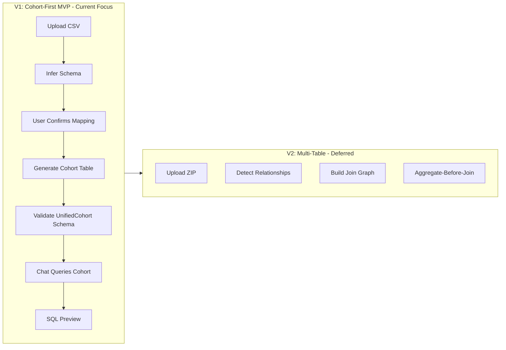

# Cohort-First S

ingle Table MVP

## Status Update (2025-12-27)

**Milestone 8: COMPLETE** - Granularity parameter chain is now complete:

- SemanticLayer.get_cohort() accepts granularity parameter
- SemanticLayer.build_cohort_query() accepts granularity parameter  
- All dataset implementations (covid_ms, sepsis, mimic3) pass granularity through
- show_sql=True uses logger.info() instead of print()
- **All internal calls use keyword-only arguments** (no positional args) to avoid churn
- API is now consistent end-to-end

**Strategic Pivot**: Moving from multi-table complexity to cohort-first MVP. Goal: "Doctor uploads CSV, it works in 5 minutes" rather than "MIMIC's 32 tables join correctly."

## Architecture Decision



**Mental Model Shift**:

- Before: MIMIC = acceptance test, Multi-table = required
- After: MIMIC = stress test (V2), Multi-table = optional, Wife's dataset = acceptance test

## Completed Work

### Milestone 8: Granularity Parameter Chain (COMPLETE)

**Files Modified**:

- `src/clinical_analytics/core/semantic.py` - Added granularity parameter to get_cohort() and build_cohort_query()
- `src/clinical_analytics/datasets/covid_ms/definition.py` - Pass granularity to semantic layer
- `src/clinical_analytics/datasets/sepsis/definition.py` - Pass granularity to semantic layer
- `src/clinical_analytics/datasets/mimic3/definition.py` - Pass granularity to semantic layer

**Key Changes**:

- Used TYPE_CHECKING to avoid circular imports
- SemanticLayer is permissive (accepts any granularity, validation at dataset level)
- show_sql=True now uses logger.info() instead of print()
- **All internal calls use keyword-only arguments** (no positional args) to prevent future churn
- Backward compatible (default granularity="patient_level")

## Remaining Work

### Task 1: Disable Multi-Table UI (Config-Driven)

**Create**: `src/clinical_analytics/ui/config.py` (new file)**Single Source of Truth**:

```python
import os

# Feature flags - single source of truth
MULTI_TABLE_ENABLED = os.getenv("MULTI_TABLE_ENABLED", "false").lower() == "true"
```

**Files to Update**:

- `src/clinical_analytics/ui/pages/1_📤_Upload_Data.py` - Import from config, gate ZIP uploads
- `src/clinical_analytics/ui/storage/user_datasets.py` - Import from config, gate save_zip_upload()

**Why**: Prevents accidental re-enabling in one place. Config-driven = single source of truth.

### Task 2: Security Fixes (Critical - Do First)

#### 2a: Fix SQL Injection (Validate Then Quote)

**File**: `src/clinical_analytics/core/semantic.py` (line 203)**Current Problem**: `f'"{table_name}"'` is not a real fix if table_name contains quotes or weird characters.**Fix**: Validate identifier first, then quote. Fail closed.

```python
import re

def _validate_table_identifier(name: str) -> str:
    """
    Validate and sanitize table identifier. Fail closed.
    
    Raises:
        ValueError: If identifier is invalid
    """
    # Allowlist: must match SQL identifier pattern
    if not re.match(r'^[A-Za-z_][A-Za-z0-9_]*$', name):
        raise ValueError(
            f"Invalid table identifier: {name}. "
            f"Must match pattern: ^[A-Za-z_][A-Za-z0-9_]*$"
        )
    return name

# Usage in semantic.py:
validated_name = _validate_table_identifier(table_name)
quoted_table = f'"{validated_name}"'
duckdb_con.execute(
    f'CREATE OR REPLACE TABLE {quoted_table} AS SELECT * FROM read_csv_auto(?)',
    [abs_path]
)
```

**Note**: If table_name comes from internal config only, add explicit assertion that it's not user-controlled.

#### 2b: Fix Path Traversal (Single-File + ZIP)

**File**: `src/clinical_analytics/ui/storage/user_datasets.py`**Scope**: Both single-file uploads (CSV/Parquet) AND ZIP extraction need protection.**Single-File Upload Fix**:

- Store uploads under UUID (not original filename)
- Strip/ignore original filename completely
- Enforce base directory (no parent traversal)
- No symlinks allowed

**ZIP Extraction Fix** (for V2):

- Add `safe_extract()` function
- Validate paths don't contain `..` or absolute paths
- Resolve to ensure within extract directory
- Check for symlinks

**Implementation**:

```python
import uuid
from pathlib import Path

def _safe_store_upload(
    file_bytes: bytes,
    base_dir: Path,
    original_filename: str
) -> Path:
    """
    Safely store upload using UUID, ignoring original filename.
    
    Args:
        file_bytes: File content
        base_dir: Base upload directory (enforced)
        original_filename: Original name (ignored, logged only)
    
    Returns:
        Path to stored file (UUID-based)
    """
    # Generate UUID-based filename
    upload_id = str(uuid.uuid4())
    safe_path = (base_dir / upload_id).with_suffix(Path(original_filename).suffix)
    
    # Ensure base_dir exists and is absolute
    base_dir = base_dir.resolve()
    safe_path = safe_path.resolve()
    
    # Enforce: must be within base_dir
    if not safe_path.is_relative_to(base_dir):
        raise SecurityError(f"Path traversal detected: {safe_path}")
    
    # No symlinks
    if safe_path.is_symlink() or base_dir.is_symlink():
        raise SecurityError("Symlinks not allowed in upload directory")
    
    # Write file
    safe_path.parent.mkdir(parents=True, exist_ok=True)
    safe_path.write_bytes(file_bytes)
    
    return safe_path

def _safe_extract_zip_member(
    zip_file: zipfile.ZipFile,
    member: str,
    extract_to: Path
) -> Path:
    """
    Safely extract ZIP member, preventing path traversal.
    
    For V2 multi-table support.
    """
    # Resolve to absolute paths
    extract_to = extract_to.resolve()
    target_path = (extract_to / member).resolve()
    
    # Must be within extract directory
    if not target_path.is_relative_to(extract_to):
        raise SecurityError(f"Path traversal detected: {member}")
    
    # No parent traversal in member name
    if '..' in member or member.startswith('/'):
        raise SecurityError(f"Invalid path: {member}")
    
    # No symlinks
    if target_path.is_symlink():
        raise SecurityError(f"Symlinks not allowed: {member}")
    
    return Path(zip_file.extract(member, extract_to))
```


#### 2c: Fix Class Attribute Mutation

**File**: `src/clinical_analytics/core/dataset.py` (line 31)

- Convert `semantic: Optional[SemanticLayer] = None` (class attribute) to instance attribute
- Add property with lazy initialization

### Task 3: UnifiedCohort Schema Contract Enforcement

**File**: `src/clinical_analytics/core/schema.py` (extend existing)**Add validator function**:

```python
def validate_unified_cohort_schema(df: pd.DataFrame) -> tuple[bool, list[str]]:
    """
    Validate DataFrame conforms to UnifiedCohort schema contract.
    
    Returns:
        Tuple of (is_valid, list_of_errors)
    """
    errors = []
    
    # Check required columns exist
    missing = set(UnifiedCohort.REQUIRED_COLUMNS) - set(df.columns)
    if missing:
        errors.append(f"Missing required columns: {missing}")
    
    # Check column types (if available)
    if UnifiedCohort.PATIENT_ID in df.columns:
        if df[UnifiedCohort.PATIENT_ID].isna().any():
            errors.append(f"{UnifiedCohort.PATIENT_ID} contains NULLs")
    
    if UnifiedCohort.OUTCOME in df.columns:
        if not pd.api.types.is_numeric_dtype(df[UnifiedCohort.OUTCOME]):
            errors.append(f"{UnifiedCohort.OUTCOME} must be numeric")
    
    return len(errors) == 0, errors
```

**Integration Point**: Call at save-time in `user_datasets.py` before persisting cohort table.

### Task 4: Summary Page Semantic Scope

Add "Semantic Scope" section to Summary/Analysis page showing:

- Cohort Table: Available
- Multi-Table: Disabled in V1
- Grain: {detected_grain}
- Outcome: {outcome_col or "Not specified"}

### Task 5: Update Plan Documents

Mark multi-table plans as DEFERRED_TO_V2:

- `.cursor/plans/multi-table_handler_refactor_aggregate-before-join_architecture_b7ca2b5e.plan.md` - Add DEFERRED_TO_V2 header
- `docs/implementation/plans/consolidate-docs-and-implement-question-driven-analysis.md` - Update Phase 4 status

## Acceptance Criteria (Wife's Dataset Test)

V1 MVP succeeds when:

1. **Upload + mapping < 5 minutes**

- CSV upload works
- Schema inference proposes mapping
- User confirms mapping
- **UnifiedCohort schema contract validated at save-time**
- Dataset saved successfully

2. **Summary page shows**:

- Cohort grain (patient vs encounter)
- Outcome prevalence
- Missingness on top predictors
- Semantic scope (cohort-only mode)

3. **Chat can answer**:

- Cohort counts
- Outcome stratification  
- Top predictors (logistic regression)
- Time-zero alignment if applicable

4. **Every answer backed by**:

- Generated SQL
- Reproducible query plan

5. **Schema Contract Enforced** (NEW):

- Cohort table validated against UnifiedCohort.REQUIRED_COLUMNS at save-time
- Column names + types + required fields locked down
- Validation errors prevent save (fail closed)
- No vibes-based "chat works" - contract is explicit

## Files to Modify

| File | Change | Priority ||------|--------|----------|| `src/clinical_analytics/ui/config.py` | **NEW**: Create config module with MULTI_TABLE_ENABLED flag | P1 || `src/clinical_analytics/ui/pages/1_📤_Upload_Data.py` | Import from config, gate ZIP uploads | P1 || `src/clinical_analytics/ui/storage/user_datasets.py` | Import from config, UUID-based storage, safe_extract() | P1 || `src/clinical_analytics/core/semantic.py` | Validate identifier then quote (SQL injection fix) | P1 CRITICAL || `src/clinical_analytics/core/dataset.py` | Fix class attribute to instance | P1 || `src/clinical_analytics/core/schema.py` | Add validate_unified_cohort_schema() function | P1 || Summary/Analysis page | Add Semantic Scope section | P2 || `.cursor/plans/multi-table_handler_refactor*.md` | Mark DEFERRED_TO_V2 | P3 || `docs/implementation/plans/consolidate-docs*.md` | Update Phase 4 status | P3 |

## Timeline

- **Day 1**: Security fixes (Tasks 2a, 2b, 2c) + Disable multi-table UI (Task 1) - **Both low risk, can do same day**
- **Day 2**: Schema contract enforcement (Task 3) + Summary page (Task 4)
- **Day 3**: Test with wife's dataset, fix issues
- **Day 4-5**: Polish, edge cases, document updates (Task 5)

## Success Metrics

- [x] M8 complete: Granularity parameter chain working end-to-end (keyword-only internal calls)
- [ ] Security fixes applied (SQL injection: validate-then-quote, path traversal: UUID storage, class attribute)
- [ ] Multi-table UI disabled (config-driven feature flag)
- [ ] UnifiedCohort schema contract enforced at save-time
- [ ] Summary page shows semantic scope
- [ ] Wife's dataset test passes (upload < 5min, chat works, SQL preview, schema validated)
- [ ] Multi-table plans marked as DEFERRED_TO_V2