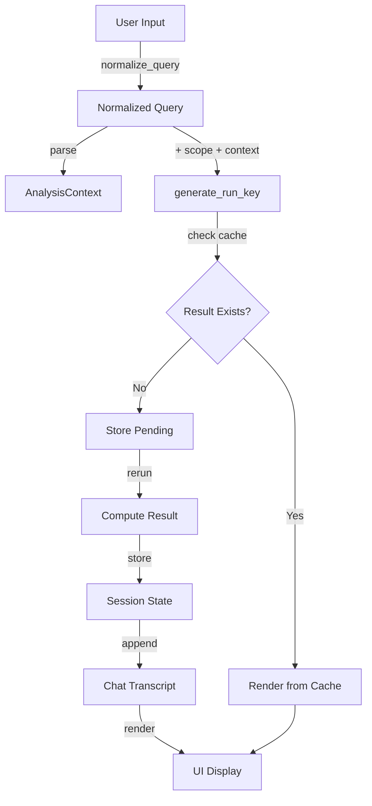

# Fix Streamlit Chat Transcript and Run Key Collisions

## Problem Statement

Two separate issues are causing UI glitches and incorrect caching:

1. **run_key collisions**: Different queries (e.g., "BMI" vs "LDL") generate the same run_key because:

- Query normalization happens inside `generate_run_key()` instead of at ingestion
- Semantic scope is not included in run_key
- None queries can bypass normalization

2. **Empty emoji tile artifacts**: Streamlit reruns create `st.chat_message()` containers without content because:

- Chat is rendered from control flow, not from persistent transcript
- Messages are appended during execution, not stored in session_state
- Reruns change execution paths, leaving empty containers

## Solution Architecture

### Core Changes

1. **Query Normalization at Ingestion**: Single source of truth - normalize immediately after `st.chat_input()`, reject None at ingestion
2. **Transcript-Driven Rendering**: Store chat in `st.session_state.chat`, render from state every rerun
3. **Pending State Pattern**: Use `st.session_state.pending` to defer computation to next rerun
4. **Compute/Render Separation**: Split `execute_analysis_with_idempotency()` into `get_or_compute_result()` and `render_result()` (naturally enforced by transcript rendering)
5. **Semantic Scope in run_key**: Include canonicalized scope dict in run_key payload (only stable, material fields)
6. **Remove Charts for V1**: Remove all chart/plot rendering, keep only Answer + compact stats + Verify (source rows) + Export
7. **Stable Widget Keys**: All widgets (download buttons, verify controls) must have deterministic keys scoped by run_key
8. **No Side Effects During Render**: render_chat() and render_result() must not mutate session_state

### Data Flow




## Implementation Phases

### Phase 1: Query Normalization and run_key Fix

**Goal**: Fix run_key collisions by normalizing queries at ingestion and including semantic scope.**Files to Modify**:

- `src/clinical_analytics/ui/pages/3_💬_Ask_Questions.py`

**Acceptance Criteria**:

- [ ] `normalize_query()` function exists and handles None, tabs, newlines, multiple spaces, lowercases
- [ ] All queries normalized immediately after `st.chat_input()` (single source of truth)
- [ ] None queries rejected/ignored at ingestion (not passed to generate_run_key)
- [ ] `canonicalize_scope()` function exists (drops None, sorts keys, sorts lists, stable JSON)
- [ ] `generate_run_key()` signature: `query_text: str` (never None, already normalized)
- [ ] **run_key contract**: `run_key = hash(dataset_version + normalized_query + canonical_scope + material_plan_signature)`
- [ ] **material_plan_signature** includes only:
  - intent/type (e.g., analysis_type)
  - metric/target variable(s) (e.g., metric, outcome, primary_variable)
  - grouping (if applicable)
  - filter specs (canonicalized)
  - time/event fields for survival
  - predictors list for regression (sorted)
- [ ] **material_plan_signature** excludes:
  - confidence
  - interpreted text
  - UI flags
  - anything derived from rerun state
- [ ] Scope canonicalized before hashing using `canonicalize_scope()` function
- [ ] All calls to `generate_run_key()` pass normalized query (never None)
- [ ] Tests verify different queries produce different keys
- [ ] Tests verify same normalized query produces same key
- [ ] Tests verify scope changes produce different keys
- [ ] Tests verify identical scope produces same key (canonicalization)
- [ ] Tests verify volatile fields excluded from run_key

**Test Requirements**:

- File: `tests/unit/ui/pages/test_ask_questions_run_key.py`
- Add tests (pure function tests, no Streamlit):
  - `test_normalize_query_handles_tabs_and_newlines`
  - `test_normalize_query_lowercases_and_strips`
  - `test_normalize_query_handles_none_returns_empty_string`
  - `test_run_key_includes_canonicalized_semantic_scope`
  - `test_run_key_different_scope_produces_different_key`
  - `test_run_key_identical_scope_produces_same_key` (canonicalization)
  - `test_run_key_excludes_volatile_fields` (confidence, timestamps)
  - `test_run_key_only_includes_material_context_variables`
  - `test_chat_input_none_is_ignored_or_noop` (at ingestion, not in generate_run_key)

**Implementation Steps**:

1. Add `normalize_query()` function (after imports, before `generate_run_key()`):
```python
def normalize_query(q: str | None) -> str:
    """Normalize query text: collapse whitespace, lowercase, strip."""
    return " ".join((q or "").split()).strip().lower()
```


2. Update `generate_run_key()` signature:
```python
def generate_run_key(
    dataset_version: str,
    query_text: str,  # Must be already normalized, never None
    context: AnalysisContext,
    scope: dict | None = None,
) -> str:
```


3. Update `generate_run_key()` implementation to include scope in payload
4. Update all call sites to normalize query first, then pass to `generate_run_key()`
5. Store semantic scope in session_state (extract from sidebar or default to {})

**Quality Gates**:

- `make format`
- `make lint-fix`
- `make type-check`
- `make test-ui` (or `make test-fast`)
- All tests passing

**Commit Message**:

```javascript
feat: Phase 1 - Fix run_key collisions with query normalization and scope

- Add normalize_query() function for single source of truth
- Update generate_run_key() to accept pre-normalized query and include scope
- Store semantic scope in session_state
- Add comprehensive tests for normalization and scope handling

All tests passing: X/Y
```


### Phase 2: Transcript-Driven Chat Rendering + Compute/Render Split

**Goal**: Implement chat transcript in session_state, render from state every rerun, and naturally enforce compute/render separation.**Files to Modify**:

- `src/clinical_analytics/ui/pages/3_💬_Ask_Questions.py`

**Acceptance Criteria**:

- [ ] `ChatMessage` TypedDict schema defined (role, text, run_key, status, created_at)
- [ ] `Pending` TypedDict schema defined (run_key, context)
- [ ] `st.session_state.chat` initialized as list[ChatMessage]
- [ ] `st.session_state.pending` initialized as Pending | None (only one pending at a time)
- [ ] `render_chat()` function renders entire transcript from state
- [ ] `get_or_compute_result()` function exists (pure computation, no UI, no side effects during render)
- [ ] `render_result()` function exists (pure rendering, no computation, no side effects during render)
- [ ] User messages appended to chat immediately on input (not during render)
- [ ] Assistant messages appended after computation completes (not during render)
- [ ] No `st.chat_message()` calls outside `render_chat()`
- [ ] Pending state pattern used for computation deferral
- [ ] **No side effects during render**: render_chat() and render_result() may:
  - Read session_state
  - Create widgets (Streamlit widget state mutation is unavoidable)
- [ ] **No side effects during render**: render_chat() and render_result() may NOT:
  - Append to transcript
  - Write results
  - Mutate pending
  - Delete cache entries
- [ ] All mutations happen only in:
  - Input ingestion handler
  - Pending compute handler
  - Explicit "reset conversation" action
- [ ] All widgets have stable keys using naming standard:
  - `key=f"verify:{run_key}"`
  - `key=f"dl:{run_key}:patients"`
  - `key=f"dl:{run_key}:export"`
  - Never reuse raw labels as keys
- [ ] Charts removed for V1 (keep only Answer + compact stats + Verify + Export)
- [ ] Tests verify chat transcript structure (pure functions)
- [ ] Tests verify messages appended exactly once per query (pure mutation logic)
- [ ] Tests verify pending state transitions (pure state machine)

**Test Requirements**:

- File: `tests/unit/ui/pages/test_ask_questions_idempotency.py` (update existing)
  - Update to use new function signatures
  - Add: `test_get_or_compute_result_returns_cached_on_second_call`
  - Add: `test_get_or_compute_result_stores_result_in_session_state`
  - Add: `test_render_result_can_be_called_multiple_times` (idempotent rendering)

- File: `tests/unit/ui/pages/test_ask_questions_chat_transcript.py` (new file)
  - Focus on pure functions (transcript mutation, pending state transitions)
  - Add tests:
    - `test_chat_transcript_initialized_empty`
    - `test_user_message_appended_on_input` (pure mutation logic)
    - `test_assistant_message_appended_after_computation` (pure mutation logic)
    - `test_reruns_dont_duplicate_messages` (pure logic, verify append-once)
    - `test_pending_state_transitions` (pure state machine)
    - `test_render_chat_is_only_chat_message_caller` (code structure enforcement, not Streamlit rendering test)

**Implementation Steps**:

1. Add `render_chat()` function:

- Iterate over `st.session_state.chat`
- Render user messages with `st.chat_message("user")`
- Render assistant messages with `st.chat_message("assistant")`
- Load result from session_state using run_key
- Call `render_result()` for assistant messages

2. Initialize chat and pending state in `main()`:
```python
if "chat" not in st.session_state:
    st.session_state.chat = []
if "pending" not in st.session_state:
    st.session_state.pending = None
```


3. Call `render_chat()` at start of `main()` (before handling new input)
4. Handle pending computation:

- Check `st.session_state.pending`
- If set, compute result using `get_or_compute_result()`
- Append assistant message to chat
- Clear pending and rerun

5. Handle new chat input:

- Normalize query
- Append user message to chat
- Parse query and create context
- If complete, store as pending and rerun
- If incomplete, store context and rerun for variable selection

6. Remove old conversation history rendering logic (lines 1143-1174)
7. Remove inline chat message rendering from execution paths

**Quality Gates**:

- `make format`
- `make lint-fix`
- `make type-check`
- `make test-ui`
- All tests passing
- Manual testing: verify no empty emoji tiles on reruns

**Commit Message**:

```javascript
feat: Phase 2 - Transcript-driven chat rendering with compute/render split

- Add render_chat() function to render from session_state (no side effects)
- Add get_or_compute_result() for pure computation
- Add render_result() for pure rendering (no side effects)
- Remove charts for V1 (keep Answer + stats + Verify + Export)
- Add stable widget keys scoped by run_key
- Initialize chat and pending state in session_state
- Use pending state pattern for deferred computation
- Remove inline chat message rendering from execution paths
- Remove CSS hacks for emoji persistence
- Add comprehensive tests for transcript management and idempotency

All tests passing: X/Y
```


### Phase 3: Semantic Layer Caching (Optional/Deferred)

**Goal**: Cache semantic layer initialization to prevent re-initialization on every rerun. **Optional: Only implement after Phase 2 is stable and idempotent. Defer if dataset object is not hashable/stable.**

**Files to Modify**:

- `src/clinical_analytics/ui/pages/3_💬_Ask_Questions.py`

**Acceptance Criteria**:

- [ ] Verify dataset object is hashable/stable for caching
- [ ] If hashable: Cache semantic layer using `@st.cache_resource` keyed by primitives (dataset_id, dataset_version)
- [ ] If not hashable: Defer caching, just stop re-initializing in hot loops
- [ ] Semantic layer initialized once per (dataset_id, dataset_version) per session
- [ ] Tests verify caching behavior (if implemented)

**Test Requirements**:

- File: `tests/unit/ui/pages/test_ask_questions_semantic_caching.py` (new file)
- Add tests:
- `test_semantic_layer_cached_per_dataset_version`
- `test_semantic_layer_reused_on_rerun`

**Implementation Steps**:

1. **Reality check**: Verify dataset object is hashable and semantic layer is safe to cache
2. **If cacheable**: Add cached function keyed by primitives (not object refs):
```python
@st.cache_resource
def get_cached_semantic_layer(_dataset, _dataset_version: str):
    """Cache semantic layer per dataset version."""
    return _dataset.get_semantic_layer()
```


2. Replace `dataset.get_semantic_layer()` calls with cached version
3. Handle ValueError for datasets without semantic layer

**Quality Gates**:

- `make format`
- `make lint-fix`
- `make type-check`
- `make test-ui`
- All tests passing

**Commit Message** (if implemented):

```javascript
feat: Phase 3 - Cache semantic layer initialization

- Add @st.cache_resource decorator for semantic layer
- Cache keyed by dataset_id + dataset_version primitives (not object refs)
- Prevent re-initialization on every rerun
- Add tests for caching behavior

All tests passing: X/Y
```

**Note**: This phase is optional and gated behind stability of transcript + idempotency (Phase 2). If dataset object is not hashable or semantic layer has non-cacheable handles, defer to future PR and just ensure no re-initialization in hot loops.


## Testing Strategy

### Unit Tests

All tests follow AAA pattern (Arrange-Act-Assert) and use fixtures from `conftest.py`.**Test Files**:

- `tests/unit/ui/pages/test_ask_questions_run_key.py` (update existing)
- `tests/unit/ui/pages/test_ask_questions_idempotency.py` (update existing)
- `tests/unit/ui/pages/test_ask_questions_chat_transcript.py` (new)
- `tests/unit/ui/pages/test_ask_questions_semantic_caching.py` (new)

**Test Execution**:

- Use `make test-ui` for UI module tests
- Use `make test-fast` for quick feedback during development
- Use `make test` for full suite before commit

### Integration Tests

Manual testing required for:

- Empty emoji tile verification (visual inspection)
- Chat transcript persistence across reruns
- Multiple queries with same/different scope

## Quality Gates

### Before Each Phase Commit

```bash
make format        # Auto-format code
make lint-fix      # Auto-fix linting issues
make type-check    # Verify type hints
make test-ui       # Run UI module tests (or make test-fast)
make check         # Full quality gate (recommended)
```


### Pre-Commit Checklist

- [ ] All tests written and passing
- [ ] Code formatted (`make format`)
- [ ] Linting issues fixed (`make lint-fix`)
- [ ] Type checking passes (`make type-check`)
- [ ] No duplicate imports
- [ ] DRY principles followed (shared fixtures, no code duplication)
- [ ] Polars-first patterns used (no pandas in new code)
- [ ] Commit message includes test count

## Rollback Plan

If issues arise:

1. Each phase is independently committable
2. Can rollback to previous phase commit
3. Tests ensure backward compatibility within each phase

## Success Criteria

**Staff-level criteria** (from user requirements):

- [ ] run_key uniqueness: distinct user queries produce distinct run_keys (normalized query included, scope canonicalized)
- [ ] run_key stability: identical inputs produce identical run_keys (volatile fields excluded)
- [ ] Append idempotency: for a single user submit, len(chat) increases by exactly 2 (user + assistant), regardless of reruns
- [ ] Render determinism: the page body is a pure function of st.session_state.chat (no extra output outside it except intentional static UI)
- [ ] No side effects during render: render_chat() and render_result() do not mutate session_state
- [ ] Stable widget keys: all widgets have deterministic keys scoped by run_key (no duplicate widget ID errors)
- [ ] Charts removed: V1 keeps only Answer + compact stats + Verify + Export (no fragile chart decoration)
- [ ] Semantic init: called once per dataset_version per session (or per cache lifetime), not on every rerun (if Phase 3 implemented)
- [ ] No empty emoji tiles: all `st.chat_message()` containers have content (transcript rendering fixes root cause)

## Dependencies

- Existing: `compute_analysis_by_type()`, `render_analysis_by_type()`, `AnalysisContext`, `AnalysisIntent`
- No new external dependencies required
- Uses existing Streamlit session_state patterns

## Notes

- Remove CSS hacks for emoji persistence (lines 44-62) - transcript rendering fixes the root cause
- Charts are fragile decoration that break the page - remove for V1, defer until transcript rendering is stable
- Widget keys must be deterministic and scoped by run_key to prevent duplicate ID errors on reruns
- Focus tests on pure functions (normalization, canonicalization, mutation logic) - avoid over-testing Streamlit rendering
- Semantic layer caching is optional - defer if dataset object is not hashable or has non-cacheable handles