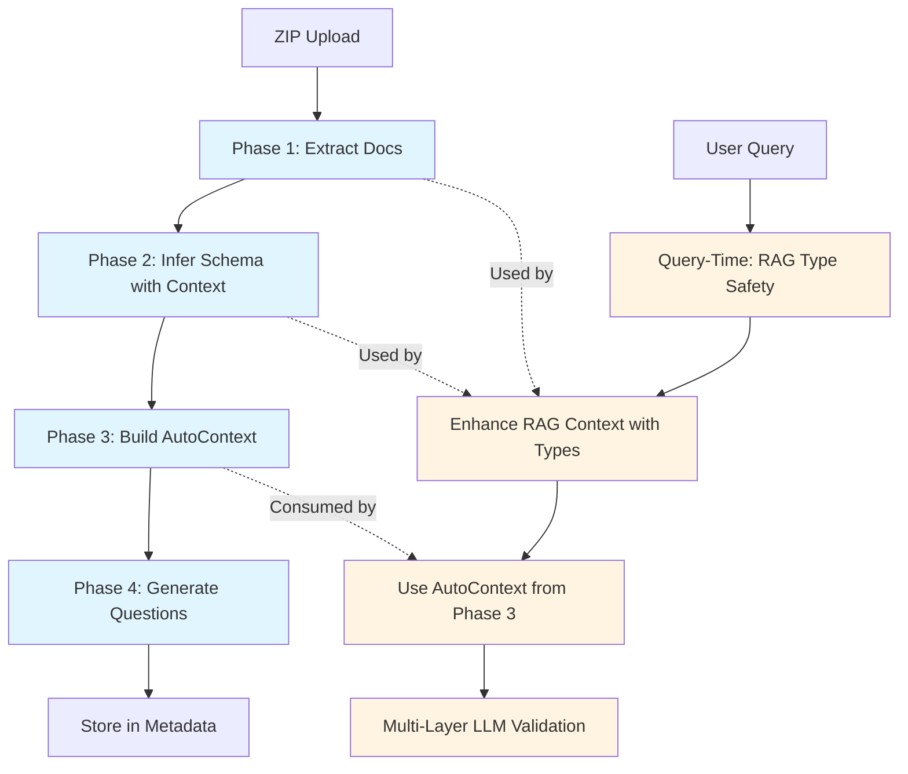

# ADR004: Complete Implementation

## Overview

Implement all phases of ADR004 - documentation ingestion, context-aware schema inference, AutoContext packager for Tier 3 LLM, and proactive question generation. This provides the foundation for RAG Type Safety plan (which enhances query-time validation using ADR004's context).

**All phases follow strict TDD workflow:**
- Write failing test first (Red)
- Implement minimum code to pass (Green)
- Fix quality issues (Refactor)
- Commit with tests

## Boundary with RAG Type Safety Plan

**CRITICAL: Clear separation of concerns**

### ADR004 (This Plan) - Upload-Time Context Building

**Scope:**
- Phase 1: Documentation extraction from ZIP uploads (upload-time)
- Phase 2: Schema inference with documentation context (upload-time)
- Phase 3: AutoContext packager (deterministic context assembly, no LLM)
- Phase 4: Proactive question generation (upload-time, one-time)

**Ownership:**
- ADR004 owns: Context assembly from existing data (docs, schema, aliases)
- ADR004 owns: Upload-time processing (docs extraction, schema inference)
- ADR004 owns: AutoContext construction (deterministic, privacy-safe)

**Outputs:**
- `doc_context`: Extracted documentation text (stored in metadata)
- `inferred_schema`: Schema with documentation-enhanced confidence (stored in metadata)
- `variable_types`: Enhanced metadata with codebooks, descriptions, units (stored in metadata JSON, flows into semantic layer)
- `AutoContext`: Bounded context pack for Tier 3 LLM (built on-demand, not stored)
- `example_questions`: Generated questions (stored in metadata)

### RAG Type Safety Plan - Query-Time Type Safety and Validation

**Scope:**
- Enhances `_build_rag_context()` with type information (query-time)
- Adds type inference from ibis view schema (query-time)
- Multi-layer LLM validation (DBA/Analyst/Manager) (query-time)
- Removes legacy runtime type handling code

**Ownership:**
- RAG Type Safety owns: Query-time type safety (enhances RAG context)
- RAG Type Safety owns: Query-time validation (multi-layer LLM validation)
- RAG Type Safety owns: Type information in RAG context (enhancement, not replacement)

**Inputs (from ADR004):**
- Uses `doc_context` from ADR004 Phase 1 (if available)
- Uses `inferred_schema` from ADR004 Phase 2 (if available)
- Uses `AutoContext` from ADR004 Phase 3 (consumes, doesn't build)

**No Overlap:**
- ADR004: Upload-time context building (proactive, one-time per upload)
- RAG Type Safety: Query-time type safety (reactive, per-query)
- ADR004 builds context, RAG Type Safety enhances and validates it

**Dependency:**
- RAG Type Safety plan **must wait** until ADR004 complete
- ADR004 provides foundation (docs, schema, AutoContext) that RAG Type Safety uses
- RAG Type Safety enhances `_build_rag_context()` but doesn't replace ADR004's context building

## Architecture



**Legend:**
- Blue: ADR004 (upload-time, this plan)
- Orange: RAG Type Safety (query-time, separate plan)

## Implementation Plan

### Phase 1: Documentation Detection and Extraction (P0)

**Goal**: Identify and extract documentation files from ZIP uploads.

**TDD Workflow:**

1. **Write failing test** (`tests/loader/test_doc_extraction.py`):
   - `test_extract_documentation_files_detects_pdf_md_txt()` - detects docs in ZIP
   - `test_extract_pdf_text_extracts_content()` - PDF text extraction
   - `test_extract_markdown_text_preserves_structure()` - Markdown extraction
   - `test_extract_context_from_docs_truncates_large_files()` - truncation at 50k chars
   - `test_save_zip_upload_stores_doc_context()` - doc_context in metadata

2. **Run test** (Red phase):
   ```bash
   make test-loader PYTEST_ARGS="tests/loader/test_doc_extraction.py -xvs"
   ```

3. **Implement** (Green phase):
   - Create `src/clinical_analytics/core/doc_parser.py`
   - Add `extract_documentation_files()` to `user_datasets.py`
   - Integrate into `extract_zip_tables()` and `save_zip_upload()`

4. **Verify test passes**:
   ```bash
   make test-loader PYTEST_ARGS="tests/loader/test_doc_extraction.py -xvs"
   ```

5. **Fix quality issues**:
   ```bash
   make format && make lint-fix
   ```

6. **Run module tests**:
   ```bash
   make test-loader
   ```

7. **Commit**:
   ```bash
   git commit -m "feat: Phase 1 - Documentation Detection and Extraction

   - Add doc_parser.py module with PDF/Markdown/text extraction
   - Add extract_documentation_files() helper to user_datasets.py
   - Integrate doc extraction into ZIP upload processing
   - Store doc_context in metadata JSON
   - Add pymupdf dependency to pyproject.toml
   - Add comprehensive test suite (X tests passing)

   All tests passing: X/Y
   Following TDD: Red-Green-Refactor"
   ```

**Files to Create/Modify:**

**New File**: `src/clinical_analytics/core/doc_parser.py`

```python
"""
Documentation Parser for Schema Inference

Extracts text content from various documentation formats (PDF, Markdown, text)
to provide context for schema inference.
"""

from pathlib import Path
from typing import Any

def extract_context_from_docs(file_paths: list[Path]) -> str:
    """
    Extract text content from documentation files.
    
    Args:
        file_paths: List of paths to documentation files
        
    Returns:
        Concatenated text context (truncated to 50,000 chars if needed)
    """
    # Implementation:
    # 1. Iterate through file_paths
    # 2. Detect file type (PDF, MD, TXT)
    # 3. Extract text using appropriate library
    # 4. Concatenate with separators
    # 5. Truncate if >50k chars (with warning log)

def extract_pdf_text(pdf_path: Path) -> str:
    """Extract text from PDF using pymupdf."""
    # Use pymupdf (fitz) for extraction

def extract_markdown_text(md_path: Path) -> str:
    """Extract text from Markdown file."""
    # Direct read (preserve structure)
```

**Modified File**: `src/clinical_analytics/ui/storage/user_datasets.py`

- Add `extract_documentation_files()` helper function
- Update `extract_zip_tables()` to return both tables and doc files
- Update `save_zip_upload()` to extract docs and store `doc_context` in metadata

**Dependencies**: Add `pymupdf>=1.23.0` to `pyproject.toml`

**Implementation Notes**:

- **Error Handling**: If PDF extraction fails (pymupdf error, corrupted file), log warning and return empty string (graceful degradation). Do not raise exception - allow upload to continue with data-driven schema inference.
- **File Storage**: Documentation files are stored in `{upload_id}/docs/` for audit trail, even if extraction fails.

**Success Criteria:**
- [ ] Documentation files detected in ZIP uploads (`docs/` or root)
- [ ] PDF, Markdown, and text files extracted successfully
- [ ] Extracted text stored in metadata JSON as `doc_context`
- [ ] Files stored in `{upload_id}/docs/` for audit trail
- [ ] Truncation at 50k chars with warning log
- [ ] All tests passing (TDD workflow)

### Phase 2: Schema Inference Integration (P0)

**Goal**: Enhance schema inference with documentation context to improve semantic layer (Ibis/DuckDB) query generation, not just LLM context.

**Critical**: This phase improves the semantic layer itself by:
- Extracting codebooks from documentation (e.g., "1: Biktarvy, 2: Symtuza" → `{"1": "Biktarvy", "2": "Symtuza"}`)
- Extracting column descriptions and units from documentation
- Storing enhanced `variable_types` in metadata JSON (flows into `SemanticLayer.config`)
- Improving Ibis/DuckDB query generation (better type handling, filter validation, SQL generation)

**TDD Workflow:**

1. **Write failing test** (`tests/core/test_schema_inference.py`):
   - `test_infer_schema_accepts_doc_context()` - signature accepts doc_context
   - `test_parse_dictionary_text_parses_plain_text()` - parse text (not just PDF)
   - `test_parse_dictionary_extracts_codebooks()` - extract codebooks from "1: Yes, 2: No" patterns
   - `test_parse_dictionary_extracts_codebooks_multiple_formats()` - test comma-separated, space-separated, reverse format
   - `test_dictionary_metadata_has_codebooks_field()` - verify DictionaryMetadata.codebooks field exists
   - `test_parse_dictionary_extracts_descriptions()` - extract column descriptions
   - `test_parse_dictionary_extracts_units_from_column_names()` - extract units from column names (reuse column_parser)
   - `test_parse_dictionary_extracts_units_from_documentation()` - extract units from documentation patterns
   - `test_infer_schema_with_doc_context_populates_dictionary_metadata()` - doc_context → DictionaryMetadata
   - `test_schema_inference_with_doc_context_improves_confidence()` - confidence scores improved
   - `test_to_dataset_config_populates_variable_types_with_codebooks()` - codebooks in variable_types
   - `test_to_dataset_config_populates_variable_types_with_descriptions()` - descriptions in variable_types
   - `test_to_dataset_config_populates_variable_types_with_units()` - units in variable_types
   - `test_metadata_json_stores_enhanced_variable_types()` - enhanced variable_types in metadata JSON

2. **Run test** (Red phase):
   ```bash
   make test-core PYTEST_ARGS="tests/core/test_schema_inference.py::test_infer_schema_accepts_doc_context -xvs"
   ```

3. **Implement** (Green phase):
   - Update `infer_schema()` signature: `def infer_schema(self, df: pl.DataFrame, doc_context: str | None = None) -> InferredSchema`
   - **Refactor `parse_dictionary_pdf()` → `parse_dictionary_text()`**: New signature accepts both Path and str
   - Extract codebooks from documentation (parse "1: Biktarvy, 2: Symtuza" patterns → `{"1": "Biktarvy", "2": "Symtuza"}`)
   - Extract column descriptions from documentation
   - Extract units from documentation or column names (mg/dL, %, etc.)
   - Use `doc_context` to populate `DictionaryMetadata` with codebooks, descriptions, units
   - Enhance `InferredSchema.to_dataset_config()` to populate `variable_types` with:
     - `codebook`: extracted codebook dict (for coded columns)
     - `description`: extracted description
     - `units`: extracted units
     - `type`: enhanced with "coded" type for numeric categoricals
   - Merge dictionary metadata with data-driven inference
   - **Remove `infer_schema_with_dictionary()` method entirely** (replaced by `infer_schema(df, doc_context=...)`)

4. **Verify test passes**:
   ```bash
   make test-core PYTEST_ARGS="tests/core/test_schema_inference.py -xvs"
   ```

5. **Fix quality issues**:
   ```bash
   make format && make lint-fix
   ```

6. **Run module tests**:
   ```bash
   make test-core
   ```

7. **Commit**:
   ```bash
   git commit -m "feat: Phase 2 - Schema Inference Integration with Semantic Layer Enhancement

   - Update infer_schema() to accept doc_context parameter
   - Extract codebooks from documentation (1: Yes, 2: No patterns)
   - Extract column descriptions and units from documentation
   - Enhance to_dataset_config() to populate variable_types with codebooks, descriptions, units
   - Store enhanced variable_types in metadata JSON (improves semantic layer/Ibis/DuckDB)
   - Merge dictionary metadata with data-driven inference
   - Improve confidence scores using documentation context
   - Integrate doc_context into save_table_list() schema inference
   - Add comprehensive test suite (X tests passing)

   All tests passing: X/Y
   Following TDD: Red-Green-Refactor"
   ```

**Files to Modify:**

**Modified File**: `src/clinical_analytics/core/schema_inference.py`

- Update `infer_schema()` signature: `def infer_schema(self, df: pl.DataFrame, doc_context: str | None = None) -> InferredSchema`
- **Refactor `parse_dictionary_pdf()` → `parse_dictionary_text()`**: New signature `def parse_dictionary_text(self, source: Path | str) -> DictionaryMetadata | None` (accepts both Path and str, removes old method)
- **Add `codebooks` field to DictionaryMetadata**: Add `codebooks: dict[str, dict[str, str]] = field(default_factory=dict)` to dataclass. Structure: `{column_name: {"1": "Biktarvy", "2": "Symtuza", ...}}`
- **Extract codebooks from documentation**: Parse patterns like "1: Biktarvy, 2: Symtuza" → `{"1": "Biktarvy", "2": "Symtuza"}`. Consider reusing `_extract_value_mapping()` from `column_parser.py` to avoid duplication.
- **Extract column descriptions**: Parse "Column: Description" patterns from documentation
- **Extract units**: 
  - From column names: Reuse `_extract_unit()` from `column_parser.py` 
  - From documentation: Parse patterns like "Units: mg/dL" or "measured in mg/dL"
- Use `doc_context` to populate `DictionaryMetadata` with codebooks, descriptions, units
- **Enhance `InferredSchema.to_dataset_config()`**: Populate `variable_types` dict with:
  ```python
  config["variable_types"] = {}
  for col in all_columns:
      var_type_info = {
          "type": "numeric" | "categorical" | "coded" | "datetime" | "text",
          "description": dictionary_metadata.get_description(col),  # FROM DOCS
          "units": extracted_units,  # FROM DOCS or column name
          "codebook": extracted_codebook,  # FROM DOCS: {"1": "Biktarvy", "2": "Symtuza"}
          "metadata": {
              "numeric": is_numeric,
              "unique_count": unique_count,
              # ... existing metadata ...
          },
          "missing_count": missing_count,
          "missing_pct": missing_pct,
      }
      config["variable_types"][col] = var_type_info
  ```
- Merge dictionary metadata with data-driven inference

**Implementation Notes**:

- **Codebook Extraction**: Parse patterns like "1: Biktarvy, 2: Symtuza" or "1: Yes, 2: No, 0: n/a" from documentation. Store as `{"1": "Biktarvy", "2": "Symtuza", ...}` in `DictionaryMetadata.codebooks` dict.
  - **Reuse existing patterns**: Consider reusing/extending `_extract_value_mapping()` from `src/clinical_analytics/core/column_parser.py` (lines 49-77) to avoid duplication
  - **Pattern formats**: Handle multiple formats:
    - `"1: Biktarvy, 2: Symtuza"` (comma-separated)
    - `"1: Yes 2: No"` (space-separated)
    - `"0: n/a 1: Atorvastatin"` (with n/a)
    - `"Yes:1 No:2"` (reverse format - less common)
  - **Regex pattern**: Use pattern like `r"(\d+)\s*:\s*([^,0-9]+)"` to extract code-value pairs
  - **Store structure**: `DictionaryMetadata.codebooks[column_name] = {"1": "Biktarvy", "2": "Symtuza", ...}`
- **Dictionary Text Format**: Plain text dictionaries should follow patterns like "Column: Description" or "Column Name | Type | Description". If format is unclear, log warning and use data-driven inference only.
- **Units Extraction**: 
  - **From column names**: Reuse `_extract_unit()` from `src/clinical_analytics/core/column_parser.py` (line 69) which extracts units like "mg/dL", "%", etc. from column names
  - **From documentation**: Parse patterns like "Units: mg/dL" or "measured in mg/dL" or "(mg/dL)" in column descriptions
  - **Priority**: Column name extraction takes precedence (more reliable), fallback to documentation parsing
- **Merging Strategy**: Dictionary metadata takes precedence over data-driven inference when both are available. Use dictionary descriptions to improve confidence scores.
- **Semantic Layer Integration**: Enhanced `variable_types` stored in metadata JSON flows into `SemanticLayer.config["variable_types"]`, which is used by:
  - `get_column_metadata()` - returns codebooks, descriptions, units for Ibis/DuckDB queries
  - `_execute_plan()` - better type handling (knows codebooks for coded columns)
  - Filter validation - knows "n/a" → 0 for coded columns
  - SQL generation - knows when to use numeric codes vs string values

**Modified File**: `src/clinical_analytics/ui/storage/user_datasets.py`

- In `save_table_list()`, pass `doc_context` to `SchemaInferenceEngine.infer_schema()`
- Store `doc_context` in metadata JSON for future reference
- **Store enhanced `variable_types` in metadata JSON**: The enhanced `variable_types` from `to_dataset_config()` should be stored in metadata JSON at `metadata["variable_types"]` (this flows into semantic layer config)

**Metadata JSON Structure** (stored in `data/uploads/metadata/{upload_id}.json`):

```json
{
  "variable_types": {
    "Current Regimen": {
      "type": "coded",  // Enhanced: "coded" for numeric categoricals
      "description": "Current antiretroviral regimen",  // FROM DOCS
      "codebook": {  // FROM DOCS: extracted from "1: Biktarvy, 2: Symtuza"
        "1": "Biktarvy",
        "2": "Symtuza",
        "3": "Triumeq",
        ...
      },
      "metadata": {
        "numeric": true,
        "unique_count": 10,
        "values": [1.0, 2.0, 3.0, ...]
      },
      "missing_count": 2,
      "missing_pct": 0.25
    },
    "LDL mg/dL": {
      "type": "continuous",
      "description": "Low-density lipoprotein cholesterol",  // FROM DOCS
      "units": "mg/dL",  // FROM column name or docs
      "metadata": {
        "min": 50.0,
        "max": 200.0,
        "mean": 120.0
      },
      "missing_count": 0,
      "missing_pct": 0.0
    }
  }
}
```

**Semantic Layer Benefits** (Ibis/DuckDB improvements):

- `SemanticLayer.config["variable_types"]` contains enhanced metadata (codebooks, descriptions, units)
- `get_column_metadata()` returns richer information for Ibis/DuckDB queries
- Better type detection: knows coded columns use numeric codes (not strings)
- Better filter handling: knows "n/a" → 0 for coded columns (prevents type errors)
- Better SQL generation: knows when to use numeric codes vs string values in Ibis expressions
- Better Ibis view generation: proper type casting for DuckDB (numeric codes for coded columns)

**Success Criteria:**
- [ ] `SchemaInferenceEngine.infer_schema()` accepts `doc_context` parameter
- [ ] **Codebook extraction**: Documentation patterns like "1: Biktarvy, 2: Symtuza" extracted as `{"1": "Biktarvy", "2": "Symtuza"}`
- [ ] **Description extraction**: Column descriptions extracted from documentation
- [ ] **Units extraction**: Units extracted from column names or documentation (mg/dL, %, etc.)
- [ ] **Enhanced variable_types**: `to_dataset_config()` populates `variable_types` with codebooks, descriptions, units
- [ ] **Metadata JSON storage**: Enhanced `variable_types` stored in `data/uploads/metadata/{upload_id}.json`
- [ ] **Semantic layer integration**: Enhanced `variable_types` flows into `SemanticLayer.config["variable_types"]`
- [ ] **Ibis/DuckDB improvements**: `get_column_metadata()` returns codebooks, descriptions, units for better query generation
- [ ] Documentation context improves column mapping confidence
- [ ] Dictionary metadata merged with data-driven inference
- [ ] Schema inference uses dictionary descriptions when available
- [ ] All tests passing (TDD workflow)

### Phase 3: Tier 3 AutoContext Packager (P0)

**Goal**: Build bounded, privacy-safe context pack for ADR001's Tier 3 LLM fallback.

**TDD Workflow:**

1. **Write failing test** (`tests/core/test_autocontext.py`):
   - `test_column_context_dataclass()` - ColumnContext structure
   - `test_autocontext_dataclass()` - AutoContext structure
   - `test_build_autocontext_extracts_entity_keys()` - entity key extraction
   - `test_build_autocontext_builds_column_catalog()` - column catalog with aliases
   - `test_build_autocontext_extracts_glossary()` - glossary from doc_context (abbreviations, definitions)
   - `test_build_autocontext_glossary_limited_to_top_50()` - verify glossary truncation for token budget
   - `test_build_autocontext_enforces_token_budget()` - token budget truncation
   - `test_build_autocontext_no_row_level_data()` - privacy validation

2. **Run test** (Red phase):
   ```bash
   make test-core PYTEST_ARGS="tests/core/test_autocontext.py -xvs"
   ```

3. **Implement** (Green phase):
   - Create `src/clinical_analytics/core/autocontext.py`
   - Implement `build_autocontext()` function (all deterministic, no LLM)
   - Add `extract_column_metadata()` method to `SemanticLayer`
   - Update `_llm_parse()` to accept and use `AutoContext`

4. **Verify test passes**:
   ```bash
   make test-core PYTEST_ARGS="tests/core/test_autocontext.py -xvs"
   ```

5. **Fix quality issues**:
   ```bash
   make format && make lint-fix
   ```

6. **Run module tests**:
   ```bash
   make test-core
   ```

7. **Commit**:
   ```bash
   git commit -m "feat: Phase 3 - Tier 3 AutoContext Packager

   - Create autocontext.py module with ColumnContext and AutoContext dataclasses
   - Implement build_autocontext() - deterministic context assembly
   - Add extract_column_metadata() method to SemanticLayer
   - Update _llm_parse() to accept AutoContext parameter
   - Privacy validation - no row-level data in AutoContext
   - Token budget enforcement with relevance filtering
   - Add comprehensive test suite (X tests passing)

   All tests passing: X/Y
   Following TDD: Red-Green-Refactor"
   ```

**Files to Create/Modify:**

**New File**: `src/clinical_analytics/core/autocontext.py`

```python
"""
AutoContext Packager for Tier 3 LLM Fallback

Builds bounded, privacy-safe context packs from schema inference,
documentation, and alias mappings to enable grounded query parsing.
"""

from dataclasses import dataclass
from typing import Literal, Any

@dataclass
class ColumnContext:
    """Column metadata for AutoContext."""
    name: str
    normalized_name: str
    system_aliases: list[str]
    user_aliases: list[str]
    dtype: Literal["numeric", "categorical", "datetime", "id"]
    units: str | None = None
    codebook: dict[str, str] | None = None
    stats: dict[str, Any] = None

@dataclass
class AutoContext:
    """Bounded, privacy-safe context pack for Tier 3 LLM."""
    dataset: dict[str, str]  # {upload_id, dataset_version, display_name}
    entity_keys: list[str]  # Candidate columns ranked
    columns: list[ColumnContext]
    glossary: dict[str, Any]  # Extracted terms, abbreviations, notes
    constraints: dict[str, Any]  # {no_row_level_data: true, max_tokens: N}

def build_autocontext(
    semantic_layer,
    inferred_schema,
    doc_context: str | None = None,
    query_terms: list[str] | None = None,
    max_tokens: int = 4000,
) -> AutoContext:
    """
    Build AutoContext pack from schema inference, documentation, and aliases.
    
    **Deterministic construction** - no LLM inference. Same inputs always produce same output.
    Think: compiler metadata, not chat memory.
    """
    # Implementation (all deterministic, no LLM):
    # 1. Extract entity keys from inferred_schema (patient_id, etc.) - deterministic ranking
    # 2. Build column catalog from semantic layer:
    #    - Get canonical columns (from schema)
    #    - Get system aliases (from alias index - deterministic)
    #    - Get user aliases (from ADR003 persisted mappings - deterministic)
    #    - Get inferred types (from schema inference - deterministic)
    #    - Get codebooks (from column name patterns: "1: Yes 2: No" - deterministic parsing)
    #    - Get lightweight stats (min/max/mean for numeric, top N for categorical - deterministic aggregation)
    # 3. Extract glossary from doc_context (abbreviations, definitions - deterministic text extraction)
    #    Glossary extraction pattern:
    #    - Look for sections with headers like "Abbreviations", "Definitions", "Glossary", "Notes"
    #    - Extract key-value pairs: "BMI: Body Mass Index" or "LDL: Low-density lipoprotein"
    #    - Limit to top 50 terms (token budget)
    #    - Structure: {"BMI": "Body Mass Index", "LDL": "Low-density lipoprotein", ...}
    # 4. Filter columns by relevance if query_terms provided (lexical + alias match - deterministic)
    # 5. Enforce token budget (truncate if needed - deterministic truncation strategy)
    # 6. Validate no row-level data included (assertion check)
    # 7. Return authoritative, closed AutoContext (only what exists, nothing invented)
```

**Modified Files**:
- `src/clinical_analytics/core/semantic.py` - Add `extract_column_metadata()` method
- `src/clinical_analytics/core/nl_query_engine.py` - Update `_llm_parse()` to build AutoContext on-demand

**Integration with `_llm_parse()` and `_build_rag_context()`**:

AutoContext **supplements** `_build_rag_context()`, they are **not replacements**:

- `_build_rag_context(query)` - Provides example queries (RAG corpus) for pattern matching
- `build_autocontext(...)` - Provides schema context (columns, aliases, types, codebooks) for grounded parsing

**Integration Pattern**:
1. `_llm_parse()` builds both contexts:
   - `rag_context = self._build_rag_context(query)` (existing, for example queries)
   - `autocontext = build_autocontext(semantic_layer, inferred_schema, doc_context, query_terms)` (new, for schema context)
2. Both are passed to `_build_llm_prompt()` which merges them into structured prompt
3. AutoContext provides authoritative schema (columns, types, codebooks)
4. RAG context provides example query patterns (golden questions)

**Method Signature for `extract_column_metadata()`**:

```python
def extract_column_metadata(self, column_name: str) -> dict[str, Any] | None:
    """
    Extract column metadata compatible with ColumnContext construction.
    
    Uses existing get_column_metadata() internally but formats for AutoContext use.
    
    Args:
        column_name: Canonical column name
        
    Returns:
        Dict compatible with ColumnContext construction, or None if metadata unavailable
        
    Example return structure:
        {
            "name": "Current Regimen",
            "normalized_name": "current_regimen",  # lowercase, underscore-normalized
            "dtype": "coded",  # Maps from variable_types["type"]: "numeric"|"categorical"|"coded"|"datetime"|"text"
            "units": None,  # From variable_types["units"] if available
            "codebook": {"1": "Biktarvy", "2": "Symtuza", ...},  # From variable_types["codebook"] if available
        }
    
    Dtype mapping:
        - "numeric" → "numeric"
        - "categorical" (with numeric=True) → "coded"
        - "categorical" (with numeric=False) → "categorical"
        - "datetime" → "datetime"
        - "text" → "categorical" (fallback)
        - "id" → "id" (for patient_id columns)
    
    Normalized name: lowercase, replace spaces/special chars with underscores
    """
```

**Token Budget Implementation Notes**:
- **Token counting method**: Use character count / 4 approximation (1 token ≈ 4 characters). This is sufficient for deterministic truncation. No need for tiktoken library (adds dependency, approximation is acceptable for token budget enforcement).
- **Truncation strategy**: Least relevant columns first (by query_terms match score)
- **Relevance filtering**: Lexical match + alias match (deterministic scoring)
- **Test requirement**: Add test with known token counts to verify budget enforcement (e.g., 100-column schema with 4000 token budget should truncate to ~50 most relevant columns)

**Success Criteria:**
- [ ] AutoContext pack built deterministically (no LLM in construction)
- [ ] No row-level data in AutoContext (privacy-safe)
- [ ] Token budget enforced (truncation if needed)
- [ ] AutoContext is authoritative and closed (only contains what exists)
- [ ] Tier 3 receives AutoContext and uses it for variable matching
- [ ] All tests passing (TDD workflow)

### Phase 4: Proactive Question Generation (P1)

**Goal**: Generate contextual example questions (upload-time) and proactive follow-up questions (query-time) using local LLM, bounded by semantic layer and confidence-gated to avoid chaos.

**Two Types of Questions**:

1. **Upload-Time Example Questions** (stored in metadata):
   - Generated once during upload
   - Stored in metadata JSON
   - Displayed on first load of Ask Questions page
   - Deterministic or LLM-generated (simple examples)

2. **Query-Time Proactive Follow-Ups** (generated after execution):
   - Generated after each query execution
   - Confidence-gated (deterministic thresholds)
   - Cached by (dataset_version, run_key, normalized_query)
   - Bounded by semantic layer (only known columns/aliases)
   - Observable (logs selection/dismissal)

**Critical Constraints** (from production feedback):

1. **Semantic Layer Bounding**: Only generate questions about columns/aliases that exist in semantic layer (no hallucination)
2. **Confidence Gating**: Deterministic thresholds - respect existing confidence patterns
3. **State/Idempotency**: Cache by (dataset_version, run_key, normalized_query) to prevent duplicates
4. **No Tier 3 Dependency**: Don't assume Tier 3 LLM fallback is production-ready
5. **Performance**: Feature flag + hard time budgets (same philosophy as parsing tiers)
6. **Observability**: Log question generation/selection/dismissal events
7. **Clinical Safety**: Analysis navigation only, not medical advice

**TDD Workflow:**

1. **Write failing test** (`tests/core/test_question_generator.py`):
   - `test_deterministic_questions_fallback()` - deterministic questions without LLM
   - `test_llm_generate_questions_bounded_by_semantic_layer()` - only uses known columns/aliases
   - `test_question_generation_confidence_gating()` - respects confidence thresholds
   - `test_question_generation_idempotency()` - cached by (dataset_version, run_key, query)
   - `test_question_generation_privacy_safe()` - no row-level data in context
   - `test_question_generation_handles_llm_failure()` - graceful degradation
   - `test_question_generation_feature_flag()` - respects ENABLE_PROACTIVE_QUESTIONS flag
   - `test_question_generation_time_budget()` - enforces hard timeout
   - `test_question_generation_observability()` - logs generation/selection events
   - `test_question_generation_clinical_safety()` - analysis navigation only, no medical advice

2. **Run test** (Red phase):
   ```bash
   make test-core PYTEST_ARGS="tests/core/test_question_generator.py -xvs"
   ```

3. **Implement** (Green phase):
   - Create `src/clinical_analytics/core/question_generator.py`
   - Implement `generate_upload_questions()` with LLM + deterministic fallback
   - Integrate into `save_table_list()` after schema inference
   - Add UI display in Ask Questions page

4. **Verify test passes**:
   ```bash
   make test-core PYTEST_ARGS="tests/core/test_question_generator.py -xvs"
   ```

5. **Fix quality issues**:
   ```bash
   make format && make lint-fix
   ```

6. **Run module tests**:
   ```bash
   make test-core && make test-loader && make test-ui
   ```

7. **Commit**:
   ```bash
   git commit -m "feat: Phase 4 - Proactive Question Generation

   - Create question_generator.py module with LLM + deterministic fallback
   - Integrate question generation into upload processing
   - Store questions in metadata JSON
   - Add UI display in Ask Questions page
   - Privacy validation - no row-level data in LLM context
   - Add comprehensive test suite (X tests passing)

   All tests passing: X/Y
   Following TDD: Red-Green-Refactor"
   ```

**Files to Create/Modify:**

**New File**: `src/clinical_analytics/core/question_generator.py`

```python
"""
Proactive Question Generator for Upload Context

Generates example questions during upload using local LLM,
falling back to deterministic generation if LLM unavailable.

**Critical Constraints**:
- Bounded by semantic layer (only known columns/aliases)
- Confidence-gated (deterministic thresholds)
- Idempotent (cached by dataset_version + run_key + query)
- Feature-flagged (ENABLE_PROACTIVE_QUESTIONS)
- Time-budgeted (hard timeout like parsing tiers)
- Observable (logs generation/selection/dismissal)
- Clinically safe (analysis navigation only, not medical advice)
"""

from clinical_analytics.core.llm_feature import LLMFeature, call_llm
from clinical_analytics.core.nl_query_config import ENABLE_PROACTIVE_QUESTIONS

def generate_upload_questions(
    semantic_layer,
    inferred_schema: InferredSchema,
    doc_context: str | None = None,
) -> list[str]:
    """
    Generate simple example questions during upload (stored in metadata).
    
    **Upload-Time Only**: These are simple examples, not confidence-gated.
    Stored in metadata JSON and displayed on first load.
    
    Args:
        semantic_layer: SemanticLayer instance (for column bounds)
        inferred_schema: InferredSchema from Phase 2
        doc_context: Extracted documentation text from Phase 1
    
    Returns:
        List of 3-5 simple example questions
    """
    # Get available columns for bounding
    alias_index = semantic_layer.get_column_alias_index()
    available_columns = list(alias_index.values()) if alias_index else []
    
    if not available_columns:
        return []
    
    # Try LLM first (if available)
    if _is_ollama_available():
        questions = _llm_generate_simple_examples(available_columns, inferred_schema, doc_context)
        if questions:
            return _validate_questions_bounded(questions, available_columns, [])
    
    # Fallback: deterministic questions
    return _deterministic_upload_questions(available_columns, inferred_schema)

def generate_proactive_questions(
    semantic_layer,
    query_intent: QueryIntent | None = None,
    dataset_version: str | None = None,
    run_key: str | None = None,
    normalized_query: str | None = None,
) -> list[str]:
    """
    Generate proactive follow-up questions based on query intent and semantic layer.
    
    **Semantic Layer Bounded**: Only generates questions about columns/aliases in semantic layer.
    **Confidence Gated**: Respects deterministic thresholds:
        - confidence ≥ 0.85: suggest next questions freely
        - 0.5-0.85: suggest only clarification/disambiguation questions
        - < 0.5: do not suggest proactively (ask user to rephrase)
    
    **Idempotent**: Cached by (dataset_version, run_key, normalized_query) to prevent duplicates.
    
    Args:
        semantic_layer: SemanticLayer instance (for column/alias bounds)
        query_intent: QueryIntent from previous parse (for confidence gating)
        dataset_version: Dataset version for caching
        run_key: Run key for caching
        normalized_query: Normalized query text for caching
    
    Returns:
        List of 3-5 example questions (empty if confidence too low or feature disabled)
    
    Raises:
        AssertionError: If semantic layer missing required metadata
    """
    # Feature flag check
    if not ENABLE_PROACTIVE_QUESTIONS:
        return []
    
    # Confidence gating (deterministic, not vibes-based)
    if query_intent is None or query_intent.confidence < 0.5:
        return []  # Don't suggest proactively if confidence too low
    
    # Check cache for idempotency
    cache_key = _build_cache_key(dataset_version, run_key, normalized_query)
    cached = _get_cached_questions(cache_key)
    if cached is not None:
        return cached
    
    # Get available columns/aliases from semantic layer (hard boundary)
    alias_index = semantic_layer.get_column_alias_index()
    available_columns = list(alias_index.values()) if alias_index else []
    available_aliases = list(alias_index.keys()) if alias_index else []
    
    if not available_columns:
        return []  # No columns available, can't generate questions
    
    # Try LLM first (if available and confidence high enough)
    questions: list[str] = []
    if query_intent.confidence >= 0.85:
        # High confidence: suggest next questions freely
        questions = _llm_generate_questions(
            semantic_layer,
            available_columns,
            available_aliases,
            query_intent,
            question_type="next_questions",
        )
    elif query_intent.confidence >= 0.5:
        # Medium confidence: only clarification/disambiguation
        questions = _llm_generate_questions(
            semantic_layer,
            available_columns,
            available_aliases,
            query_intent,
            question_type="clarification",
        )
    
    # Fallback: deterministic questions if LLM unavailable
    if not questions:
        questions = _deterministic_questions(semantic_layer, available_columns, query_intent)
    
    # Validate questions are bounded by semantic layer
    questions = _validate_questions_bounded(questions, available_columns, available_aliases)
    
    # Cache results for idempotency
    _cache_questions(cache_key, questions)
    
    # Log observability event
    _log_question_generation(questions, query_intent.confidence, dataset_version, len(available_columns))
    
    return questions

def _llm_generate_questions(
    semantic_layer,
    available_columns: list[str],
    available_aliases: list[str],
    query_intent: QueryIntent,
    question_type: Literal["next_questions", "clarification"],
    timeout_s: float = 5.0,  # Hard time budget (same philosophy as parsing tiers)
) -> list[str] | None:
    """
    Generate questions using local LLM via call_llm().
    
    **Semantic Layer Bounded**: Prompt explicitly lists only available columns/aliases.
    **Clinical Safety**: Prompts emphasize analysis navigation, not medical advice.
    **Time Budgeted**: Hard timeout (5s default, same as parsing tiers).
    
    Args:
        semantic_layer: SemanticLayer instance
        available_columns: List of column names (hard boundary)
        available_aliases: List of alias names (hard boundary)
        query_intent: QueryIntent from previous parse
        question_type: "next_questions" (confidence ≥0.85) or "clarification" (0.5-0.85)
        timeout_s: Hard timeout (default 5.0s, same as parsing tiers)
    
    Returns:
        List of questions or None if LLM unavailable/failed
    """
    # Build prompt with semantic layer bounds (only known columns/aliases)
    system_prompt = f"""Generate 3-5 example questions users might ask about this dataset.

**CRITICAL CONSTRAINTS**:
1. Only reference columns/aliases that exist in the dataset (listed below)
2. Questions must be about analysis navigation, NOT medical advice
3. Use phrases like "Would you like to stratify by X?" not "You should consider Y treatment"

**Available Columns**: {', '.join(available_columns[:20])}  # Limit to top 20 for token budget
**Available Aliases**: {', '.join(available_aliases[:10])}  # Limit to top 10 for token budget

**Question Type**: {question_type}
- "next_questions": Suggest logical next analysis steps
- "clarification": Ask for clarification/disambiguation only

**Previous Query Intent**: {query_intent.intent_type} (confidence: {query_intent.confidence:.2f})

Return JSON: {{"questions": ["question1", "question2", ...]}}"""
    
    user_prompt = f"Generate {question_type} questions based on the previous query intent."
    
    result = call_llm(
        feature=LLMFeature.QUESTION_GENERATION,
        system=system_prompt,
        user=user_prompt,
        timeout_s=timeout_s,  # Hard time budget
    )
    
    if result.payload and "questions" in result.payload:
        questions = result.payload["questions"]
        # Validate questions are bounded (check for hallucinated columns)
        return _validate_questions_bounded(questions, available_columns, available_aliases)
    return None

def _validate_questions_bounded(
    questions: list[str],
    available_columns: list[str],
    available_aliases: list[str],
) -> list[str]:
    """
    Validate that questions only reference known columns/aliases.
    
    Filters out questions that reference columns not in semantic layer.
    This prevents hallucination.
    
    **Validation Strategy**: 
    - Primary: Substring matching (case-insensitive) - fast and sufficient for most cases
    - Future enhancement: Could use NLQueryEngine's column matching logic for more sophisticated parsing
    - Edge cases: Partial matches (e.g., "age" matches "age_group") are acceptable (conservative filtering)
    
    Args:
        questions: List of generated questions
        available_columns: List of canonical column names (hard boundary)
        available_aliases: List of alias names (hard boundary)
    
    Returns:
        Filtered list of questions (only those referencing known columns/aliases)
    """
    validated = []
    all_valid_names = set(available_columns + available_aliases)
    
    for question in questions:
        # Check if question mentions any valid column/alias (case-insensitive substring match)
        question_lower = question.lower()
        if any(name.lower() in question_lower for name in all_valid_names):
            validated.append(question)
        # Note: Substring matching is sufficient for MVP. More sophisticated parsing (extracting
        # column references via NLQueryEngine) can be added in future if needed.
    
    return validated

def _deterministic_questions(
    semantic_layer,
    available_columns: list[str],
    query_intent: QueryIntent | None = None,
) -> list[str]:
    """
    Generate deterministic questions without LLM (fallback).
    
    Uses template-based generation based on available columns.
    Always bounded by semantic layer.
    """
    # Template-based questions (e.g., "What is the average {column}?")
    # Only use columns from available_columns (semantic layer bounded)
    questions = []
    
    # Simple templates based on intent type
    if query_intent:
        if query_intent.intent_type == "DESCRIBE":
            # Suggest grouping/stratification questions
            for col in available_columns[:3]:  # Limit to top 3
                questions.append(f"Would you like to stratify by {col}?")
        elif query_intent.intent_type == "COMPARE_GROUPS":
            # Suggest additional grouping variables
            for col in available_columns[:3]:
                questions.append(f"Would you like to compare by {col}?")
    
    # Default: generic analysis questions
    if not questions:
        questions = [
            "What is the distribution of the data?",
            "Are there any outliers?",
            "What are the key relationships?",
        ]
    
    return questions[:5]  # Limit to 5 questions

def _build_cache_key(
    dataset_version: str | None,
    run_key: str | None,
    normalized_query: str | None,
) -> str:
    """
    Build cache key for idempotency.
    
    Uses same pattern as execution result caching in 03_💬_Ask_Questions.py:
    - Key format: "{dataset_version}:{run_key}:{query_hash}"
    - query_hash: SHA256 hash of normalized_query (first 16 chars, same as exec_result caching)
    - Full session state key: f"proactive_questions:{cache_key}"
    
    Args:
        dataset_version: Dataset version identifier
        run_key: Run key for idempotency
        normalized_query: Normalized query text (for hashing)
        
    Returns:
        Cache key string (without "proactive_questions:" prefix - added in _get_cached_questions/_cache_questions)
    """
    import hashlib
    # Use SHA256 (same as exec_result caching) for deterministic hashing
    query_hash = hashlib.sha256(normalized_query.encode() if normalized_query else b"").hexdigest()[:16]
    return f"{dataset_version or 'unknown'}:{run_key or 'unknown'}:{query_hash}"

def _get_cached_questions(cache_key: str) -> list[str] | None:
    """
    Get cached questions from Streamlit session state.
    
    Uses same pattern as execution result caching in 03_💬_Ask_Questions.py:
    - Key format: f"proactive_questions:{cache_key}"
    - Cache key includes dataset_version, run_key, query_hash for idempotency
    - Returns None if not cached (allows LLM generation)
    
    Args:
        cache_key: Cache key built from (dataset_version, run_key, query_hash)
        
    Returns:
        Cached questions list or None if not cached
    """
    import streamlit as st
    session_key = f"proactive_questions:{cache_key}"
    return st.session_state.get(session_key)

def _cache_questions(cache_key: str, questions: list[str]) -> None:
    """
    Cache questions in Streamlit session state for idempotency.
    
    Uses same pattern as execution result caching in 03_💬_Ask_Questions.py:
    - Key format: f"proactive_questions:{cache_key}"
    - Prevents duplicate question generation on Streamlit reruns
    - Cache persists for session lifetime (cleared on page refresh)
    
    Args:
        cache_key: Cache key built from (dataset_version, run_key, query_hash)
        questions: Generated questions to cache
    """
    import streamlit as st
    session_key = f"proactive_questions:{cache_key}"
    st.session_state[session_key] = questions

def _log_question_generation(
    questions: list[str],
    confidence: float,
    dataset_version: str | None,
    column_count: int,
) -> None:
    """Log observability event for question generation."""
    from clinical_analytics.core.llm_observability import log_llm_event
    import structlog
    
    logger = structlog.get_logger()
    logger.info(
        "proactive_questions_generated",
        question_count=len(questions),
        confidence=confidence,
        dataset_version=dataset_version,
        column_count=column_count,
    )

def _validate_privacy_safe_stats(stats: dict[str, Any]) -> None:
    """
    Validate that stats contain only aggregated data, no row-level values.
    
    Raises AssertionError if row-level data detected.
    """
    # Implementation: Check that stats dict contains only aggregated keys
    # (min, max, mean, count, top_values with counts, etc.)
    # No individual row values or patient IDs
    pass
```

**Modified Files**:
- `src/clinical_analytics/ui/pages/03_💬_Ask_Questions.py` - Call `generate_proactive_questions()` after query execution, display with selection/dismissal tracking
- `src/clinical_analytics/core/nl_query_engine.py` - Export `generate_proactive_questions()` for use in UI

**Integration Points**:

1. **Upload-Time Example Questions** (simple, stored in metadata):
   - Generated in `save_table_list()` after schema inference
   - Stored in metadata JSON as `example_questions`
   - Displayed on first load of Ask Questions page
   - Use `generate_upload_questions()` (simpler, no confidence gating needed)

2. **Query-Time Proactive Follow-Ups** (confidence-gated, cached):
   - Generated **after query execution** in `03_💬_Ask_Questions.py`
   - Requires: `query_intent` with confidence, `run_key`, `normalized_query`
   - Use `generate_proactive_questions()` (full constraints: bounding, gating, caching, observability)
   - Displayed after results with click tracking

**Integration Pattern for Query-Time Follow-Ups**:
1. User submits query → `QuestionEngine.ask_free_form_question()` parses it
2. Query executes → `execute_query_plan()` produces results
3. **After execution**: Call `generate_proactive_questions(semantic_layer, query_intent, dataset_version, run_key, normalized_query)`
4. Display questions in UI with click tracking (log `proactive_question_selected` or `proactive_question_dismissed`)

**Implementation Notes**:

- **Semantic Layer Bounding**: Questions must only reference columns/aliases from `semantic_layer.get_column_alias_index()`. Use `_validate_questions_bounded()` to filter out hallucinated columns.
- **Confidence Gating**: Deterministic thresholds (not vibes-based):
  - `confidence ≥ 0.85`: Suggest next questions freely (`question_type="next_questions"`)
  - `0.5 ≤ confidence < 0.85`: Suggest only clarification/disambiguation (`question_type="clarification"`)
  - `confidence < 0.5`: Do not suggest proactively (return empty list)
- **Idempotency**: Cache questions by `(dataset_version, run_key, normalized_query)` using same pattern as result caching. Prevents duplicates on Streamlit reruns.
- **Feature Flag**: Add `ENABLE_PROACTIVE_QUESTIONS` to `nl_query_config.py` (default: `False` for initial rollout).
- **Time Budget**: Hard timeout of 5.0s (same as parsing tiers). If LLM times out, fall back to deterministic questions.
- **Observability**: Log events:
  - `proactive_questions_generated` (count, confidence, dataset_version, column_count)
  - `proactive_question_selected` (which question, position) - in UI component
  - `proactive_question_dismissed` - in UI component
- **Clinical Safety**: Prompts explicitly state "analysis navigation only, not medical advice". Use phrases like "Would you like to stratify by X?" not "You should consider Y treatment."
- **No Tier 3 Dependency**: Don't assume Tier 3 LLM fallback is production-ready. Use deterministic fallback if LLM unavailable.
- **LLMFeature Enum**: Must add `LLMFeature.QUESTION_GENERATION = "question_generation"` to `llm_feature.py` before Phase 4 implementation (todo 4.0).
- **Error Handling**: If LLM call fails (timeout, unavailable), gracefully fall back to deterministic questions. Never raise exception.

**Success Criteria:**
- [ ] LLMFeature.QUESTION_GENERATION enum entry added to llm_feature.py
- [ ] ENABLE_PROACTIVE_QUESTIONS feature flag added to nl_query_config.py
- [ ] Question generator module created with LLM + deterministic fallback
- [ ] **Semantic layer bounding**: Questions only reference known columns/aliases (no hallucination)
- [ ] **Confidence gating**: Respects deterministic thresholds (≥0.85 free, 0.5-0.85 clarification only, <0.5 none)
- [ ] **Idempotency**: Questions cached by (dataset_version, run_key, normalized_query) using st.session_state with key format `f"proactive_questions:{cache_key}"` (same pattern as exec_result caching)
- [ ] **Time budget**: Hard timeout of 5.0s (same as parsing tiers)
- [ ] **Observability**: Logs `proactive_questions_generated`, `proactive_question_selected`, `proactive_question_dismissed` events
- [ ] **Clinical safety**: Prompts emphasize analysis navigation only, not medical advice
- [ ] **No Tier 3 dependency**: Works with deterministic fallback if LLM unavailable
- [ ] Questions displayed in UI as suggestions (with selection/dismissal tracking)
- [ ] All tests passing (TDD workflow)

### Phase 5: Comprehensive Testing (P1)

**Goal**: Verify all phases work together end-to-end.

**TDD Workflow:**

1. **Write integration tests**:
   - `tests/integration/test_adr004_end_to_end.py` - Full upload flow with all phases
   - `tests/integration/test_autocontext_tier3_integration.py` - AutoContext consumed by Tier 3

**Performance Test Specification**:

- **Test Data**: Use sample PDF with 10-20 pages (typical data dictionary size)
- **Performance Budget**: Doc extraction should complete in <5s for typical PDFs
- **Marker**: Use `@pytest.mark.slow` for performance tests
- **Test Name**: `test_doc_extraction_performance_under_5s()`

2. **Run tests**:
   ```bash
   make test-integration PYTEST_ARGS="tests/integration/test_adr004_end_to_end.py -xvs"
   ```

3. **Fix any issues**:
   - Address integration failures
   - Ensure all phases work together

4. **Run full test suite**:
   ```bash
   make test
   ```

5. **Update documentation**:
   - Update `docs/implementation/ADR/ADR004.md` with implementation status

6. **Final commit**:
   ```bash
   git commit -m "feat: Phase 5 - ADR004 Comprehensive Testing

   - Add end-to-end integration tests for all phases
   - Verify AutoContext integration with Tier 3 LLM
   - Performance tests for doc extraction
   - All tests passing (X/Y total)

   All tests passing: X/Y
   Following TDD: Red-Green-Refactor"
   ```

**Success Criteria:**
- [ ] End-to-end integration test passes (upload with docs → schema → AutoContext → questions)
- [ ] AutoContext integration test passes (Tier 3 consumes AutoContext)
- [ ] Performance tests pass (doc extraction <5s for typical PDFs)
- [ ] All existing tests pass (no regressions)
- [ ] Test coverage >80% for new code
- [ ] ADR004.md updated with implementation status

## Boundary Clarification with RAG Type Safety Plan

### What ADR004 Provides (Foundation)

1. **`doc_context`** (Phase 1):
   - Extracted documentation text from ZIP uploads
   - Stored in metadata JSON
   - Available for query-time use

2. **`inferred_schema`** (Phase 2):
   - Schema with documentation-enhanced confidence
   - **Enhanced `variable_types`** with codebooks, descriptions, units (stored in metadata JSON)
   - Flows into `SemanticLayer.config["variable_types"]` (improves Ibis/DuckDB query generation)
   - Available for query-time use

3. **`AutoContext`** (Phase 3):
   - Bounded, privacy-safe context pack
   - Built on-demand (not stored)
   - Consumed by Tier 3 LLM fallback

4. **`example_questions`** (Phase 4):
   - Generated questions for UI display
   - Stored in metadata JSON
   - Not used by RAG Type Safety

### What RAG Type Safety Enhances (Query-Time)

1. **`_build_rag_context()`** (RAG Type Safety Phase 1):
   - **Enhances** existing RAG context with type information
   - **Uses** `doc_context` and `inferred_schema` from ADR004 (if available)
   - **Adds** type inference from ibis view schema
   - **Does NOT replace** ADR004's context building

2. **Multi-Layer Validation** (RAG Type Safety Phase 3):
   - **Uses** `AutoContext` from ADR004 Phase 3
   - **Validates** QueryPlans against AutoContext
   - **Does NOT build** AutoContext (ADR004 owns that)

3. **Type Safety** (RAG Type Safety):
   - **Enhances** RAG context with type information
   - **Validates** filter types before execution
   - **Does NOT extract** documentation (ADR004 owns that)

### Clear Ownership Boundaries

| Component | ADR004 Owns | RAG Type Safety Owns |
|-----------|-------------|---------------------|
| Documentation extraction | ✅ Upload-time extraction | ❌ |
| Schema inference with docs | ✅ Upload-time inference | ❌ |
| AutoContext construction | ✅ Deterministic assembly | ❌ |
| Question generation | ✅ Upload-time generation | ❌ |
| RAG context type enhancement | ❌ | ✅ Query-time enhancement |
| Type inference from ibis | ❌ | ✅ Query-time inference |
| Multi-layer LLM validation | ❌ | ✅ Query-time validation |
| AutoContext consumption | ❌ | ✅ Query-time consumption |

### Integration Points (No Conflicts)

1. **AutoContext Usage**:
   - ADR004 Phase 3: Builds AutoContext (deterministic, no LLM)
   - RAG Type Safety: Consumes AutoContext in `_llm_parse()`
   - **No conflict**: ADR004 builds, RAG Type Safety uses

2. **Documentation Context**:
   - ADR004 Phase 1: Extracts `doc_context` (upload-time)
   - RAG Type Safety: Uses `doc_context` in enhanced RAG context (query-time)
   - **No conflict**: ADR004 extracts, RAG Type Safety uses

3. **Schema Information**:
   - ADR004 Phase 2: Infers schema with `doc_context` (upload-time)
   - RAG Type Safety: Uses `inferred_schema` for type information (query-time)
   - **No conflict**: ADR004 infers, RAG Type Safety uses

4. **RAG Context Building**:
   - ADR004: Provides foundation (docs, schema, AutoContext)
   - RAG Type Safety: Enhances `_build_rag_context()` with types
   - **No conflict**: ADR004 provides, RAG Type Safety enhances

## Files to Create/Modify

### New Files

1. `src/clinical_analytics/core/doc_parser.py` - Documentation extraction
2. `src/clinical_analytics/core/autocontext.py` - AutoContext packager
3. `src/clinical_analytics/core/question_generator.py` - Question generation
4. `tests/core/test_doc_parser.py` - Doc parser unit tests
5. `tests/core/test_autocontext.py` - AutoContext unit tests
6. `tests/core/test_question_generator.py` - Question generator unit tests
7. `tests/loader/test_doc_extraction.py` - Doc extraction integration tests
8. `tests/integration/test_adr004_end_to_end.py` - End-to-end integration tests

### Modified Files

1. `src/clinical_analytics/core/schema_inference.py` - Schema inference with doc context
2. `src/clinical_analytics/ui/storage/user_datasets.py` - Doc extraction and integration
3. `src/clinical_analytics/core/semantic.py` - Column metadata extraction
4. `src/clinical_analytics/core/nl_query_engine.py` - AutoContext consumption
5. `src/clinical_analytics/ui/pages/03_💬_Ask_Questions.py` - Question display
6. `pyproject.toml` - Add pymupdf dependency
7. `docs/implementation/ADR/ADR004.md` - Update implementation status

## Makefile Commands

**Phase 1 Tests:**
```bash
make test-loader PYTEST_ARGS="tests/loader/test_doc_extraction.py -xvs"
```

**Phase 2 Tests:**
```bash
make test-core PYTEST_ARGS="tests/core/test_schema_inference.py -xvs"
```

**Phase 3 Tests:**
```bash
make test-core PYTEST_ARGS="tests/core/test_autocontext.py -xvs"
```

**Phase 4 Tests:**
```bash
make test-core PYTEST_ARGS="tests/core/test_question_generator.py -xvs"
make test-loader PYTEST_ARGS="tests/loader/test_question_generation_upload.py -xvs"
make test-ui PYTEST_ARGS="tests/ui/pages/test_ask_questions.py -xvs"
```

**Phase 5 Tests:**
```bash
make test-integration PYTEST_ARGS="tests/integration/test_adr004_end_to_end.py -xvs"
```

**Full Test Suite:**
```bash
make test
```

**Quality Gates:**
```bash
make format && make lint-fix && make type-check && make test
```

## Success Criteria

### Phase 1: Documentation Detection and Extraction
- [ ] Documentation files detected in ZIP uploads
- [ ] PDF, Markdown, and text files extracted successfully
- [ ] Extracted text stored in metadata JSON as `doc_context`
- [ ] Files stored in `{upload_id}/docs/` for audit trail
- [ ] Truncation at 50k chars with warning log
- [ ] All tests passing (TDD workflow)

### Phase 2: Schema Inference Integration
- [ ] `SchemaInferenceEngine.infer_schema()` accepts `doc_context` parameter
- [ ] **Codebook extraction**: Documentation patterns like "1: Biktarvy, 2: Symtuza" extracted as codebooks
- [ ] **Description extraction**: Column descriptions extracted from documentation
- [ ] **Units extraction**: Units extracted from column names or documentation
- [ ] **Enhanced variable_types**: `to_dataset_config()` populates `variable_types` with codebooks, descriptions, units
- [ ] **Metadata JSON storage**: Enhanced `variable_types` stored in `data/uploads/metadata/{upload_id}.json`
- [ ] **Semantic layer integration**: Enhanced `variable_types` flows into `SemanticLayer.config` (improves Ibis/DuckDB)
- [ ] **Legacy code removed**: `infer_schema_with_dictionary()` method does not exist (verified by test)
- [ ] **Legacy code removed**: `parse_dictionary_pdf()` method does not exist (only `parse_dictionary_text()` remains, verified by test)
- [ ] **Unified approach**: All schema inference uses `infer_schema(df, doc_context=...)` only
- [ ] **No competing systems**: Verified by grep that no old method names exist in codebase
- [ ] Documentation context improves column mapping confidence
- [ ] Dictionary metadata merged with data-driven inference
- [ ] Schema inference uses dictionary descriptions when available
- [ ] All tests passing (TDD workflow)

### Phase 3: Tier 3 AutoContext Packager
- [ ] AutoContext pack built deterministically (no LLM in construction)
- [ ] No row-level data in AutoContext (privacy-safe)
- [ ] Token budget enforced (truncation if needed)
- [ ] AutoContext is authoritative and closed (only contains what exists)
- [ ] Tier 3 receives AutoContext and uses it for variable matching
- [ ] All tests passing (TDD workflow)

### Phase 4: Proactive Question Generation
- [ ] Question generator module created with LLM + deterministic fallback
- [ ] Questions generated during upload (background/async)
- [ ] Questions stored in metadata JSON
- [ ] LLM generation uses local Ollama (privacy-safe)
- [ ] Deterministic fallback works when LLM unavailable
- [ ] No row-level data in LLM context (privacy validation)
- [ ] Questions displayed in UI as suggestions
- [ ] All tests passing (TDD workflow)

### Phase 5: Comprehensive Testing
- [ ] End-to-end integration test passes
- [ ] AutoContext integration test passes
- [ ] Performance tests pass
- [ ] All existing tests pass (no regressions)
- [ ] Test coverage >80% for new code
- [ ] ADR004.md updated with implementation status

## Risk Mitigation

- **PDF parsing failures**: Graceful degradation - fallback to data-driven inference
- **Large documentation**: Truncation at 50k chars with warning log
- **LLM unavailable**: Deterministic fallback for question generation
- **AutoContext token overflow**: Relevance filtering and truncation
- **Privacy concerns**: Assertion checks - no row-level data in any context
- **Performance**: Doc extraction <5s for typical PDFs, question generation async

## Notes

- All phases follow strict TDD workflow (Red-Green-Refactor)
- Each phase commits independently with tests
- ADR004 provides foundation for RAG Type Safety plan
- No scope overlap with RAG Type Safety (upload-time vs query-time)
- AutoContext is deterministic (compiler metadata, not chat memory)