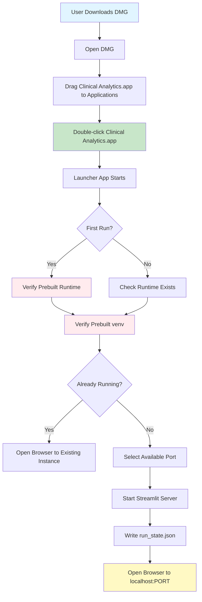

# Doctor-Friendly macOS DMG Installer Implementation Plan

## Overview

This plan implements a doctor-proof installation experience: a self-contained DMG file with **prebuilt Python runtime**, **prebuilt virtual environment**, and **offline wheelhouse**. The `.app` bundle launches in <10 seconds with zero dependency resolution on first run. Users download, open DMG, drag to Applications, double-click, and browser opens. No terminal, no pip, no "Python" exposed.

## Distribution Strategy Decision (ADR)

**Decision**: Prebuilt runtime + prebuilt venv + offline wheelhouse (Option A)**Rationale**:

- **First-run must be <10 seconds** - doctors will quit if first launch takes minutes
- **Offline-capable** - hospital networks may block PyPI, have SSL interception, or be offline
- **Predictable** - prebuilt artifacts eliminate "works on my machine" failures
- **No dependency resolution** - eliminates SSL, proxy, network, and PyPI failure modes

**What we ship**:

- Relocatable Python runtime (python-build-standalone or similar)
- Prebuilt virtual environment with all dependencies installed
- Application code and data
- Offline wheelhouse (backup, not primary install path)

**What we don't do**:

- ❌ First-run dependency installation from PyPI
- ❌ Python.org framework (not relocatable without path patching)
- ❌ "Install from source" (doctors want a button that works)
- ❌ Online dependency resolution on first launch

**Installation Location Decision**:

- **Primary**: `/Applications/ClinicalAnalytics` (requires admin, best UX)
- **Fallback**: `~/Applications/ClinicalAnalytics` (no admin, explicit instructions needed)
- DMG provides both options with clear labeling

## Architecture




## Launcher Service Contract

**State Files** (JSON, in app bundle Resources):

- `install_state.json`: `{installed: bool, version: str, install_path: str, last_error: str | null}`
- `run_state.json`: `{port: int, pid: int, start_time: str, url: str}`

**Port Selection Algorithm**:

1. Check `run_state.json` for existing instance
2. Verify PID is alive, port is listening
3. If alive: open browser to existing URL, exit
4. If dead: clean up stale state, select new port (8501, then 8502, etc.)
5. Write new `run_state.json` before starting server

**Logs**:

- Location: `~/Library/Logs/ClinicalAnalytics/`
- Files: `launcher.log`, `streamlit.log`
- Rotation: Keep last 5 logs, max 10MB each

**Idempotent Startup**:

- Second double-click: detect existing instance, open browser, exit
- No duplicate servers
- Graceful cleanup on crash (detect stale PID, clean state)

## Implementation Phases

### Phase 1: Prebuilt Python Runtime and Virtual Environment

**Objective**: Build relocatable Python runtime and prebuilt virtual environment with all dependencies. Package as offline-capable artifacts.**Deliverables**:

- Script to download/build relocatable Python runtime (python-build-standalone or similar)
- Script to create prebuilt virtual environment with all dependencies
- Script to build offline wheelhouse
- Verification scripts for runtime and venv
- Tests for runtime and venv creation

**Files to Create**:

- `scripts/macos/build_python_runtime.sh` - Downloads/builds relocatable Python
- `scripts/macos/build_prebuilt_venv.sh` - Creates venv and installs all deps
- `scripts/macos/build_wheelhouse.sh` - Builds offline wheelhouse
- `scripts/macos/verify_runtime.sh` - Verifies Python runtime works
- `scripts/macos/verify_venv.sh` - Verifies venv has all dependencies
- `tests/packaging/test_runtime_build.py` - Tests for runtime build
- `tests/packaging/test_venv_build.py` - Tests for venv build

**Key Requirements**:

- **Use relocatable Python** (python-build-standalone, not Python.org framework)
- **Prebuild venv** with all dependencies from `pyproject.toml`
- **Offline wheelhouse** as backup (not primary install path)
- **No path patching required** - runtime must be truly relocatable
- **Architecture**: Universal (arm64 + x86_64) or separate builds

**Runtime Options** (evaluate and choose one):

- **python-build-standalone**: Standalone, relocatable, maintained by PyPA
- **Miniforge**: Conda-based, relocatable-ish, larger but predictable
- **PyOxidizer**: Heavy but true embedded Python story

**Testing**:

- Test runtime download/build
- Test runtime works from different locations (relocatability)
- Test venv creation with bundled Python
- Test all dependencies install successfully
- Test venv can import application modules
- Test offline wheelhouse contains all wheels

### Phase 2: Application Packaging and Build Process

**Objective**: Package application code, build wheel, and create distributable bundle with prebuilt runtime and venv.**Deliverables**:

- Build script that packages application as wheel
- Script that bundles prebuilt runtime + venv + application
- Script that creates distributable `.app` bundle structure
- Verification script for complete bundle
- Tests for packaging process

**Files to Create**:

- `scripts/macos/build_application_wheel.sh` - Builds application wheel
- `scripts/macos/package_app_bundle.sh` - Creates .app bundle with all artifacts
- `scripts/macos/verify_bundle.sh` - Verifies bundle is complete and functional
- `tests/packaging/test_app_packaging.py` - Tests for app packaging
- `tests/packaging/test_bundle_verification.py` - Tests for bundle verification

**Key Requirements**:

- **Build wheel in CI** (not install from source for doctors)
- **Bundle structure**: Runtime + venv + application code + data directory
- **Verify bundle** before packaging (all files present, imports work)
- **Handle Ollama** (optional, graceful degradation if not available)
- **Application code** installed in venv from wheel (not source)

**Bundle Structure**:

```javascript
Clinical Analytics.app/Contents/
├── MacOS/
│   └── launcher
├── Resources/
│   ├── Python/              # Prebuilt runtime
│   ├── venv/                 # Prebuilt virtual environment
│   ├── wheelhouse/           # Offline wheels (backup)
│   ├── app/                 # Application code (from wheel)
│   ├── data/                # Data directory template
│   ├── install_state.json  # Installation state
│   └── run_state.json       # Runtime state
└── Info.plist
```

**Testing**:

- Test wheel builds successfully
- Test bundle contains all required files
- Test bundle verification passes
- Test application can be imported from bundle
- Test Streamlit can start from bundle
- Test bundle works from different locations (relocatability)

### Phase 3: macOS Application Launcher with State Management

**Objective**: Create macOS `.app` bundle launcher with proper state management, port selection, and Streamlit lifecycle control.**Deliverables**:

- macOS `.app` bundle launcher script
- State management (install_state.json, run_state.json)
- Port selection and conflict resolution
- Streamlit lifecycle management (start, stop, detect running)
- Browser opening logic
- Error handling with user-friendly messages
- Application icon and metadata

**Files to Create**:

- `packaging/macos/Clinical Analytics.app/Contents/MacOS/launcher` - Main launcher script
- `packaging/macos/Clinical Analytics.app/Contents/Info.plist` - App metadata
- `packaging/macos/Clinical Analytics.app/Contents/Resources/icon.icns` - App icon
- `scripts/macos/launch_application.sh` - Core launch logic
- `scripts/macos/port_manager.sh` - Port selection and conflict resolution
- `scripts/macos/streamlit_manager.sh` - Streamlit lifecycle management
- `scripts/macos/state_manager.sh` - State file management
- `tests/packaging/test_launcher.py` - Tests for launcher logic
- `tests/packaging/test_port_manager.py` - Tests for port management
- `tests/packaging/test_streamlit_lifecycle.py` - Tests for Streamlit lifecycle

**Key Requirements**:

- **First run <10 seconds** - verify prebuilt artifacts, no installation
- **Idempotent startup** - second double-click opens browser, doesn't spawn duplicate
- **Port selection** - dynamic port selection (8501, 8502, etc.) with conflict detection
- **State management** - track installation, runtime state, errors
- **Streamlit lifecycle** - proper start/stop, PID tracking, cleanup on crash
- **Browser opening** - open default browser to correct URL
- **Error messages** - one-sentence, actionable error messages (no "Python", no "pip")
- **Logs** - write to `~/Library/Logs/ClinicalAnalytics/`

**Launcher Flow**:

1. Check `install_state.json` - if not installed, verify prebuilt artifacts (should be <1s)
2. Check `run_state.json` - if exists and PID alive, open browser to existing URL, exit
3. Select available port (check 8501, 8502, etc.)
4. Start Streamlit server with selected port
5. Write `run_state.json` with port, PID, URL
6. Wait for server to be ready (health check)
7. Open browser to `http://localhost:PORT`
8. Monitor server (if crashes, clean up state)

**Testing**:

- Test first-run verification (<10 seconds)
- Test subsequent launches (skip verification, open browser)
- Test duplicate launch detection (second double-click)
- Test port conflict resolution
- Test Streamlit startup and health check
- Test browser opening
- Test error handling (missing runtime, port conflicts, etc.)
- Test state file management
- Test cleanup on crash

### Phase 4: DMG Creation and Packaging

**Objective**: Create DMG file with `.app` bundle, clear installation instructions, and proper layout.**Deliverables**:

- Script to create DMG from `.app` bundle
- DMG layout with drag-to-install interface
- Applications folder shortcuts (both /Applications and ~/Applications)
- Clear installation instructions
- Background image and layout configuration

**Files to Create**:

- `scripts/macos/create_dmg.sh` - Creates DMG file
- `packaging/macos/dmg_background.png` - DMG background image
- `packaging/macos/dmg_layout.applescript` - DMG layout configuration
- `packaging/macos/.DS_Store` - DMG layout (generated)
- `packaging/macos/README.txt` - Installation instructions (in DMG)

**Key Requirements**:

- DMG contains `.app` bundle
- DMG has Applications folder shortcuts (system and user)
- DMG has clear drag-to-install instructions
- DMG is readable (not compressed) for faster access
- DMG layout is user-friendly (large icons, clear instructions)
- Build process is automated

**DMG Layout**:

- Left side: `.app` bundle (large icon)
- Right side: Applications folder shortcuts (both system and user)
- Background: Installation instructions image
- Window size: Optimized for drag-to-install

**Testing**:

- Test DMG creation
- Test DMG can be opened on clean macOS system
- Test drag-to-install works (both /Applications and ~/Applications)
- Test DMG layout and appearance
- Test DMG works on different macOS versions

### Phase 5: Code Signing, Notarization, and CI Integration

**Objective**: Add code signing, notarization, Makefile targets, and CI/CD automation. **Notarization is required for doctor adoption, not optional.Deliverables**:

- Code signing configuration and scripts
- Notarization workflow and scripts
- Makefile targets for packaging
- CI workflow for automated DMG builds with signing/notarization
- Release script that creates signed/notarized DMG
- Documentation for building DMG

**Files to Create/Modify**:

- `Makefile` - Add `make package-dmg`, `make sign-app`, `make notarize-dmg` targets
- `.github/workflows/build-dmg.yml` - CI workflow for DMG builds
- `scripts/macos/sign_app.sh` - Code signing script
- `scripts/macos/notarize_dmg.sh` - Notarization script
- `scripts/macos/build_release.sh` - Release build script (signs + notarizes)
- `docs/development/packaging.md` - Build and signing guide

**Key Requirements**:

- **Code signing is mandatory** - DMG will be quarantined without it
- **Notarization is mandatory** - doctors will see scary warnings without it
- Single command to build DMG: `make package-dmg`
- CI should build, sign, and notarize DMG on tags/releases
- DMG should be attached to GitHub releases
- Build process should be reproducible
- Signing certificates stored in GitHub Secrets

**Code Signing Requirements**:

- Sign `.app` bundle with Developer ID Application certificate
- Sign DMG with Developer ID Installer certificate
- Hardened runtime enabled
- Entitlements configured

**Notarization Requirements**:

- Submit DMG to Apple notarization service
- Wait for notarization approval
- Staple notarization ticket to DMG
- Verify notarization before release

**CI Workflow**:

1. Build prebuilt runtime and venv
2. Package `.app` bundle
3. Code sign `.app` bundle
4. Create DMG
5. Code sign DMG
6. Notarize DMG
7. Staple notarization ticket
8. Attach to GitHub release

**Testing**:

- Test Makefile targets (build, sign, notarize)
- Test CI workflow builds, signs, and notarizes DMG
- Test release script creates correct artifacts
- Test signed DMG opens without quarantine warnings
- Test notarized DMG passes Gatekeeper
- Test DMG works on different macOS versions

### Phase 6: Black-Box Integration Tests and Documentation

**Objective**: Create comprehensive black-box integration tests and user-friendly documentation.**Deliverables**:

- Black-box integration tests (clean macOS VM, install DMG, verify functionality)
- User installation guide
- Developer build guide
- Troubleshooting guide
- Update README with DMG installation instructions

**Files to Create/Modify**:

- `tests/packaging/integration/test_dmg_installation.py` - Black-box DMG installation tests
- `tests/packaging/integration/test_app_launch.py` - Black-box app launch tests
- `tests/packaging/integration/test_first_run.py` - Black-box first-run tests
- `tests/packaging/integration/test_subsequent_runs.py` - Black-box subsequent run tests
- `docs/getting-started/macos-installation.md` - User installation guide
- `docs/development/packaging.md` - Developer build guide
- `README.md` - Update with DMG installation section
- `docs/getting-started/troubleshooting.md` - Troubleshooting guide

**Black-Box Test Requirements**:

- **Spin up clean macOS VM** (GitHub Actions macOS runner or similar)
- **Install DMG** from scratch
- **Launch app** and verify:
- Server starts in <10 seconds
- Health endpoint reachable (or page loads)
- Logs written to correct location
- Browser opens automatically
- **Second launch** - verify:
- No reinstallation
- Opens browser to existing instance
- No duplicate servers
- **Uninstall** - verify:
- Clean removal (or at least documented what's left)
- No system-wide changes

**Integration Test Scenarios**:

1. Fresh install on clean macOS
2. First launch (<10 seconds, browser opens)
3. Second launch (opens existing instance)
4. Port conflict handling
5. Crash recovery (stale PID cleanup)
6. Uninstall cleanup

**Key Requirements**:

- Step-by-step installation instructions with screenshots
- Clear troubleshooting section (one-sentence error messages)
- Developer instructions for building DMG
- Update main README with new installation method
- Integration tests run in CI on macOS runners

## Technical Specifications

### Application Bundle Structure

```javascript
Clinical Analytics.app/Contents/
├── MacOS/
│   └── launcher              # Main launcher script
├── Resources/
│   ├── Python/              # Prebuilt relocatable Python runtime
│   │   └── bin/python3
│   ├── venv/                 # Prebuilt virtual environment
│   │   ├── bin/
│   │   ├── lib/
│   │   └── pyvenv.cfg
│   ├── wheelhouse/           # Offline wheelhouse (backup)
│   │   └── *.whl
│   ├── app/                  # Application code (from wheel)
│   │   └── clinical_analytics/
│   ├── data/                 # Data directory template
│   ├── install_state.json    # Installation state
│   └── run_state.json        # Runtime state (port, PID, URL)
└── Info.plist                # App metadata
```


### Python Runtime Requirements

- **Version**: Python 3.11+ (matches `pyproject.toml`)
- **Source**: python-build-standalone (or similar relocatable distribution)
- **Architecture**: Universal (arm64 + x86_64) or architecture-specific builds
- **Size**: ~50-100MB compressed
- **Location**: `Clinical Analytics.app/Contents/Resources/Python/`
- **Relocatable**: Must work from any location without path patching

### Application Launcher Requirements

- **Format**: macOS `.app` bundle (signed and notarized)
- **Name**: "Clinical Analytics"
- **First Run**: Verify prebuilt artifacts (<1s), no installation
- **Subsequent Runs**: Check `run_state.json`, open browser if running, else start server
- **Port Selection**: Dynamic (8501, 8502, etc.) with conflict detection
- **Browser**: Open default browser to `http://localhost:PORT`
- **Error Handling**: One-sentence, actionable error messages (no "Python", no "pip")
- **State Management**: `install_state.json`, `run_state.json` in Resources
- **Logs**: `~/Library/Logs/ClinicalAnalytics/launcher.log`, `streamlit.log`
- **Idempotent**: Second double-click opens browser, doesn't spawn duplicate

### DMG Requirements

- **Format**: Readable DMG (not compressed), signed and notarized
- **Size**: ~300-500MB (Python runtime + prebuilt venv + application)
- **Contents**: `.app` bundle + Applications folder shortcuts (system and user)
- **Layout**: Drag-to-install interface with clear instructions
- **Compatibility**: macOS 11.0+ (Big Sur and later)
- **Code Signing**: Developer ID Installer certificate
- **Notarization**: Apple notarization ticket stapled

## Quality Gates

Each phase must pass these gates before proceeding:

1. **Code Quality**: `make check` passes (lint, format, type-check, test)
2. **Tests**: All new tests pass (`make test-fast` or module-specific)
3. **Functionality**: Manual testing on clean macOS system
4. **Black-Box Tests**: Integration tests pass (Phase 6)
5. **Documentation**: Phase deliverables documented

## Doctor-Friendly Definition of Done

**Ruthless, non-engineer DoD**:

- ✅ Download DMG
- ✅ Drag app to Applications
- ✅ Double-click app
- ✅ Browser opens in <10 seconds
- ✅ If something goes wrong, error message tells them what to do in one sentence
- ✅ No terminal, no pip, no "Python," no "dependency," no "port 8501"
- ✅ Second launch never reinstalls and never spawns duplicates
- ✅ No Gatekeeper warnings (signed and notarized)

## Dependencies and Prerequisites

- macOS 11.0+ for building (can test on earlier versions)
- `hdiutil` for DMG creation (built into macOS)
- `create-dmg` or manual DMG creation scripts
- Python 3.11+ for build environment (not bundled Python)

## Risk Mitigation

1. **Python Runtime Relocatability**: Use python-build-standalone (proven relocatable), not Python.org framework
2. **First-Run Time**: Prebuilt venv eliminates dependency installation (<10 seconds)
3. **Gatekeeper Warnings**: Code signing and notarization are **mandatory** (Phase 5), not future
4. **Port Conflicts**: Dynamic port selection (8501, 8502, etc.) with conflict detection
5. **First Run Experience**: Prebuilt artifacts = instant launch, no progress needed
6. **Offline Installation**: Prebuilt venv works offline, no PyPI required
7. **Network Issues**: No dependency resolution on first run, eliminates SSL/proxy/PyPI failures
8. **Duplicate Launches**: State management prevents duplicate servers

## Future Enhancements (Out of Scope)

- Auto-updater mechanism (Sparkle framework)
- Universal DMG optimization (smaller size, faster download)
- Automated testing on multiple macOS versions (CI matrix)
- Uninstaller application
- Application menu bar integration

## References

- [python-build-standalone](https://github.com/indygreg/python-build-standalone) - Relocatable Python distributions
- [macOS App Bundle Structure](https://developer.apple.com/library/archive/documentation/CoreFoundation/Conceptual/CFBundles/)
- [Code Signing Guide](https://developer.apple.com/documentation/security/notarizing_macos_software_before_distribution)
- [Notarization Guide](https://developer.apple.com/documentation/security/notarizing_macos_software_before_distribution)
- [DMG Creation Guide](https://developer.apple.com/library/archive/documentation/DeveloperTools/Conceptual/SoftwareDistribution/DistributingApplicationsOutside/DistributingApplicationsOutside.html)
