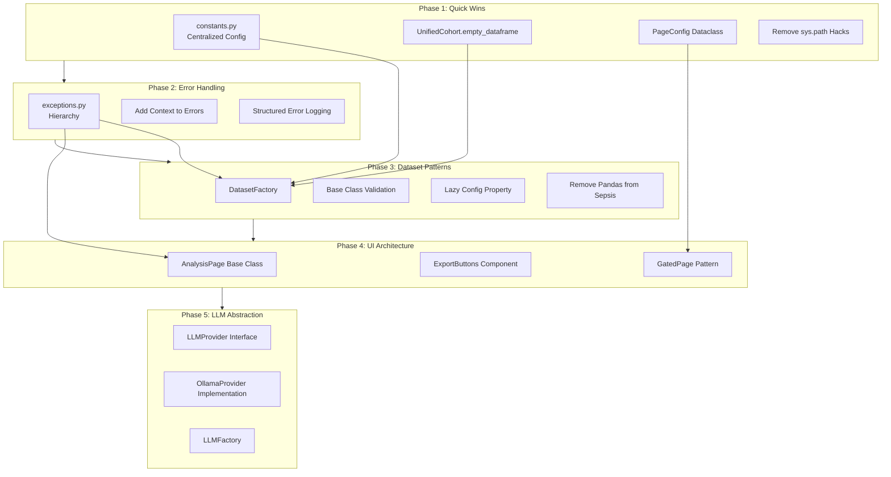
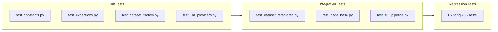

# DRY/SOLID Platform Refactoring

## Architecture Overview



## Phase 1: Quick Wins (1-2 days)

### 1.1: Create Constants Module

**Files**: [`src/clinical_analytics/core/constants.py`](src/clinical_analytics/core/constants.py) (new)

**Test Strategy**:
- Test that constants are immutable (frozen dataclasses)
- Test that all expected constants exist
- Test that values match current hardcoded values

**Implementation**:
```python
from dataclasses import dataclass

@dataclass(frozen=True)
class StatisticalThresholds:
    P_VALUE_THRESHOLD: float = 0.05
    CONFIDENCE_LEVEL: float = 0.95
    MIN_SAMPLE_SIZE: int = 10
    BINARY_UNIQUE_THRESHOLD: int = 2
    CATEGORICAL_UNIQUE_THRESHOLD: int = 10

@dataclass(frozen=True)
class LLMConfig:
    DEFAULT_TIMEOUT: float = 30.0
    MAX_RETRIES: int = 3
    RETRY_DELAY: float = 1.0

@dataclass(frozen=True)
class UIConfig:
    PAGE_TITLE_SUFFIX: str = " | Clinical Analytics"
    DEFAULT_LAYOUT: str = "wide"
    MAX_PREVIEW_ROWS: int = 20
```

**Migration**: Update all hardcoded values in UI pages and analysis modules.

### 1.2: Add empty_dataframe Helper

**Files**: [`src/clinical_analytics/core/schema.py`](src/clinical_analytics/core/schema.py)

**Test Strategy**:
- Test returns DataFrame with required columns
- Test returned DataFrame is empty
- Test column types match schema

**Implementation**:
```python
class UnifiedCohort:
    # ... existing code ...
    
    @staticmethod
    def empty_dataframe() -> pd.DataFrame:
        """Return empty DataFrame with required cohort columns."""
        return pd.DataFrame(columns=UnifiedCohort.REQUIRED_COLUMNS)
```

**Migration**: Replace 3 instances in dataset definitions.

### 1.3: Create PageConfig Dataclass

**Files**: [`src/clinical_analytics/ui/page_base.py`](src/clinical_analytics/ui/page_base.py) (new)

**Test Strategy**:
- Test PageConfig creates correct title format
- Test apply() method calls st.set_page_config with correct params
- Mock streamlit to verify parameters

**Implementation**:
```python
from dataclasses import dataclass
import streamlit as st

@dataclass
class PageConfig:
    title: str
    icon: str
    layout: str = "wide"
    
    def apply(self):
        st.set_page_config(
            page_title=f"{self.title} | Clinical Analytics",
            page_icon=self.icon,
            layout=self.layout
        )
```

**Migration**: Update all 8 UI pages.

### 1.4: Remove sys.path Manipulation

**Files**: All 8 files in [`src/clinical_analytics/ui/pages/`](src/clinical_analytics/ui/pages/)

**Test Strategy**:
- Run all page tests to ensure imports still work
- Test that pages can be imported without sys.path hacks

**Implementation**: Delete all `sys.path.insert()` lines, rely on proper editable install.

**Verification**: Run `make test-ui` to ensure no import errors.

---

## Phase 2: Error Handling Architecture (2-3 days)

### 2.1: Create Exception Hierarchy

**Files**: [`src/clinical_analytics/core/exceptions.py`](src/clinical_analytics/core/exceptions.py) (new)

**Test Strategy**:
- Test exception inheritance hierarchy
- Test `to_dict()` serialization
- Test exception details are preserved
- Test all exception types instantiate correctly

**Implementation**:
```python
class ClinicalAnalyticsError(Exception):
    def __init__(self, message: str, details: dict | None = None):
        super().__init__(message)
        self.message = message
        self.details = details or {}
    
    def to_dict(self) -> dict:
        return {
            "error_type": self.__class__.__name__,
            "message": self.message,
            "details": self.details
        }

# Hierarchy: DataError, DatasetError, UploadError, ProcessingError, LLMError
# With specific subclasses for each
```

**Migration**: Update 4 existing files that define custom exceptions.

### 2.2: Add Context to All Exceptions

**Files**: Throughout codebase - identify all `raise ValueError/Exception` calls

**Test Strategy**:
- Test exceptions include dataset name in context
- Test exceptions include relevant columns/values
- Test error messages are descriptive

**Implementation**: Replace generic exceptions with contextual ones:
```python
# Before
raise ValueError("Invalid schema")

# After
raise SchemaValidationError(
    "Dataset schema validation failed",
    details={
        "dataset": dataset_name,
        "missing_columns": missing,
        "actual_columns": df.columns.tolist()
    }
)
```

### 2.3: Add Structured Error Logging

**Files**: Core modules that raise exceptions

**Test Strategy**:
- Test error logging includes exception dict
- Test log entries have correct structure
- Use caplog fixture to verify logging

**Implementation**: Add logging to exception handlers:
```python
logger.error(
    "schema_validation_failed",
    error=exc.to_dict(),
    dataset=dataset_name
)
```

---

## Phase 3: Dataset Patterns (3-5 days)

### 3.1: Create DatasetFactory

**Files**: [`src/clinical_analytics/core/dataset_factory.py`](src/clinical_analytics/core/dataset_factory.py) (new)

**Test Strategy**:
- Test factory creates each dataset type correctly
- Test config loading and merging
- Test source_path resolution from config
- Test init_params override behavior

**Implementation**:
```python
class DatasetFactory:
    @staticmethod
    def create_dataset(
        dataset_cls: type[T],
        dataset_name: str,
        source_path: str | None = None,
        **init_overrides
    ) -> T:
        config = load_dataset_config(dataset_name)
        if source_path is None:
            source_path = config["init_params"].get("source_path")
        init_params = {**config["init_params"], **init_overrides}
        if source_path:
            init_params["source_path"] = source_path
        return dataset_cls(name=dataset_name, config=config, **init_params)
```

**Migration**: Refactor all 3 dataset `__init__` methods.

### 3.2: Add Granularity Validation to Base Class

**Files**: [`src/clinical_analytics/core/dataset.py`](src/clinical_analytics/core/dataset.py)

**Test Strategy**:
- Test validation accepts supported granularities
- Test validation rejects unsupported granularities
- Test error message includes supported options
- Test subclasses can override SUPPORTED_GRANULARITIES

**Implementation**:
```python
class ClinicalDataset(ABC):
    SUPPORTED_GRANULARITIES: ClassVar[frozenset[Granularity]] = frozenset(["patient_level"])
    
    def validate_granularity(self, granularity: Granularity) -> None:
        if granularity not in self.SUPPORTED_GRANULARITIES:
            supported = ", ".join(self.SUPPORTED_GRANULARITIES)
            raise ValueError(
                f"{self.__class__.__name__} only supports {supported} granularity. "
                f"Requested: {granularity}"
            )
```

**Migration**: Remove duplicate validation from 3 dataset classes.

### 3.3: Add Lazy Config Loading to Base Class

**Files**: [`src/clinical_analytics/core/dataset.py`](src/clinical_analytics/core/dataset.py)

**Test Strategy**:
- Test config property loads lazily
- Test config is cached after first access
- Test config loading failures raise appropriate error

**Implementation**:
```python
class ClinicalDataset(ABC):
    def __init__(self, name: str, ...):
        self.name = name
        self._config = None
    
    @property
    def config(self) -> dict:
        if self._config is None:
            self._config = load_dataset_config(self.name)
        return self._config
```

**Migration**: Remove explicit config loading from dataset constructors.

### 3.4: Remove Pandas from Sepsis Loader

**Files**: [`src/clinical_analytics/datasets/sepsis/definition.py`](src/clinical_analytics/datasets/sepsis/definition.py), [`src/clinical_analytics/datasets/sepsis/loader.py`](src/clinical_analytics/datasets/sepsis/loader.py)

**Test Strategy**:
- Test PSV files load correctly via Ibis
- Test aggregation produces same results as Polars version
- Test no pandas imports in sepsis module
- Integration test with full pipeline

**Implementation**: Replace Polars → Pandas conversion with direct Ibis loading:
```python
# Use DuckDB's read_csv with separator='|'
# Let Ibis handle aggregation via SQL
con = ibis.duckdb.connect()
raw = con.read_csv(psv_pattern, sep="|")
# Apply aggregations via semantic layer config
```

**PANDAS EXCEPTION REMOVED**: Document in commit message.

---

## Phase 4: UI Architecture (3-4 days)

### 4.1: Create Base Page Classes

**Files**: [`src/clinical_analytics/ui/page_base.py`](src/clinical_analytics/ui/page_base.py) (extend)

**Test Strategy**:
- Test AnalysisPage loads dataset correctly
- Test GatedPage respects gate configuration
- Test page lifecycle methods called in correct order
- Mock streamlit components

**Implementation**:
```python
class AnalysisPage:
    def __init__(self, page_config: PageConfig):
        self.page_config = page_config
        self.page_config.apply()
    
    def load_dataset(self, show_semantic_scope: bool = False):
        result = render_dataset_selector(show_semantic_scope=show_semantic_scope)
        if result is None:
            st.stop()
        return result

class GatedPage(AnalysisPage):
    def __init__(self, page_config: PageConfig, gate_in_mvp: bool = True):
        if gate_in_mvp:
            from clinical_analytics.ui.helpers import gate_v1_mvp_legacy_page
            gate_v1_mvp_legacy_page()
        super().__init__(page_config)
```

**Migration**: Refactor all 5 analysis pages (20-24).

### 4.2: Create ExportButtons Component

**Files**: [`src/clinical_analytics/ui/components/export_buttons.py`](src/clinical_analytics/ui/components/export_buttons.py) (new)

**Test Strategy**:
- Test CSV export produces correct format
- Test Excel export creates valid workbook
- Test Text export formatting
- Mock download_button to verify parameters

**Implementation**:
```python
class ExportButtons:
    @staticmethod
    def render_data_export(
        data: pd.DataFrame,
        filename_base: str,
        label: str = "Download Results"
    ):
        # CSV, Excel, Text download buttons in columns
```

**Migration**: Replace duplicate export code in 3 pages.

### 4.3: Consolidate Gate Pattern

**Files**: All analysis pages 20-24

**Test Strategy**:
- Test gated pages stop execution in MVP mode
- Test non-gated pages continue execution
- Test heavy imports only happen after gate

**Implementation**: Use GatedPage base class with lazy import pattern.

**Migration**: Simplify main() in all 5 analysis pages.

---

## Phase 5: LLM Abstraction (2-3 days)

### 5.1: Create LLM Provider Interface

**Files**: [`src/clinical_analytics/core/llm_interface.py`](src/clinical_analytics/core/llm_interface.py) (new)

**Test Strategy**:
- Test interface defines all required methods
- Test concrete implementations satisfy interface
- Test provider switching works correctly
- Mock provider for testing

**Implementation**:
```python
class LLMProvider(ABC):
    @abstractmethod
    def is_available(self) -> bool: pass
    
    @abstractmethod
    def generate(self, prompt: str, model: str, **kwargs) -> str: pass
    
    @abstractmethod
    def generate_json(self, prompt: str, model: str, **kwargs) -> dict: pass
```

### 5.2: Refactor Ollama to Provider Pattern

**Files**: [`src/clinical_analytics/core/providers/ollama.py`](src/clinical_analytics/core/providers/ollama.py) (new, move from llm_client.py)

**Test Strategy**:
- Test OllamaProvider implements interface
- Test existing functionality preserved
- Test backward compatibility with existing code

**Implementation**: Move OllamaClient code to OllamaProvider class.

**Migration**: Update all imports from llm_client to use provider interface.

### 5.3: Create LLM Factory

**Files**: [`src/clinical_analytics/core/llm_factory.py`](src/clinical_analytics/core/llm_factory.py) (new)

**Test Strategy**:
- Test factory creates correct provider type
- Test factory handles unknown provider gracefully
- Test factory supports configuration

**Implementation**:
```python
class LLMFactory:
    @staticmethod
    def create_provider(provider_type: str = "ollama") -> LLMProvider:
        if provider_type == "ollama":
            return OllamaProvider()
        raise ValueError(f"Unknown provider: {provider_type}")
```

---

## Testing Strategy

### Test Organization



### Test Execution Per Phase

**Phase 1**: `make test-core`, `make test-ui`
**Phase 2**: `make test-core`, `make test-integration`
**Phase 3**: `make test-datasets`, `make test-core`
**Phase 4**: `make test-ui`, `make test-integration`
**Phase 5**: `make test-core`

### Regression Protection

After each phase, run full test suite:
```bash
make test  # All 786+ tests must pass
make check # Lint, format, type check
```

---

## Migration Checklist

### Pre-Refactoring
- [ ] Create feature branch: `feat/dry-solid-refactoring`
- [ ] Run baseline tests: `make test` (document pass count)
- [ ] Run baseline quality: `make check` (document status)
- [ ] Commit hash for rollback: document current HEAD

### Per-Phase Checklist
- [ ] Write tests BEFORE implementation (Red phase)
- [ ] Run tests to verify failure (Red verified)
- [ ] Implement refactoring (Green phase)
- [ ] Run tests to verify pass (Green verified)
- [ ] Run `make format && make lint-fix`
- [ ] Run module-specific tests
- [ ] Run full test suite (regression check)
- [ ] Commit with TDD confirmation

### Post-Refactoring
- [ ] All 786+ tests passing
- [ ] Zero new linting errors
- [ ] Type checking passes
- [ ] Documentation updated
- [ ] Performance benchmarks show no regression
- [ ] Create PR with detailed migration notes

---

## Risk Mitigation

### Backward Compatibility

1. **Old imports still work**: Use `__all__` and deprecation warnings
2. **Gradual migration**: Each phase is independently deployable
3. **Feature flags**: Can disable new patterns if issues found

### Rollback Plan

Each phase commits separately, allowing selective rollback:
```bash
git revert <phase-N-commit>  # Revert specific phase
git checkout main            # Full rollback if needed
```

### Testing Coverage

- Minimum 80% coverage maintained throughout
- Critical paths have 100% coverage (dataset loading, analysis)
- Integration tests verify end-to-end workflows

---

## Success Metrics

### Code Quality
- **Lines of code**: Reduce by ~780 lines (25% in affected modules)
- **Duplication**: <5% duplicated blocks (from current ~30%)
- **Cyclomatic complexity**: Reduce average from 8 to 5

### Maintainability
- **Time to add dataset**: From 3 hours to 30 minutes
- **Time to add UI page**: From 2 hours to 30 minutes
- **Error debugging time**: Reduce by 50% (better context)

### Performance
- **Sepsis dataset loading**: 20% faster (remove Pandas conversion)
- **Memory usage**: 15% reduction (lazy evaluation)
- **Test execution**: <5% slower (acceptable trade-off)

---

## Implementation Order

Each phase follows TDD workflow:
1. Phase 1: Quick Wins (foundation for other phases)
2. Phase 2: Error Handling (better debugging for phases 3-5)
3. Phase 3: Dataset Patterns (core architecture)
4. Phase 4: UI Architecture (builds on phases 1-3)
5. Phase 5: LLM Abstraction (independent, can be done last)

Total estimated time: **10-15 days** with full TDD discipline and quality gates.
