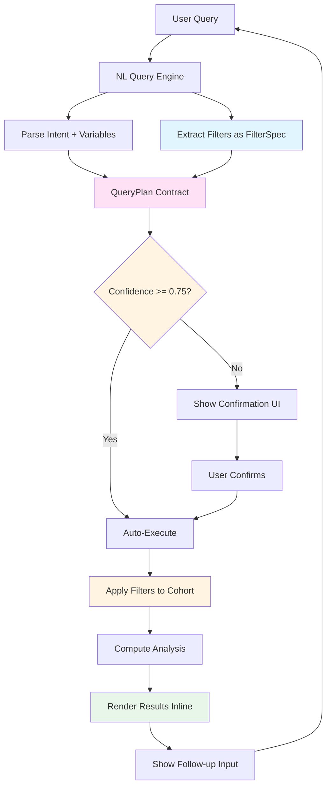

# Fix Comparison Analysis and Implement Conversational Filtering UI

## Alignment with ADR001, ADR002, ADR003, and ADR007

**This plan implements [ADR001: Fix Comparison Analysis, Implement Filtering, and Conversational UI](../../docs/implementation/ADR/ADR001.md)** and must align with:

1. **[ADR007: Feature Parity Architecture](../../docs/implementation/ADR/ADR007.md) **- **AUTHORITATIVE SOURCE** for feature parity. Establishes principle "Single-Table = Multi-Table with 1 Table". All features must work identically for both upload types.

2. **[ADR002: Persistent Storage Layer](../../docs/implementation/ADR/ADR002.md)** - Defines persistent DuckDB storage, lazy Polars evaluation, Parquet export. All features must apply to both upload types.

3. **[ADR003: Clinical Trust Architecture & Adaptive Terminology](../../docs/implementation/ADR/ADR003.md)** - Trust/verification UI and adaptive dictionary overlap with filter extraction and conversational UI.

### Critical Principle: Feature Parity (No Exceptions)

- Both upload types must use identical code paths - no conditional logic based on upload type
- Both upload types must have identical capabilities - persistence, query capabilities, analysis features, UI features
- No feature gap is acceptable - any capability added for one type must be available to the other

## Problem Statement

Three critical issues need addressing:

1. **Comparison Analysis Bug**: String numeric columns (e.g., "Viral Load" with values like "<20", "120") are incorrectly treated as categorical, causing the system to compare group counts instead of group means. This leads to wrong answers (e.g., selecting least common treatment instead of treatment with lowest mean).

2. **Missing Filter Support**: Queries like "what was the average t score of those that had osteoporosis (with scores below -2.5)" contain filter conditions that are parsed but not applied, resulting in incorrect results.

3. **Inconsistent UI**: The Ask Questions page has confusing buttons, lacks conversation history, and doesn't support natural follow-up questions. Users want a clean flow: question → data → question.

**All fixes must work identically for single-file and multi-table uploads per ADR007.**

## Solution Architecture



## Phase 0: Ensure Feature Parity (Prerequisite)

**Goal**: Eliminate any feature disparity between single-file and multi-table uploads before implementing new features. Both upload types must be first-class citizens with identical capabilities.

**Alignment with ADR007**: This phase implements ADR007 Phases 1-3 (MVP), which establishes unified persistence and semantic layer registration. ADR007 Phases 4-5 (lazy frames, conditional removal) are planned for future PRs but not required for this work.

**Implementation Strategy** (from ADR007):

1. **Normalize Upload Handling** (ADR007 Phase 1) ✅ Complete

                                                                                                                                                                                                                                                                                                                                                                                                                                                                                                                                                                                                                                                                                                                                                                                                                                                                                                                                                                                                                                                                                                                                                                                                                                                                                                                                                                                                                                                                                                                                                                                                                                                                                                                                                                                                                                                                                                                                                                                                                                                                                                                                                                                                                                                                                                                                                                                                                                                                                                                                                                                                                                                                                                                                                                                                                                                                                                                                                                                                                                                                                                                                                                                                - Create `normalize_upload_to_table_list()` function
                                                                                                                                                                                                                                                                                                                                                                                                                                                                                                                                                                                                                                                                                                                                                                                                                                                                                                                                                                                                                                                                                                                                                                                                                                                                                                                                                                                                                                                                                                                                                                                                                                                                                                                                                                                                                                                                                                                                                                                                                                                                                                                                                                                                                                                                                                                                                                                                                                                                                                                                                                                                                                                                                                                                                                                                                                                                                                                                                                                                                                                                                                                                                                                                - Both upload types normalize to same table list structure
                                                                                                                                                                                                                                                                                                                                                                                                                                                                                                                                                                                                                                                                                                                                                                                                                                                                                                                                                                                                                                                                                                                                                                                                                                                                                                                                                                                                                                                                                                                                                                                                                                                                                                                                                                                                                                                                                                                                                                                                                                                                                                                                                                                                                                                                                                                                                                                                                                                                                                                                                                                                                                                                                                                                                                                                                                                                                                                                                                                                                                                                                                                                                                                                - Single-table → `[{"name": "table_0", "data": df}]`
                                                                                                                                                                                                                                                                                                                                                                                                                                                                                                                                                                                                                                                                                                                                                                                                                                                                                                                                                                                                                                                                                                                                                                                                                                                                                                                                                                                                                                                                                                                                                                                                                                                                                                                                                                                                                                                                                                                                                                                                                                                                                                                                                                                                                                                                                                                                                                                                                                                                                                                                                                                                                                                                                                                                                                                                                                                                                                                                                                                                                                                                                                                                                                                                - Multi-table → `[{"name": "table_0", "data": df1}, {"name": "table_1", "data": df2}, ...]`

2. **Unify Persistence** (ADR007 Phase 2) ✅ Complete

                                                                                                                                                                                                                                                                                                                                                                                                                                                                                                                                                                                                                                                                                                                                                                                                                                                                                                                                                                                                                                                                                                                                                                                                                                                                                                                                                                                                                                                                                                                                                                                                                                                                                                                                                                                                                                                                                                                                                                                                                                                                                                                                                                                                                                                                                                                                                                                                                                                                                                                                                                                                                                                                                                                                                                                                                                                                                                                                                                                                                                                                                                                                                                                                - Both upload types save individual tables to `{upload_id}_tables/` directory
                                                                                                                                                                                                                                                                                                                                                                                                                                                                                                                                                                                                                                                                                                                                                                                                                                                                                                                                                                                                                                                                                                                                                                                                                                                                                                                                                                                                                                                                                                                                                                                                                                                                                                                                                                                                                                                                                                                                                                                                                                                                                                                                                                                                                                                                                                                                                                                                                                                                                                                                                                                                                                                                                                                                                                                                                                                                                                                                                                                                                                                                                                                                                                                                - Both save unified cohort CSV (for backward compatibility)
                                                                                                                                                                                                                                                                                                                                                                                                                                                                                                                                                                                                                                                                                                                                                                                                                                                                                                                                                                                                                                                                                                                                                                                                                                                                                                                                                                                                                                                                                                                                                                                                                                                                                                                                                                                                                                                                                                                                                                                                                                                                                                                                                                                                                                                                                                                                                                                                                                                                                                                                                                                                                                                                                                                                                                                                                                                                                                                                                                                                                                                                                                                                                                                                - Both use `inferred_schema` metadata format (convert `variable_mapping` during save)

3. **Unify Semantic Layer Registration** (ADR007 Phase 3) ✅ Complete

                                                                                                                                                                                                                                                                                                                                                                                                                                                                                                                                                                                                                                                                                                                                                                                                                                                                                                                                                                                                                                                                                                                                                                                                                                                                                                                                                                                                                                                                                                                                                                                                                                                                                                                                                                                                                                                                                                                                                                                                                                                                                                                                                                                                                                                                                                                                                                                                                                                                                                                                                                                                                                                                                                                                                                                                                                                                                                                                                                                                                                                                                                                                                                                                - Both upload types register all tables in DuckDB identically
                                                                                                                                                                                                                                                                                                                                                                                                                                                                                                                                                                                                                                                                                                                                                                                                                                                                                                                                                                                                                                                                                                                                                                                                                                                                                                                                                                                                                                                                                                                                                                                                                                                                                                                                                                                                                                                                                                                                                                                                                                                                                                                                                                                                                                                                                                                                                                                                                                                                                                                                                                                                                                                                                                                                                                                                                                                                                                                                                                                                                                                                                                                                                                                                - Remove hardcoded `patient_level` restriction
                                                                                                                                                                                                                                                                                                                                                                                                                                                                                                                                                                                                                                                                                                                                                                                                                                                                                                                                                                                                                                                                                                                                                                                                                                                                                                                                                                                                                                                                                                                                                                                                                                                                                                                                                                                                                                                                                                                                                                                                                                                                                                                                                                                                                                                                                                                                                                                                                                                                                                                                                                                                                                                                                                                                                                                                                                                                                                                                                                                                                                                                                                                                                                                                - Both support all granularity levels (patient_level, admission_level, event_level)

4. **Unify Data Access** (ADR007 Phase 4) - Planned for future PR

                                                                                                                                                                                                                                                                                                                                                                                                                                                                                                                                                                                                                                                                                                                                                                                                                                                                                                                                                                                                                                                                                                                                                                                                                                                                                                                                                                                                                                                                                                                                                                                                                                                                                                                                                                                                                                                                                                                                                                                                                                                                                                                                                                                                                                                                                                                                                                                                                                                                                                                                                                                                                                                                                                                                                                                                                                                                                                                                                                                                                                                                                                                                                                                                - Both upload types return Polars lazy frames (not pandas DataFrames)
                                                                                                                                                                                                                                                                                                                                                                                                                                                                                                                                                                                                                                                                                                                                                                                                                                                                                                                                                                                                                                                                                                                                                                                                                                                                                                                                                                                                                                                                                                                                                                                                                                                                                                                                                                                                                                                                                                                                                                                                                                                                                                                                                                                                                                                                                                                                                                                                                                                                                                                                                                                                                                                                                                                                                                                                                                                                                                                                                                                                                                                                                                                                                                                                - Both support lazy evaluation and predicate pushdown
                                                                                                                                                                                                                                                                                                                                                                                                                                                                                                                                                                                                                                                                                                                                                                                                                                                                                                                                                                                                                                                                                                                                                                                                                                                                                                                                                                                                                                                                                                                                                                                                                                                                                                                                                                                                                                                                                                                                                                                                                                                                                                                                                                                                                                                                                                                                                                                                                                                                                                                                                                                                                                                                                                                                                                                                                                                                                                                                                                                                                                                                                                                                                                                                - Remove eager pandas loading paths

5. **Remove Conditional Logic** (ADR007 Phase 5) - Planned for future PR

                                                                                                                                                                                                                                                                                                                                                                                                                                                                                                                                                                                                                                                                                                                                                                                                                                                                                                                                                                                                                                                                                                                                                                                                                                                                                                                                                                                                                                                                                                                                                                                                                                                                                                                                                                                                                                                                                                                                                                                                                                                                                                                                                                                                                                                                                                                                                                                                                                                                                                                                                                                                                                                                                                                                                                                                                                                                                                                                                                                                                                                                                                                                                                                                - Eliminate all `if upload_type == "single"` conditionals
                                                                                                                                                                                                                                                                                                                                                                                                                                                                                                                                                                                                                                                                                                                                                                                                                                                                                                                                                                                                                                                                                                                                                                                                                                                                                                                                                                                                                                                                                                                                                                                                                                                                                                                                                                                                                                                                                                                                                                                                                                                                                                                                                                                                                                                                                                                                                                                                                                                                                                                                                                                                                                                                                                                                                                                                                                                                                                                                                                                                                                                                                                                                                                                                - Use unified code paths for both upload types
                                                                                                                                                                                                                                                                                                                                                                                                                                                                                                                                                                                                                                                                                                                                                                                                                                                                                                                                                                                                                                                                                                                                                                                                                                                                                                                                                                                                                                                                                                                                                                                                                                                                                                                                                                                                                                                                                                                                                                                                                                                                                                                                                                                                                                                                                                                                                                                                                                                                                                                                                                                                                                                                                                                                                                                                                                                                                                                                                                                                                                                                                                                                                                                                - Verify identical behavior through tests

**Success Criteria** (from ADR007):

- [ ] Single-table and multi-table uploads have identical persistence structure
- [ ] Both upload types register all tables in DuckDB semantic layer
- [ ] Both upload types support lazy Polars evaluation
- [ ] Both upload types use same metadata schema (`inferred_schema` format)
- [ ] Both upload types go through same validation pipeline
- [ ] Both upload types support all granularity levels
- [ ] No conditional logic based on upload type exists in codebase
- [ ] Same query produces identical results for both upload types

**Implementation Notes**:

- See ADR007 for complete implementation details, code examples, and migration strategy
- This phase must be completed before Phase 1-3 to ensure new features work for both upload types
- All subsequent phases assume feature parity is established per ADR007

## QueryPlan Contract (ADR001 Requirement)

**ADR001 owns the QueryPlan schema** - this is the contract between NLU (query parsing) and execution (semantic layer + analysis functions). All query parsing must produce a `QueryPlan`, and all execution must consume a `QueryPlan`.

### Define QueryPlan and FilterSpec Dataclasses

**File**: `src/clinical_analytics/core/query_plan.py` (new)

```python
from dataclasses import dataclass, field
from typing import Literal

@dataclass
class FilterSpec:
    """Single filter condition specification."""
    column: str  # Canonical column name (after alias resolution)
    operator: Literal["==", "!=", ">", ">=", "<", "<=", "IN", "NOT_IN"]
    value: str | int | float | list[str | int | float]  # Filter value(s)
    exclude_nulls: bool = True  # Whether to exclude nulls (default: yes)

@dataclass
class QueryPlan:
    """Structured query plan produced by NLU and consumed by execution layer."""
    intent: Literal["COUNT", "DESCRIBE", "COMPARE_GROUPS", "FIND_PREDICTORS", "CORRELATIONS"]
    metric: str | None = None  # Column name for aggregation (e.g., "LDL mg/dL" for average/describe)
    group_by: str | None = None  # Column name for grouping (e.g., "Nicotine Use")
    filters: list[FilterSpec] = field(default_factory=list)  # Filter conditions
    confidence: float = 0.0  # Parsing confidence (0.0-1.0)
    explanation: str = ""  # Human-readable explanation (shown in UI + logs)
    run_key: str | None = None  # Deterministic key for idempotent execution (includes dataset_version + plan hash)
```

**QueryPlan Semantics by Intent**:

- **COUNT**: Count rows (optionally with filters, optionally grouped by `group_by`)
  - `metric=None`, `group_by=None` → Total count with filters
  - `metric=None`, `group_by="X"` → Count by X (frequency table)
  - Example: "how many patients on statins?" → `COUNT`, `filters=[FilterSpec("Statin Prescribed?", "==", "Yes")]`

- **DESCRIBE**: Descriptive statistics for a metric
  - `metric="X"`, `group_by=None` → Stats for X (mean, median, std dev, etc.)
  - `metric="X"`, `group_by="Y"` → Stats for X grouped by Y
  - Example: "average LDL" → `DESCRIBE`, `metric="LDL mg/dL"`

- **COMPARE_GROUPS**: Compare metric across groups
  - `metric="X"`, `group_by="Y"` → Compare X across Y groups (t-test/ANOVA/chi-square)
  - Example: "compare viral load by treatment" → `COMPARE_GROUPS`, `metric="Viral Load"`, `group_by="Treatment"`

- **FIND_PREDICTORS**: Predictive modeling
  - `metric="X"` (outcome), `group_by=None` → Find predictors of X
  - Example: "what predicts mortality?" → `FIND_PREDICTORS`, `metric="mortality"`

**Execution Gating Rules**:
- **Confidence < threshold (default 0.75)**: Show interpreted plan in UI, require user confirmation before execution
- **Confidence >= threshold**: Auto-execute (user can still review results)
- **Idempotency**: `run_key` is deterministic hash of `(dataset_version, normalized_plan)` - same plan on same data = same key = cached result

## Phase 1: Fix Comparison Analysis Bug

### 1.1 Update `compute_comparison_analysis()` to try numeric conversion first

**File**: `src/clinical_analytics/analysis/compute.py`**Change**: Before determining test type (line 388-389), try converting the outcome column to numeric using `_try_convert_to_numeric()` (same helper used in descriptive analysis).

```python
def compute_comparison_analysis(df: pl.DataFrame, context: AnalysisContext) -> dict[str, Any]:
    outcome_col = context.primary_variable
    group_col = context.grouping_variable
    
    # Clean data
    analysis_df = df.select([outcome_col, group_col]).drop_nulls()
    
    # CRITICAL FIX: Try numeric conversion FIRST, before deciding test type
    outcome_series = analysis_df[outcome_col]
    numeric_outcome = None
    outcome_is_numeric = False
    
    # Check if already numeric
    if outcome_series.dtype in (pl.Int64, pl.Float64):
        outcome_is_numeric = True
        numeric_outcome = outcome_series
    else:
        # Try to convert string columns to numeric (handles "<20", "120", etc.)
        numeric_outcome = _try_convert_to_numeric(outcome_series)
        if numeric_outcome is not None:
            outcome_is_numeric = True
            # Replace outcome column with numeric version
            analysis_df = analysis_df.with_columns(numeric_outcome.alias(outcome_col))
    
    # Now proceed with numeric vs categorical logic
    if outcome_is_numeric:
        # Use t-test/ANOVA path (existing code lines 398-464)
        ...
    else:
        # Use chi-square path (existing code lines 466-516)
        ...
```

**Why**: Ensures string columns containing numeric data (like "Viral Load" with "<20", "120") are treated as numeric and use mean-based comparisons, not count-based.

### 1.2 Add tests for string numeric conversion in comparison

**File**: `tests/analysis/test_compute.py`Add test cases:

- String numeric outcome with "<20" style values
- String numeric outcome with European comma format
- Verify group means are computed correctly (not counts)

## Phase 1.5: Add COUNT Intent Type (P0 - Quick Win)

**Goal**: Support simple counting queries ("how many X?") as first-class intent type.

**Real-World Failure Evidence**: Query **"how many were on a statin?"** should return a simple count, but system computed descriptive statistics (mean=0.93) instead. This is a fundamental query type that must work.

### 1.5.1 Add COUNT to intent types

**File**: `src/clinical_analytics/core/nl_query_engine.py`

```python
VALID_INTENT_TYPES = ["DESCRIBE", "COMPARE_GROUPS", "FIND_PREDICTORS", "COUNT", "CORRELATIONS"]
```

### 1.5.2 Pattern matching for COUNT intent

**File**: `src/clinical_analytics/core/nl_query_engine.py`

```python
COUNT_PATTERNS = [
    r"how many",
    r"count",
    r"number of",
]
if any(re.search(p, query.lower()) for p in COUNT_PATTERNS):
    intent = QueryIntent(intent_type="COUNT", confidence=0.9)
```

### 1.5.3 COUNT QueryPlan execution

**File**: `src/clinical_analytics/analysis/compute.py` or semantic layer

- If `filters` present: Use `semantic_layer.query(metrics=["count"], filters={...})` for SQL aggregation
- If `group_by` present: Use `semantic_layer.query(metrics=["count"], dimensions=[group_by])` for grouped counts
- Return simple count/percentage, not statistics

**Success Criteria**:
- "how many X?" queries produce COUNT intent with confidence >0.75
- COUNT queries return count/percentage, not mean/median/std dev
- COUNT queries use semantic layer aggregation (SQL) when possible, not Polars

## Phase 2: Implement Filter Parsing and Application

### 2.1 Add filter extraction to NL Query Engine

**File**: `src/clinical_analytics/core/nl_query_engine.py`

**Note**: This coordinates with ADR003 Phase 2 (Enhanced LLM Parser) - filter extraction can leverage enhanced LLM parsing for complex filter conditions.

**Implementation Strategy**: **P0: Deterministic heuristics first, LLM only when needed**

Filter extraction should use deterministic pattern matching (Tier 1.5) for common patterns:
- "not on X" → `FilterSpec(column="X", operator="==", value="No")`
- "those patients with X" → `FilterSpec(column="X", operator="==", value="Yes")`
- "scores below/above X" → `FilterSpec(column="score_col", operator="<"/">", value=X)`

LLM structured extraction (Tier 3) only invoked when:
- Tier 1.5 cannot produce valid FilterSpec with confidence ≥ threshold
- Query contains complex negation or multiple conditions

**New Method**: `_extract_filters(query: str) -> list[FilterSpec]`

Extract filter conditions from query text (returns FilterSpec, not dict):

```python
from clinical_analytics.core.query_plan import FilterSpec

def _extract_filters(self, query: str) -> list[FilterSpec]:
    """
    Extract filter conditions from query text.
    
    Patterns to detect:
    - "those that had X" / "patients with X" → categorical filter
    - "scores below/above X" → numeric range filter
    - "with X" / "without X" → presence filter
    
    Returns:
        List of FilterSpec objects:
        [
            FilterSpec(column="Results of DEXA?", operator="==", value="Osteoporosis"),
            FilterSpec(column="DEXA Score (T score)", operator="<", value=-2.5)
        ]
    """
    filters = []
    query_lower = query.lower()
    
    # Pattern 1: Categorical filters ("those that had X", "patients with X")
    # Match against semantic layer column aliases
    # ...
    
    # Pattern 2: Numeric range filters ("below X", "above X", "less than X")
    # Extract numeric value and operator
    # ...
    
    # Pattern 3: "without X" → inverse filter
    # ...
    
    return filters
```

**Integration**: 
- Call `_extract_filters()` in `parse_query()` and populate `QueryIntent.filters` (as `list[FilterSpec]`)
- Convert `QueryIntent` to `QueryPlan` with filters as `list[FilterSpec]`
- Pass `QueryPlan` to execution layer (semantic layer or analysis functions)

**Data Structure**: Filters use `FilterSpec` dataclass (from QueryPlan contract), not dicts. This ensures type safety and prevents ad-hoc structures.

### 2.2 Convert QueryIntent to QueryPlan

**File**: `src/clinical_analytics/core/nl_query_engine.py`

**New Method**: `_intent_to_plan(intent: QueryIntent, dataset_version: str) -> QueryPlan`

```python
from clinical_analytics.core.query_plan import QueryPlan, FilterSpec
import hashlib
import json

def _intent_to_plan(self, intent: QueryIntent, dataset_version: str) -> QueryPlan:
    """Convert QueryIntent to QueryPlan with deterministic run_key."""
    
    # Create QueryPlan from intent
    plan = QueryPlan(
        intent=intent.intent_type,
        metric=intent.primary_variable,
        group_by=intent.grouping_variable,
        filters=intent.filters,  # Already FilterSpec objects
        confidence=intent.confidence,
        explanation=intent.explanation or "",
    )
    
    # Generate deterministic run_key: hash of (dataset_version, normalized_plan)
    normalized_plan = {
        "intent": plan.intent,
        "metric": plan.metric,
        "group_by": plan.group_by,
        "filters": [
            {
                "column": f.column,
                "operator": f.operator,
                "value": f.value,
                "exclude_nulls": f.exclude_nulls,
            }
            for f in plan.filters
        ],
    }
    plan_hash = hashlib.sha256(
        json.dumps(normalized_plan, sort_keys=True).encode()
    ).hexdigest()[:16]
    plan.run_key = f"{dataset_version}_{plan_hash}"
    
    return plan
```

### 2.3 Update AnalysisContext to use QueryPlan

**File**: `src/clinical_analytics/ui/components/question_engine.py`

**Change**: `AnalysisContext` should contain a `QueryPlan` (or be replaced by QueryPlan entirely).

```python
from clinical_analytics.core.query_plan import QueryPlan

@dataclass
class AnalysisContext:
    # ... existing fields ...
    query_plan: QueryPlan | None = None  # Structured plan (preferred)
    # OR: Keep existing fields but add query_plan for new code paths
```

**Propagation**: In `ask_free_form_question()`, convert `QueryIntent` to `QueryPlan` and store in context:

```python
# In ask_free_form_question():
query_intent = self.parse_query(query, ...)
query_plan = self._intent_to_plan(query_intent, dataset_version)
context.query_plan = query_plan
```

### 2.4 Apply filters in compute functions

**File**: `src/clinical_analytics/analysis/compute.py`

**New Helper**: `_apply_filters(df: pl.DataFrame, filters: list[FilterSpec]) -> pl.DataFrame`

```python
from clinical_analytics.core.query_plan import FilterSpec

def _apply_filters(df: pl.DataFrame, filters: list[FilterSpec]) -> pl.DataFrame:
    """
    Apply filter conditions to DataFrame.
    
    Args:
        df: Input DataFrame
        filters: List of FilterSpec objects
    
    Returns:
        Filtered DataFrame
    """
    # Operator dispatch table
    OPERATORS = {
        "==": lambda col, val: pl.col(col) == val,
        "!=": lambda col, val: pl.col(col) != val,
        "<": lambda col, val: pl.col(col) < val,
        ">": lambda col, val: pl.col(col) > val,
        "<=": lambda col, val: pl.col(col) <= val,
        ">=": lambda col, val: pl.col(col) >= val,
        "IN": lambda col, val: pl.col(col).is_in(val),
        "NOT_IN": lambda col, val: ~pl.col(col).is_in(val),
    }
    
    filtered_df = df
    for filter_spec in filters:
        if filter_spec.column not in df.columns:
            continue  # Skip if column not found
        
        # Apply null exclusion if requested (default: yes)
        if filter_spec.exclude_nulls:
            filtered_df = filtered_df.filter(pl.col(filter_spec.column).is_not_null())
        
        # Apply operator
        op_func = OPERATORS.get(filter_spec.operator)
        if op_func:
            filtered_df = filtered_df.filter(op_func(filter_spec.column, filter_spec.value))
    
    return filtered_df
```

**Feature Parity**: Filter application must work identically for both single-file and multi-table uploads, using the same lazy Polars evaluation pattern.

**Integration**: 
- In `compute_descriptive_analysis()`: Apply filters at the start (line ~340), before computing statistics
- In `compute_comparison_analysis()`: Apply filters at the start (line ~390), before grouping
- For COUNT intent: Use `semantic_layer.query(metrics=["count"], filters={...})` when possible (SQL aggregation), fall back to Polars if needed
- Track filtered vs unfiltered counts for breakdown reporting
- **Feature Parity**: Filter application must work identically for both single-file and multi-table uploads, using the same lazy Polars evaluation pattern

**Note**: For COUNT queries with filters, prefer semantic layer aggregation (`query()` method) over Polars filtering + counting. This is faster and more correct (predicate pushdown in SQL).

### 2.5 Enhanced breakdown reporting

**File**: `src/clinical_analytics/analysis/compute.py`**Modify `compute_descriptive_analysis()`** to return breakdown info:

```python
def compute_descriptive_analysis(df: pl.DataFrame, context: AnalysisContext) -> dict[str, Any]:
    # Store original count
    original_count = len(df)
    
    # Apply filters from QueryPlan
    if context.query_plan and context.query_plan.filters:
        df = _apply_filters(df, context.query_plan.filters)
    
    # ... existing analysis logic ...
    
    return {
        # ... existing fields ...
        "original_count": original_count,
        "filtered_count": len(df),
        "filters_applied": [f.__dict__ for f in context.query_plan.filters] if context.query_plan else [],
        "filter_description": _format_filter_description(context.query_plan.filters) if context.query_plan else "",
    }
```

**New Helper**: `_format_filter_description(filters: list[FilterSpec]) -> str`

```python
from clinical_analytics.core.query_plan import FilterSpec

def _format_filter_description(filters: list[FilterSpec]) -> str:
    """Convert filter list to human-readable description."""
    if not filters:
        return ""
    
    descriptions = []
    for f in filters:
        op_text = {
            "==": "equals",
            "!=": "does not equal",
            "<": "less than",
            ">": "greater than",
            "<=": "at most",
            ">=": "at least",
            "IN": "in",
            "NOT_IN": "not in",
        }.get(f.operator, f.operator)
        
        descriptions.append(f"{f.column} {op_text} {f.value}")
    
    return "; ".join(descriptions)
```

**File**: `src/clinical_analytics/ui/pages/3_💬_Ask_Questions.py`**Update rendering functions** to show breakdown:

```python
def _render_focused_descriptive(result: dict) -> None:
    # Show breakdown if filters were applied
    if result.get("filters_applied"):
        st.markdown("### Data Breakdown")
        col1, col2 = st.columns(2)
        with col1:
            st.metric("Matching Criteria", f"{result['filtered_count']:,}")
        with col2:
            st.metric("Excluded", f"{result['original_count'] - result['filtered_count']:,}")
        
        if result.get("filter_description"):
            st.caption(f"**Filters:** {result['filter_description']}")
        
        st.divider()
    
    # Show headline answer
    if "headline" in result:
        st.info(f"📋 **Answer:** {result['headline']}")
    
    # ... rest of rendering
```

Apply similar breakdown display to `_render_focused_comparison()`.

## Phase 3: Redesign UI for Conversational Flow

**Note**: This coordinates with ADR003 Phase 1 (Trust Layer) - conversational UI should include verification expanders in each result message.

### 3.1 Implement execution gating

**File**: `src/clinical_analytics/ui/pages/3_💬_Ask_Questions.py`

**Execution Gating Rules** (per ADR001):
- **Confidence < threshold (default 0.75)**: Show interpreted plan in UI, require user confirmation before execution
- **Confidence >= threshold**: Auto-execute (user can still review results)
- **Idempotency**: `run_key` is deterministic hash of `(dataset_version, normalized_plan)` - same plan on same data = same key = cached result

**Implementation**:

```python
# In main() flow:
query_plan = context.query_plan  # From QuestionEngine.ask_free_form_question()

# Check confidence threshold
CONFIDENCE_THRESHOLD = 0.75
if query_plan.confidence < CONFIDENCE_THRESHOLD:
    # Low confidence - show confirmation UI
    with st.chat_message("assistant"):
        st.warning(f"Confidence: {query_plan.confidence:.0%} - Please confirm interpretation")
        st.json({
            "intent": query_plan.intent,
            "metric": query_plan.metric,
            "group_by": query_plan.group_by,
            "filters": [f.__dict__ for f in query_plan.filters],
            "explanation": query_plan.explanation,
        })
        
        col1, col2 = st.columns(2)
        with col1:
            if st.button("Confirm and Run", use_container_width=True):
                st.session_state["confirmed_plan"] = query_plan
                st.rerun()
        with col2:
            if st.button("Cancel", use_container_width=True):
                st.session_state["confirmed_plan"] = None
                st.rerun()
    
    # Wait for confirmation
    if "confirmed_plan" not in st.session_state:
        return
    
    query_plan = st.session_state["confirmed_plan"]
    del st.session_state["confirmed_plan"]

# High confidence or confirmed - proceed with execution
# Use deterministic run_key from QueryPlan (already set in _intent_to_plan)
run_key = query_plan.run_key
```

**Note**: The `run_key` is now deterministic (hash-based) and set during QueryPlan creation, not time-based. This enables idempotent execution and result caching.

### 3.2 Conversation history data structure

**File**: `src/clinical_analytics/ui/pages/3_💬_Ask_Questions.py`**New Session State Structure** (lightweight storage per ADR001):

```python
# Initialize conversation history
if "conversation_history" not in st.session_state:
    st.session_state["conversation_history"] = []

# Each entry (lightweight storage):
{
    "query": str,  # Original user query
    "intent": AnalysisIntent,  # Parsed intent
    "headline": str,  # Summary result (not full result dict)
    "run_key": str,  # Unique key to reference full result if needed
    "timestamp": float,  # Unix timestamp
    "filters_applied": list[dict],  # For audit trail
}
```

**Rationale**: Store lightweight summaries (headline text, not full result dicts with arrays/charts) to prevent session state bloat. Full results can be reconstructed on demand via `run_key`.

### 3.2 Redesign main UI flow

**File**: `src/clinical_analytics/ui/pages/3_💬_Ask_Questions.py`**New Flow**:

```python
def main():
    st.title("💬 Ask Questions")
    
    # Display conversation history (if any)
    if st.session_state.get("conversation_history"):
        for entry in st.session_state.conversation_history:
            with st.chat_message("user"):
                st.write(entry["query"])
            
            with st.chat_message("assistant"):
                st.info(entry["headline"])
                
                # Expandable details
                with st.expander("View detailed results"):
                    # Reconstruct or display cached details
                    st.write("Detailed analysis here...")
    
    # Always show query input at bottom (sticky)
    query = st.chat_input("Ask a question about your data...")
    
    if query:
        # Parse and execute
        context = QuestionEngine.ask_free_form_question(
            query=query,
            data_preview=st.session_state["data_preview"],
            semantic_layer=st.session_state["semantic_layer"],
        )
        
        if context and context.execution_ready:
            # Execute analysis
            result = execute_analysis(
                df=st.session_state["uploaded_data"],
                context=context,
            )
            
            # Use deterministic run_key from QueryPlan (already set during creation)
            run_key = context.query_plan.run_key if context.query_plan else None
            
            # Add to conversation history (lightweight)
            st.session_state.conversation_history.append({
                "query": query,
                "intent": context.inferred_intent,
                "headline": result.get("headline") or result.get("headline_text"),
                "run_key": run_key,
                "timestamp": time.time(),
                "filters_applied": [f.__dict__ for f in context.query_plan.filters] if context.query_plan else [],
            })
            
            # Rerun to display new message
            st.rerun()
```

**Handling Low Confidence Variable Matches**:

Instead of showing variable selection UI in expanders, display inline clarification in chat:

```python
if context and not context.execution_ready:
    # Low confidence - ask for clarification inline
    with st.chat_message("assistant"):
        st.warning("I found multiple possible matches. Which did you mean?")
        
        # Show options as buttons
        for idx, option in enumerate(context.candidate_variables):
            if st.button(
                f"{option['column']} ({option['confidence']:.0%} confidence)",
                key=f"clarify_{idx}_{run_key}",
                use_container_width=True,
            ):
                # Update context with selected variable
                st.session_state["pending_clarification"] = {
                    "context": context,
                    "selected_variable": option["column"],
                }
                st.rerun()
```

### 3.3 Remove confusing buttons

**Remove**:

- "Start Over" button (replace with "Clear Conversation" in sidebar)
- "Clear Results" button (replace with conversation history management)
- "Confirm and Run" button (auto-execute on high confidence, show inline for low confidence)
- Low confidence variable selection UI (replace with inline clarification)

**Replace with**:

- Inline result rendering (no page switching)
- Follow-up query input always visible
- Conversation history sidebar (optional, collapsible)

### 3.4 Inline result rendering

**File**: `src/clinical_analytics/ui/pages/3_💬_Ask_Questions.py`**New Function**: `_render_result_inline(result: dict, context: AnalysisContext) -> None`

```python
def _render_result_inline(result: dict, context: AnalysisContext) -> None:
    """Render analysis result inline in conversation flow."""
    
    # Show query
    with st.chat_message("user"):
        st.write(context.research_question)
    
    # Show answer
    with st.chat_message("assistant"):
        # Headline answer first
        if result.get("headline") or result.get("headline_text"):
            st.info(result.get("headline") or result.get("headline_text"))
        
        # Detailed results (collapsible)
        with st.expander("View detailed results"):
            render_analysis_by_type(result, context.inferred_intent)
        
        # Suggest follow-up questions
        _suggest_follow_ups(context, result)
```

### 3.5 Follow-up question suggestions

**File**: `src/clinical_analytics/ui/pages/3_💬_Ask_Questions.py`**New Function**: `_suggest_follow_ups(context: AnalysisContext, result: dict) -> None`

```python
def _suggest_follow_ups(context: AnalysisContext, result: dict) -> None:
    """Suggest natural follow-up questions based on current result."""
    
    st.markdown("**💡 You might also ask:**")
    
    suggestions = []
    
    if context.inferred_intent == AnalysisIntent.DESCRIBE:
        if context.primary_variable:
            suggestions.append(f"Compare {context.primary_variable} by treatment group")
            suggestions.append(f"What predicts {context.primary_variable}?")
    
    elif context.inferred_intent == AnalysisIntent.COMPARE_GROUPS:
        if context.grouping_variable and context.primary_variable:
            suggestions.append(f"Show distribution of {context.primary_variable} by {context.grouping_variable}")
            suggestions.append(f"What else affects {context.primary_variable}?")
    
    # Render as clickable buttons that populate chat input
    for suggestion in suggestions:
        if st.button(suggestion, key=f"suggest_{hash(suggestion)}", use_container_width=True):
            st.session_state["prefilled_query"] = suggestion
            st.rerun()
```

**Integration**: Call `_suggest_follow_ups()` at the end of each assistant message block.

**Optional Enhancement**: If `st.session_state.get("prefilled_query")` exists, pre-populate the `st.chat_input()` with it (if Streamlit supports this; otherwise, display as text above input).

### 3.5 Conversation management controls

**File**: `src/clinical_analytics/ui/pages/3_💬_Ask_Questions.py`

**Add to sidebar**:

```python
with st.sidebar:
    st.markdown("### Conversation")
    
    if st.button("Clear Conversation", use_container_width=True):
        st.session_state.conversation_history = []
        st.rerun()
    
    # Optional: Export conversation as JSON
    if st.session_state.get("conversation_history"):
        conversation_json = json.dumps(
            st.session_state.conversation_history,
            indent=2,
            default=str,
        )
        st.download_button(
            "Export Conversation",
            data=conversation_json,
            file_name=f"conversation_{int(time.time())}.json",
            mime="application/json",
            use_container_width=True,
        )
```

**Rationale**: Conversation controls in sidebar keep main area clean. Export supports audit trail for clinical research reproducibility.

## Phase 4: Testing

### 4.1 Test comparison analysis with string numeric columns

**File**: `tests/analysis/test_compute.py`

```python
def test_comparison_analysis_with_string_numeric_outcome():
    """Test that string numeric columns are converted and means computed."""
    df = pl.DataFrame({
        "Treatment": ["A", "A", "B", "B"],
        "Viral Load": ["<20", "120", "200", "150"],
    })
    
    context = AnalysisContext(
        primary_variable="Viral Load",
        grouping_variable="Treatment",
        inferred_intent=AnalysisIntent.COMPARE_GROUPS,
    )
    
    result = compute_comparison_analysis(df, context)
    
    # Verify group means were computed (not counts)
    assert "group_statistics" in result
    # Treatment A: mean of [20, 120] = 70
    # Treatment B: mean of [200, 150] = 175
    # (Note: "<20" converts to 20 as upper bound)
    assert result["group_statistics"]["A"]["mean"] == pytest.approx(70, rel=0.01)
    assert result["group_statistics"]["B"]["mean"] == pytest.approx(175, rel=0.01)
    
    # Verify test type is numeric (t-test or ANOVA)
    assert result["test_type"] in ["t-test", "ANOVA"]

def test_comparison_analysis_with_european_comma_format():
    """Test European comma format conversion (e.g., '1,234.5')."""
    df = pl.DataFrame({
        "Treatment": ["A", "B"],
        "Score": ["1,234.5", "2,345.6"],
    })
    
    context = AnalysisContext(
        primary_variable="Score",
        grouping_variable="Treatment",
        inferred_intent=AnalysisIntent.COMPARE_GROUPS,
    )
    
    result = compute_comparison_analysis(df, context)
    
    # Verify conversion and mean computation
    assert result["group_statistics"]["A"]["mean"] == pytest.approx(1234.5)
    assert result["group_statistics"]["B"]["mean"] == pytest.approx(2345.6)

def test_comparison_analysis_works_identically_single_file_and_multi_table():
    """Test that comparison analysis works identically for both upload types."""
    # Create identical test data for both upload types
    single_file_df = pl.DataFrame({
        "Treatment": ["A", "A", "B", "B"],
        "Viral Load": ["<20", "120", "200", "150"],
    })
    
    multi_table_df = pl.DataFrame({
        "Treatment": ["A", "A", "B", "B"],
        "Viral Load": ["<20", "120", "200", "150"],
    })
    
    context = AnalysisContext(
        primary_variable="Viral Load",
        grouping_variable="Treatment",
        inferred_intent=AnalysisIntent.COMPARE_GROUPS,
    )
    
    # Run analysis on both
    single_result = compute_comparison_analysis(single_file_df, context)
    multi_result = compute_comparison_analysis(multi_table_df, context)
    
    # Results must be identical
    assert single_result["test_type"] == multi_result["test_type"]
    assert single_result["group_statistics"]["A"]["mean"] == multi_result["group_statistics"]["A"]["mean"]
    assert single_result["group_statistics"]["B"]["mean"] == multi_result["group_statistics"]["B"]["mean"]
```

### 4.2 Test filter parsing

**File**: `tests/core/test_nl_query_engine_filters.py` (new)

```python
def test_extract_categorical_filter():
    """Test extraction of categorical filters from query."""
    engine = NLQueryEngine(semantic_layer=mock_semantic_layer)
    
    query = "what was the average t score of those that had osteoporosis"
    filters = engine._extract_filters(query)
    
    assert len(filters) == 1
    assert isinstance(filters[0], FilterSpec)
    assert filters[0].column == "Results of DEXA?"
    assert filters[0].operator == "=="
    assert filters[0].value == "Osteoporosis"

def test_extract_numeric_range_filter():
    """Test extraction of numeric range filters."""
    engine = NLQueryEngine(semantic_layer=mock_semantic_layer)
    
    query = "show patients with scores below -2.5"
    filters = engine._extract_filters(query)
    
    assert len(filters) == 1
    assert isinstance(filters[0], FilterSpec)
    assert filters[0].column == "DEXA Score (T score)"
    assert filters[0].operator == "<"
    assert filters[0].value == -2.5

def test_extract_multiple_filters():
    """Test extraction of multiple filters in one query."""
    engine = NLQueryEngine(semantic_layer=mock_semantic_layer)
    
    query = "average t score of those that had osteoporosis with scores below -2.5"
    filters = engine._extract_filters(query)
    
    assert len(filters) == 2
    assert all(isinstance(f, FilterSpec) for f in filters)
    # Order may vary
    filter_columns = {f.column for f in filters}
    assert "Results of DEXA?" in filter_columns
    assert "DEXA Score (T score)" in filter_columns

def test_apply_filters():
    """Test filter application to DataFrame."""
    from clinical_analytics.core.query_plan import FilterSpec
    
    df = pl.DataFrame({
        "Results of DEXA?": ["Osteoporosis", "Normal", "Osteoporosis", "Osteopenia"],
        "DEXA Score (T score)": [-3.0, -0.5, -2.8, -1.5],
    })
    
    filters = [
        FilterSpec(column="Results of DEXA?", operator="==", value="Osteoporosis"),
        FilterSpec(column="DEXA Score (T score)", operator="<", value=-2.5),
    ]
    
    filtered_df = _apply_filters(df, filters)
    
    # Should only include rows where both conditions are met
    assert len(filtered_df) == 2  # Rows 0 and 2
    assert filtered_df["DEXA Score (T score)"].to_list() == [-3.0, -2.8]

def test_filters_work_identically_single_file_and_multi_table():
    """Test that filter application works identically for both upload types."""
    from clinical_analytics.core.query_plan import FilterSpec
    
    # Create test data for single-file upload
    single_file_df = pl.DataFrame({
        "patient_id": [1, 2, 3, 4],
        "outcome": [0, 1, 0, 1],
        "age": [50, 60, 70, 80],
    })
    
    # Create test data for multi-table upload (unified cohort)
    multi_table_df = pl.DataFrame({
        "patient_id": [1, 2, 3, 4],
        "outcome": [0, 1, 0, 1],
        "age": [50, 60, 70, 80],
    })
    
    filters = [FilterSpec(column="age", operator=">=", value=60)]
    
    # Apply filters to both
    single_filtered = _apply_filters(single_file_df, filters)
    multi_filtered = _apply_filters(multi_table_df, filters)
    
    # Results must be identical
    assert len(single_filtered) == len(multi_filtered)
    assert single_filtered["age"].to_list() == multi_filtered["age"].to_list()

def test_count_intent_pattern_matching():
    """Test that COUNT intent is detected for 'how many' queries."""
    engine = NLQueryEngine(semantic_layer=mock_semantic_layer)
    
    query = "how many patients on statins?"
    intent = engine.parse_query(query)
    
    assert intent.intent_type == "COUNT"
    assert intent.confidence >= 0.75

def test_queryplan_deterministic_run_key():
    """Test that same QueryPlan produces same run_key."""
    from clinical_analytics.core.query_plan import QueryPlan, FilterSpec
    
    plan1 = QueryPlan(
        intent="DESCRIBE",
        metric="LDL mg/dL",
        filters=[FilterSpec(column="Statin Prescribed?", operator="==", value="Yes")],
        confidence=0.9,
    )
    plan1.run_key = generate_run_key(plan1, "dataset_v1")
    
    plan2 = QueryPlan(
        intent="DESCRIBE",
        metric="LDL mg/dL",
        filters=[FilterSpec(column="Statin Prescribed?", operator="==", value="Yes")],
        confidence=0.9,
    )
    plan2.run_key = generate_run_key(plan2, "dataset_v1")
    
    # Same plan should produce same run_key
    assert plan1.run_key == plan2.run_key
    
    # Different dataset version should produce different run_key
    plan3 = QueryPlan(
        intent="DESCRIBE",
        metric="LDL mg/dL",
        filters=[FilterSpec(column="Statin Prescribed?", operator="==", value="Yes")],
        confidence=0.9,
    )
    plan3.run_key = generate_run_key(plan3, "dataset_v2")
    assert plan1.run_key != plan3.run_key
```

### 4.3 Test conversational UI flow

**File**: `tests/ui/pages/test_ask_questions_conversational.py` (new)

```python
def test_conversation_history_persistence():
    """Test that conversation history is stored correctly."""
    # Initialize session state
    st.session_state["conversation_history"] = []
    
    # Simulate adding a query
    entry = {
        "query": "what is the average viral load",
        "intent": AnalysisIntent.DESCRIBE,
        "headline": "Average viral load: 150 copies/mL",
        "run_key": "describe_123456",
        "timestamp": time.time(),
        "filters_applied": [],
    }
    st.session_state.conversation_history.append(entry)
    
    # Verify storage
    assert len(st.session_state.conversation_history) == 1
    assert st.session_state.conversation_history[0]["query"] == "what is the average viral load"

def test_conversation_history_lightweight_storage():
    """Test that only lightweight data is stored, not full results."""
    entry = {
        "query": "compare viral load by treatment",
        "intent": AnalysisIntent.COMPARE_GROUPS,
        "headline": "Treatment A has lower viral load (p<0.05)",
        "run_key": "compare_789012",
        "timestamp": time.time(),
        "filters_applied": [],
    }
    
    # Verify no large objects (arrays, dataframes) are stored
    import sys
    entry_size = sys.getsizeof(json.dumps(entry, default=str))
    assert entry_size < 1024  # Should be under 1KB per entry

def test_clear_conversation():
    """Test clearing conversation history."""
    st.session_state["conversation_history"] = [
        {"query": "test1", "headline": "result1"},
        {"query": "test2", "headline": "result2"},
    ]
    
    # Simulate clear button
    st.session_state.conversation_history = []
    
    assert len(st.session_state.conversation_history) == 0
```

## Implementation Order

Execute phases sequentially to maintain code quality and testability. **Phase 0 must be completed first** to ensure feature parity:

0. **Phase 0** (Feature Parity Prerequisite): Ensure single-file and multi-table uploads have identical capabilities
   - Estimated time: 2-3 hours
   - Deliverable: Both upload types use same persistence, semantic layer registration, and data access patterns
   - Commit messages:
     - `feat: unify single-file and multi-table upload persistence`
     - `feat: ensure both upload types register in DuckDB semantic layer identically`
     - `feat: replace eager pandas with lazy Polars for both upload types`
   - **Must complete before Phase 1**

1. **Phase 1** (Critical Bug Fix): Fix comparison analysis to handle string numeric columns
   - Estimated time: 2 hours
   - Deliverable: Comparison analysis correctly computes group means for string numeric columns
   - Commit message: `fix: handle string numeric columns in comparison analysis`

1.5. **Phase 1.5** (QueryPlan Contract + COUNT Intent): Define QueryPlan contract and add COUNT intent type
   - Estimated time: 2 hours
   - Deliverable: QueryPlan/FilterSpec dataclasses, COUNT intent support, deterministic run_key
   - Commit messages:
     - `feat: add QueryPlan and FilterSpec dataclasses per ADR001`
     - `feat: add COUNT intent type with pattern matching`

2. **Phase 2** (Core Feature): Implement filter parsing and application
   - Estimated time: 3 hours
   - Deliverable: Filters are extracted from NL queries as FilterSpec, converted to QueryPlan, and applied to cohort before analysis
   - Commit messages: 
     - `feat: add filter extraction returning FilterSpec objects`
     - `feat: convert QueryIntent to QueryPlan with deterministic run_key`
     - `feat: update AnalysisContext to use QueryPlan`
     - `feat: apply filters in compute functions using FilterSpec`
     - `feat: add breakdown reporting for filtered cohorts`

3. **Phase 3** (UX Improvement): Redesign UI for conversational flow with execution gating
   - Estimated time: 4-5 hours
   - Deliverable: Clean conversation flow with inline results, execution gating (confidence threshold), deterministic run_key, no confusing buttons
   - Commit messages:
     - `feat: implement execution gating with confidence threshold and confirmation UI`
     - `feat: add conversation history to session state`
     - `refactor: redesign Ask Questions UI for conversational flow`
     - `feat: add follow-up question suggestions`

4. **Phase 4** (Quality): Add comprehensive e2e tests (deferred to end)
   - Estimated time: 2 hours
   - Deliverable: E2E test coverage for all phases with explicit feature parity verification
   - Commit message: `test: add comprehensive e2e tests for comparison fix, filters, and conversational UI`
   - **Note**: E2E testing deferred until after Phase 3 completion to test full conversational flow

## Success Criteria

### Phase 0: Feature Parity (Prerequisite)

- [ ] Single-file and multi-table uploads have identical persistence mechanisms
- [ ] Both types register tables in DuckDB semantic layer identically
- [ ] Both types support lazy Polars evaluation (not eager pandas)
- [ ] Both types use same metadata schema (`inferred_schema` format)
- [ ] Both types go through same validation pipeline
- [ ] Both types support all granularity levels (patient_level, admission_level, event_level)
- [ ] No feature disparity exists between upload types

### Phase 1-3: Core Features

- [ ] QueryPlan and FilterSpec dataclasses defined per ADR001 contract
- [ ] COUNT intent type supported with pattern matching and semantic layer execution
- [ ] Comparison analysis correctly computes group means for string numeric columns (not counts)
- [ ] Comparison analysis works identically for single-file and multi-table uploads
- [ ] Filter conditions from NL queries are parsed as FilterSpec objects and applied correctly
- [ ] QueryIntent converted to QueryPlan with deterministic run_key generation
- [ ] AnalysisContext uses QueryPlan (not ad-hoc dict structures)
- [ ] Filter application works identically for both upload types (using lazy Polars)
- [ ] Filtered cohort size is displayed in breakdown reporting
- [ ] Execution gating implemented: confidence threshold (0.75), confirmation UI for low confidence
- [ ] Run_key is deterministic (hash-based), not time-based, enabling idempotent execution
- [ ] UI shows clean conversation flow: question → data → question
- [ ] Conversational UI works identically for both upload types
- [ ] No confusing buttons; all actions are clear and contextual
- [ ] Follow-up questions work naturally without page resets
- [ ] Conversation history persists across page interactions
- [ ] Conversation history can be exported for audit trail
- [ ] All functionality has test coverage for both upload types

## Notes

### Feature Parity Requirements

- **All features must work identically for single-file and multi-table uploads** - no exceptions
- Filter parsing should leverage semantic layer column aliases for robust matching (works for both upload types)
- Comparison analysis must handle string numeric columns identically regardless of upload type
- Conversational UI must work identically for both upload types
- All analysis functions must use lazy Polars evaluation (not eager pandas) for both upload types

### Implementation Guidance

- Reference ADR007 for detailed feature parity requirements
- Reference multi-table handler refactor plan for advanced patterns (aggregate-before-join, table classification) - apply to single-file where applicable
- UI redesign maintains backward compatibility with existing analysis results
- Conversation history should be limited (e.g., last 20 queries) to avoid memory issues in long sessions
- Statistical warnings (small sample size, etc.) should be added to results in future iteration
- Consider adding filter validation against semantic layer schema to catch extraction errors early

## References

### Related ADRs
- **[ADR007: Feature Parity Architecture](../../docs/implementation/ADR/ADR007.md)** - **AUTHORITATIVE SOURCE** for feature parity. Establishes principle "Single-Table = Multi-Table with 1 Table" and defines unified code paths, persistence, and query capabilities. Phase 0 of this plan implements ADR007.
- **[ADR002: Persistent Storage Layer](../../docs/implementation/ADR/ADR002.md)** - **NORTH STAR**: Defines persistent DuckDB storage, lazy Polars evaluation, Parquet export. All features in this plan must align with ADR002's architecture.
- **[ADR003: Clinical Trust Architecture & Adaptive Terminology](../../docs/implementation/ADR/ADR003.md)** - Trust/verification UI (Phase 1) should be integrated into conversational UI results. Enhanced LLM parsing (Phase 2) can improve filter extraction. Adaptive dictionary (Phase 3) extends existing alias system used in variable matching.

### Related Plans
- **[Multi-Table Handler Refactor Plan](../../docs/implementation/plans/multi-table_handler_refactor_aggregate-before-join_architecture_b7ca2b5e.plan.md)**: Defines advanced multi-table features (table classification, aggregate-before-join, partitioning). Single-file uploads should leverage these patterns where applicable.

### Code References
- `src/clinical_analytics/ui/storage/user_datasets.py` - Upload storage (must handle both types uniformly)
- `src/clinical_analytics/datasets/uploaded/definition.py` - UploadedDataset class (must support both types identically)
- `src/clinical_analytics/analysis/compute.py` - Analysis functions (must work identically for both upload types)
- `src/clinical_analytics/core/nl_query_engine.py` - NL query parsing (must work identically for both upload types)

### Testing Requirements

- All tests must verify functionality works for both single-file and multi-table uploads
- Test feature parity explicitly: same query on both upload types produces identical results
- Test lazy evaluation works correctly for both upload types
- Test semantic layer registration works identically for both upload types