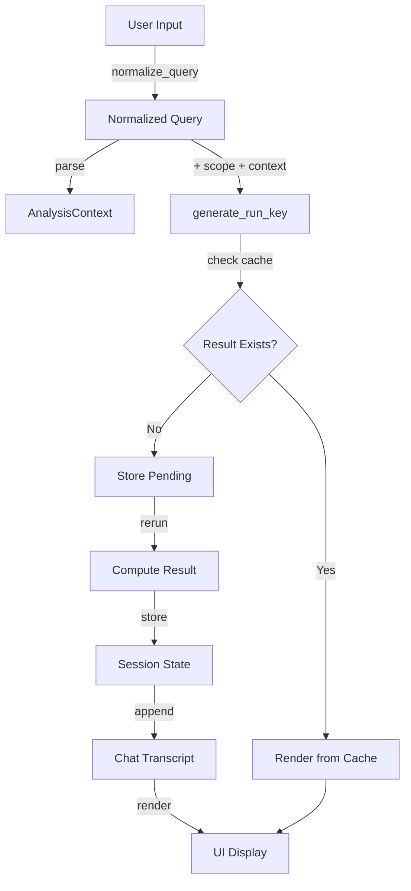

# Fix Streamlit Chat Transcript and Run Key Collisions

## Problem Statement

Two separate issues are causing UI glitches and incorrect caching:

1. **run_key collisions**: Different queries (e.g., "BMI" vs "LDL") generate the same run_key because:

- Query normalization happens inside `generate_run_key()` instead of at ingestion
- Semantic scope is not included in run_key
- None queries can bypass normalization

2. **Empty emoji tile artifacts**: Streamlit reruns create `st.chat_message()` containers without content because:

- Chat is rendered from control flow, not from persistent transcript
- Messages are appended during execution, not stored in session_state
- Reruns change execution paths, leaving empty containers

## Solution Architecture

### Core Changes

1. **Query Normalization at Ingestion**: Single source of truth - normalize immediately after `st.chat_input()`
2. **Transcript-Driven Rendering**: Store chat in `st.session_state.chat`, render from state every rerun
3. **Pending State Pattern**: Use `st.session_state.pending` to defer computation to next rerun
4. **Compute/Render Separation**: Split `execute_analysis_with_idempotency()` into `get_or_compute_result()` and `render_result()`
5. **Semantic Scope in run_key**: Include scope dict in run_key payload

### Data Flow




## Implementation Phases

### Phase 1: Query Normalization and run_key Fix

**Goal**: Fix run_key collisions by normalizing queries at ingestion and including semantic scope.**Files to Modify**:

- `src/clinical_analytics/ui/pages/3_💬_Ask_Questions.py`

**Acceptance Criteria**:

- [ ] `normalize_query()` function exists and handles None, tabs, newlines, multiple spaces
- [ ] All queries normalized immediately after `st.chat_input()`
- [ ] `generate_run_key()` accepts pre-normalized query (never None in chat flow)
- [ ] `generate_run_key()` includes semantic scope in payload
- [ ] All calls to `generate_run_key()` pass normalized query
- [ ] Tests verify different queries produce different keys
- [ ] Tests verify same normalized query produces same key
- [ ] Tests verify scope changes produce different keys

**Test Requirements**:

- File: `tests/unit/ui/pages/test_ask_questions_run_key.py`
- Add tests:
- `test_normalize_query_handles_tabs_and_newlines`
- `test_normalize_query_lowercases_and_strips`
- `test_run_key_includes_semantic_scope`
- `test_run_key_different_scope_produces_different_key`
- `test_generate_run_key_rejects_none_query_in_chat_flow` (should raise ValueError)

**Implementation Steps**:

1. Add `normalize_query()` function (after imports, before `generate_run_key()`):
```python
def normalize_query(q: str | None) -> str:
    """Normalize query text: collapse whitespace, lowercase, strip."""
    return " ".join((q or "").split()).strip().lower()
```


2. Update `generate_run_key()` signature:
```python
def generate_run_key(
    dataset_version: str,
    query_text: str,  # Must be already normalized, never None
    context: AnalysisContext,
    scope: dict | None = None,
) -> str:
```


3. Update `generate_run_key()` implementation to include scope in payload
4. Update all call sites to normalize query first, then pass to `generate_run_key()`
5. Store semantic scope in session_state (extract from sidebar or default to {})

**Quality Gates**:

- `make format`
- `make lint-fix`
- `make type-check`
- `make test-ui` (or `make test-fast`)
- All tests passing

**Commit Message**:

```javascript
feat: Phase 1 - Fix run_key collisions with query normalization and scope

- Add normalize_query() function for single source of truth
- Update generate_run_key() to accept pre-normalized query and include scope
- Store semantic scope in session_state
- Add comprehensive tests for normalization and scope handling

All tests passing: X/Y
```


### Phase 2: Split Compute from Render

**Goal**: Separate computation from rendering to enable transcript-driven UI.**Files to Modify**:

- `src/clinical_analytics/ui/pages/3_💬_Ask_Questions.py`

**Acceptance Criteria**:

- [ ] `get_or_compute_result()` function exists (pure computation, no UI)
- [ ] `render_result()` function exists (pure rendering, no computation)
- [ ] `execute_analysis_with_idempotency()` removed or refactored to use new functions
- [ ] All result storage logic in `get_or_compute_result()`
- [ ] All rendering logic in `render_result()`
- [ ] Tests verify computation is idempotent
- [ ] Tests verify rendering can be called multiple times safely

**Test Requirements**:

- File: `tests/unit/ui/pages/test_ask_questions_idempotency.py`
- Update existing tests to use new function signatures
- Add tests:
- `test_get_or_compute_result_returns_cached_on_second_call`
- `test_get_or_compute_result_stores_result_in_session_state`
- `test_render_result_can_be_called_multiple_times` (idempotent rendering)

**Implementation Steps**:

1. Create `get_or_compute_result()` function:

- Check `st.session_state[result_key]`
- If missing, compute using `compute_analysis_by_type()`
- Store result in session_state
- Call `remember_run()` for history tracking
- Return result dict

2. Create `render_result()` function:

- Call `render_analysis_by_type()`
- Render interpretation if query_plan available
- Render follow-ups (with idempotency guard)

3. Update call sites to use new functions

**Quality Gates**:

- `make format`
- `make lint-fix`
- `make type-check`
- `make test-ui`
- All tests passing

**Commit Message**:

```javascript
feat: Phase 2 - Split compute from render for transcript-driven UI

- Extract get_or_compute_result() for pure computation
- Extract render_result() for pure rendering
- Refactor execute_analysis_with_idempotency() to use new functions
- Update tests to use new function signatures

All tests passing: X/Y
```


### Phase 3: Transcript-Driven Chat Rendering

**Goal**: Implement chat transcript in session_state and render from state every rerun.**Files to Modify**:

- `src/clinical_analytics/ui/pages/3_💬_Ask_Questions.py`

**Acceptance Criteria**:

- [ ] `st.session_state.chat` initialized as list
- [ ] `st.session_state.pending` initialized for deferred computation
- [ ] `render_chat()` function renders entire transcript from state
- [ ] User messages appended to chat immediately on input
- [ ] Assistant messages appended after computation completes
- [ ] No `st.chat_message()` calls outside `render_chat()`
- [ ] Pending state pattern used for computation deferral
- [ ] Tests verify chat transcript structure
- [ ] Tests verify messages appended exactly once per query
- [ ] Tests verify reruns don't duplicate messages

**Test Requirements**:

- File: `tests/unit/ui/pages/test_ask_questions_chat_transcript.py` (new file)
- Add tests:
- `test_chat_transcript_initialized_empty`
- `test_user_message_appended_on_input`
- `test_assistant_message_appended_after_computation`
- `test_reruns_dont_duplicate_messages`
- `test_render_chat_renders_all_messages_from_state`
- `test_pending_state_deferred_computation`

**Implementation Steps**:

1. Add `render_chat()` function:

- Iterate over `st.session_state.chat`
- Render user messages with `st.chat_message("user")`
- Render assistant messages with `st.chat_message("assistant")`
- Load result from session_state using run_key
- Call `render_result()` for assistant messages

2. Initialize chat and pending state in `main()`:
```python
if "chat" not in st.session_state:
    st.session_state.chat = []
if "pending" not in st.session_state:
    st.session_state.pending = None
```


3. Call `render_chat()` at start of `main()` (before handling new input)
4. Handle pending computation:

- Check `st.session_state.pending`
- If set, compute result using `get_or_compute_result()`
- Append assistant message to chat
- Clear pending and rerun

5. Handle new chat input:

- Normalize query
- Append user message to chat
- Parse query and create context
- If complete, store as pending and rerun
- If incomplete, store context and rerun for variable selection

6. Remove old conversation history rendering logic (lines 1143-1174)
7. Remove inline chat message rendering from execution paths

**Quality Gates**:

- `make format`
- `make lint-fix`
- `make type-check`
- `make test-ui`
- All tests passing
- Manual testing: verify no empty emoji tiles on reruns

**Commit Message**:

```javascript
feat: Phase 3 - Implement transcript-driven chat rendering

- Add render_chat() function to render from session_state
- Initialize chat and pending state in session_state
- Use pending state pattern for deferred computation
- Remove inline chat message rendering from execution paths
- Add comprehensive tests for transcript management

All tests passing: X/Y
```


### Phase 4: Semantic Layer Caching

**Goal**: Cache semantic layer initialization to prevent re-initialization on every rerun.**Files to Modify**:

- `src/clinical_analytics/ui/pages/3_💬_Ask_Questions.py`

**Acceptance Criteria**:

- [ ] Semantic layer cached using `@st.cache_resource`
- [ ] Cache keyed by dataset_version
- [ ] Semantic layer initialized once per dataset_version per session
- [ ] Tests verify caching behavior (mock Streamlit cache)

**Test Requirements**:

- File: `tests/unit/ui/pages/test_ask_questions_semantic_caching.py` (new file)
- Add tests:
- `test_semantic_layer_cached_per_dataset_version`
- `test_semantic_layer_reused_on_rerun`

**Implementation Steps**:

1. Add cached function:
```python
@st.cache_resource
def get_cached_semantic_layer(_dataset, _dataset_version: str):
    """Cache semantic layer per dataset version."""
    return _dataset.get_semantic_layer()
```


2. Replace `dataset.get_semantic_layer()` calls with cached version
3. Handle ValueError for datasets without semantic layer

**Quality Gates**:

- `make format`
- `make lint-fix`
- `make type-check`
- `make test-ui`
- All tests passing

**Commit Message**:

```javascript
feat: Phase 4 - Cache semantic layer initialization

- Add @st.cache_resource decorator for semantic layer
- Cache keyed by dataset_version
- Prevent re-initialization on every rerun
- Add tests for caching behavior

All tests passing: X/Y
```


## Testing Strategy

### Unit Tests

All tests follow AAA pattern (Arrange-Act-Assert) and use fixtures from `conftest.py`.**Test Files**:

- `tests/unit/ui/pages/test_ask_questions_run_key.py` (update existing)
- `tests/unit/ui/pages/test_ask_questions_idempotency.py` (update existing)
- `tests/unit/ui/pages/test_ask_questions_chat_transcript.py` (new)
- `tests/unit/ui/pages/test_ask_questions_semantic_caching.py` (new)

**Test Execution**:

- Use `make test-ui` for UI module tests
- Use `make test-fast` for quick feedback during development
- Use `make test` for full suite before commit

### Integration Tests

Manual testing required for:

- Empty emoji tile verification (visual inspection)
- Chat transcript persistence across reruns
- Multiple queries with same/different scope

## Quality Gates

### Before Each Phase Commit

```bash
make format        # Auto-format code
make lint-fix      # Auto-fix linting issues
make type-check    # Verify type hints
make test-ui       # Run UI module tests (or make test-fast)
make check         # Full quality gate (recommended)
```


### Pre-Commit Checklist

- [ ] All tests written and passing
- [ ] Code formatted (`make format`)
- [ ] Linting issues fixed (`make lint-fix`)
- [ ] Type checking passes (`make type-check`)
- [ ] No duplicate imports
- [ ] DRY principles followed (shared fixtures, no code duplication)
- [ ] Polars-first patterns used (no pandas in new code)
- [ ] Commit message includes test count

## Rollback Plan

If issues arise:

1. Each phase is independently committable
2. Can rollback to previous phase commit
3. Tests ensure backward compatibility within each phase

## Success Criteria

**Staff-level criteria** (from user requirements):

- [ ] run_key uniqueness: distinct user queries produce distinct run_keys (normalized query included)
- [ ] Append idempotency: for a single user submit, len(chat) increases by exactly 2 (user + assistant), regardless of reruns
- [ ] Render determinism: the page body is a pure function of st.session_state.chat (no extra output outside it except intentional static UI)
- [ ] Semantic init: called once per dataset_version per session (or per cache lifetime), not on every rerun
- [ ] No empty emoji tiles: all `st.chat_message()` containers have content

## Dependencies

- Existing: `compute_analysis_by_type()`, `render_analysis_by_type()`, `AnalysisContext`, `AnalysisIntent`
- No new external dependencies required
- Uses existing Streamlit session_state patterns

## Notes

- Remove CSS hacks for emoji persistence (lines 44-62) - transcript rendering fixes the root cause