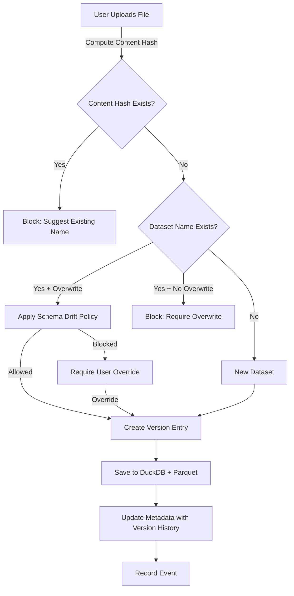

# Implement ADR008: Versioned Dataset Persistence with Rollback

## Overview

This plan implements ADR008's versioned dataset persistence architecture, extending ADR002's versioning contract to support:

## Blockers (Must Fix Before Phase 1)

**CRITICAL**: These two blockers must be addressed before starting Phase 1:

1. **Cross-Dataset Content Dedupe**: Changed from "block" to "warn + offer link" (unless overwrite requested). This is UX polish, not a blocking storage optimization. Clinicians may intentionally duplicate files for cohort subsets, analysis copies, etc. Hard-blocking would impose arbitrary workflow constraints.

2. **Canonical Tables Structure**: Do NOT "kill table_0" without a migration story. Keep stable internal table identifier (table_0 or cohort) for single-table uploads. Use display names in UI only, not as storage keys. Breaking this would require conditional logic everywhere and break old uploads.

Both blockers are addressed in Phase 1 and Phase 2 respectively.

- Version history tracking with canonical `tables` structure (replacing `parquet_paths`/`duckdb_tables` lists)
- Cross-dataset content deduplication (warn + offer link for same content with different names, unless overwrite requested)
- Schema drift policy (allow additive, block breaking changes)
- Overwrite behavior with version preservation (never delete Parquet files)
- Rollback mechanism with schema compatibility checks
- Event logging for audit trail
- File locking for metadata writes
- Active version resolution algorithm

## Architecture Overview



## Implementation Phases

### Phase 0: File Locking Helper (Foundation)

**Objective**: Implement reusable file locking helper for metadata writes to prevent corruption from concurrent Streamlit reruns.

**Files to Modify**:

- `src/clinical_analytics/ui/storage/user_datasets.py` - Add `file_lock()` context manager
- `tests/ui/test_user_datasets.py` - Add tests for file locking

**Test-First Approach**:

1. **Write failing tests**:
   ```python
   def test_file_lock_exclusive_access(tmp_path):
       """File lock should provide exclusive access to metadata file."""
       # Arrange: Metadata file
       # Act: Acquire lock, verify other process blocked
       # Assert: Exclusive access enforced
   
   def test_file_lock_platform_support():
       """File lock should work on both Unix (fcntl) and Windows (msvcrt)."""
       # Arrange: Platform detection
       # Act: Create lock helper
       # Assert: Correct implementation selected
   ```

2. **Run tests** (should fail): `make test-ui`

3. **Implement**:

   - Add `file_lock()` context manager using `fcntl` (Unix) or `msvcrt` (Windows)
   - Handle platform detection
   - Use in all metadata write operations (reused in Phase 4, 6)

4. **Run tests again**: `make test-ui`

5. **Quality gates**: `make check`

**Key Changes**:

- Create reusable `file_lock()` context manager
- Support both Unix and Windows platforms
- Use in all phases that write metadata (not just Phase 6)

### Phase 1: Cross-Dataset Content Deduplication (UX Polish, Non-Blocking)

**Objective**: Warn users about duplicate content with different names, offer link to existing dataset (unless overwrite requested). This is UX polish, not a blocking storage optimization - clinicians may intentionally duplicate files for cohort subsets, analysis copies, etc.

**Files to Modify**:

- `src/clinical_analytics/ui/storage/user_datasets.py` - Add `find_datasets_by_content_hash()` and update `save_upload()` flow
- `tests/ui/test_user_datasets.py` - Add tests for cross-dataset deduplication

**Test-First Approach**:

1. **Write failing tests** (`tests/ui/test_user_datasets.py`):
   ```python
      def test_same_content_different_name_blocked(tmp_path):
          """Same file content with different dataset_name should be blocked."""
          # Arrange: Upload same file twice with different names
          # Act: Second upload should fail
          # Assert: Error message lists existing dataset names
      
      def test_same_content_same_name_overwrite_allowed(tmp_path):
          """Same content + same name + overwrite=True should proceed."""
          # Arrange: Upload, then upload again with overwrite=True
          # Act: Second upload should succeed
          # Assert: Uses existing version (dedupe)
      
      def test_different_content_different_name_allowed(tmp_path):
          """Different content + different name should be allowed."""
          # Arrange: Two different files with different names
          # Act: Both uploads should succeed
          # Assert: Two separate datasets created
   ```

2. **Run tests** (should fail): `make test-ui`
3. **Implement**:

- Add `find_datasets_by_content_hash()` method to `UserDatasetStorage`
- Move `dataset_version` computation to start of `save_upload()` (before `dataset_name` check)
- Add content hash check before name check
- **Warn (not block)** if duplicate content found with different name (unless overwrite requested)
- Provide warning message with link to existing dataset names
- Allow upload to proceed (UX polish, not blocking constraint)

4. **Run tests again**: `make test-ui`
5. **Quality gates**: `make check`

**Key Changes**:

- Move `compute_dataset_version()` call to beginning of `save_upload()` (currently in `save_table_list()`)
- Scan all metadata files to find content hash matches
- **Warn with link** (not block) - allows clinicians to intentionally duplicate files for workflow needs
- Upload proceeds regardless (non-blocking UX enhancement)

### Phase 2: Version History Metadata Structure

**Objective**: Extend metadata schema to include `version_history` array with canonical `tables` structure.**Files to Modify**:

- `src/clinical_analytics/ui/storage/user_datasets.py` - Update metadata structure, replace `parquet_paths`/`duckdb_tables` with `tables` map
- `src/clinical_analytics/ui/storage/user_datasets.py` - Update `save_table_list()` to use canonical structure
- `tests/ui/test_user_datasets.py` - Add tests for version history structure

**Test-First Approach**:

1. **Write failing tests**:
   ```python
      def test_metadata_includes_version_history(tmp_path):
          """Metadata should include version_history array."""
          # Arrange: Upload dataset
          # Act: Load metadata
          # Assert: version_history exists, is list
      
      def test_version_entry_has_canonical_tables_structure(tmp_path):
          """Version entry should use tables map, not parquet_paths/duckdb_tables lists."""
          # Arrange: Upload dataset
          # Act: Load metadata, check version entry
          # Assert: tables map exists with parquet_path, duckdb_table, row_count, column_count, schema_fingerprint
      
      def test_stable_internal_table_identifier_preserved(tmp_path):
          """Version entries should preserve stable internal identifier (table_0 or cohort) for single-table uploads."""
          # Arrange: Upload single-table dataset
          # Act: Load metadata, check version entry
          # Assert: Internal identifier preserved (table_0 or cohort), display names used in UI only
   ```

2. **Run tests**: `make test-ui`
3. **Implement**:

- Update `save_table_list()` to create canonical `tables` structure
- Add `schema_fingerprint` computation (using `compute_schema_fingerprint()`)
- Remove `parquet_paths` and `duckdb_tables` list generation
- **Keep stable internal table identifier** (table_0 or cohort) for single-table uploads - this is the storage key
- Use display names in UI only (not as storage keys)
- Initialize `version_history` array in metadata

4. **Run tests again**: `make test-ui`
5. **Quality gates**: `make check`

**Key Changes**:

- Replace `parquet_paths: {"table_0": "..."}` with `tables: {"table_0": {"parquet_path": "...", "duckdb_table": "...", "display_name": "ActualTableName", ...}}`
- Add `schema_fingerprint` to each table entry
- **Preserve stable internal identifier** (table_0 or cohort) - don't break existing uploads
- Display names are UI-only (breadcrumbs for humans, not storage keys)

### Phase 3: Schema Drift Detection and Policy

**Objective**: Implement schema drift classification and policy enforcement.**Files to Modify**:

- `src/clinical_analytics/ui/storage/user_datasets.py` - Add schema drift functions
- `tests/ui/test_user_datasets.py` - Add tests for schema drift

**Test-First Approach**:

1. **Write failing tests**:
   ```python
      def test_schema_fingerprint_deterministic_ordered():
          """Schema fingerprint should be deterministic over ordered columns/types (canonical JSON with sorted keys)."""
          # Arrange: Same schema with different column order
          # Act: Compute fingerprint twice
          # Assert: Same fingerprint (order-independent, deterministic)
      
      def test_classify_schema_drift_additive():
          """Additive changes (new columns) should be classified as additive."""
          # Arrange: Old schema, new schema with added columns
          # Act: Classify drift
          # Assert: drift_type == "additive", added_columns populated
      
      def test_classify_schema_drift_breaking():
          """Breaking changes (removed columns) should be classified as breaking."""
          # Arrange: Old schema, new schema with removed columns
          # Act: Classify drift
          # Assert: drift_type == "breaking", removed_columns populated
      
      def test_schema_drift_policy_allows_additive():
          """Additive changes should be allowed without override."""
          # Arrange: Additive drift
          # Act: Apply policy
          # Assert: Allowed, no override required
      
      def test_schema_drift_policy_blocks_removals():
          """Column removals should be blocked by default."""
          # Arrange: Breaking drift (removed columns)
          # Act: Apply policy
          # Assert: Blocked, override required
   ```

2. **Run tests**: `make test-ui`
3. **Implement**:

- Add `compute_schema_fingerprint()` function
- Add `classify_schema_drift()` function
- Add `apply_schema_drift_policy()` function
- Integrate into overwrite flow

4. **Run tests again**: `make test-ui`
5. **Quality gates**: `make check`

**Key Changes**:

- Implement schema fingerprint computation (SHA256 of canonicalized schema JSON with **sorted keys** - deterministic over ordered columns/types)
- Implement drift classification (added/removed/type changes)
- Implement policy enforcement for **overwrite acceptance only** (allow additive, block breaking unless override)
- **Query compatibility** handled separately in Phase 8 (warnings at rollback time, query validation against active schema)

### Phase 4: Overwrite Behavior with Version Preservation

**Objective**: Implement overwrite logic that preserves all versions and enforces invariants.**Files to Modify**:

- `src/clinical_analytics/ui/storage/user_datasets.py` - Update `save_upload()` overwrite logic
- `tests/ui/test_user_datasets.py` - Add tests for version preservation

**Test-First Approach**:

1. **Write failing tests**:
   ```python
      def test_overwrite_preserves_previous_versions(tmp_path):
          """Overwriting dataset should preserve all previous versions."""
          # Arrange: Upload dataset, then overwrite with new data
          # Act: Load metadata
          # Assert: version_history contains both versions, old version marked inactive
      
      def test_identical_content_reuses_version(tmp_path):
          """Uploading identical content should reuse existing version entry."""
          # Arrange: Upload dataset, then upload same content again with overwrite=True
          # Act: Load metadata
          # Assert: Only one version entry, marked active, version_activated event recorded
      
      def test_overwrite_enforces_exactly_one_active(tmp_path):
          """Overwrite should enforce exactly one active version invariant."""
          # Arrange: Dataset with multiple versions
          # Act: Overwrite
          # Assert: Exactly one version has is_active=True
      
      def test_overwrite_updates_top_level_dataset_version(tmp_path):
          """Top-level dataset_version should match active version."""
          # Arrange: Overwrite dataset
          # Act: Load metadata
          # Assert: metadata["dataset_version"] == active_version["version"]
   ```

2. **Run tests**: `make test-ui`
3. **Implement**:

- Update `save_upload()` to handle overwrite with version preservation
- Check for duplicate version (dedupe logic)
- Apply schema drift policy (overwrite acceptance gating)
- Mark old versions inactive
- Create new version entry (if not duplicate)
- **Only register active version tables in DuckDB** (historical versions preserved but not registered)
- **Call `assert_metadata_invariants()` after every metadata write** (using file locking helper from Phase 0)
- Never delete Parquet files or DuckDB tables

4. **Run tests again**: `make test-ui`
5. **Quality gates**: `make check`

**Key Changes**:

- Find existing metadata by `dataset_name` (with file locking)
- Check if `dataset_version` already exists in `version_history` (dedupe)
- Apply schema drift policy (overwrite acceptance)
- Create version entry with canonical `tables` structure
- **Only register active version tables** - historical versions preserved but not registered (prevents name collisions, faster startup, cleaner DuckDB)
- **Call `assert_metadata_invariants()` after every write** - explicit, centralized enforcement
- Never delete Parquet files or DuckDB tables

### Phase 5: Event Logging

**Objective**: Add append-only event log to metadata for audit trail.**Files to Modify**:

- `src/clinical_analytics/ui/storage/user_datasets.py` - Add event recording
- `tests/ui/test_user_datasets.py` - Add tests for event logging

**Test-First Approach**:

1. **Write failing tests**:
   ```python
      def test_upload_creates_upload_created_event(tmp_path):
          """New upload should record upload_created event."""
          # Arrange: Upload dataset
          # Act: Load metadata
          # Assert: events list contains upload_created event
      
      def test_overwrite_creates_version_activated_event(tmp_path):
          """Overwriting should record version_activated event."""
          # Arrange: Upload, then overwrite
          # Act: Load metadata
          # Assert: events list contains version_activated event
      
      def test_events_are_append_only(tmp_path):
          """Events should be append-only (never deleted)."""
          # Arrange: Multiple operations
          # Act: Load metadata
          # Assert: All events preserved in chronological order
   ```

2. **Run tests**: `make test-ui`
3. **Implement**:

- Initialize `events` list in metadata
- **Add `event_id` (UUID) and `timestamp` to each event** (for safe merge and sort)
- Record `upload_created` on new upload
- Record `version_activated` on overwrite (if not duplicate)
- Record `overwrite_attempt_blocked_by_drift` when drift blocked
- **Add `source_filename` to version history entries** (breadcrumbs for humans)

4. **Run tests again**: `make test-ui`
5. **Quality gates**: `make check`

**Key Changes**:
- Events include `event_id` (UUID) and `timestamp` for safe merge/sort
- Version history entries include `source_filename` (human breadcrumbs)

### Phase 6: Rollback Mechanism

**Objective**: Implement rollback with schema compatibility checks and file locking.**Files to Modify**:

- `src/clinical_analytics/ui/storage/user_datasets.py` - Add `rollback_to_version()` method
- `tests/ui/test_user_datasets.py` - Add tests for rollback

**Test-First Approach**:

1. **Write failing tests**:
   ```python
      def test_rollback_switches_active_version(tmp_path):
          """Rollback should switch active version flag."""
          # Arrange: Dataset with multiple versions
          # Act: Rollback to previous version
          # Assert: Target version is_active=True, others False
      
      def test_rollback_updates_top_level_fields(tmp_path):
          """Rollback should update top-level schema/aliases/config to match active version."""
          # Arrange: Dataset with version history
          # Act: Rollback
          # Assert: Top-level fields match rolled-back version
      
      def test_rollback_warns_on_schema_incompatibility(tmp_path):
          """Rollback should warn if target version has breaking schema changes."""
          # Arrange: Current version has columns, target version removes columns
          # Act: Rollback
          # Assert: Warnings returned, rollback still succeeds
      
      def test_rollback_enforces_exactly_one_active(tmp_path):
          """Rollback should enforce exactly one active version invariant."""
          # Arrange: Multiple versions
          # Act: Rollback
          # Assert: Exactly one is_active=True
      
      def test_rollback_records_event(tmp_path):
          """Rollback should record rollback event."""
          # Arrange: Dataset with versions
          # Act: Rollback
          # Assert: events list contains rollback event
   ```

2. **Run tests**: `make test-ui`
3. **Implement**:

- Add `rollback_to_version()` method using **file locking helper from Phase 0**
- **Check schema compatibility for query compatibility warnings** (not overwrite gating - that's Phase 3)
- Switch active version flag
- **Register historical version tables on-demand** (activate them in DuckDB when rolled back)
- Update top-level fields (schema/aliases/config)
- Record rollback event (with event_id and timestamp)
- **Call `assert_metadata_invariants()` after rollback**

4. **Run tests again**: `make test-ui`
5. **Quality gates**: `make check`

**Key Changes**:

- **Use file locking helper from Phase 0** (not implementing here)
- **Schema compatibility warnings** are for query compatibility (will queries work after rollback?), not overwrite acceptance
- **Register historical version tables on-demand** when rolled back (activate in DuckDB)
- Update top-level fields to match active version (version-scoped)
- **Call `assert_metadata_invariants()`** - explicit enforcement

### Phase 7: Active Version Resolution Algorithm

**Objective**: Implement canonical active version resolution with fallback logic.**Files to Modify**:

- `src/clinical_analytics/ui/storage/user_datasets.py` - Add `get_active_version()` method
- `src/clinical_analytics/datasets/uploaded/definition.py` - Use active version for loading
- `tests/ui/test_user_datasets.py` - Add tests for active version resolution

**Test-First Approach**:

1. **Write failing tests**:
   ```python
      def test_get_active_version_finds_active_entry():
          """Should find version with is_active=True."""
          # Arrange: Metadata with version_history, one active
          # Act: get_active_version()
          # Assert: Returns active version
      
      def test_get_active_version_fallback_to_latest():
          """Should fallback to latest if no active version."""
          # Arrange: Metadata with version_history, no active
          # Act: get_active_version()
          # Assert: Returns latest version (by created_at)
      
      def test_get_active_version_backward_compatible():
          """Should work with metadata without version_history (backward compatibility)."""
          # Arrange: Old metadata format (no version_history)
          # Act: get_active_version()
          # Assert: Returns synthetic version from top-level dataset_version
      
      def test_get_active_version_enforces_invariant():
          """Should raise error if multiple active versions (invariant violation)."""
          # Arrange: Metadata with multiple is_active=True
          # Act: get_active_version()
          # Assert: Raises ValueError
   ```

2. **Run tests**: `make test-ui`
3. **Implement**:

- Add `get_active_version()` method with canonical rules
- Fallback to latest if no active version
- Backward compatibility for old metadata format
- Assert invariants

4. **Run tests again**: `make test-ui`
5. **Quality gates**: `make check`

### Phase 8: Query Validation Against Active Schema

**Objective**: Validate QueryPlan column references against active version schema.**Files to Modify**:

- `src/clinical_analytics/core/semantic.py` - Add query validation
- `tests/core/test_semantic_queryplan_execution.py` - Add tests for validation

**Test-First Approach**:

1. **Write failing tests**:
   ```python
      def test_validate_query_warns_missing_metric_column():
          """Should warn if metric column not in active version schema."""
          # Arrange: QueryPlan with metric, active version without that column
          # Act: validate_query_against_schema()
          # Assert: Warning returned
      
      def test_validate_query_warns_missing_group_by_column():
          """Should warn if group_by column not in active version schema."""
          # Arrange: QueryPlan with group_by, active version without that column
          # Act: validate_query_against_schema()
          # Assert: Warning returned
      
      def test_validate_query_allows_execution_with_warnings():
          """Validation warnings should not block execution."""
          # Arrange: QueryPlan with missing columns
          # Act: Execute query
          # Assert: Warnings displayed, execution proceeds (may fail at runtime)
   ```

2. **Run tests**: `make test-core`
3. **Implement**:

- Add `validate_query_against_schema()` function
- Integrate into `execute_query_plan()` flow
- Display warnings in UI (non-blocking)

4. **Run tests again**: `make test-core`
5. **Quality gates**: `make check`

### Phase 9: UI Integration

**Objective**: Add UI for overwrite checkbox, version history display, and rollback.**Files to Modify**:

- `src/clinical_analytics/ui/pages/1_📤_Add_Your_Data.py` - Add overwrite checkbox
- `src/clinical_analytics/ui/pages/1_📤_Add_Your_Data.py` - Add version history display
- `src/clinical_analytics/ui/pages/1_📤_Add_Your_Data.py` - Add rollback UI
- `tests/ui/pages/test_add_your_data.py` - Add UI tests (if exists)

**Test-First Approach**:

1. **Write failing tests** (or manual testing plan):

- Test overwrite checkbox appears when dataset_name exists
- Test version history displays in dataset selector
- Test rollback button works

2. **Implement**:

- Add overwrite checkbox (only shown when `dataset_name` matches existing)
- Display version history with active indicator
- Add rollback button/UI

3. **Manual testing**: Verify UI behavior
4. **Quality gates**: `make check`

## File Structure

### Modified Files

- `src/clinical_analytics/ui/storage/user_datasets.py`
- Add `file_lock()` context manager (Phase 0)
- Add `find_datasets_by_content_hash()` method (Phase 1)
- Update `save_upload()` flow (content hash check first, warn not block, overwrite logic)
- Update `save_table_list()` to use canonical `tables` structure (preserve stable internal identifier)
- Add schema drift functions (`compute_schema_fingerprint` with sorted keys, `classify_schema_drift`, `apply_schema_drift_policy` for overwrite acceptance)
- Add `assert_metadata_invariants()` function (Phase 4.1)
- Add `rollback_to_version()` method (uses file locking helper, registers historical tables on-demand)
- Add `get_active_version()` method
- Add event logging (with event_id, timestamp, source_filename)
- `src/clinical_analytics/core/semantic.py`
- Add `validate_query_against_schema()` function
- Integrate validation into `execute_query_plan()`
- `src/clinical_analytics/ui/pages/1_📤_Add_Your_Data.py`
- Add overwrite checkbox
- Add version history display
- Add rollback UI
- `tests/ui/test_user_datasets.py`
- Add tests for all Phase 1-7 functionality
- `tests/core/test_semantic_queryplan_execution.py`
- Add tests for query validation

## Success Criteria

- [ ] Cross-dataset content deduplication warns (not blocks) same content with different names, offers link to existing
- [ ] Version history tracks all uploads with same dataset_name
- [ ] Identical content hash = reuse existing version (no duplicate history)
- [ ] Schema changes detected and recorded in version history
- [ ] Schema Drift Policy enforced for overwrite acceptance (block breaking changes, allow additive, override mechanism)
- [ ] Query compatibility handled separately (warnings at rollback, validation in Phase 8)
- [ ] Overwrite preserves all previous versions
- [ ] Rollback switches active version without data loss
- [ ] Rollback updates aliases/semantic_config to match rolled-back version
- [ ] Active version resolution works (exactly one active, fallback to latest)
- [ ] Event log records all version operations with event_id (UUID) and timestamp for safe merge/sort
- [ ] Version history entries include source_filename (human breadcrumbs)
- [ ] File locking helper (Phase 0) prevents metadata corruption, reused in all write operations
- [ ] Only active version tables registered in DuckDB (historical on-demand)
- [ ] Invariant assertion function enforces metadata consistency after every write
- [ ] Query validation warns about missing columns
- [ ] All tests passing (`make test-ui` and `make test-core`)
- [ ] All quality gates passing (`make check`)

## Dependencies

- **ADR002**: Provides `compute_dataset_version()` and Parquet export infrastructure
- **ADR003**: Alias mappings are version-scoped (each version has its own aliases)
- Existing `versioning.py` module for content hash computation
- Existing `datastore.py` for DuckDB persistence and Parquet export

## Notes

- **Backward Compatibility**: Old uploads without `version_history` should continue to work (backward compatibility via `get_active_version()` fallback)
- **File Locking**: Implement reusable helper in Phase 0 (fcntl for Unix, msvcrt for Windows), reuse in all metadata write operations
- **Schema Fingerprint**: Use SHA256 hash of canonicalized schema JSON with **sorted keys** (deterministic over ordered columns/types)
- **Table Names**: **Preserve stable internal identifier** (table_0 or cohort) for single-table uploads - use display names in UI only, not as storage keys
- **Cross-Dataset Dedupe**: UX polish (warn + link), not blocking constraint - allows clinicians to intentionally duplicate files for workflow needs
- **Schema Drift Policy**: Separates overwrite acceptance (Phase 3) from query compatibility (Phase 8 warnings + validation)
- **DuckDB Registration**: Only register active version tables by default - historical versions preserved but not registered (on-demand activation)
- **Invariant Enforcement**: Centralized `assert_metadata_invariants()` function called after every write
- **Events**: Include event_id (UUID) and timestamp for safe merge/sort
- **Version History**: Include source_filename for human breadcrumbs