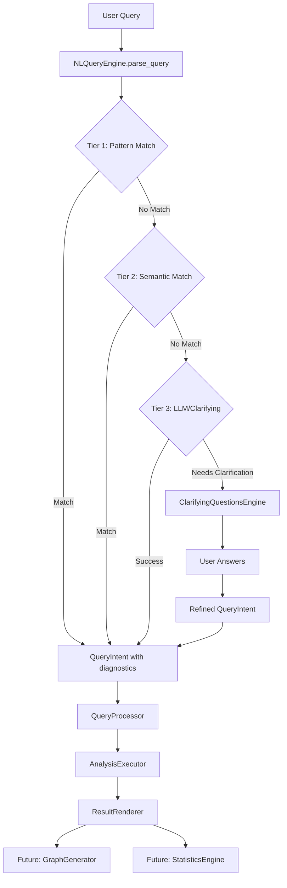

# Improve NL Query UX for Single-Table Uploads

## Problem Statement

The current NL query system has several UX gaps that make it difficult for doctors to ask realistic questions about their data:

1. **No clarifying questions**: When confidence < 0.5, system shows "I'll ask some clarifying questions..." but just falls back to structured questions instead of actually asking
2. **No progressive feedback**: Users only see "Understanding your question..." with no visibility into what's happening
3. **Poor error messages**: When parsing fails, users get no explanation of what was tried or how to improve their query
4. **Unnecessary semantic layer check**: Structured questions path checks for semantic layer even though it only uses `parse_column_name()` which doesn't need it
5. **Not extensible**: Current architecture doesn't support future features like dynamic graph generation, advanced statistics, etc.

## Solution Architecture

### Extensible Query Processing Pipeline



### Key Components

1. **Enhanced QueryIntent** with parsing diagnostics
2. **ClarifyingQuestionsEngine** for interactive refinement
3. **ProgressiveFeedback** system for real-time status updates
4. **QueryProcessor** extensible interface for future features
5. **DiagnosticErrorHandler** for actionable error messages

## Implementation Plan

### Phase 1: Enhance QueryIntent with Diagnostics and Create Config (Test-First)

**Goal**: Add parsing diagnostics to `QueryIntent` and create centralized configuration file.

**Files to Create**:
- `src/clinical_analytics/core/nl_query_config.py` (new)

**Files to Modify**:
- `src/clinical_analytics/core/nl_query_engine.py`

**Test Files**:
- `tests/core/test_nl_query_engine_diagnostics.py` (new)
- `tests/core/test_nl_query_config.py` (new)

**Tasks**:

1. **Create `nl_query_config.py`** (DRY principle - single source of truth):
   ```python
   """NL Query Engine Configuration Constants.

   Single source of truth for confidence thresholds and parsing parameters.
   These are domain config, not code - adjust without code changes.
   """

   import os

   # Confidence thresholds for tier matching
   TIER_1_PATTERN_MATCH_THRESHOLD = 0.9  # Pattern matching requires high confidence
   TIER_2_SEMANTIC_MATCH_THRESHOLD = 0.75  # Semantic matching threshold
   CLARIFYING_QUESTIONS_THRESHOLD = 0.5  # Below this, ask clarifying questions

   # Auto-execute threshold (intentionally same as TIER_2_SEMANTIC_MATCH_THRESHOLD)
   # because semantic match is the minimum confidence for auto-execution
   AUTO_EXECUTE_CONFIDENCE_THRESHOLD = TIER_2_SEMANTIC_MATCH_THRESHOLD

   # Performance/timeout settings
   TIER_TIMEOUT_SECONDS = 5.0  # Fail fast if any tier takes too long
   ENABLE_PARALLEL_TIER_MATCHING = False  # Future optimization (not implemented yet)

   # Semantic matching parameters
   SEMANTIC_SIMILARITY_THRESHOLD = 0.7  # Minimum cosine similarity for semantic match
   FUZZY_MATCH_CUTOFF = 0.7  # difflib cutoff for fuzzy variable matching

   # Feature flags (env vars with defaults)
   ENABLE_CLARIFYING_QUESTIONS = os.getenv("ENABLE_CLARIFYING_QUESTIONS", "true").lower() == "true"
   ENABLE_PROGRESSIVE_FEEDBACK = os.getenv("ENABLE_PROGRESSIVE_FEEDBACK", "true").lower() == "true"
   ```

2. **Extract `VALID_INTENT_TYPES` constant** in `nl_query_engine.py`:
   ```python
   # At module level, before QueryIntent class
   VALID_INTENT_TYPES = [
       "DESCRIBE",
       "COMPARE_GROUPS", 
       "FIND_PREDICTORS",
       "SURVIVAL",
       "CORRELATIONS",
   ]
   ```

3. **Write failing tests** for enhanced `QueryIntent`:
   ```python
   def test_query_intent_tracks_successful_tier():
       """QueryIntent should track which tier succeeded."""
       intent = QueryIntent(
           intent_type="COMPARE_GROUPS",
           parsing_tier="pattern_match",
           parsing_attempts=[{"tier": "pattern_match", "result": "success", "confidence": 0.95}],
           confidence=0.95
       )
       assert intent.parsing_tier == "pattern_match"
       assert len(intent.parsing_attempts) == 1
   
   def test_query_intent_tracks_all_parsing_attempts():
       """QueryIntent should track all parsing attempts for diagnostics."""
       # Test that attempts list includes tier, result, confidence for each try
       # When pattern match fails, semantic match should be attempted and tracked
   
   def test_query_intent_includes_failure_reason():
       """QueryIntent should include failure reason when parsing fails."""
       # Test that failure_reason is populated when all tiers fail
   
   def test_query_intent_validates_intent_type():
       """QueryIntent should validate intent_type against VALID_INTENT_TYPES."""
       with pytest.raises(ValueError, match="Invalid intent_type"):
           QueryIntent(intent_type="INVALID_TYPE", confidence=0.5)
   
   def test_existing_queries_still_parse_correctly():
       """Regression: Existing queries should continue to work after diagnostics added."""
       engine = NLQueryEngine(mock_semantic_layer)
       
       # Known working queries from existing codebase
       test_cases = [
           ("compare mortality by treatment", "COMPARE_GROUPS"),
           ("what predicts mortality", "FIND_PREDICTORS"),
           ("survival analysis", "SURVIVAL"),
           ("correlation between age and outcome", "CORRELATIONS"),
           ("descriptive statistics", "DESCRIBE"),
       ]
       
       for query, expected_intent in test_cases:
           intent = engine.parse_query(query)
           assert intent.intent_type == expected_intent, f"Failed for: {query}"
           assert intent.confidence > 0.0, f"Zero confidence for: {query}"
   ```

4. **Update QueryIntent dataclass**:
   ```python
   @dataclass
   class QueryIntent:
       # ... existing fields ...
       parsing_tier: str | None = None  # "pattern_match", "semantic_match", "llm_fallback"
       parsing_attempts: list[dict] = field(default_factory=list)  # What was tried
       failure_reason: str | None = None  # Why it failed
       suggestions: list[str] = field(default_factory=list)  # How to improve query
       
       def __post_init__(self):
           """Validate intent_type."""
           if self.intent_type not in VALID_INTENT_TYPES:
               raise ValueError(
                   f"Invalid intent_type: {self.intent_type}. "
                   f"Must be one of {VALID_INTENT_TYPES}"
               )
   ```

5. **Update `parse_query()` to populate diagnostics**:
   - Import constants from `nl_query_config.py` (not magic values)
   - Track each tier attempt in `parsing_attempts` with structured logging
   - Set `parsing_tier` when match found
   - Set `failure_reason` and `suggestions` when all tiers fail
   - Use constants for threshold comparisons

6. **Run tests**: `make test-fast`
7. **Quality gates**: `make check`
8. **Commit**: `feat: Phase 1 - Add parsing diagnostics to QueryIntent and create config`

### Phase 2: Implement Progressive Feedback System with Timeout (Test-First)

**Goal**: Show users what's happening during query parsing with tier-by-tier progress and timeout protection.

**Files to Modify**:
- `src/clinical_analytics/ui/components/question_engine.py`

**Test Files**:
- `tests/ui/components/test_question_engine_progressive_feedback.py` (new)

**Tasks**:

1. **Write failing tests** for progressive feedback (behavior-based, not implementation details):
   ```python
   def test_progressive_feedback_returns_intent_with_diagnostics():
       """Progressive feedback should return QueryIntent with parsing_tier populated."""
       # Arrange
       engine = NLQueryEngine(mock_semantic_layer)
       query = "compare mortality by treatment"
       
       # Act
       intent = QuestionEngine._show_progressive_feedback(engine, query)
       
       # Assert
       assert intent is not None
       assert intent.parsing_tier in ["pattern_match", "semantic_match", "llm_fallback"]
       assert intent.parsing_attempts  # Should have at least one attempt
       assert intent.confidence > 0.0
   
   def test_progressive_feedback_tracks_all_attempts():
       """When pattern match fails, semantic match should be attempted and tracked."""
       # Test that parsing_attempts includes both pattern and semantic attempts
       # when pattern match confidence < threshold
   
   def test_progressive_feedback_handles_timeout():
       """Progressive feedback should handle tier timeout gracefully."""
       # Mock slow LLM parse that exceeds timeout, verify graceful fallback
   ```

2. **Create `_show_progressive_feedback()` helper method** (with timeout, use config constants):
   ```python
   @staticmethod
   def _show_progressive_feedback(nl_engine, query: str) -> QueryIntent:
       """Parse query with progressive feedback showing each tier.
       
       Uses timeout to prevent long waits on LLM fallback.
       Uses constants from nl_query_config (not magic values).
       """
       from clinical_analytics.core.nl_query_config import (
           TIER_1_PATTERN_MATCH_THRESHOLD,
           TIER_2_SEMANTIC_MATCH_THRESHOLD,
           TIER_TIMEOUT_SECONDS,
           ENABLE_PROGRESSIVE_FEEDBACK,
       )
       import signal
       from contextlib import contextmanager
       
       if not ENABLE_PROGRESSIVE_FEEDBACK:
           # Fallback to simple parsing without feedback
           return nl_engine.parse_query(query)
       
       @contextmanager
       def timeout_context(seconds: float):
           """Timeout context manager for tier execution."""
           def timeout_handler(signum, frame):
               raise TimeoutError(f"Tier execution exceeded {seconds}s")
           
           # Set alarm (Unix only - for production, use threading.Timer)
           old_handler = signal.signal(signal.SIGALRM, timeout_handler)
           signal.alarm(int(seconds))
           try:
               yield
           finally:
               signal.alarm(0)
               signal.signal(signal.SIGALRM, old_handler)
       
       with st.status("🔍 Analyzing your question...", expanded=True) as status:
           # Tier 1: Pattern matching (fast, no timeout needed)
           status.update(label="Trying pattern matching...")
           try:
               intent = nl_engine._pattern_match(query)
               if intent and intent.confidence >= TIER_1_PATTERN_MATCH_THRESHOLD:
                   status.update(label=f"✅ Matched via pattern matching (confidence: {intent.confidence:.0%})")
                   return intent
           except Exception as e:
               logger.warning("pattern_match_failed", error=str(e))
           
           # Tier 2: Semantic search (may be slow, but usually < 1s)
           status.update(label="Trying semantic search...")
           try:
               with timeout_context(TIER_TIMEOUT_SECONDS):
                   intent = nl_engine._semantic_match(query)
               if intent and intent.confidence >= TIER_2_SEMANTIC_MATCH_THRESHOLD:
                   status.update(label=f"✅ Matched via semantic search (confidence: {intent.confidence:.0%})")
                   return intent
           except TimeoutError:
               status.update(label="⏱️ Semantic search timed out, trying advanced parsing...")
               logger.warning("semantic_match_timeout", query=query)
           except Exception as e:
               logger.warning("semantic_match_failed", error=str(e))
           
           # Tier 3: LLM fallback (can be very slow - 3-5s)
           status.update(label="Trying advanced parsing...")
           try:
               with timeout_context(TIER_TIMEOUT_SECONDS):
                   intent = nl_engine._llm_parse(query)
               if intent:
                   status.update(label=f"✅ Matched via advanced parsing (confidence: {intent.confidence:.0%})")
                   return intent
           except TimeoutError:
               status.update(label="❌ Advanced parsing timed out")
               logger.warning("llm_parse_timeout", query=query)
           except Exception as e:
               logger.warning("llm_parse_failed", error=str(e))
           
           status.update(label="❌ Could not understand query")
           return None
   ```

3. **Update `ask_free_form_question()` to use progressive feedback**:
   - Check `ENABLE_PROGRESSIVE_FEEDBACK` feature flag
   - Replace single `st.spinner` with `_show_progressive_feedback()` if enabled
   - Show diagnostic info when parsing fails

4. **Run tests**: `make test-fast`
5. **Quality gates**: `make check`
6. **Commit**: `feat: Phase 2 - Add progressive feedback with timeout for query parsing`

### Phase 3: Implement Clarifying Questions Engine (Test-First)

**Goal**: Actually ask clarifying questions when confidence is low, instead of just falling back.

**Files to Create**:
- `src/clinical_analytics/core/clarifying_questions.py` (new)

**Files to Modify**:
- `src/clinical_analytics/ui/components/question_engine.py`

**Test Files**:
- `tests/core/test_clarifying_questions.py` (new)
- `tests/ui/components/test_question_engine_clarifying.py` (new)
- `tests/ui/components/test_question_engine_integration.py` (new)

**Tasks**:

1. **Write failing tests** for clarifying questions:
   ```python
   def test_clarifying_questions_asks_about_intent_type():
       """When intent is ambiguous, ask user to select analysis type."""
       # Mock st.selectbox to return "COMPARE_GROUPS"
       # Verify refined intent has intent_type="COMPARE_GROUPS" and higher confidence
   
   def test_clarifying_questions_uses_semantic_layer_metadata():
       """Clarifying questions should use semantic layer metadata for context."""
       # Test that get_column_alias_index() is used to show available columns
       # Test that get_available_metrics() is used when asking about outcomes
       # Test that get_available_dimensions() is used when asking about grouping
   
   def test_clarifying_questions_handles_collisions():
       """Clarifying questions should show collision suggestions when variables ambiguous."""
       # Mock get_collision_suggestions() to return options
       # Verify st.selectbox is called with collision options
       # Verify selected option updates intent.primary_variable
   
   def test_clarifying_questions_surfaces_quality_warnings():
       """Clarifying questions should show relevant quality warnings."""
       # Mock get_data_quality_warnings() to return warning
       # Verify st.warning is called with warning message
   
   def test_clarifying_questions_asks_about_variables():
       """When variables are missing, ask user to select them."""
       # Test that engine asks for primary_variable, grouping_variable, etc.
       # Test that display names are shown (using parse_column_name)
   
   def test_clarifying_questions_refines_intent():
       """User answers should refine QueryIntent with higher confidence."""
       # Test that refined intent has confidence > original
   
   def test_clarifying_questions_aborted_gracefully():
       """Error path: User closes browser during clarifying questions returns gracefully."""
       # Mock st.selectbox to raise RuntimeError (simulating browser close)
       # Verify function returns original intent (not crash)
   
   def test_end_to_end_nl_query_flow():
       """Integration test: query → progressive feedback → clarifying questions → analysis."""
       # Test full pipeline: parse query, show feedback, ask clarifying questions, execute analysis
   ```

2. **Create `ClarifyingQuestionsEngine` class** (real Streamlit code, not pseudocode):
   ```python
   import structlog
   import streamlit as st
   
   logger = structlog.get_logger()
   
   class ClarifyingQuestionsEngine:
       """Interactive clarifying questions to refine low-confidence queries.
       
       Leverages existing semantic layer infrastructure:
       - get_column_alias_index() for available columns
       - get_collision_suggestions() for ambiguous variables
       - get_available_metrics() and get_available_dimensions() for context
       - get_data_quality_warnings() for data quality context
       
       Structured logging: Logs all user interactions for debugging.
       """
       
       @staticmethod
       def ask_clarifying_questions(
           intent: QueryIntent,
           semantic_layer,
           available_columns: list[str]  # Just column names, not DataFrame
       ) -> QueryIntent:
           """Ask targeted questions to refine intent using semantic layer metadata.
           
           Args:
               intent: Low-confidence QueryIntent to refine
               semantic_layer: SemanticLayer instance for metadata access
               available_columns: List of column names (extracted from cohort before calling)
           
           Returns:
               Refined QueryIntent with higher confidence
           
           Raises:
               ValueError: If semantic layer missing required metadata
           """
           from clinical_analytics.core.nl_query_engine import VALID_INTENT_TYPES
           from clinical_analytics.core.column_parser import parse_column_name
           from clinical_analytics.core.nl_query_config import ENABLE_CLARIFYING_QUESTIONS
           
           if not ENABLE_CLARIFYING_QUESTIONS:
               return intent  # Feature flag disabled, return original
           
           log = logger.bind(
               intent_type=intent.intent_type,
               confidence=intent.confidence
           )
           log.info("clarifying_questions_start")
           
           try:
               # 1. If intent_type is ambiguous or missing, ask user to select
               if not intent.intent_type or intent.confidence < 0.3:
                   st.subheader("What type of analysis do you want?")
                   intent_type = st.selectbox(
                       "Analysis Type",
                       VALID_INTENT_TYPES,  # Use constant, not hardcoded
                       help="Select the type of analysis you're looking for"
                   )
                   intent.intent_type = intent_type
                   intent.confidence = max(intent.confidence, 0.6)
               
               # 2. If primary_variable missing, show available columns
               if not intent.primary_variable:
                   alias_index = semantic_layer.get_column_alias_index()
                   
                   # Get display names using parse_column_name
                   column_options = {}
                   for canonical_name in available_columns:
                       meta = parse_column_name(canonical_name)
                       display_name = meta.display_name or canonical_name
                       column_options[display_name] = canonical_name
                   
                   if column_options:
                       st.subheader("Which variable are you interested in?")
                       selected_display = st.selectbox(
                           "Primary Variable",
                           list(column_options.keys()),
                           help="Select the main outcome or variable you want to analyze"
                       )
                       intent.primary_variable = column_options[selected_display]
                       intent.confidence = max(intent.confidence, 0.7)
               
               # 3. If grouping_variable missing for COMPARE_GROUPS
               if intent.intent_type == "COMPARE_GROUPS" and not intent.grouping_variable:
                   available_dims = semantic_layer.get_available_dimensions()
                   if available_dims:
                       st.subheader("How do you want to group the data?")
                       dim_options = list(available_dims.keys())
                       selected_dim = st.selectbox("Grouping Variable", dim_options)
                       intent.grouping_variable = selected_dim
                       intent.confidence = max(intent.confidence, 0.7)
               
               # 4. Handle collisions (ACTUAL IMPLEMENTATION)
               collision_suggestions = {}
               if intent.primary_variable:
                   suggestions = semantic_layer.get_collision_suggestions(intent.primary_variable)
                   if suggestions:
                       collision_suggestions["primary_variable"] = suggestions
               
               if collision_suggestions:
                   st.warning("⚠️ Some terms matched multiple columns. Please select:")
                   for var_name, options in collision_suggestions.items():
                       # Show display names
                       display_options = {
                           parse_column_name(opt).display_name or opt: opt 
                           for opt in options
                       }
                       selected_display = st.selectbox(
                           f"Which '{var_name}' did you mean?",
                           list(display_options.keys())
                       )
                       # Update intent with selected canonical name
                       if var_name == "primary_variable":
                           intent.primary_variable = display_options[selected_display]
                           intent.confidence = max(intent.confidence, 0.8)
               
               # 5. Surface quality warnings
               quality_warnings = semantic_layer.get_data_quality_warnings()
               if quality_warnings and intent.primary_variable:
                   # Filter warnings relevant to selected variable
                   relevant_warnings = [
                       w for w in quality_warnings 
                       if w.get("column") == intent.primary_variable
                   ]
                   if relevant_warnings:
                       st.warning(f"⚠️ Note: {relevant_warnings[0].get('message', '')}")
               
               log.info("clarifying_questions_complete", refined_confidence=intent.confidence)
               return intent
               
           except (RuntimeError, AttributeError) as e:
               # Handle Streamlit widget failures (browser close, session expired)
               logger.warning("clarifying_questions_aborted", error=str(e))
               return intent  # Return original intent gracefully
   ```

3. **Update `ask_free_form_question()` to use clarifying questions**:
   - Import constants from `nl_query_config.py` (not magic values)
   - Check `ENABLE_CLARIFYING_QUESTIONS` feature flag
   - Extract `available_columns = cohort.columns` before calling (not pass DataFrame)
   - When confidence < `CLARIFYING_QUESTIONS_THRESHOLD`, call `ClarifyingQuestionsEngine.ask_clarifying_questions()`
   - Use refined intent instead of returning None
   - Add structured logging for clarifying questions flow

4. **Run tests**: `make test-fast`
5. **Quality gates**: `make check`
6. **Commit**: `feat: Phase 3 - Implement clarifying questions engine with feature flag`

### Phase 4: Improve Error Messages with Diagnostics (Test-First)

**Goal**: Show users what was tried and how to improve their query when parsing fails.

**Files to Modify**:
- `src/clinical_analytics/core/nl_query_engine.py`
- `src/clinical_analytics/ui/components/question_engine.py`

**Test File**:
- `tests/core/test_nl_query_engine_error_messages.py` (new)

**Tasks**:

1. **Write failing tests** for diagnostic error messages:
   ```python
   def test_error_message_shows_parsing_attempts():
       """Error message should show what tiers were tried."""
       # Test that error message includes parsing_attempts info
   
   def test_error_message_includes_suggestions():
       """Error message should include actionable suggestions."""
       # Test that suggestions are included (e.g., "Try mentioning specific variable names")
   ```

2. **Enhance `parse_query()` to generate suggestions** (use semantic layer metadata):
   - When all tiers fail, generate suggestions based on:
     - Query length (too short? too long?)
     - Missing variables: Use `semantic_layer.get_column_alias_index()` to suggest available columns
     - Ambiguous intent: Suggest common patterns from query templates
     - Collision detection: Use `semantic_layer.get_collision_suggestions()` if term matches multiple columns

3. **Create `_format_diagnostic_error()` helper in UI layer** (engine returns structured, UI formats):
   ```python
   # In question_engine.py
   @staticmethod
   def _format_diagnostic_error(intent: QueryIntent) -> str:
       """Format structured diagnostics into user-friendly message.
       
       Engine returns structured diagnostics, UI formats for display.
       This avoids duplication - single formatting layer.
       
       Args:
           intent: QueryIntent with diagnostics (parsing_attempts, failure_reason, suggestions)
       
       Returns:
           Formatted error message with actionable suggestions
       """
       parts = [f"❌ Could not understand your query."]
       
       if intent.suggestions:
           parts.append("\n💡 Suggestions:")
           for suggestion in intent.suggestions:
               parts.append(f"  • {suggestion}")
       
       if intent.parsing_attempts:
           parts.append("\n🔍 What I tried:")
           for attempt in intent.parsing_attempts:
               tier_name = attempt.get("tier", "unknown")
               result = attempt.get("result", "failed")
               parts.append(f"  • {tier_name}: {result}")
       
       if intent.failure_reason:
           parts.append(f"\n⚠️ Reason: {intent.failure_reason}")
       
       return "\n".join(parts)
   ```

4. **Update UI to show diagnostic errors**:
   - Replace generic error with `_format_diagnostic_error(intent)`
   - Show expandable "What I tried" section with parsing attempts
   - Use `st.error()` for formatted message

5. **Run tests**: `make test-fast`
6. **Quality gates**: `make check`
7. **Commit**: `feat: Phase 4 - Add diagnostic error messages`

### Phase 5: Remove Redundant Semantic Layer Guard (Test-First)

**Goal**: Fix the bug where structured questions path unnecessarily requires semantic layer.

**Files to Modify**:
- `src/clinical_analytics/ui/pages/3_💬_Ask_Questions.py`

**Test File**:
- `tests/ui/pages/test_ask_questions_semantic_layer_check.py` (new)

**Tasks**:

1. **Write failing test**:
   ```python
   def test_structured_questions_work_without_semantic_layer():
       """Structured questions should work even if semantic layer not initialized."""
       # Mock dataset without semantic layer, verify structured questions still work
   ```

2. **Remove semantic layer check from structured questions path**:
   - Lines 801-808: Remove the try/except block that checks for semantic layer
   - `get_display_name()` only uses `parse_column_name()` which doesn't need semantic layer

3. **Run tests**: `make test-fast`
4. **Quality gates**: `make check`
5. **Commit**: `feat: Phase 5 - Remove redundant semantic layer guard from structured questions`

### Phase 6: Extensibility Hooks (DEFERRED)

**Status**: Deferred to future PR. Not needed for single-table NL query MVP.

**Rationale**: Current architecture is sufficient for MVP:
- `NLQueryEngine` handles query parsing
- `QuestionEngine` handles UI flow  
- `compute_analysis_by_type()` handles execution
- `render_analysis_by_type()` handles rendering

Adding `QueryProcessor`/`ResultRenderer` interfaces would create a third abstraction layer without clear benefit for current needs (YAGNI violation).

**When to implement**: When we need:
- Multi-table query processing plugins
- Advanced statistical analysis plugins
- Custom graph generation renderers
- Multi-step query chaining

**This phase will be implemented separately when those features are prioritized.**

## Success Criteria

After all phases complete:

- [ ] All test files created and passing (`make test-fast`)
- [ ] All quality gates passing (`make check`)
- [ ] Users see progressive feedback during query parsing
- [ ] Users get clarifying questions when confidence is low (not just fallback)
- [ ] Users see diagnostic error messages when parsing fails
- [ ] Structured questions work without semantic layer check
- [ ] No hardcoded analysis types (uses VALID_INTENT_TYPES constant)
- [ ] Feature flags allow rollback (ENABLE_CLARIFYING_QUESTIONS, ENABLE_PROGRESSIVE_FEEDBACK)
- [ ] Timeout protection prevents long waits on LLM fallback
- [ ] Single-table uploads work smoothly with NL queries

## Testing Strategy

### Unit Tests
- Test each component in isolation (QueryIntent, ClarifyingQuestionsEngine, etc.)
- Mock Streamlit components for UI tests
- Use AAA pattern (Arrange-Act-Assert)

### Integration Tests
- Test end-to-end flow: query → progressive feedback → clarifying questions → refined intent → analysis execution
- Test error handling paths (timeout, aborted clarifying questions, widget failures)
- Test with real single-table uploads
- Test regression: existing queries still parse correctly after diagnostics added

### Test Coverage
- Aim for 80%+ coverage on new code
- Focus on critical paths (parsing, clarifying questions, error handling)

## Performance Considerations

- **Timeout protection**: `TIER_TIMEOUT_SECONDS = 5.0` prevents long waits on LLM fallback
- **Progressive feedback**: Shows tier-by-tier progress but adds UI latency (acceptable trade-off for transparency)
- **Feature flags**: Allow disabling features if performance issues arise (`ENABLE_CLARIFYING_QUESTIONS`, `ENABLE_PROGRESSIVE_FEEDBACK`)

## Future Extensibility (Deferred)

Phase 6 extensibility hooks are deferred. Current architecture is sufficient for MVP:
- `NLQueryEngine` handles query parsing
- `QuestionEngine` handles UI flow
- `compute_analysis_by_type()` handles execution
- `render_analysis_by_type()` handles rendering

When needed (multi-table, advanced stats, custom graphs), we'll add extensibility interfaces in a separate PR.

## Notes

- All phases follow test-first workflow (Red-Green-Refactor)
- Quality gates (`make check`) run before each commit
- Commits include both implementation and tests
- Architecture is extensible but doesn't over-engineer current needs
- Focus on single-table uploads (multi-table handled separately)

## Rule Compliance Checklist

### 000-project-setup-and-makefile.mdc
- ✅ All commands use Makefile (`make test-fast`, `make check`) - never direct tool calls
- ✅ Quality gates run before every commit
- ✅ Uses `uv` package manager (not pip)

### 100-polars-first.mdc
- ✅ Uses `pl.DataFrame` in all signatures (not `pd.DataFrame`)
- ✅ No pandas imports in new code (only at render boundary if needed)
- ✅ Polars testing assertions (`plt.assert_frame_equal`)

### 101-testing-hygiene.mdc
- ✅ Test-first workflow (Red-Green-Refactor)
- ✅ AAA pattern (Arrange-Act-Assert) in all test examples
- ✅ Descriptive test names: `test_unit_scenario_expectedBehavior`
- ✅ Uses fixtures from `conftest.py` (mentioned in test structure)
- ✅ Test isolation (no shared mutable state)

### 102-dry-principles.mdc
- ✅ Confidence thresholds extracted to `nl_query_config.py` (not hardcoded in source)
- ✅ `VALID_INTENT_TYPES` constant (not hardcoded lists)
- ✅ Leverages existing infrastructure (semantic layer, column intelligence)
- ✅ Single source of truth for thresholds and configuration
- ✅ No code duplication (reuses existing functions)
- ✅ Error formatting in one layer (UI), engine returns structured diagnostics

### 103-staff-engineer-standards.mdc
- ✅ Explicit error handling (raises `ValueError`, not silent returns)
- ✅ Graceful degradation (feature flags, timeout handling, aborted widget handling)
- ✅ Structured logging (`structlog`) used throughout
- ✅ Defensive programming (validates inputs, fail-closed defaults)
- ✅ Type hints on all function signatures
- ✅ Docstrings with purpose, args, returns, raises
- ✅ Performance awareness (timeout config, latency mitigation)

### 104-plan-execution-hygiene.mdc
- ✅ Test-first workflow in every phase
- ✅ Phase commits with tests included
- ✅ Quality gates (`make check`) before every commit
- ✅ Never commit without tests passing

## Leveraging Existing Infrastructure

The plan leverages existing infrastructure from chat-first-ux and semantic layer:

1. **Column Intelligence** (already implemented):
   - `semantic_layer.get_column_alias_index()` - maps aliases to canonical names
   - `semantic_layer.get_collision_suggestions()` - handles ambiguous variable matches
   - `parse_column_name()` - converts canonical names to display names

2. **Semantic Layer Metadata** (for RAG context):
   - `semantic_layer.get_available_metrics()` - available outcome metrics
   - `semantic_layer.get_available_dimensions()` - available grouping dimensions
   - `semantic_layer.config.get('outcomes', {})` - outcome definitions
   - `semantic_layer.get_data_quality_warnings()` - quality warnings from metadata

3. **Existing Patterns**:
   - Progress feedback: Use `st.status()` with `status.update()` (consistent with upload progress)
   - Collision handling: Reuse existing collision detection logic
   - Display names: Use existing `parse_column_name()` function

This ensures we build on existing work rather than duplicating functionality.