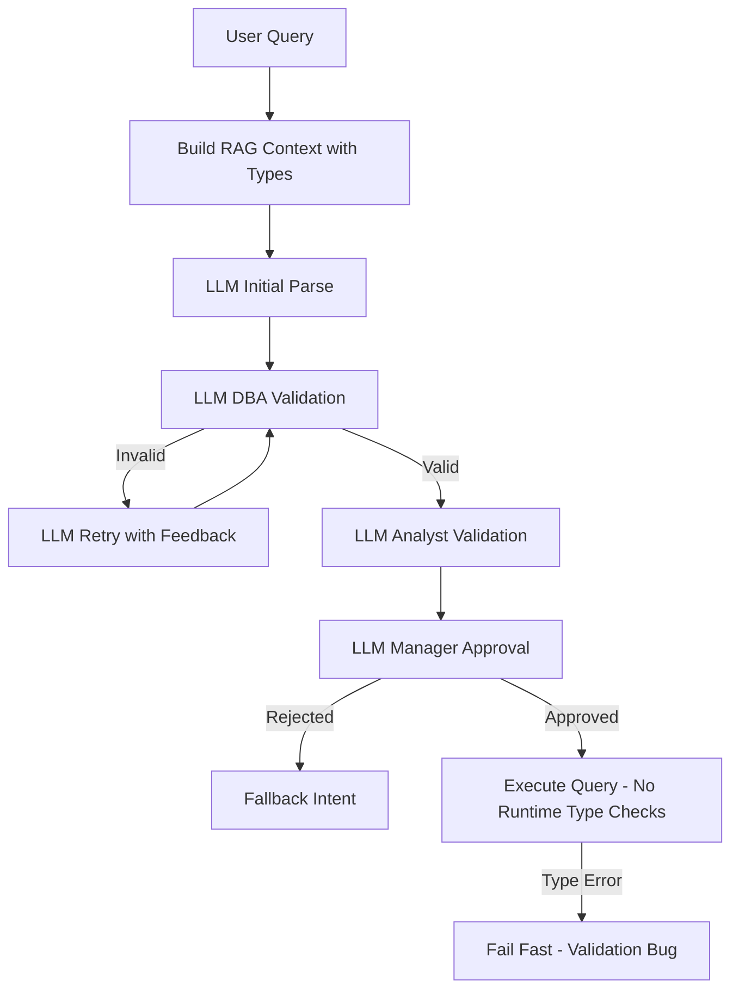

# RAG Type Safety and Multi-Layer Validation

## Blocking Dependency

**⚠️ IMPORTANT**: This plan is **BLOCKED** until `.cursor/plans/adr004_phase_4_proactive_question_generation_864660ab.plan.md` is complete. Do not begin execution until that plan is finished.

## Problem Statement

The current RAG system lacks type information in context, leading to type mismatch errors at execution time. Example: Query "remove the n/a" extracts filter `{"column": "ASCVD Risk % After statin...", "operator": "!=", "value": "the n/a"}` where a float64 column is compared with a string value, causing `IbisTypeError` at runtime.**Current Approach Problems:**

- Defensive runtime code tries to catch and fix type errors after they occur
- Python code attempts type casting at execution time (lines 1813-1847 in semantic.py)
- Silent filter skipping when type mismatches occur (lines 664-714 in compute.py)
- No LLM-based validation - LLM doesn't review its own output

**Solution Approach:**

- LLM understands types from enhanced RAG context
- LLM writes correct filter logic with proper types
- LLM validates its own output through multi-layer validation (DBA/Analyst/Manager roles)
- LLM corrects its own mistakes through retry with feedback
- Remove all defensive runtime type handling code
- Trust LLM validation - fail fast if runtime errors occur (validation bug)

## Architecture Overview




## Implementation Plan

### Phase 0.5: Config Infrastructure for Validation (Config-Driven Prompts)

**Following pattern from config migration plan: Config is data (YAML), code is behavior (Python)File: `config/validation.yaml`** (new file)

1. **Create validation configuration YAML** (Todo 0.5a)

- Create `config/validation.yaml` following pattern from `prompt_learning_config.yaml`
- Structure:
  ```yaml
    validation_layers:
      dba:
        system_prompt: |
          You are a database administrator reviewing query plans for type safety.
          Review the query plan and identify type mismatches.

          Check for:
            1. Filter values that don't match column types (e.g., string "n/a" for numeric column)
            2. Operators invalid for column types (e.g., ">" on categorical column)
            3. Missing columns in schema

          Return JSON:
          {
            "is_valid": true/false,
            "errors": ["error1", "error2"],
            "warnings": ["warning1"]
          }

        response_schema:
          is_valid: bool
          errors: list[str]
          warnings: list[str]

      analyst:
        system_prompt: |
          You are a clinical analyst reviewing query plans for business logic.
          Review the query plan. Does the intent make sense? Is the grouping variable appropriate?
          Is the metric selection reasonable? Is the filter logic coherent?

          Return JSON:
          {
            "is_valid": true/false,
            "errors": [],
            "warnings": ["concern1", "concern2"]
          }

      manager:
        system_prompt: |
          You are a manager reviewing query plans for final approval.
          Review the query plan and validation results. Should we proceed?
          Consider confidence, errors, warnings.

          Return JSON:
          {
            "approved": true/false,
            "reason": "explanation",
            "confidence_adjustment": 0.0
          }

      retry:
        system_prompt: |
          You made these type errors: {errors}. Fix them and return corrected query plan.
          Original query: {query}
          Original intent: {intent_json}

          Return corrected QueryIntent JSON matching QueryPlan schema.

    validation_rules:
      max_retries: 1
      confidence_threshold: 0.6
      timeout_seconds: 20.0
  ```


**File: `src/clinical_analytics/core/llm_feature.py`**

2. **Add LLMFeature enum entries** (Todo 0.5b)

- Add to `LLMFeature` enum:
  ```python
    DBA_VALIDATION = "dba_validation"
    ANALYST_VALIDATION = "analyst_validation"
    MANAGER_APPROVAL = "manager_approval"
    VALIDATION_RETRY = "validation_retry"
  ```


**File: `src/clinical_analytics/core/config_loader.py`** (create new file)

3. **Create minimal config loader with validation config support** (Todo 0.5c)

- **Decision**: Create minimal `config_loader.py` with only `load_validation_config()` function for this plan's needs
- **Note**: Full config loader will be created by config migration plan (`config_migration_to_yaml_ed79c904.plan.md`), but this plan needs validation config loading now
- Add `load_validation_config()` function following config migration pattern:
  ```python
  def load_validation_config(config_path: Path | None = None) -> dict[str, Any]:
      """Load validation config from YAML with env var overrides.

      Args:
          config_path: Path to validation.yaml (defaults to config/validation.yaml)

      Returns:
          dict with keys:
          - validation_layers: dict (dba, analyst, manager, retry)
          - validation_rules: dict (max_retries, confidence_threshold, timeout_seconds)

      Raises:
          FileNotFoundError: If config file missing
          ValueError: If YAML is invalid
      """
  ```
- Load from `config/validation.yaml`
- Support environment variable overrides (precedence: env var → YAML value → default)
- Return structured dict matching YAML structure

### Phase 1: Enhanced RAG Context with Type Information

**File: `src/clinical_analytics/core/nl_query_engine.py`**

1. **Add `_infer_column_type_from_view()` method** (lines ~1043)

- Infer column dtype from ibis view schema
- Fallback when metadata unavailable
- Returns dict with `type`, `numeric`, `dtype` keys

2. **Enhance `_build_rag_context()` method** (lines 1011-1042)

- Add `column_types` dict to context
- For each column: get metadata via `semantic_layer.get_column_metadata()`
- Fallback to `_infer_column_type_from_view()` if metadata missing
- Include coded column detection (numeric with labels)

3. **Update `_build_llm_prompt()` method** (lines 1116-1266)

- Add column type information to system prompt
- Include type rules section:
    - Numeric columns: use numeric values only
    - Coded columns: use numeric codes (0 for n/a)
    - Categorical columns: use string values
- Add examples showing correct type usage

### Phase 2: Enhanced Filter Validation

**File: `src/clinical_analytics/core/filter_extraction.py`**

1. **Enhance `_validate_filter()` function** (lines 26-87)

- Add type compatibility check before FilterSpec construction
- Get column type from semantic layer metadata
- Validate filter value type matches column type:
    - Numeric columns: value must be numeric (int/float) or convertible
    - String columns: value must be string
    - Coded columns: handle "n/a", "missing" → 0 conversion
- Return detailed error message with type mismatch info

2. **Update `_extract_filters_with_llm()` function** (lines 90-289)

- Pass column type information in prompt context
- Emphasize type matching in system prompt
- Add examples showing correct type usage for coded columns

**File: `src/clinical_analytics/core/semantic.py`**

3. **Add `_validate_filter_types()` method** (new method, ~line 1795)

- Lightweight pre-execution sanity check (not primary validation - LLM already did this)
- Verify filters match schema (defensive check)
- Return list of error messages (empty if all valid)
- Called before `_execute_plan()` in `execute_query_plan()`
- **Note**: This is a final safety check, not the primary validation. LLM validation layers are primary.

4. **Update `execute_query_plan()` method** (lines ~1432)

- Call `_validate_filter_types()` before execution (sanity check only)
- If type errors found: raise `TypeValidationError` immediately (LLM should have caught this)
- **No auto-correction**: LLM validation layers should have already fixed issues
- Fail fast with clear error message indicating validation bug

### Phase 3: LLM-Based Multi-Layer Validation System

**File: `src/clinical_analytics/core/nl_query_engine.py`**

1. **Add `ValidationResult` dataclass** (new, after QueryIntent)

- Fields: `is_valid: bool`, `errors: list[str]`, `warnings: list[str]`

2. **Add `_dba_validate_llm()` method** (new method, ~line 1512)

- **LLM-based validation**: Ask LLM to review its own output for type correctness
- **Config-driven**: Load system prompt from `config/validation.yaml` via `load_validation_config()`
- **Observability integrated**: Use `log_llm_event()` from `llm_observability.py` for structured logging
- Provide column type information from RAG context
- LLM returns JSON with validation result matching schema from config
- Parse response using `llm_json.parse_json_response()` and validate schema
- Returns `ValidationResult` with LLM-identified errors

**Explicit Error Handling**:
1. **If `parse_json_response()` returns `None` (invalid JSON)**:
   - Log error with `log_llm_event(success=False, error_type="json_parse_failed")`
   - Fallback to code-based validation: call existing `_validate_filter()` function for each filter
   - Return `ValidationResult(is_valid=False, errors=["LLM JSON parsing failed - using code-based validation"], warnings=[])`
2. **If JSON valid but schema mismatch (missing required fields)**:
   - Log error with `log_llm_event(success=False, error_type="schema_mismatch", error_message="missing field: is_valid")`
   - Return `ValidationResult(is_valid=False, errors=["LLM response schema mismatch: missing required field"], warnings=[])`
3. **If LLM call timeout**:
   - Log error with `log_llm_event(success=False, error_type="timeout")`
   - Fallback to code-based validation (same as #1)
4. **If LLM call network error**:
   - Log error with `log_llm_event(success=False, error_type="network_error")`
   - Fallback to code-based validation (same as #1)

**LLM Response Schema** (from config):

```json
{
  "is_valid": bool,
  "errors": ["error1", "error2"],
  "warnings": ["warning1"]
}
```

**Observability Integration**:

```python
from clinical_analytics.core.llm_observability import log_llm_event
from clinical_analytics.core.llm_feature import LLMFeature

start_time = time.perf_counter()
# ... LLM validation call ...
latency_ms = (time.perf_counter() - start_time) * 1000

event = log_llm_event(
    event="dba_validation_completed",
    query=query,
    tier=3,
    model=client.model,
    feature=LLMFeature.DBA_VALIDATION,
    timeout_s=20.0,
    latency_ms=latency_ms,
    success=result.is_valid,
    error_type=error_type if not result.is_valid else None,
    error_message=result.errors[0] if result.errors else None,
)
```


3. **Add `_analyst_validate_llm()` method** (new method, after `_dba_validate_llm`)

- **LLM-based validation**: Ask LLM to review business logic
- **Config-driven**: Load system prompt from `config/validation.yaml`
- **Observability integrated**: Use `log_llm_event()` with `LLMFeature.ANALYST_VALIDATION`
- LLM returns JSON with validation result
- Returns `ValidationResult` with LLM-identified concerns
- **Error handling**: Apply same error handling pattern as `_dba_validate_llm()` (invalid JSON → fallback, schema mismatch → invalid result, timeout/network → fallback)

4. **Add `_manager_approve_llm()` method** (new method, after `_analyst_validate_llm`)

- **LLM-based approval**: Ask LLM to make final decision
- **Config-driven**: Load system prompt from `config/validation.yaml`
- **Observability integrated**: Use `log_llm_event()` with `LLMFeature.MANAGER_APPROVAL`
- LLM returns JSON with approval decision and reasoning
- Returns approval decision with LLM reasoning
- **Error handling**: Apply same error handling pattern as `_dba_validate_llm()`. If fallback needed, return `{"approved": False, "reason": "LLM validation failed - defaulting to rejection", "confidence_adjustment": -0.3}`

**LLM Response Schema** (from config):

```json
{
  "approved": bool,
  "reason": "explanation",
  "confidence_adjustment": float
}
```


5. **Add `_retry_with_dba_feedback_llm()` method** (new method, after `_manager_approve_llm`)

- **LLM-based correction**: Ask LLM to fix its own mistakes
- **Config-driven**: Load system prompt from `config/validation.yaml` (retry template)
- **Observability integrated**: Use `log_llm_event()` with `LLMFeature.VALIDATION_RETRY`
- Provide original query, original intent, and specific errors from DBA validation
- LLM returns corrected QueryIntent
- Returns corrected QueryIntent or None if retry fails
- **Error handling**: Apply same error handling pattern as `_dba_validate_llm()`. If JSON parsing fails or schema mismatch, return `None` (retry failed). If timeout/network error, return `None` (retry failed)

6. **Refactor `_llm_parse()` method** (lines 1348-1511)

- Keep name, add LLM-based validation layers
- After initial parse, run validation layers:
                - LLM DBA validation → LLM retry with feedback if invalid (max 1 retry from config)
                - LLM Analyst validation → reduce confidence if concerns
                - LLM Manager approval → reject if below threshold (from config)
- **All validation calls use `log_llm_event()` for observability**
- Log validation results at each layer
- Return validated QueryIntent or fallback

### Phase 3.5: Remove Legacy Runtime Type Handling

**⚠️ QUALITY GATE**: Phase 3.5 (legacy code removal) requires:
1. All Phase 3 unit tests passing (100% test coverage for LLM validation layers)
2. All Phase 3 integration tests passing
3. Manual verification that LLM validation catches type mismatches in test scenarios
4. All observability tests passing (verify `log_llm_event()` called for every LLM validation call)

**Note**: Legacy code removal happens AFTER LLM validation is implemented and tested (Phase 3 complete).**File: `src/clinical_analytics/core/semantic.py`**

1. **Remove runtime type casting in `_execute_plan()`** (lines 1813-1847)

- Remove try/except blocks that catch type errors and attempt casting
- Remove logic that samples data to determine dtype at runtime
- Replace with direct filter application (types already validated by LLM)
- If type error occurs: raise `TypeValidationError` with message "Pre-execution validation should have caught this - this is a validation bug"

2. **Remove similar logic for `NOT_IN` operator** (lines 1851-1874)

- Remove runtime type casting for NOT_IN filters
- Apply filters directly (types already validated)

**File: `src/clinical_analytics/analysis/compute.py`**

3. **Remove runtime type checks in `_apply_filters()`** (lines 664-714)

- Remove `isinstance(filter_spec.value, str)` checks for numeric columns
- Remove `except pl.exceptions.ComputeError` handler that silently skips filters
- Apply filters directly (types already validated by LLM)
- If type error occurs: raise exception (validation bug, not runtime fix)

**File: `src/clinical_analytics/core/nl_query_engine.py`**

4. **Consolidate regex filter validation** (lines 547-573)

- Use same `_validate_filter()` function (no duplicate logic)
- Remove duplicate validation code

### Phase 3.6: Remove UI Confirmation Step

**⚠️ INDEPENDENT PHASE**: Phase 3.6 (UI changes) is **independent** of Phase 3 (LLM validation) and can be executed in parallel with Phase 3, or sequentially. UI changes do not depend on validation layer implementation.

**⚠️ INDEPENDENT OF BLOCKING DEPENDENCY**: Phase 3.6 (UI changes) is **independent** of ADR004 dependency and can be executed in parallel with ADR004, or after ADR004 completes. This phase does not require ADR004 foundation.

**File: `src/clinical_analytics/ui/components/question_engine.py`**

1. **Remove confirmation radio button** (verify current line numbers - may have shifted from 666-675)

- **Current behavior**: When `query_intent.confidence < 0.85`, shows radio button "Is this what you meant?" requiring user confirmation
- **New behavior**: Remove confirmation step entirely - always execute queries
- Delete radio button confirmation logic (verify current line numbers - may have shifted)
- Remove conditional check `if query_intent.confidence < 0.85:`
- Always proceed to execution after showing interpretation
- **Note**: Current codebase uses `AUTO_EXECUTE_CONFIDENCE_THRESHOLD = 0.75` in `nl_query_config.py` (not 0.85). The 0.85 threshold appears to be in UI code only. Verify actual threshold values in current codebase.

2. **Update confidence threshold logic** (verify current line numbers)

- **Current**: `expanded=(query_intent.confidence < 0.85)` - expander opens for low confidence
- **New**: Keep expander behavior (show interpretation for transparency) but remove blocking confirmation
- Interpretation expander should still auto-expand for confidence < 0.6 (for visibility)
- For confidence 0.6-0.85: Show warning badge but execute immediately (no confirmation)

3. **Add warning display for moderate confidence** (0.6-0.85 range)

- After removing confirmation, add non-blocking warning:
  ```python
  if 0.6 <= query_intent.confidence < 0.85:
      st.warning(f"⚠️ Moderate confidence ({query_intent.confidence:.0%}) - Results may need review")
  ```
- Warning is informational only - does not block execution
- For confidence < 0.6: Show error badge but still execute (user can see results and rephrase if needed)

**File: `src/clinical_analytics/core/nl_query_config.py`**

4. **Update confidence threshold constant** (if exists)

- Verify current constants: `AUTO_EXECUTE_CONFIDENCE_THRESHOLD = 0.75` exists (not 0.85)
- Remove or update any `CONFIRMATION_THRESHOLD = 0.85` constant if it exists
- Add comment: "Confidence thresholds are for display only - execution always proceeds"

**File: `src/clinical_analytics/ui/pages/03_💬_Ask_Questions.py`** (if applicable)

5. **Check for other confidence display/confirmation logic**

- Verify if confidence display exists in `_render_interpretation_inline_compact()` (lines ~1256-1287)
- Verify if confidence display exists in `_render_interpretation_and_confidence()` (lines ~1351-1380)
- If blocking confirmation logic exists in these functions, remove it (same pattern as question_engine.py)
- Ensure all confidence displays are non-blocking (informational only)

**⚠️ QUALITY GATE**: Phase 3.6 requires:
1. All existing UI tests pass (no regressions)
2. Manual verification that queries execute without confirmation blocking
3. Verification that warning badges display correctly for 0.6-0.85 confidence range
4. Verification that confidence display still works after removing confirmation (expander, warning badges)

**File: `tests/ui/components/test_question_engine.py`**

6. **Update tests to verify no confirmation blocking**

- Remove tests that verify confirmation radio button appears
- Add tests that verify:
  - Queries with confidence < 0.6 execute without confirmation
  - Queries with confidence 0.6-0.85 execute with warning (no confirmation)
  - Queries with confidence >= 0.85 execute without warning
  - Interpretation expander auto-expands for confidence < 0.6

### Phase 4: Pre-Execution Safety Check (Not Primary Validation)

**File: `src/clinical_analytics/core/semantic.py`**

1. **Simplify `_execute_plan()` method** (lines ~1806)

- **Remove all runtime type casting** (already done in Phase 3.5)
- Apply filters directly (types already validated by LLM layers)
- If type error occurs: raise `TypeValidationError` immediately
- Error message: "Pre-execution validation should have caught this - this is a validation bug. LLM validation layers failed to catch type mismatch."

2. **Add `TypeValidationError` exception** (new, near line 45)

- Custom exception for type validation failures
- Includes column name, expected type, actual type
- Message indicates this is a validation bug (LLM should have caught it)

### Phase 5: Structured Observability Integration

**File: `src/clinical_analytics/core/nl_query_engine.py`**

1. **Add structured logging to `_infer_column_type_from_view()`**

                                                - Use `logger.debug()` with structured fields:
   - Log: `column_type_inference_started` (column, has_metadata) at debug level
   - Log: `column_type_inference_completed` (column, inferred_type, source=metadata|dtype_inference) at debug level
   - Log: `column_type_inference_fallback` (column, reason) at warning level when metadata unavailable

2. **Add structured logging to `_build_rag_context()`**

                                                - Use `logger.info()` with structured fields:
                                                - Log: `rag_context_built` (query_hash, column_count, type_info_count, metadata_count, inferred_count) at info level
   - Log: `rag_context_type_info_missing` (column_count) at warning level when type info unavailable for any columns
                                                - **Note**: Use `sanitize_query()` from `llm_observability.py` to get query_hash (never log raw query)

3. **Validation layers use `log_llm_event()` (already integrated in Phase 3)**

                                                - `_dba_validate_llm()`: Uses `log_llm_event()` with `LLMFeature.DBA_VALIDATION`
                                                - `_analyst_validate_llm()`: Uses `log_llm_event()` with `LLMFeature.ANALYST_VALIDATION`
                                                - `_manager_approve_llm()`: Uses `log_llm_event()` with `LLMFeature.MANAGER_APPROVAL`
                                                - `_retry_with_dba_feedback_llm()`: Uses `log_llm_event()` with `LLMFeature.VALIDATION_RETRY`
                                                - All events include: query_hash, tier, model, feature, timeout_s, latency_ms, success, error_type, error_message

4. **Add structured logging to `_llm_parse()` validation flow**

                                                - Log: `multi_layer_validation_started` (query_hash, initial_confidence) at info level
   - Log: `multi_layer_validation_layer_completed` (layer=dba|analyst|manager, result, latency_ms) at debug level for each layer
                                                - Log: `multi_layer_validation_completed` (query_hash, final_intent_type, final_confidence, total_latency_ms, layers_passed) at info level
                                                - **Note**: Use `sanitize_query()` for query_hash (never log raw query)

**File: `src/clinical_analytics/core/filter_extraction.py`**

8. **Add structured logging to enhanced `_validate_filter()`**

   - Log: `filter_type_validation_started` (column, operator, value_type) at debug level
   - Log: `filter_type_validation_mismatch` (column, expected_type, actual_type, value) at warning level for mismatches
   - Log: `filter_type_validation_passed` (column, operator, value) at debug level when validation passes

**File: `src/clinical_analytics/core/semantic.py`**

9. **Add structured logging to `_validate_filter_types()`**

   - Log: `pre_execution_type_validation_started` (filter_count, query_plan_intent) at info level
   - Log: `pre_execution_type_validation_mismatch` (column, expected_type, actual_type, filter_value) at warning level for each mismatch
                - **Note**: No auto-correction logging (LLM validation should have fixed issues - this is sanity check only)
                - Log: `pre_execution_type_validation_completed` (valid_count, invalid_count, errors) at info level

10. **Add structured logging to `execute_query_plan()` type validation**

    - Log: `query_plan_type_validation_started` (run_key, filter_count) at info level
    - Log: `query_plan_type_validation_failed` (run_key, error_count, errors) at warning level when validation fails
    - Log: `query_plan_type_validation_passed` (run_key, filter_count) at debug level when validation passes

### Phase 6: Validation Metrics Tracking

**File: `src/clinical_analytics/core/validation_metrics.py`** (new file)

1. **Create validation metrics module** (Todo 32)

- Track validation layer effectiveness from `LLMEvent` logs
- Compute metrics for monitoring and continuous improvement
- Provide metrics API for dashboards/monitoring

2. **Add metrics tracking** (Todo 33)

**Metrics to Track**:

- `dba_validation_error_rate`: Percentage of DBA validations that find errors
- `dba_validation_latency_p50`: Median latency for DBA validation (ms)
- `dba_validation_latency_p95`: 95th percentile latency for DBA validation (ms)
- `analyst_validation_warning_rate`: Percentage of Analyst validations that find warnings
- `analyst_validation_latency_p50`: Median latency for Analyst validation (ms)
- `manager_approval_rejection_rate`: Percentage of Manager approvals that reject queries
- `retry_success_rate`: Percentage of retries that successfully correct errors
- `type_mismatch_detection_rate`: Percentage of type mismatches detected by DBA validation
- `validation_total_latency_p95`: 95th percentile total latency for all 3 validation layers (ms)

**Implementation Pattern**:

```python
from clinical_analytics.core.llm_observability import LLMEvent
from collections import defaultdict
import statistics

def compute_validation_metrics(events: list[LLMEvent]) -> dict[str, float]:
    """
    Compute validation metrics from LLMEvent logs.

    Args:
        events: List of LLMEvent instances from validation layers

    Returns:
        Dict with metric names and values
    """
    # Filter events by feature
    dba_events = [e for e in events if e.feature == "dba_validation"]
    analyst_events = [e for e in events if e.feature == "analyst_validation"]
    manager_events = [e for e in events if e.feature == "manager_approval"]
    retry_events = [e for e in events if e.feature == "validation_retry"]

    metrics = {}

    # DBA validation error rate
    if dba_events:
        error_count = sum(1 for e in dba_events if not e.success or e.error_type)
        metrics["dba_validation_error_rate"] = error_count / len(dba_events)

        # DBA latency percentiles
        latencies = [e.latency_ms for e in dba_events]
        metrics["dba_validation_latency_p50"] = statistics.median(latencies)
        metrics["dba_validation_latency_p95"] = statistics.quantiles(latencies, n=20)[18] if len(latencies) > 1 else latencies[0]

    # ... compute other metrics ...

    return metrics
```

**Integration Points**:

- Metrics computed from `LLMEvent` logs (observability infrastructure)
- Can be called periodically or on-demand
- Results can be logged, sent to monitoring system, or exposed via API

### Error Handling Strategy

**Decision Tree:**

- LLM DBA validation fails → LLM retry with feedback (max 1 retry) → If still fails → Fallback to DESCRIBE intent (confidence=0.3)
- LLM Analyst validation fails (warnings only) → Reduce confidence by 0.2 → Continue to Manager
- LLM Manager approval rejects → Fallback to DESCRIBE intent (confidence=0.3)
- Pre-execution type check fails → Raise TypeValidationError immediately (validation bug - LLM should have caught this)
- Runtime type error → Raise TypeValidationError immediately (validation bug - LLM should have caught this)

**Timeout Handling:**

- LLM DBA validation: Use existing LLM timeout (20s default)
- LLM Analyst validation: Use existing LLM timeout (20s default)
- LLM Manager approval: Use existing LLM timeout (20s default)
- LLM Retry with DBA feedback: Use existing LLM timeout (20s default)

**Error Recovery:**

- LLM validation layers log errors but continue processing when possible
- **LLM call failures**: If LLM validation call fails (timeout, invalid JSON, network error), fallback to code-based validation using existing `_validate_filter()` function. Log fallback with `log_llm_event()` marking success=False.
- Only raise exceptions for unrecoverable errors (e.g., TypeValidationError at runtime indicates validation bug)
- Fallback to DESCRIBE intent (confidence=0.3) when LLM validation layers reject query
- **No runtime auto-correction**: LLM validation layers are responsible for correctness

## Test Strategy

### Unit Tests

**File: `tests/core/test_nl_query_engine.py`**

1. **Test `_build_rag_context()` with type information**

- Verify `column_types` dict included
- Verify metadata used when available
- Verify fallback to dtype inference works

2. **Test `_dba_validate_llm()`**

- LLM correctly identifies type mismatches (numeric column + string value)
- LLM correctly identifies missing columns
- LLM returns structured ValidationResult matching config schema
- **LLM Mocking Strategy**: Use `unittest.mock.patch` on `NLQueryEngine._get_ollama_client()`
- Mock `client.generate()` to return structured JSON responses matching config schema
- Test scenarios: valid response, invalid JSON, timeout, network error
- Verify `log_llm_event()` is called with correct parameters

**Example Mock Response**:

```python
mock_client.generate.return_value = json.dumps({
    "is_valid": False,
    "errors": ["Type mismatch: column 'age' is numeric but filter value is string 'n/a'"],
    "warnings": []
})
```


3. **Test `_analyst_validate_llm()`**

- LLM correctly identifies business logic issues
- LLM adjusts confidence appropriately
- LLM returns structured ValidationResult matching config schema
- **LLM Mocking Strategy**: Same as DBA validation
- Verify `log_llm_event()` is called with `LLMFeature.ANALYST_VALIDATION`

4. **Test `_manager_approve_llm()`**

- LLM rejects low confidence queries
- LLM approves high confidence queries
- LLM considers validation errors in decision
- **LLM Mocking Strategy**: Same as DBA validation
- Verify `log_llm_event()` is called with `LLMFeature.MANAGER_APPROVAL`

**Example Mock Response**:

```python
mock_client.generate.return_value = json.dumps({
    "approved": True,
    "reason": "High confidence, no critical errors",
    "confidence_adjustment": 0.0
})
```


5. **Test `_retry_with_dba_feedback_llm()`**

- LLM corrects type errors when given feedback
- LLM returns corrected QueryIntent matching QueryPlan schema
- Returns None if retry fails
- **LLM Mocking Strategy**: Same as DBA validation
- Test retry success and retry failure scenarios
- Verify `log_llm_event()` is called with `LLMFeature.VALIDATION_RETRY`

**File: `tests/core/test_filter_extraction.py`**

6. **Test enhanced `_validate_filter()`**

- Type compatibility checks
- Coded column handling
- Error messages are clear

**File: `tests/core/test_semantic.py`**

7. **Test `_validate_filter_types()`**

- Lightweight sanity check works
- Raises TypeValidationError if issues found (validation bug)
- Error messages indicate validation bug

8. **Test pre-execution type safety**

- Type errors raise TypeValidationError immediately (validation bug)
- No auto-correction (LLM should have fixed it)
- Clear error messages indicating validation failure

### Integration Tests

**File: `tests/integration/test_nl_query_type_safety.py`** (new)

1. **Test end-to-end type safety**

- Query "remove the n/a" with numeric coded column
- Verify filter uses numeric 0, not string "n/a"
- Verify execution succeeds

2. **Test multi-layer LLM validation flow**

- Invalid parse → LLM DBA catches → LLM retry → success
- Business logic concerns → LLM Analyst reduces confidence
- Low confidence → LLM Manager rejection → fallback
- Verify LLM calls are made in correct sequence

### Logging Tests

**File: `tests/core/test_nl_query_engine.py`**

1. **Test logging in validation layers**

   - Verify `dba_validation_started` and `dba_validation_completed` are logged
   - Verify log context includes required fields (query, intent_type, error_count)
   - Verify `analyst_validation_*` events are logged
   - Verify `manager_approval_*` events are logged
   - Verify log levels are correct (info for start/complete, warning for errors)

2. **Test logging in retry mechanism**

   - Verify `retry_with_dba_feedback_started` is logged
   - Verify correction attempts are logged with `retry_with_dba_feedback_correction_applied`
   - Verify retry outcomes are logged with `retry_with_dba_feedback_completed`
   - Verify `log_llm_event()` is called even when retry fails

3. **Test logging in RAG context building**

   - Verify `rag_context_built` is logged with correct statistics
   - Verify `column_type_inference_*` events are logged when inference occurs
   - Verify fallback logging when metadata unavailable

**File: `tests/core/test_filter_extraction.py`**

4. **Test logging in filter validation**

   - Verify `filter_type_validation_started` is logged
   - Verify `filter_type_validation_mismatch` is logged for type errors
   - Verify `filter_type_validation_passed` is logged for valid filters

**File: `tests/core/test_semantic.py`**

5. **Test logging in pre-execution validation**

   - Verify `pre_execution_type_validation_started` is logged
   - Verify type mismatches are logged with correct context
   - Verify `query_plan_type_validation_*` events are logged

### Performance Tests

**File: `tests/core/test_nl_query_engine.py`**

1. **Test LLM validation layer performance**

                                                                                                                                                                                                                                                                                                                                                                                                                                                                                                                                                                                                                                                                                                                                                                                                                                                                                                                                                                                                                                                                                                                                                                                                                                                                                                                                                                                                                                                                                                                                                                                                - **Performance Budgets** (from config):
                                                                                                                                                                                                                                                                                                                                                                                                                                                                                                                                                                                                                                                                                                                                                                                                                                                                                                                                                                                                                                                                                                                                                                                                                                                                                                                                                                                                                                                                                                                                                                                                                                                                                                                                                                                                                                                                                                                                                                                                                                                                                                                                                                                                                                                                                                                                                                                                                                                                                                                                                                                                                                                                - LLM DBA validation: <20s per call (timeout from config)
                                                                                                                                                                                                                                                                                                                                                                                                                                                                                                                                                                                                                                                                                                                                                                                                                                                                                                                                                                                                                                                                                                                                                                                                                                                                                                                                                                                                                                                                                                                                                                                                                                                                                                                                                                                                                                                                                                                                                                                                                                                                                                                                                                                                                                                                                                                                                                                                                                                                                                                                                                                                                                                                - LLM Analyst validation: <20s per call (timeout from config)
                                                                                                                                                                                                                                                                                                                                                                                                                                                                                                                                                                                                                                                                                                                                                                                                                                                                                                                                                                                                                                                                                                                                                                                                                                                                                                                                                                                                                                                                                                                                                                                                                                                                                                                                                                                                                                                                                                                                                                                                                                                                                                                                                                                                                                                                                                                                                                                                                                                                                                                                                                                                                                                                - LLM Manager approval: <20s per call (timeout from config)
                                                                                                                                                                                                                                                                                                                                                                                                                                                                                                                                                                                                                                                                                                                                                                                                                                                                                                                                                                                                                                                                                                                                                                                                                                                                                                                                                                                                                                                                                                                                                                                                                                                                                                                                                                                                                                                                                                                                                                                                                                                                                                                                                                                                                                                                                                                                                                                                                                                                                                                                                                                                                                                                - Multi-layer LLM validation total latency: <60s (3 sequential calls)
                                                                                                                                                                                                                                                                                                                                                                                                                                                                                                                                                                                                                                                                                                                                                                                                                                                                                                                                                                                                                                                                                                                                                                                                                                                                                                                                                                                                                                                                                                                                                                                                - **Execution**: Sequential (DBA → Analyst → Manager) - not parallelized
                                                                                                                                                                                                                                                                                                                                                                                                                                                                                                                                                                                                                                                                                                                                                                                                                                                                                                                                                                                                                                                                                                                                                                                                                                                                                                                                                                                                                                                                                                                                                                                                - **Success Criteria**: All validation layers complete within budget
                                                                                                                                                                                                                                                                                                                                                                                                                                                                                                                                                                                                                                                                                                                                                                                                                                                                                                                                                                                                                                                                                                                                                                                                                                                                                                                                                                                                                                                                                                                                                                                                - **Note**: LLM calls are sequential, total latency is sum of individual calls

**File: `tests/core/test_semantic.py`**

2. **Test pre-execution validation performance**

   - Pre-execution type validation adds <100ms latency
   - Type inference adds <10ms per column

**File: `tests/core/test_validation_metrics.py`** (new)

3. **Test validation metrics computation**

   - Test metrics computed correctly from LLMEvent logs
   - Test error rate calculations
   - Test latency percentile calculations
   - Test retry success rate calculations
   - Test type mismatch detection rate

## Files to Modify

1. `config/validation.yaml` (new file)

- Create validation layer prompts (config-driven)
- Include response schemas
- Include validation rules and thresholds

2. `src/clinical_analytics/core/llm_feature.py`

- Add LLMFeature enum entries: DBA_VALIDATION, ANALYST_VALIDATION, MANAGER_APPROVAL, VALIDATION_RETRY

3. `src/clinical_analytics/core/config_loader.py` (or create if doesn't exist)

- Add `load_validation_config()` function following config migration pattern

4. `src/clinical_analytics/core/nl_query_engine.py`

- Enhance `_build_rag_context()` (lines 1011-1042)
- Add `_infer_column_type_from_view()` (new method)
- Update `_build_llm_prompt()` (lines 1116-1266)
- Add `ValidationResult` dataclass (new)
- Add `_dba_validate_llm()` (new method - LLM-based, config-driven, observability integrated)
- Add `_analyst_validate_llm()` (new method - LLM-based, config-driven, observability integrated)
- Add `_manager_approve_llm()` (new method - LLM-based, config-driven, observability integrated)
- Add `_retry_with_dba_feedback_llm()` (new method - LLM-based, config-driven, observability integrated)
- Refactor `_llm_parse()` (lines 1348-1511) to integrate LLM validation layers

2. `src/clinical_analytics/core/filter_extraction.py`

- Enhance `_validate_filter()` (lines 26-87)
- Update `_extract_filters_with_llm()` (lines 90-289)

5. `src/clinical_analytics/core/semantic.py`

- Add `TypeValidationError` exception (new)
- Add `_validate_filter_types()` method (new - lightweight sanity check)
- Update `execute_query_plan()` (lines ~1432)
- Remove legacy runtime type casting from `_execute_plan()` (lines 1813-1847, 1851-1874) - Phase 3.5

6. `src/clinical_analytics/analysis/compute.py`

- Remove legacy runtime type checks from `_apply_filters()` (lines 664-714) - Phase 3.5

7. `src/clinical_analytics/core/validation_metrics.py` (new file)

- Create metrics tracking module for validation effectiveness
- Track: error rates, retry success, latency, type mismatch detection
- Compute metrics from `LLMEvent` logs

8. `src/clinical_analytics/ui/components/question_engine.py`

- Remove confirmation radio button (verify current line numbers - may have shifted) - Phase 3.6
- Add warning display for moderate confidence (0.6-0.85) without blocking execution - Phase 3.6
- Update interpretation expander logic (auto-expand for confidence < 0.6) - Phase 3.6

9. `src/clinical_analytics/ui/pages/03_💬_Ask_Questions.py` (if applicable)

- Check for other confidence display/confirmation logic - Phase 3.6
- Remove blocking confirmation if exists in `_render_interpretation_inline_compact()` or `_render_interpretation_and_confidence()` - Phase 3.6

10. `src/clinical_analytics/core/nl_query_config.py`

- Verify current constants: `AUTO_EXECUTE_CONFIDENCE_THRESHOLD = 0.75` exists (not 0.85) - Phase 3.6
- Remove or update `CONFIRMATION_THRESHOLD` constant (if exists) - Phase 3.6
- Add comment that confidence thresholds are for display only - Phase 3.6

4. `tests/core/test_nl_query_engine.py`

- Add tests for type-aware RAG context
- Add tests for LLM-based validation layers (with mocked LLM responses)
- Add tests for LLM retry mechanism

5. `tests/core/test_filter_extraction.py`

- Add tests for enhanced type validation

6. `tests/core/test_semantic.py`

- Add tests for pre-execution type safety (validation bug detection)
- Add tests verifying legacy runtime code is removed

7. `tests/core/test_compute.py`

- Add tests verifying legacy runtime type checks are removed from `_apply_filters()`

9. `tests/integration/test_nl_query_type_safety.py` (new)

- End-to-end type safety tests
- Multi-layer LLM validation flow tests
- Test config-driven prompt loading
- Test observability event generation

10. `tests/core/test_validation_metrics.py` (new)

- Test metrics computation from LLMEvent logs
- Test validation effectiveness tracking

11. `tests/ui/components/test_question_engine.py`

- Update tests to verify no confirmation blocking - Phase 3.6
- Test that queries with confidence < 0.6 execute without confirmation
- Test that queries with confidence 0.6-0.85 execute with warning (no confirmation)
- Test that queries with confidence >= 0.85 execute without warning

## Success Criteria

1. Query "remove the n/a" correctly extracts filter with numeric 0 (not string "n/a")
2. Type mismatches detected before execution (no runtime `IbisTypeError`)
3. Multi-layer validation catches errors at appropriate layers
4. All existing tests pass (no regressions)
5. New tests cover type safety scenarios
6. Error messages are clear and actionable
7. **UI confirmation step removed**: Queries always execute regardless of confidence (no blocking radio button)
8. **Warning display for moderate confidence**: Queries with confidence 0.6-0.85 show warning but execute immediately
9. **Low confidence still executes**: Queries with confidence < 0.6 execute with error badge (user can review and rephrase)

## Dependencies

- Existing `semantic_layer.get_column_metadata()` (already implemented)
- Existing `FilterSpec` validation (already implemented)
- Ibis view schema access for dtype inference

## Makefile Command Usage

- Phase 0.5 tests: `make test-core PYTEST_ARGS="tests/core/test_config_loader.py tests/core/test_llm_feature.py -xvs"`
- Phase 1-2 tests: `make test-core PYTEST_ARGS="tests/core/test_nl_query_engine.py tests/core/test_filter_extraction.py -xvs"`
- Phase 3 tests: `make test-core PYTEST_ARGS="tests/core/test_nl_query_engine.py::TestMultiLayerValidation -xvs"`
- Phase 3.5 tests: `make test-core PYTEST_ARGS="tests/core/test_semantic.py::TestLegacyCodeRemoval tests/core/test_compute.py::TestLegacyCodeRemoval -xvs"`
- Phase 3.6 tests: `make test-ui PYTEST_ARGS="tests/ui/components/test_question_engine.py::TestNoConfirmationBlocking -xvs"`
- Phase 4 tests: `make test-core PYTEST_ARGS="tests/core/test_semantic.py::TestTypeValidation -xvs"`
- Phase 5 tests (observability): `make test-core PYTEST_ARGS="tests/core/test_nl_query_engine.py::TestObservability -xvs"`
- Phase 6 tests (metrics): `make test-core PYTEST_ARGS="tests/core/test_validation_metrics.py -xvs"`
- Integration tests: `make test-integration PYTEST_ARGS="tests/integration/test_nl_query_type_safety.py -xvs"`
- Performance tests: `make test-core PYTEST_ARGS="tests/core/test_nl_query_engine.py::TestPerformance -xvs"`
- Full test suite: `make test`
- Format and lint: `make format && make lint-fix`

## Risk Mitigation

- **Blocking Dependency**: This plan is blocked until `adr004_phase_4_proactive_question_generation_864660ab.plan.md` is complete
- Fallback to current behavior if type inference fails
- Graceful degradation: LLM validation warnings don't block execution (but errors do)
- LLM validation layers use existing LLM timeout (20s default)
- Retry mechanism limited to 1 attempt to prevent infinite loops
- Runtime type errors indicate validation bug (fail fast, don't silently fix)
- Performance: 3 LLM calls for validation (DBA, Analyst, Manager) - acceptable for correctness
- Legacy runtime code removal: If type error occurs at runtime, it's a validation bug - fail fast with clear error
- **Rollback Strategy**:
  - LLM validation: Disable via feature flag `ENABLE_LLM_VALIDATION=false` (falls back to code-based validation only). Measure regression via error rate increase or latency increase.
  - Phase 3.6 (UI changes): If UI changes cause regressions, revert Phase 3.6 changes independently (UI changes are isolated from core validation logic). UI changes can be rolled back without affecting validation layers.

## Key Design Principles

1. **LLM Does the Work**: LLM understands types, writes correct logic, validates its own output, and corrects mistakes
2. **No Runtime Fixes**: If type error occurs at runtime, it's a validation bug - fail fast, don't silently fix
3. **Trust LLM Validation**: LLM validation layers are primary validation - pre-execution check is just sanity check
4. **Remove Legacy Code**: All defensive runtime type handling code is removed - LLM is responsible for correctness
5. **Config is Data**: Validation prompts stored in YAML (config-driven), following config migration pattern
6. **Full Observability**: All LLM validation calls use `log_llm_event()` for structured tracking and metrics
