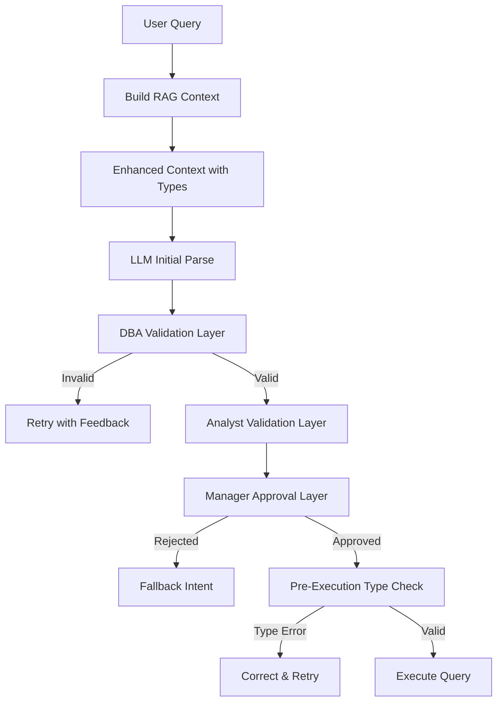

# RAG Type Safety and Multi-Layer Validation

## Problem Statement

The current RAG system lacks type information in context, leading to type mismatch errors at execution time. Example: Query "remove the n/a" extracts filter `{"column": "ASCVD Risk % After statin...", "operator": "!=", "value": "the n/a"}` where a float64 column is compared with a string value, causing `IbisTypeError` at runtime.

## Architecture Overview

## Implementation Plan

### Phase 1: Enhanced RAG Context with Type Information

**File: `src/clinical_analytics/core/nl_query_engine.py`**

1. **Add `_infer_column_type_from_view()` method** (lines ~1043)

- Infer column dtype from ibis view schema
- Fallback when metadata unavailable
- Returns dict with `type`, `numeric`, `dtype` keys

2. **Enhance `_build_rag_context()` method** (lines 1011-1042)

- Add `column_types` dict to context
- For each column: get metadata via `semantic_layer.get_column_metadata()`
- Fallback to `_infer_column_type_from_view()` if metadata missing
- Include coded column detection (numeric with labels)

3. **Update `_build_llm_prompt()` method** (lines 1116-1266)

- Add column type information to system prompt
- Include type rules section:
    - Numeric columns: use numeric values only
    - Coded columns: use numeric codes (0 for n/a)
    - Categorical columns: use string values
- Add examples showing correct type usage

### Phase 2: Enhanced Filter Validation

**File: `src/clinical_analytics/core/filter_extraction.py`**

1. **Enhance `_validate_filter()` function** (lines 26-87)

- Add type compatibility check before FilterSpec construction
- Get column type from semantic layer metadata
- Validate filter value type matches column type:
    - Numeric columns: value must be numeric (int/float) or convertible
    - String columns: value must be string
    - Coded columns: handle "n/a", "missing" → 0 conversion
- Return detailed error message with type mismatch info

2. **Update `_extract_filters_with_llm()` function** (lines 90-289)

- Pass column type information in prompt context
- Emphasize type matching in system prompt
- Add examples showing correct type usage for coded columns

**File: `src/clinical_analytics/core/semantic.py`**

3. **Add `_validate_filter_types()` method** (new method, ~line 1795)

- Validate all filters before execution
- Check type compatibility for each filter
- Return list of error messages (empty if all valid)
- Called before `_execute_plan()` in `execute_query_plan()`

4. **Update `execute_query_plan()` method** (lines ~1432)

- Call `_validate_filter_types()` before execution
- If type errors found: log warnings, attempt auto-correction
- Auto-correction: convert string "n/a" to 0 for numeric columns
- If auto-correction fails: raise clear error with suggestions

### Phase 3: Multi-Layer Validation System

**File: `src/clinical_analytics/core/nl_query_engine.py`**

1. **Add `ValidationResult` dataclass** (new, after QueryIntent)

- Fields: `is_valid: bool`, `errors: list[str]`, `warnings: list[str]`

2. **Add `_dba_validate()` method** (new method, ~line 1512)

- DBA role: Schema and type validation
- Validates:
    - All columns exist in schema
    - Filter value types match column dtypes
    - Operators valid for column types
    - No type mismatches that would cause runtime errors
- Returns `ValidationResult` with detailed errors

3. **Add `_analyst_validate()` method** (new method, after `_dba_validate`)

- Analyst role: Business logic validation
- Validates:
    - Intent makes sense for query
    - Grouping variable appropriate for intent
    - Metric selection reasonable
    - Filter logic coherent
- Returns `ValidationResult` with warnings/concerns

4. **Add `_manager_approve()` method** (new method, after `_analyst_validate`)

- Manager role: Final approval gate
- Checks:
    - Confidence meets threshold (>= 0.6)
    - All required fields present
    - No critical errors from previous layers
- Returns approval decision with reason

5. **Add `_retry_with_dba_feedback()` method** (new method, after `_manager_approve`)

- Retry LLM parse with DBA validation feedback
- Constructs correction prompt with specific errors
- Attempts to fix type mismatches automatically
- Returns corrected QueryIntent or None

6. **Refactor `_llm_parse()` method** (lines 1348-1511)

- Rename to `_llm_parse_with_validation()` (or keep name, add validation)
- After initial parse, run validation layers:
    - DBA validation → retry if invalid
    - Analyst validation → reduce confidence if concerns
    - Manager approval → reject if below threshold
- Log validation results at each layer
- Return validated QueryIntent or fallback

### Phase 4: Pre-Execution Type Safety

**File: `src/clinical_analytics/core/semantic.py`**

1. **Enhance `_execute_plan()` method** (lines ~1806)

- Before applying filters, validate types
- For each filter: check dtype compatibility
- Auto-correct common issues:
    - String "n/a" → 0 for numeric coded columns
    - String "missing" → 0 for numeric coded columns
- If correction fails: raise `TypeValidationError` with clear message

2. **Add `TypeValidationError` exception** (new, near line 45)

- Custom exception for type validation failures
- Includes column name, expected type, actual type, suggested fix

### Phase 5: Comprehensive Logging

**File: `src/clinical_analytics/core/nl_query_engine.py`**

1. **Add structured logging to `_infer_column_type_from_view()`**

   - Log: `column_type_inference_started` (column, has_metadata) at debug level
   - Log: `column_type_inference_completed` (column, inferred_type, source=metadata|dtype_inference) at debug level
   - Log: `column_type_inference_fallback` (column, reason) at warning level when metadata unavailable

2. **Add structured logging to `_build_rag_context()`**

   - Log: `rag_context_built` (query, column_count, type_info_count, metadata_count, inferred_count) at info level
   - Log: `rag_context_type_info_missing` (column_count) at warning level when type info unavailable for any columns

3. **Add structured logging to `_dba_validate()`**

   - Log: `dba_validation_started` (query, intent_type, filter_count, column_count) at info level
   - Log: `dba_validation_type_mismatch` (column, expected_type, actual_type, filter_value, operator) at warning level for each mismatch
   - Log: `dba_validation_column_missing` (column, available_columns_count) at warning level for missing columns
   - Log: `dba_validation_completed` (is_valid, error_count, warning_count, errors, warnings) at info level

4. **Add structured logging to `_analyst_validate()`**

   - Log: `analyst_validation_started` (query, intent_type, confidence, has_group_by, has_metric) at info level
   - Log: `analyst_validation_concern` (concern_type, reason, confidence_adjustment) at warning level for each concern
   - Log: `analyst_validation_completed` (is_valid, warning_count, confidence_before, confidence_after) at info level

5. **Add structured logging to `_manager_approve()`**

   - Log: `manager_approval_started` (query, confidence, dba_errors, analyst_warnings) at info level
   - Log: `manager_approval_rejected` (reason, confidence, threshold) at warning level when rejected
   - Log: `manager_approval_approved` (confidence, final_intent_type) at info level when approved

6. **Add structured logging to `_retry_with_dba_feedback()`**

   - Log: `retry_with_dba_feedback_started` (query, error_count, errors) at info level
   - Log: `retry_with_dba_feedback_correction_applied` (column, old_value, new_value, correction_type) at info level for each correction
   - Log: `retry_with_dba_feedback_completed` (success, remaining_errors, corrected_intent) at info level

7. **Add structured logging to `_llm_parse()` validation flow**

   - Log: `multi_layer_validation_started` (query, initial_confidence) at info level
   - Log: `multi_layer_validation_layer_completed` (layer=dba|analyst|manager, result, latency_ms) at debug level for each layer
   - Log: `multi_layer_validation_completed` (final_intent_type, final_confidence, total_latency_ms, layers_passed) at info level

**File: `src/clinical_analytics/core/filter_extraction.py`**

8. **Add structured logging to enhanced `_validate_filter()`**

   - Log: `filter_type_validation_started` (column, operator, value_type) at debug level
   - Log: `filter_type_validation_mismatch` (column, expected_type, actual_type, value) at warning level for mismatches
   - Log: `filter_type_validation_passed` (column, operator, value) at debug level when validation passes

**File: `src/clinical_analytics/core/semantic.py`**

9. **Add structured logging to `_validate_filter_types()`**

   - Log: `pre_execution_type_validation_started` (filter_count, query_plan_intent) at info level
   - Log: `pre_execution_type_validation_mismatch` (column, expected_type, actual_type, filter_value) at warning level for each mismatch
   - Log: `pre_execution_type_auto_correction` (column, old_value, new_value, correction_type) at info level for each auto-correction
   - Log: `pre_execution_type_validation_completed` (valid_count, invalid_count, corrected_count, errors) at info level

10. **Add structured logging to `execute_query_plan()` type validation**

    - Log: `query_plan_type_validation_started` (run_key, filter_count) at info level
    - Log: `query_plan_type_validation_failed` (run_key, error_count, errors) at warning level when validation fails
    - Log: `query_plan_type_validation_passed` (run_key, filter_count) at debug level when validation passes

### Error Handling Strategy

**Decision Tree:**

- DBA validation fails → Retry with feedback (max 1 retry) → If still fails → Fallback to DESCRIBE intent (confidence=0.3)
- Analyst validation fails (warnings only) → Reduce confidence by 0.2 → Continue to Manager
- Manager approval rejects → Fallback to DESCRIBE intent (confidence=0.3)
- Pre-execution type validation fails → Auto-correct if possible → If correction fails → Raise TypeValidationError

**Timeout Handling:**

- DBA validation: No timeout (synchronous, fast)
- Analyst validation: No timeout (synchronous, fast)
- Manager approval: No timeout (synchronous, fast)
- Retry with DBA feedback: Use existing LLM timeout (20s default)

**Error Recovery:**

- All validation layers log errors but continue processing when possible
- Only raise exceptions for unrecoverable errors (e.g., TypeValidationError after auto-correction fails)
- Fallback to DESCRIBE intent (confidence=0.3) when validation layers reject query

## Test Strategy

### Unit Tests

**File: `tests/core/test_nl_query_engine.py`**

1. **Test `_build_rag_context()` with type information**

- Verify `column_types` dict included
- Verify metadata used when available
- Verify fallback to dtype inference works

2. **Test `_dba_validate()`**

- Valid filters pass
- Type mismatches detected (numeric column + string value)
- Coded column detection works
- Missing columns detected

3. **Test `_analyst_validate()`**

- Business logic checks work
- Confidence adjustment on warnings

4. **Test `_manager_approve()`**

- Low confidence rejected
- High confidence approved
- Missing fields rejected

5. **Test `_retry_with_dba_feedback()`**

- Retry with feedback corrects errors
- Returns None if retry fails

**File: `tests/core/test_filter_extraction.py`**

6. **Test enhanced `_validate_filter()`**

- Type compatibility checks
- Coded column handling
- Error messages are clear

**File: `tests/core/test_semantic.py`**

7. **Test `_validate_filter_types()`**

- Type validation before execution
- Auto-correction of common issues
- Error handling

8. **Test pre-execution type safety**

- Type errors caught before execution
- Auto-correction works
- Clear error messages on failure

### Integration Tests

**File: `tests/integration/test_nl_query_type_safety.py`** (new)

1. **Test end-to-end type safety**

- Query "remove the n/a" with numeric coded column
- Verify filter uses numeric 0, not string "n/a"
- Verify execution succeeds

2. **Test multi-layer validation flow**

- Invalid parse → DBA catches → retry → success
- Business logic concerns → confidence reduced
- Low confidence → manager rejection → fallback

### Logging Tests

**File: `tests/core/test_nl_query_engine.py`**

1. **Test logging in validation layers**

   - Verify `dba_validation_started` and `dba_validation_completed` are logged
   - Verify log context includes required fields (query, intent_type, error_count)
   - Verify `analyst_validation_*` events are logged
   - Verify `manager_approval_*` events are logged
   - Verify log levels are correct (info for start/complete, warning for errors)

2. **Test logging in retry mechanism**

   - Verify `retry_with_dba_feedback_started` is logged
   - Verify correction attempts are logged with `retry_with_dba_feedback_correction_applied`
   - Verify retry outcomes are logged with `retry_with_dba_feedback_completed`

3. **Test logging in RAG context building**

   - Verify `rag_context_built` is logged with correct statistics
   - Verify `column_type_inference_*` events are logged when inference occurs
   - Verify fallback logging when metadata unavailable

**File: `tests/core/test_filter_extraction.py`**

4. **Test logging in filter validation**

   - Verify `filter_type_validation_started` is logged
   - Verify `filter_type_validation_mismatch` is logged for type errors
   - Verify `filter_type_validation_passed` is logged for valid filters

**File: `tests/core/test_semantic.py`**

5. **Test logging in pre-execution validation**

   - Verify `pre_execution_type_validation_started` is logged
   - Verify type mismatches are logged with correct context
   - Verify auto-corrections are logged with `pre_execution_type_auto_correction`
   - Verify `query_plan_type_validation_*` events are logged

### Performance Tests

**File: `tests/core/test_nl_query_engine.py`**

1. **Test validation layer performance**

   - DBA validation completes in <50ms
   - Analyst validation completes in <50ms
   - Manager approval completes in <10ms
   - Multi-layer validation total latency <200ms

**File: `tests/core/test_semantic.py`**

2. **Test pre-execution validation performance**

   - Pre-execution type validation adds <100ms latency
   - Type inference adds <10ms per column

## Files to Modify

1. `src/clinical_analytics/core/nl_query_engine.py`

- Enhance `_build_rag_context()` (lines 1011-1042)
- Add `_infer_column_type_from_view()` (new method)
- Update `_build_llm_prompt()` (lines 1116-1266)
- Add `ValidationResult` dataclass (new)
- Add `_dba_validate()` (new method)
- Add `_analyst_validate()` (new method)
- Add `_manager_approve()` (new method)
- Add `_retry_with_dba_feedback()` (new method)
- Refactor `_llm_parse()` (lines 1348-1511)

2. `src/clinical_analytics/core/filter_extraction.py`

- Enhance `_validate_filter()` (lines 26-87)
- Update `_extract_filters_with_llm()` (lines 90-289)

3. `src/clinical_analytics/core/semantic.py`

- Add `TypeValidationError` exception (new)
- Add `_validate_filter_types()` method (new)
- Update `execute_query_plan()` (lines ~1432)
- Enhance `_execute_plan()` filter handling (lines ~1806)

4. `tests/core/test_nl_query_engine.py`

- Add tests for type-aware RAG context
- Add tests for validation layers
- Add tests for retry mechanism

5. `tests/core/test_filter_extraction.py`

- Add tests for enhanced type validation

6. `tests/core/test_semantic.py`

- Add tests for pre-execution type safety

7. `tests/integration/test_nl_query_type_safety.py` (new)

- End-to-end type safety tests
- Multi-layer validation flow tests

## Success Criteria

1. Query "remove the n/a" correctly extracts filter with numeric 0 (not string "n/a")
2. Type mismatches detected before execution (no runtime `IbisTypeError`)
3. Multi-layer validation catches errors at appropriate layers
4. All existing tests pass (no regressions)
5. New tests cover type safety scenarios
6. Error messages are clear and actionable

## Dependencies

- Existing `semantic_layer.get_column_metadata()` (already implemented)
- Existing `FilterSpec` validation (already implemented)
- Ibis view schema access for dtype inference

## Makefile Command Usage

- Phase 1-2 tests: `make test-core PYTEST_ARGS="tests/core/test_nl_query_engine.py tests/core/test_filter_extraction.py -xvs"`
- Phase 3 tests: `make test-core PYTEST_ARGS="tests/core/test_nl_query_engine.py::TestMultiLayerValidation -xvs"`
- Phase 4 tests: `make test-core PYTEST_ARGS="tests/core/test_semantic.py::TestTypeValidation -xvs"`
- Phase 5 tests (logging): `make test-core PYTEST_ARGS="tests/core/test_nl_query_engine.py::TestLogging -xvs"`
- Integration tests: `make test-integration PYTEST_ARGS="tests/integration/test_nl_query_type_safety.py -xvs"`
- Performance tests: `make test-core PYTEST_ARGS="tests/core/test_nl_query_engine.py::TestPerformance -xvs"`
- Full test suite: `make test`
- Format and lint: `make format && make lint-fix`

## Risk Mitigation

- Fallback to current behavior if type inference fails
- Graceful degradation: validation warnings don't block execution
- All validation layers are synchronous and fast (no LLM calls except retry)
- Retry mechanism limited to 1 attempt to prevent infinite loops
- Performance budgets enforced via tests to prevent latency regressions