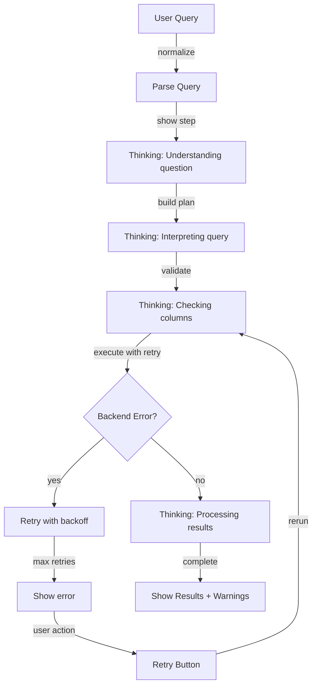

# Remove Confirmation Logic and Add Progressive Thinking Indicators

## Overview

Remove all execution gating (confidence thresholds, completeness checks, validation gates) and replace with immediate execution that shows progressive thinking steps. Display query plan interpretation as it processes, similar to Claude Code or ChatGPT's "thinking" indicators. Add retry logic for backend errors.

## Current State

- `execute_query_plan()` blocks execution with `requires_confirmation=True` when:
- Confidence < threshold (0.75)
- Plan incomplete (missing required fields)
- Validation fails (columns don't exist, operators invalid)
- Execution error occurs
- UI shows blocking confirmation UI with "Confirm and Run" button
- Simple `st.spinner("Running analysis...")` for progress
- Backend AttributeError: `'Backend' object has no attribute '_record_batch_readers_consumed'` (Ibis/DuckDB version issue)

## Architecture Changes

### 1. Remove Gating Logic

**File**: `src/clinical_analytics/core/semantic.py`

- Remove confidence gating (Step 1)
- Remove completeness gating (Step 2) 
- Remove validation gating (Step 3)
- Always attempt execution, return warnings instead of blocking
- Change return signature: remove `requires_confirmation`, add `warnings: list[str]`

### 2. Progressive Thinking Indicator

**File**: `src/clinical_analytics/ui/pages/3_💬_Ask_Questions.py`Create `_render_thinking_indicator()` that shows progressive steps:

```python
def _render_thinking_indicator(steps: list[dict]) -> None:
    """
    Render progressive thinking steps (like Claude Code/ChatGPT).
    
    Steps format:
    [
        {"status": "completed", "text": "Parsed query", "details": "..."},
        {"status": "processing", "text": "Building query plan", "details": "..."},
        {"status": "pending", "text": "Executing query", "details": "..."},
    ]
    """
```

Steps to show:

1. **Parsing query** - "Understanding your question..."
2. **Building query plan** - "Interpreting: [intent, metric, group_by, filters]"
3. **Validating plan** - "Checking columns and operators..."
4. **Executing query** - "Running analysis..."
5. **Processing results** - "Formatting results..."

### 3. Retry Logic for Backend Errors

**File**: `src/clinical_analytics/core/semantic.py`Add retry wrapper for `_execute_plan()`:

```python
def _execute_plan_with_retry(self, plan: "QueryPlan", max_retries: int = 3) -> pd.DataFrame:
    """
    Execute plan with retry logic for backend errors.
    
    Handles:
 - AttributeError: '_record_batch_readers_consumed' (Ibis backend init issue)
 - Connection errors
 - Transient execution errors
    """
```

Retry strategy:

- Exponential backoff (1s, 2s, 4s)
- Only retry on specific errors (AttributeError, connection errors)
- Reinitialize backend if `_record_batch_readers_consumed` missing
- Log retry attempts

### 4. Remove Confirmation UI

**File**: `src/clinical_analytics/ui/pages/3_💬_Ask_Questions.py`

- Delete `_render_confirmation_ui()` function (lines 1250-1291)
- Remove all `requires_confirmation` checks
- Remove "Confirm and Run" buttons
- Remove fallback confirmation logic (lines 1757-1772)

### 5. Update Execution Flow

**File**: `src/clinical_analytics/ui/pages/3_💬_Ask_Questions.py`Replace confirmation flow with immediate execution:

```python
# Before: Check requires_confirmation, show confirmation UI
# After: Always execute, show thinking indicator, display warnings inline
```

### 6. Comprehensive Logging

**Files**: All modified files

Add structured logging throughout execution flow:

- **Query parsing**: Log query text, parsing tier used, confidence score, intent detected
- **Query plan building**: Log plan details (intent, metric, group_by, filters, entity_key)
- **Validation**: Log validation checks (columns exist, operators valid, types compatible), validation results
- **Warnings**: Log each warning generated (confidence, completeness, validation issues)
- **Execution start**: Log run_key, plan summary, dataset version
- **Retry attempts**: Log retry number, error type, backoff delay, backend reinitialization
- **Execution completion**: Log success/failure, result row count, execution duration
- **Thinking steps**: Log each step start/complete, step details
- **User actions**: Log retry button clicks, manual retries
- **Errors**: Log all errors with full context (error type, message, stack trace)

## Implementation Plan

### Phase 1: Remove Gating Logic

**Files**:

- `src/clinical_analytics/core/semantic.py`

**Changes**:

1. Update `execute_query_plan()` signature:

- Remove `confidence_threshold` parameter (or keep for logging only)
- Change return type: remove `requires_confirmation`, add `warnings: list[str]`

2. Remove Step 1 (confidence gating) - convert to warning
3. Remove Step 2 (completeness gating) - convert to warning  
4. Remove Step 3 (validation gating) - convert to warning
5. Always proceed to execution (Step 4-5)
6. Collect warnings instead of blocking
7. Update return dict structure

**Return Format**:

```python
{
    "success": bool,
    "result": pd.DataFrame | None,
    "run_key": str | None,
    "warnings": list[str],  # New: non-blocking warnings
    "error": str | None,    # Only for execution failures
}
```

### Phase 2: Add Retry Logic

**Files**:

- `src/clinical_analytics/core/semantic.py`

**Changes**:

1. Add `_execute_plan_with_retry()` method
2. Detect `AttributeError: '_record_batch_readers_consumed'`
3. Reinitialize backend if attribute missing:
   ```python
         if not hasattr(backend, '_record_batch_readers_consumed'):
             backend._record_batch_readers_consumed = {}
   ```

4. Implement exponential backoff (1s, 2s, 4s)
5. Only retry on specific errors (AttributeError, connection errors)
6. Update `_execute_plan()` to use retry wrapper
7. **Add logging**:

                                                - Log retry attempt start (attempt number, max retries, error type, error message)
                                                - Log backend reinitialization when `_record_batch_readers_consumed` missing
                                                - Log backoff delay before each retry
                                                - Log retry success/failure with attempt number
                                                - Log final failure after max retries with all error context
                                                - Use structured logging with context (run_key, plan intent, error details)

### Phase 3: Progressive Thinking Indicator

**Files**:

- `src/clinical_analytics/ui/pages/3_💬_Ask_Questions.py`

**Changes**:

1. Add `_render_thinking_indicator()` function
2. Create step tracking during execution:

- Parse query → show "Understanding your question..."
- Build plan → show "Interpreting: [details]"
- Validate → show "Checking columns..."
- Execute → show "Running analysis..."
- Process → show "Formatting results..."

3. Use `st.status()` or custom container for step-by-step display
4. Show query plan details as they become available
5. Update `get_or_compute_result()` to emit progress steps
6. **Add logging**:

                                                - Log each thinking step start (step name, step details)
                                                - Log query plan details as they're built (intent, metric, group_by, filters, confidence)
                                                - Log validation results (columns checked, operators validated, types verified)
                                                - Log each thinking step completion (step name, duration)
                                                - Log progress transitions between steps
                                                - Use structured logging with context (run_key, query_text, step sequence)

**Visual Design**:

- Use expandable sections or status containers
- Show completed steps with checkmarks
- Show current step with spinner
- Show pending steps as grayed out
- Display query plan interpretation inline

### Phase 4: Remove Confirmation UI

**Files**:

- `src/clinical_analytics/ui/pages/3_💬_Ask_Questions.py`

**Changes**:

1. Delete `_render_confirmation_ui()` function
2. Remove `requires_confirmation` checks in main flow (line 1729)
3. Remove fallback confirmation logic (lines 1757-1772)
4. Update execution flow to always proceed:
   ```python
         # Always execute, show warnings inline
         execution_result = semantic_layer.execute_query_plan(...)
         
         if execution_result.get("warnings"):
             for warning in execution_result["warnings"]:
                 st.warning(f"⚠️ {warning}")
         
         if execution_result.get("success"):
             # Proceed with analysis
         else:
             # Show error with retry option
   ```

5. **Add logging**:

                                                - Log immediate execution start (no confirmation required)
                                                - Log warnings displayed to user (warning count, warning types)
                                                - Log execution outcome (success/failure, result metadata)
                                                - Log user retry actions (retry button clicks, manual retries)
                                                - Log thinking indicator rendering (steps shown, current step)
                                                - Use structured logging with context (run_key, dataset_version, query_text)

### Phase 5: Update Tests

**Files**:

- `tests/core/test_semantic_queryplan_execution.py`
- `tests/unit/ui/pages/test_ask_questions_*.py`

**Changes**:

1. Update tests to expect `warnings` instead of `requires_confirmation`
2. Remove tests for confirmation UI
3. Add tests for retry logic
4. Add tests for thinking indicator rendering
5. Update test assertions for new return format

## Data Flow



## Error Handling

### Backend Errors

- **AttributeError: '_record_batch_readers_consumed'**: Reinitialize backend attribute, retry
- **Connection errors**: Retry with exponential backoff
- **Validation errors**: Show as warning, still attempt execution
- **Execution errors**: Show error with retry button

### Retry Strategy

- Max 3 retries
- Exponential backoff: 1s, 2s, 4s
- Only retry on specific errors (AttributeError, connection errors)
- Log all retry attempts
- Show retry status in thinking indicator

## Success Criteria

- [ ] No confirmation UI or "Confirm and Run" buttons
- [ ] All queries execute immediately (no gating)
- [ ] Progressive thinking indicator shows query plan steps
- [ ] Warnings displayed inline (non-blocking)
- [ ] Backend errors trigger retry logic
- [ ] Retry attempts visible in thinking indicator
- [ ] Comprehensive logging at all execution points (parsing, planning, validation, execution, retries, thinking steps)
- [ ] Structured logging with consistent context fields (run_key, dataset_version, query_text, etc.)
- [ ] All tests updated and passing
- [ ] No breaking changes to existing functionality

## Testing Strategy

### Unit Tests

- Test `execute_query_plan()` returns warnings instead of blocking
- Test retry logic with mock errors
- Test backend reinitialization
- Test thinking indicator rendering
- Test logging calls (verify log statements are called with correct context)

### Integration Tests

- Test full execution flow with low confidence queries
- Test retry logic with actual backend errors
- Test warning display for incomplete plans

### Manual Testing

- Verify no confirmation prompts appear
- Verify thinking indicator shows progressive steps
- Verify retry works for backend errors
- Verify warnings display correctly
- Verify logs contain all expected events (check log output for structured logging)

## Files to Modify

1. **`src/clinical_analytics/core/semantic.py`**

- Update `execute_query_plan()` (remove gating, add warnings)
- Add `_execute_plan_with_retry()` method
- Fix backend initialization issue

2. **`src/clinical_analytics/ui/pages/3_💬_Ask_Questions.py`**

- Delete `_render_confirmation_ui()` function
- Add `_render_thinking_indicator()` function
- Update execution flow (remove confirmation checks)
- Update `get_or_compute_result()` to emit progress

3. **`tests/core/test_semantic_queryplan_execution.py`**

- Update tests for new return format
- Add retry logic tests

4. **`tests/unit/ui/pages/test_ask_questions_*.py`**

- Remove confirmation UI tests
- Add thinking indicator tests

## Logging Requirements

### Logging Standards

All logging must use structured logging (structlog) with consistent context fields:

- `run_key`: Unique identifier for this execution
- `dataset_version`: Dataset version identifier
- `query_text`: Normalized query text
- `intent`: Query intent (COUNT, DESCRIBE, etc.)
- `confidence`: Confidence score (if available)
- `step`: Current thinking step name
- `attempt`: Retry attempt number (for retries)
- `error_type`: Type of error (for failures)
- `duration_ms`: Duration in milliseconds (for performance tracking)

### Log Levels

- **DEBUG**: Detailed step-by-step progress, query plan details, validation checks
- **INFO**: Execution start/complete, warnings generated, retry attempts, thinking steps
- **WARNING**: Non-blocking warnings (low confidence, incomplete plans, validation issues)
- **ERROR**: Execution failures, retry exhaustion, backend errors

### Logging Points

1. **Query Parsing** (INFO):

                                                - Query received, parsing tier used, confidence score, intent detected

2. **Query Plan Building** (DEBUG/INFO):

                                                - Plan details: intent, metric, group_by, filters, entity_key, scope
                                                - Confidence score, completeness status

3. **Validation** (DEBUG):

                                                - Column existence checks, operator validation, type compatibility checks
                                                - Validation results (pass/fail with details)

4. **Warnings** (WARNING):

                                                - Each warning generated with context (confidence below threshold, missing fields, validation issues)

5. **Execution Start** (INFO):

                                                - Run key, plan summary, dataset version, warnings present

6. **Retry Logic** (INFO/WARNING):

                                                - Retry attempt start (attempt number, error type, error message)
                                                - Backend reinitialization (when `_record_batch_readers_consumed` missing)
                                                - Backoff delay before retry
                                                - Retry success/failure
                                                - Final failure after max retries

7. **Thinking Steps** (INFO):

                                                - Step start (step name, step details)
                                                - Step completion (step name, duration)
                                                - Progress transitions

8. **Execution Completion** (INFO/ERROR):

                                                - Success: result row count, execution duration, warnings shown
                                                - Failure: error type, error message, retry attempts made

9. **User Actions** (INFO):

                                                - Retry button clicks, manual retries

### Example Log Statements

```python
# Execution start
logger.info(
    "query_execution_start",
    run_key=run_key,
    dataset_version=dataset_version,
    intent=plan.intent,
    metric=plan.metric,
    group_by=plan.group_by,
    confidence=plan.confidence,
    warning_count=len(warnings),
)

# Warning generated
logger.warning(
    "query_plan_warning",
    run_key=run_key,
    warning_type="low_confidence",
    confidence=plan.confidence,
    threshold=confidence_threshold,
)

# Retry attempt
logger.info(
    "query_execution_retry",
    run_key=run_key,
    attempt=attempt_number,
    max_retries=max_retries,
    error_type=type(e).__name__,
    error_message=str(e),
    backoff_seconds=backoff_delay,
)

# Thinking step
logger.info(
    "thinking_step_start",
    run_key=run_key,
    step="validating_plan",
    step_details={"columns_checked": len(columns)},
)

# Execution completion
logger.info(
    "query_execution_complete",
    run_key=run_key,
    success=True,
    result_rows=len(result_df),
    duration_ms=execution_duration_ms,
    warnings_shown=len(warnings),
)
```

## Notes

- Warnings are informational only - execution always proceeds
- Backend retry handles transient errors automatically
- Thinking indicator provides transparency without blocking
- All operations must be logged for observability and debugging
- Structured logging enables querying and analysis of execution patterns