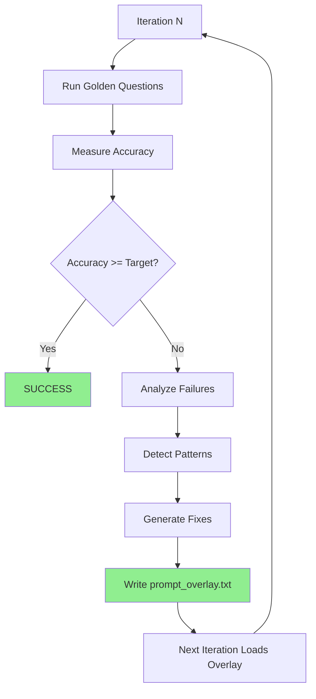

# Self-Improving NL Query Parser

Close the feedback loop so the system actually learns from failures instead of requiring manual prompt integration.

## Current Problem

The self-improvement script detects failure patterns and generates prompt fixes, but then **breaks** (line 160) and requires manual copy-paste into [`nl_query_engine.py`](src/clinical_analytics/core/nl_query_engine.py). This prevents iterative learning.

## Critical Learnings (2026-01-01)

### Model Size > Prompt Engineering

**Root Cause Identified**: llama3.2:3b (3 billion parameters) is too small for conversational refinements:

- Creates invalid intents: "FILTER_OUT", "FILTERS", "REMOVE_NA", "EX Exclude"
- Ignores conversation_history even with explicit instructions
- Can't follow complex refinement rules in prompts

**Impact**:

- RAG implementation improved accuracy 16% → 17% (1/6 refinement tests passing)
- Prompt optimization has diminishing returns with undersized model
- **Need llama3.1:8b (8 billion parameters) to reach 95% target**

### RAG System Implemented ✅

**What**: Loads `golden_questions.yaml` as corpus, retrieves similar examples for LLM**How**: Jaccard similarity on keywords, boosts refinement patterns**Results**: Modest improvement with 3b model, expect larger gains with 8b

### Validation

From test logs showing 3b model failures:

```javascript
[warning] llm_queryplan_validation_failed_trying_legacy_format
error="Invalid intent 'FILTER_OUT'. Must be one of ['COUNT'...]"

[warning] llm_queryplan_validation_failed_trying_legacy_format
error="Invalid intent 'FILTERS'. Must be one of ['COUNT'...]"
```

**Conclusion**: Prompt overlay system will help, but **model upgrade is prerequisite**.

## Solution: Prompt Overlay System

Implement a hot-reload overlay system where learned fixes are written to a file that [`NLQueryEngine`](src/clinical_analytics/core/nl_query_engine.py) automatically loads.---

## Step 0: Prerequisite Validation

**File**: N/A (validation checks)**Purpose**: Verify current implementation state, model availability, and establish baseline before making changes.

### 0.1 Verify current implementation state

Check if overlay system already exists:

```bash
# Check for overlay methods
grep -n "_load_prompt_overlay\|_prompt_overlay_path" src/clinical_analytics/core/nl_query_engine.py

# Check for cache fields
grep -n "_overlay_cache" src/clinical_analytics/core/nl_query_engine.py

# Check for overlay injection
grep -n "_build_llm_prompt" src/clinical_analytics/core/nl_query_engine.py | head -5
```

**Document findings**: List what's already implemented vs what's missing. Update plan todos accordingly.

### 0.2 Verify model availability

```bash
# Check if model exists
ollama list | grep llama3.1:8b

# If missing, pull model (~5GB download)
ollama pull llama3.1:8b

# Verify model responds
curl -s http://localhost:11434/api/generate -d '{"model":"llama3.1:8b","prompt":"test","stream":false}' | jq -r '.response' | head -1
```

**Blocking**: If model not available, overlay system won't help (model size > prompt engineering).

### 0.3 Verify EvalHarness API

```bash
# Check actual method name
grep -n "def evaluate_batch\|def run_evaluation" src/clinical_analytics/core/eval_harness.py

# Check how engine is created
grep -n "NLQueryEngine\|self.query_engine" src/clinical_analytics/core/eval_harness.py | head -5
```

**Document**: Actual method is `evaluate_batch()`, not `run_evaluation()`. Engine is created in `__init__`, not per evaluation.

### 0.4 Run baseline accuracy test

```bash
# Run core module tests to establish baseline
make test-core

# Capture baseline accuracy from test output
# Document in plan: "Baseline accuracy: X%"
```

**Purpose**: Establish starting point for measuring improvement.

## Prerequisites

**Before implementing overlay system** (covered in Step 0):

1. ✅ **Verify model availability**: See Step 0.2
2. ✅ **Verify RAG working**: Check `_load_golden_questions_rag()` and `_find_similar_examples()` methods exist
3. ✅ **Run baseline test**: See Step 0.4

## Step 1: Verify/Add Prompt Overlay Support with Caching

**File**: [`src/clinical_analytics/core/nl_query_engine.py`](src/clinical_analytics/core/nl_query_engine.py)**Critical Fix #1**: Use configurable env var path (default `/tmp/nl_query_learning/`) instead of source tree**Critical Fix #2**: Add mtime-based caching to avoid disk I/O on every parse**Note**: Many overlay features may already exist. Step 0.1 should have documented current state. This step verifies and adds missing pieces.

### 1.1 Verify/Add overlay cache fields in `__init__`

In `__init__` method, verify or add overlay cache fields:

```python
def __init__(self, semantic_layer, embedding_model: str = "all-MiniLM-L6-v2"):
    # ... existing fields ...

    # Overlay cache (mtime-based hot reload)
    self._overlay_cache_text = ""
    self._overlay_cache_mtime_ns = 0
```

### 1.2 Verify/Add overlay path resolver (env var support)

Verify or add method after `__init__`:

```python
def _prompt_overlay_path(self) -> Path:
    """
    Get overlay file path (configurable via env var).

    Defaults to /tmp/nl_query_learning/prompt_overlay.txt to keep
    learning artifacts out of source tree.

    Returns:
        Path to overlay file
    """
    import os
    from pathlib import Path

    # Prefer explicit override
    p = os.getenv("NL_PROMPT_OVERLAY_PATH")
    if p:
        return Path(p)

    # Default: same directory as self-improve logs
    # (keeps artifacts out of source tree)
    return Path("/tmp/nl_query_learning/prompt_overlay.txt")
```

### 1.3 Verify/Add overlay loader with mtime caching

```python
def _load_prompt_overlay(self) -> str:
    """
    Load prompt overlay from disk with mtime-based caching.

    Only re-reads file if modified since last load (hot reload).

    Returns:
        Overlay text to append to system prompt, or empty string
    """
    p = self._prompt_overlay_path()

    try:
        st = p.stat()
    except FileNotFoundError:
        self._overlay_cache_text = ""
        self._overlay_cache_mtime_ns = 0
        return ""

    # Cache hit: file unchanged since last load
    if st.st_mtime_ns == self._overlay_cache_mtime_ns:
        return self._overlay_cache_text

    # Cache miss: file changed, reload
    try:
        text = p.read_text(encoding="utf-8").strip()
        self._overlay_cache_text = text
        self._overlay_cache_mtime_ns = st.st_mtime_ns
        if text:
            logger.info("prompt_overlay_loaded", path=str(p), length=len(text))
        return text
    except Exception as e:
        logger.warning("prompt_overlay_load_failed", path=str(p), error=str(e))
        return ""
```

### 1.4 Verify/Modify `_build_llm_prompt` to append overlay

In `_build_llm_prompt` method, verify or add overlay injection **after** constructing full prompt (before return statement):

```python
# ... existing system_prompt construction ...

# Load and append overlay (auto-generated fixes)
overlay = self._load_prompt_overlay()
if overlay:
    system_prompt = system_prompt + "\n\n" + overlay

return system_prompt, user_prompt
```

---

## Step 2: Atomic Overlay Writes + Size Capping

**File**: [`scripts/self_improve_nl_parsing.py`](scripts/self_improve_nl_parsing.py)**Critical Fix #3**: Atomic writes via temp + replace to prevent race conditions**Critical Fix #7**: Cap overlay to top 5 patterns, max 8KB length

### 2.1 Add atomic overlay writer

**Overlay file format**: Plain text, UTF-8 encoded. Content is exactly what `PromptOptimizer.generate_improved_prompt_additions()` returns (no headers, no metadata, just prompt additions).Add after imports (around line 25):

```python
def write_prompt_overlay(prompt_additions: str, overlay_path: Path) -> None:
    """
    Write prompt additions atomically to overlay file.

    Uses temp + replace to prevent race conditions if engine reads
    while script is writing.

    Args:
        prompt_additions: Generated fixes from failure patterns
        overlay_path: Target overlay file path
    """
    import os

    # Ensure parent directory exists
    overlay_path.parent.mkdir(parents=True, exist_ok=True)

    # Write to temp file
    tmp = overlay_path.with_suffix(".tmp")
    tmp.write_text(prompt_additions, encoding="utf-8")

    # Atomic replace (POSIX guarantee)
    os.replace(tmp, overlay_path)

    logger.info("prompt_overlay_written", path=str(overlay_path), length=len(prompt_additions))
```

### 2.2 Update main loop with capping + atomic writes

Replace lines 122-160 with:

```python
# Cap patterns to top 5 by priority
patterns.sort(key=lambda p: (p.priority, -p.count))
patterns = patterns[:5]

# Generate prompt improvements
prompt_additions = optimizer.generate_improved_prompt_additions(patterns)

# Hard cap overlay length (prevent bloat)
MAX_OVERLAY_LENGTH = 8000
if len(prompt_additions) > MAX_OVERLAY_LENGTH:
    prompt_additions = prompt_additions[:MAX_OVERLAY_LENGTH]
    logger.warning("prompt_overlay_truncated", original_length=len(prompt_additions), capped_length=MAX_OVERLAY_LENGTH)

# Write overlay atomically
import os
overlay_path = Path(os.getenv("NL_PROMPT_OVERLAY_PATH", "/tmp/nl_query_learning/prompt_overlay.txt"))
write_prompt_overlay(prompt_additions, overlay_path)

logger.info(
    "prompt_improvements_applied",
    iteration=iteration,
    additions_length=len(prompt_additions),
)

# Display progress
print(f"\n📝 Prompt improvements applied:")
print(f"   {len(prompt_additions)} characters written to {overlay_path.name}")
print(f"   Top {len(patterns)} patterns addressed")
print(f"   Re-running evaluation with updated prompt...")

# NO BREAK - let loop continue
```

### 2.3 Rollback Mechanism

**Disable overlay**: Empty overlay file = no overlay applied. To disable:

```bash
# Empty overlay file (disables overlay)
echo "" > /tmp/nl_query_learning/prompt_overlay.txt

# Or remove file entirely
rm /tmp/nl_query_learning/prompt_overlay.txt
```

**Backup previous overlay**: Before writing new overlay, backup previous:

```python
# In write_prompt_overlay(), before atomic write:
if overlay_path.exists():
    backup_path = overlay_path.with_suffix(f".backup.{int(time.time())}")
    overlay_path.rename(backup_path)
    logger.info("overlay_backed_up", backup_path=str(backup_path))
```

**Note**: Atomic writes prevent corruption, but backup allows rollback to previous iteration if accuracy degrades.---

## Step 3: Force Fresh Engine Each Iteration

**File**: [`scripts/self_improve_nl_parsing.py`](scripts/self_improve_nl_parsing.py)**Critical Fix #4**: Self-improvement script must create fresh EvalHarness each iteration (picks up new overlay)**Note**: EvalHarness already creates engine in `__init__` (line 85), so creating new EvalHarness per iteration is sufficient. No need to modify `evaluate_batch()`.

### 3.1 Update self-improvement script to create fresh EvalHarness

In `scripts/self_improve_nl_parsing.py`, modify main loop to create fresh EvalHarness each iteration (around line 234):

```python
# Create FRESH EvalHarness each iteration (picks up overlay changes)
# EvalHarness.__init__ creates fresh NLQueryEngine, which loads current overlay via mtime cache
harness = EvalHarness(mock_layer)
results = harness.evaluate_batch(questions)
```

**Before** (current code):

```python
harness = EvalHarness(mock_layer)  # Created once outside loop
for iteration in range(1, args.max_iterations + 1):
    results = harness.evaluate_batch(questions)  # Reuses same engine
```

**After** (fixed):

```python
for iteration in range(1, args.max_iterations + 1):
    # Create fresh EvalHarness each iteration (picks up overlay changes)
    harness = EvalHarness(mock_layer)
    results = harness.evaluate_batch(questions)
```

**Note**: Break statement already removed in Step 2.2 - loop continues automatically.

## Step 4: Stable Hashing + Granular Checkpoints

**File**: [`src/clinical_analytics/core/nl_query_engine.py`](src/clinical_analytics/core/nl_query_engine.py)**Critical Fix #5**: Use stable SHA256 hashing (not Python's randomized hash()) + granular success checkpoints**Critical Fix #6**: Keep instrumentation even with 8b model (verify, don't assume)

### 4.1 Verify/Add stable hash helper

Verify or add at module level (after imports):

```python
import hashlib

def _stable_hash(s: str) -> str:
    """
    Stable hash for metrics (SHA256, not Python's randomized hash()).

    Returns:
        First 12 chars of SHA256 hex digest
    """
    return hashlib.sha256(s.encode("utf-8")).hexdigest()[:12]
```

### 4.2 Add granular instrumentation in `parse_query`

**Log format**: structlog JSON lines**Log location**: Configured via structlog (default: stdout, can be redirected to file)**Log file**: `/tmp/nl_query.log` (if redirected via `> /tmp/nl_query.log`)**Event name**: `parse_outcome` (structured log with fields: tier, success, query_hash, etc.)In `parse_query` method, add checkpoints at each decision point:

```python
# After tier 1 pattern match (in parse_query method, after tier1_match check)
if tier1_match:
    logger.info("parse_outcome",
                tier="tier1",
                success=True,
                query_hash=_stable_hash(query))
    return tier1_result

# After tier 2 semantic match (in parse_query method, after tier2_match check)
if tier2_match:
    logger.info("parse_outcome",
                tier="tier2",
                success=True,
                query_hash=_stable_hash(query))
    return tier2_result

# Tier 3 LLM fallback (in parse_query method, when entering LLM path)
logger.info("parse_outcome",
            tier="tier3",
            llm_called=True,
            query_hash=_stable_hash(query))

# After LLM call (in parse_query method, after client.generate call)
response = client.generate(...)
llm_http_success = response is not None

logger.info("parse_outcome",
            tier="tier3",
            llm_http_success=llm_http_success,
            query_hash=_stable_hash(query))

if not llm_http_success:
    return QueryIntent(intent_type="DESCRIBE", confidence=0.3, parsing_tier="llm_fallback")

# After JSON parsing (in parse_query method, before schema validation)
try:
    raw_json = json.loads(response.get("response", "{}"))
    json_parse_success = True
except json.JSONDecodeError:
    json_parse_success = False

logger.info("parse_outcome",
            tier="tier3",
            json_parse_success=json_parse_success,
            query_hash=_stable_hash(query))

# After schema validation (in parse_query method, after _extract_query_intent_from_llm_response)
intent = self._extract_query_intent_from_llm_response(response)
schema_validate_success = intent is not None

logger.info("parse_outcome",
            tier="tier3",
            schema_validate_success=schema_validate_success,
            final_returned_from_tier3=schema_validate_success,
            query_hash=_stable_hash(query))
```

### 4.3 Update metrics aggregation script

Create [`scripts/analyze_parse_outcomes.py`](scripts/analyze_parse_outcomes.py) with granular checkpoints:

```python
#!/usr/bin/env python3
"""Analyze parse outcome metrics from logs."""
import json
import sys
from collections import Counter
from pathlib import Path

def analyze_logs(log_file: Path):
    """Parse structlog output and compute metrics with granular checkpoints."""
    outcomes = []

    with open(log_file) as f:
        for line in f:
            if "parse_outcome" in line:
                try:
                    entry = json.loads(line)
                    outcomes.append(entry)
                except json.JSONDecodeError:
                    continue

    if not outcomes:
        print("No parse outcomes found in logs")
        return

    total = len(outcomes)
    tier_counts = Counter(o.get("tier") for o in outcomes if "tier" in o)

    tier3_outcomes = [o for o in outcomes if o.get("tier") == "tier3"]
    tier3_total = len(tier3_outcomes)

    # Granular checkpoints
    llm_called = sum(1 for o in tier3_outcomes if o.get("llm_called"))
    llm_http_success = sum(1 for o in tier3_outcomes if o.get("llm_http_success"))
    json_parse_success = sum(1 for o in tier3_outcomes if o.get("json_parse_success"))
    schema_validate_success = sum(1 for o in tier3_outcomes if o.get("schema_validate_success"))
    final_returned = sum(1 for o in tier3_outcomes if o.get("final_returned_from_tier3"))

    print(f"Parse Outcome Analysis")
    print(f"=" * 50)
    print(f"Total parses: {total}")
    print(f"\nTier Distribution:")
    print(f"  Tier 1 (pattern): {tier_counts.get('tier1', 0)} ({tier_counts.get('tier1', 0)/total*100:.1f}%)")
    print(f"  Tier 2 (semantic): {tier_counts.get('tier2', 0)} ({tier_counts.get('tier2', 0)/total*100:.1f}%)")
    print(f"  Tier 3 (LLM): {tier3_total} ({tier3_total/total*100:.1f}%)")

    if tier3_total > 0:
        print(f"\nTier 3 Pipeline (Granular Checkpoints):")
        print(f"  LLM called: {llm_called}/{tier3_total} ({llm_called/tier3_total*100:.1f}%)")
        print(f"  LLM HTTP success: {llm_http_success}/{tier3_total} ({llm_http_success/tier3_total*100:.1f}%)")
        print(f"  JSON parse success: {json_parse_success}/{tier3_total} ({json_parse_success/tier3_total*100:.1f}%)")
        print(f"  Schema validate success: {schema_validate_success}/{tier3_total} ({schema_validate_success/tier3_total*100:.1f}%)")
        print(f"  Final returned: {final_returned}/{tier3_total} ({final_returned/tier3_total*100:.1f}%)")

    print(f"\nDiagnostics:")
    print(f"  Tier 3 rate <10%: LLM path bypassed (lower tier thresholds)")
    print(f"  LLM HTTP <80%: Ollama unavailable/timing out")
    print(f"  JSON parse <80%: LLM returning invalid JSON (check model size)")
    print(f"  Schema validate <80%: Invalid intents (model hallucinating, need 8b+)")

if __name__ == "__main__":
    log_file = Path(sys.argv[1]) if len(sys.argv) > 1 else Path("/tmp/nl_query.log")
    analyze_logs(log_file)
```

---

## Expected Behavior After Implementation

### Iteration Flow



### Instrumentation Signals

If accuracy doesn't improve, check metrics:

- **Tier 3 rate < 10%**: LLM path not being used → Lower tier thresholds
- **LLM call success < 80%**: Ollama unavailable/timing out → Check Ollama, verify model exists
- **JSON parse success < 80%**: LLM returning invalid JSON → **Check model size first**
- **Schema validate success < 80%**: JSON doesn't match QueryPlan → **Check for invalid intents**
- **Invalid intents in logs**: Model hallucinating → **Model too small, need 8b**

### Model Size Diagnostics

If you see these in logs, model is too small:

```javascript
llm_queryplan_validation_failed_trying_legacy_format
error="Invalid intent 'FILTER_OUT'..."
```

**Solution**: Upgrade to llama3.1:8b, not more prompt engineering.------

## Minimal Patch Checklist (All 7 Staff-Level Fixes)

- [ ] **Fix #1**: Engine reads overlay from env var path (`/tmp/nl_query_learning/prompt_overlay.txt` default)
- [ ] **Fix #2**: Engine caches overlay by mtime (hot reload without disk thrashing)
- [ ] **Fix #3**: Script writes overlay atomically (temp + replace)
- [ ] **Fix #4**: EvalHarness creates fresh engine each iteration
- [ ] **Fix #5**: Use stable SHA256 hashing + granular checkpoints (llm_called, llm_http_success, json_parse_success, schema_validate_success)
- [ ] **Fix #6**: Keep overlay + instrumentation even with 8b model (verify, don't assume)
- [ ] **Fix #7**: Cap overlay to top 5 patterns, max 8KB length

---

## Files Changed

1. [`src/clinical_analytics/core/nl_query_engine.py`](src/clinical_analytics/core/nl_query_engine.py) - Overlay loading with caching, stable hashing, granular instrumentation
2. [`src/clinical_analytics/core/eval_harness.py`](src/clinical_analytics/core/eval_harness.py) - Force fresh engine creation
3. [`scripts/self_improve_nl_parsing.py`](scripts/self_improve_nl_parsing.py) - Atomic writes, size capping, remove break
4. [`scripts/analyze_parse_outcomes.py`](scripts/analyze_parse_outcomes.py) - Granular checkpoint metrics

## Testing Requirements (TDD Workflow)

**MANDATORY**: Each fix MUST follow TDD workflow per `.cursor/rules/106-staff-engineer-agent-execution-protocol.mdc`:

1. **Write failing test first** (Red phase)
2. **Run test to verify failure** (Red phase verification)
3. **Implement fix** (Green phase)
4. **Run test to verify pass** (Green phase verification)
5. **Run `make format && make lint-fix`** (Refactor phase)
6. **Run `make test-core`** to verify no regressions

### Test Files

- `tests/core/test_nl_query_overlay.py` - Overlay system tests
- Test overlay loading with mtime caching
- Test overlay path resolution (env var)
- Test overlay injection into system prompt
- `tests/core/test_nl_query_instrumentation.py` - Instrumentation tests
- Test parse_outcome logging at each checkpoint
- Test stable hash function
- `tests/integration/test_self_improvement_loop.py` - Full loop integration test
- Test atomic overlay writes
- Test fresh engine creation per iteration
- Test overlay size capping

### Example Test Structure

```python
def test_overlay_loads_from_env_var_path():
    """Test that overlay loads from env var path."""
    # Arrange
    import os
    from pathlib import Path
    os.environ["NL_PROMPT_OVERLAY_PATH"] = "/tmp/test_overlay.txt"
    Path("/tmp/test_overlay.txt").write_text("test overlay")

    # Act
    engine = NLQueryEngine(mock_semantic_layer)
    overlay = engine._load_prompt_overlay()

    # Assert
    assert overlay == "test overlay"
```

**Run test**: `make test-core PYTEST_ARGS="tests/core/test_nl_query_overlay.py::test_overlay_loads_from_env_var_path -xvs"`

## Makefile Commands

**Always use Makefile commands** (never run tools directly):

- `make test-core` - Run core module tests (includes nl_query_engine)
- `make format` - Format code before commit
- `make lint-fix` - Fix linting issues
- `make type-check` - Type check changed files
- `python scripts/self_improve_nl_parsing.py` - Run self-improvement script
- `python scripts/analyze_parse_outcomes.py /tmp/nl_query.log` - Analyze metrics

## Quality Gates

**Before marking any step complete**:

- [ ] Test written and passing (TDD Green phase)
- [ ] `make format` executed
- [ ] `make lint-fix` executed
- [ ] `make test-core` passes (no regressions)
- [ ] Type checks pass (`make type-check` on changed files)

## Testing Strategy

### Pre-Flight Checks (Step 0)

1. **Verify 8b model**: `curl -s http://localhost:11434/api/tags | grep "llama3.1:8b"`
2. **Baseline accuracy**: `make test-core` (capture current accuracy with 8b)
3. **RAG verification**: Check logs for `prompt_overlay_loaded` or similar
4. **Verify current implementation**: See Step 0.1

### Iteration Testing

1. Run `python scripts/self_improve_nl_parsing.py --max-iterations 3 --target-accuracy 0.95`
2. Verify `prompt_overlay.txt` is created and updated each iteration
3. Check that accuracy improves across iterations (or stays flat)
4. Monitor for invalid intent hallucinations (if present, model still too small)

### Success Criteria

**Per-Phase Success Criteria**:

- **Step 1**: Overlay loads correctly (test passes)
- **Step 2**: Atomic writes work (test passes)
- **Step 3**: Fresh engine picks up overlay (test passes)
- **Step 4**: Instrumentation logs correctly (test passes)

**Overall Success Criteria**:

- **Baseline accuracy**: Documented in Step 0.4
- **Accuracy improvement**: Improves 5%+ per iteration (absolute) OR plateaus at target (95%)
- **No invalid intents in logs**: Validation script confirms no hallucinations
- **Conversation context**: Refinement tests passing
- **LLM call timeouts**: < 10% of requests

**How to measure improvement**: Compare current iteration accuracy to baseline from Step 0.4 (absolute difference).

### Fallback

If accuracy doesn't improve after 3 iterations with 8b model:
