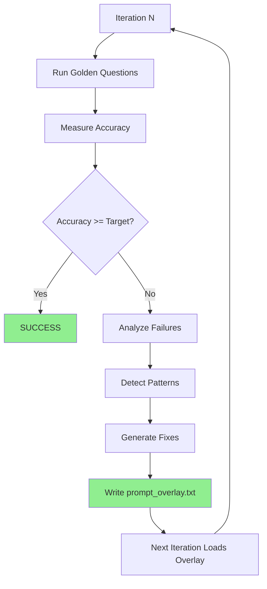

# Self-Improving NL Query Parser

Close the feedback loop so the system actually learns from failures instead of requiring manual prompt integration.

## Current Problem

The self-improvement script detects failure patterns and generates prompt fixes, but then **breaks** (line 160) and requires manual copy-paste into [`nl_query_engine.py`](src/clinical_analytics/core/nl_query_engine.py). This prevents iterative learning.

## Critical Learnings (2026-01-01)

### Model Size > Prompt Engineering

**Root Cause Identified**: llama3.2:3b (3 billion parameters) is too small for conversational refinements:

- Creates invalid intents: "FILTER_OUT", "FILTERS", "REMOVE_NA", "EX Exclude"
- Ignores conversation_history even with explicit instructions
- Can't follow complex refinement rules in prompts

**Impact**:

- RAG implementation improved accuracy 16% → 17% (1/6 refinement tests passing)
- Prompt optimization has diminishing returns with undersized model
- **Need llama3.1:8b (8 billion parameters) to reach 95% target**

### RAG System Implemented ✅

**What**: Loads `golden_questions.yaml` as corpus, retrieves similar examples for LLM

**How**: Jaccard similarity on keywords, boosts refinement patterns

**Results**: Modest improvement with 3b model, expect larger gains with 8b

### Validation

From test logs showing 3b model failures:

```
[warning] llm_queryplan_validation_failed_trying_legacy_format 
error="Invalid intent 'FILTER_OUT'. Must be one of ['COUNT'...]"

[warning] llm_queryplan_validation_failed_trying_legacy_format 
error="Invalid intent 'FILTERS'. Must be one of ['COUNT'...]"
```

**Conclusion**: Prompt overlay system will help, but **model upgrade is prerequisite**.

## Solution: Prompt Overlay System

Implement a hot-reload overlay system where learned fixes are written to a file that [`NLQueryEngine`](src/clinical_analytics/core/nl_query_engine.py) automatically loads.---

## Prerequisites

**Before implementing overlay system**:

1. **Verify model availability**: `ollama list | grep llama3.1:8b`
2. **Pull 8b model if missing**: `ollama pull llama3.1:8b` (~5GB download)
3. **Verify RAG working**: Check `_load_golden_questions_rag()` and `_find_similar_examples()` methods exist
4. **Run baseline test**: `make test` to establish current accuracy with 8b model

## Step 1: Add Prompt Overlay Support in NLQueryEngine

**File**: [`src/clinical_analytics/core/nl_query_engine.py`](src/clinical_analytics/core/nl_query_engine.py)

**Note**: RAG system already implemented (2026-01-01). Overlay will build on top of RAG-provided examples.

### 1.1 Add overlay loading method

Add new method after `__init__` (around line 115):

```python
def _load_prompt_overlay(self) -> str:
    """
    Load prompt overlay from disk if it exists.
    
    The overlay file is written by the self-improvement script and contains
    auto-generated fixes from failure pattern analysis.
    
    Returns:
        Overlay text to append to system prompt, or empty string if no overlay exists
    """
    from pathlib import Path
    
    overlay_path = Path(__file__).parent / "prompt_overlay.txt"
    
    if not overlay_path.exists():
        return ""
    
    try:
        overlay_text = overlay_path.read_text()
        logger.info("prompt_overlay_loaded", length=len(overlay_text))
        return overlay_text
    except Exception as e:
        logger.warning("prompt_overlay_load_failed", error=str(e))
        return ""
```

### 1.2 Modify `_build_llm_prompt` to use overlay

In [`_build_llm_prompt`](src/clinical_analytics/core/nl_query_engine.py:1043), append overlay **before** returning the prompt (around line 1260):

```python
# Existing system_prompt construction...
system_prompt = """You are a medical data query parser...
[existing prompt content]
"""

# Load and append overlay (auto-generated fixes)
overlay = self._load_prompt_overlay()
if overlay:
    system_prompt = system_prompt + "\n\n" + overlay

return system_prompt, user_prompt
```

---

## Step 2: Write Overlay File Each Iteration

**File**: [`scripts/self_improve_nl_parsing.py`](scripts/self_improve_nl_parsing.py)

### 2.1 Add overlay writer function

Add after imports (around line 25):

```python
def write_prompt_overlay(prompt_additions: str) -> None:
    """Write prompt additions to overlay file that NLQueryEngine loads."""
    from pathlib import Path
    
    overlay_path = Path(__file__).parent.parent / "src" / "clinical_analytics" / "core" / "prompt_overlay.txt"
    overlay_path.write_text(prompt_additions)
    logger.info("prompt_overlay_written", path=str(overlay_path), length=len(prompt_additions))
```

### 2.2 Write overlay in main loop

Replace lines 141-160 (the manual intervention section) with:

```python
# Write prompt improvements to overlay file
write_prompt_overlay(prompt_additions)

logger.info(
    "prompt_improvements_applied",
    iteration=iteration,
    additions_length=len(prompt_additions),
)

# Display progress
print(f"\n📝 Prompt improvements applied:")
print(f"   {len(prompt_additions)} characters written to prompt_overlay.txt")
print(f"   Re-running evaluation with updated prompt...")
```

---

## Step 3: Remove the Break Statement

**File**: [`scripts/self_improve_nl_parsing.py`](scripts/self_improve_nl_parsing.py)Delete the `break` statement (line 160) that prevents iteration.After Step 2 changes, there should be **no break** - let the loop continue to next iteration.---

## Step 4: Re-run Eval Automatically

**No changes needed** - evaluation already runs at the start of each iteration (line 105).The loop will now:

1. Run eval
2. Detect patterns
3. Write overlay
4. Loop back to step 1 (eval with new overlay)

---

## Step 5: Add Pipeline Instrumentation

If accuracy still doesn't improve after Steps 1-4, it means the LLM path isn't being exercised or is being rejected. Instrument to measure:**File**: [`src/clinical_analytics/core/nl_query_engine.py`](src/clinical_analytics/core/nl_query_engine.py)

### 5.1 Add instrumentation counters

In `parse_query` method (around line 250), add counters after tier decisions:

```python
# After tier 1 attempt (around line 270)
if tier1_match:
    logger.info("parse_outcome", tier="tier1", success=True, query_hash=hash(query))
    # existing return...

# After tier 2 attempt (around line 340)
if tier2_match:
    logger.info("parse_outcome", tier="tier2", success=True, query_hash=hash(query))
    # existing return...

# In tier 3 LLM path (around line 1284)
logger.info("parse_outcome", tier="tier3", llm_called=True, query_hash=hash(query))

# After LLM response (around line 1286)
if response is None:
    logger.info("parse_outcome", tier="tier3", llm_call_success=False, query_hash=hash(query))
else:
    logger.info("parse_outcome", tier="tier3", llm_call_success=True, query_hash=hash(query))

# After JSON parsing (around line 1291)
if intent is None:
    logger.info("parse_outcome", tier="tier3", json_parse_success=False, schema_validate_success=False)
else:
    logger.info("parse_outcome", tier="tier3", json_parse_success=True, schema_validate_success=True)
```

### 5.2 Add metrics aggregation script

Create [`scripts/analyze_parse_outcomes.py`](scripts/analyze_parse_outcomes.py):

```python
#!/usr/bin/env python3
"""Analyze parse outcome metrics from logs."""
import json
import sys
from collections import Counter
from pathlib import Path

def analyze_logs(log_file: Path):
    """Parse structlog output and compute metrics."""
    outcomes = []
    
    with open(log_file) as f:
        for line in f:
            if "parse_outcome" in line:
                try:
                    entry = json.loads(line)
                    outcomes.append(entry)
                except json.JSONDecodeError:
                    continue
    
    if not outcomes:
        print("No parse outcomes found in logs")
        return
    
    total = len(outcomes)
    tier_counts = Counter(o.get("tier") for o in outcomes if "tier" in o)
    
    tier3_outcomes = [o for o in outcomes if o.get("tier") == "tier3"]
    tier3_total = len(tier3_outcomes)
    
    llm_success = sum(1 for o in tier3_outcomes if o.get("llm_call_success"))
    json_success = sum(1 for o in tier3_outcomes if o.get("json_parse_success"))
    schema_success = sum(1 for o in tier3_outcomes if o.get("schema_validate_success"))
    
    print(f"Parse Outcome Analysis")
    print(f"=" * 50)
    print(f"Total parses: {total}")
    print(f"\nTier Distribution:")
    print(f"  Tier 1 (pattern): {tier_counts.get('tier1', 0)} ({tier_counts.get('tier1', 0)/total*100:.1f}%)")
    print(f"  Tier 2 (semantic): {tier_counts.get('tier2', 0)} ({tier_counts.get('tier2', 0)/total*100:.1f}%)")
    print(f"  Tier 3 (LLM): {tier3_total} ({tier3_total/total*100:.1f}%)")
    
    if tier3_total > 0:
        print(f"\nTier 3 Success Rates:")
        print(f"  LLM call success: {llm_success}/{tier3_total} ({llm_success/tier3_total*100:.1f}%)")
        print(f"  JSON parse success: {json_success}/{tier3_total} ({json_success/tier3_total*100:.1f}%)")
        print(f"  Schema validate success: {schema_success}/{tier3_total} ({schema_success/tier3_total*100:.1f}%)")
    
    print(f"\nIf Tier 3 rate is <10%, the LLM path is being bypassed.")
    print(f"If LLM success <80%, prompts aren't reaching the LLM.")
    print(f"If JSON success <80%, the LLM is returning invalid JSON.")
    print(f"If schema success <80%, the JSON doesn't match QueryPlan schema.")

if __name__ == "__main__":
    log_file = Path(sys.argv[1]) if len(sys.argv) > 1 else Path("/tmp/nl_query.log")
    analyze_logs(log_file)
```

---

## Expected Behavior After Implementation

### Iteration Flow



### Instrumentation Signals

If accuracy doesn't improve, check metrics:

- **Tier 3 rate < 10%**: LLM path not being used → Lower tier thresholds
- **LLM call success < 80%**: Ollama unavailable/timing out → Check Ollama, verify model exists
- **JSON parse success < 80%**: LLM returning invalid JSON → **Check model size first**
- **Schema validate success < 80%**: JSON doesn't match QueryPlan → **Check for invalid intents**
- **Invalid intents in logs**: Model hallucinating → **Model too small, need 8b**

### Model Size Diagnostics

If you see these in logs, model is too small:

```
llm_queryplan_validation_failed_trying_legacy_format 
error="Invalid intent 'FILTER_OUT'..."
```

**Solution**: Upgrade to llama3.1:8b, not more prompt engineering.

---

## Files Changed

1. [`src/clinical_analytics/core/nl_query_engine.py`](src/clinical_analytics/core/nl_query_engine.py) - Add overlay loading
2. [`scripts/self_improve_nl_parsing.py`](scripts/self_improve_nl_parsing.py) - Write overlay, remove break
3. [`scripts/analyze_parse_outcomes.py`](scripts/analyze_parse_outcomes.py) - New instrumentation script

## Testing Strategy

### Pre-Flight Checks

1. **Verify 8b model**: `curl -s http://localhost:11434/api/tags | grep "llama3.1:8b"`
2. **Baseline accuracy**: `make test` (capture current accuracy with 8b)
3. **RAG verification**: Check logs for `prompt_overlay_loaded` or similar

### Iteration Testing

1. Run `python scripts/self_improve_nl_parsing.py --max-iterations 3 --target-accuracy 0.95`
2. Verify `prompt_overlay.txt` is created and updated each iteration
3. Check that accuracy improves across iterations (or stays flat)
4. Monitor for invalid intent hallucinations (if present, model still too small)

### Success Criteria

- Accuracy improves 5%+ per iteration (or plateaus at target)
- No invalid intents in logs
- Conversation context being used (refinement tests passing)
- LLM call timeouts < 10% of requests

### Fallback

If accuracy doesn't improve after 3 iterations with 8b model:

1. Check instrumentation metrics
2. Verify overlay is being loaded
3. Manually inspect generated fixes
4. Consider 70b model if available (overkill but guaranteed to work)