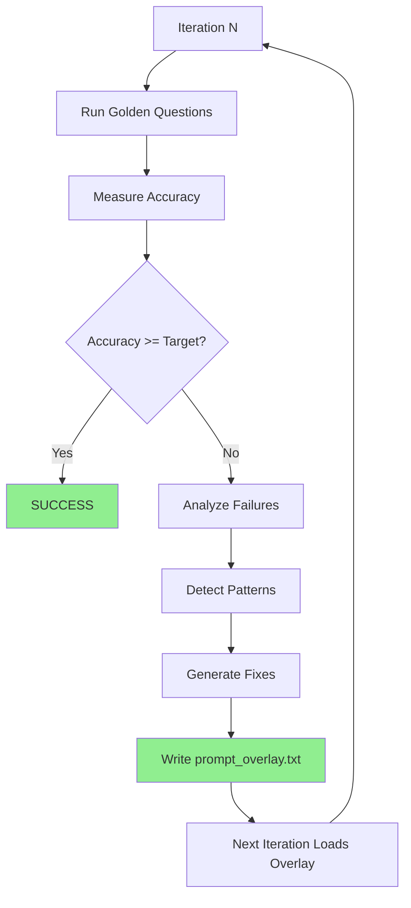

# Self-Improving NL Query Parser

Close the feedback loop so the system actually learns from failures instead of requiring manual prompt integration.

## Current Problem

The self-improvement script detects failure patterns and generates prompt fixes, but then **breaks** (line 160) and requires manual copy-paste into [`nl_query_engine.py`](src/clinical_analytics/core/nl_query_engine.py). This prevents iterative learning.

## Critical Learnings (2026-01-01)

### Model Size > Prompt Engineering

**Root Cause Identified**: llama3.2:3b (3 billion parameters) is too small for conversational refinements:

- Creates invalid intents: "FILTER_OUT", "FILTERS", "REMOVE_NA", "EX Exclude"
- Ignores conversation_history even with explicit instructions
- Can't follow complex refinement rules in prompts

**Impact**:

- RAG implementation improved accuracy 16% → 17% (1/6 refinement tests passing)
- Prompt optimization has diminishing returns with undersized model
- **Need llama3.1:8b (8 billion parameters) to reach 95% target**

### RAG System Implemented ✅

**What**: Loads `golden_questions.yaml` as corpus, retrieves similar examples for LLM

**How**: Jaccard similarity on keywords, boosts refinement patterns

**Results**: Modest improvement with 3b model, expect larger gains with 8b

### Validation

From test logs showing 3b model failures:

```
[warning] llm_queryplan_validation_failed_trying_legacy_format 
error="Invalid intent 'FILTER_OUT'. Must be one of ['COUNT'...]"

[warning] llm_queryplan_validation_failed_trying_legacy_format 
error="Invalid intent 'FILTERS'. Must be one of ['COUNT'...]"
```

**Conclusion**: Prompt overlay system will help, but **model upgrade is prerequisite**.

## Solution: Prompt Overlay System

Implement a hot-reload overlay system where learned fixes are written to a file that [`NLQueryEngine`](src/clinical_analytics/core/nl_query_engine.py) automatically loads.---

## Prerequisites

**Before implementing overlay system**:

1. **Verify model availability**: `ollama list | grep llama3.1:8b`
2. **Pull 8b model if missing**: `ollama pull llama3.1:8b` (~5GB download)
3. **Verify RAG working**: Check `_load_golden_questions_rag()` and `_find_similar_examples()` methods exist
4. **Run baseline test**: `make test` to establish current accuracy with 8b model

## Step 1 (REVISED): Add Prompt Overlay Support with Caching

**File**: [`src/clinical_analytics/core/nl_query_engine.py`](src/clinical_analytics/core/nl_query_engine.py)

**Critical Fix #1**: Use configurable env var path (default `/tmp/nl_query_learning/`) instead of source tree
**Critical Fix #2**: Add mtime-based caching to avoid disk I/O on every parse

### 1.1 Update `__init__` to add cache fields

In `__init__` method (around line 100), add overlay cache fields:

```python
def __init__(self, semantic_layer, embedding_model: str = "all-MiniLM-L6-v2"):
    # ... existing fields ...
    
    # Overlay cache (mtime-based hot reload)
    self._overlay_cache_text = ""
    self._overlay_cache_mtime_ns = 0
```

### 1.2 Add overlay path resolver (env var support)

Add method after `__init__`:

```python
def _prompt_overlay_path(self) -> Path:
    """
    Get overlay file path (configurable via env var).
    
    Defaults to /tmp/nl_query_learning/prompt_overlay.txt to keep
    learning artifacts out of source tree.
    
    Returns:
        Path to overlay file
    """
    import os
    from pathlib import Path
    
    # Prefer explicit override
    p = os.getenv("NL_PROMPT_OVERLAY_PATH")
    if p:
        return Path(p)
    
    # Default: same directory as self-improve logs
    # (keeps artifacts out of source tree)
    return Path("/tmp/nl_query_learning/prompt_overlay.txt")
```

### 1.3 Add overlay loader with mtime caching

```python
def _load_prompt_overlay(self) -> str:
    """
    Load prompt overlay from disk with mtime-based caching.
    
    Only re-reads file if modified since last load (hot reload).
    
    Returns:
        Overlay text to append to system prompt, or empty string
    """
    p = self._prompt_overlay_path()
    
    try:
        st = p.stat()
    except FileNotFoundError:
        self._overlay_cache_text = ""
        self._overlay_cache_mtime_ns = 0
        return ""
    
    # Cache hit: file unchanged since last load
    if st.st_mtime_ns == self._overlay_cache_mtime_ns:
        return self._overlay_cache_text
    
    # Cache miss: file changed, reload
    try:
        text = p.read_text(encoding="utf-8").strip()
        self._overlay_cache_text = text
        self._overlay_cache_mtime_ns = st.st_mtime_ns
        if text:
            logger.info("prompt_overlay_loaded", path=str(p), length=len(text))
        return text
    except Exception as e:
        logger.warning("prompt_overlay_load_failed", path=str(p), error=str(e))
        return ""
```

### 1.4 Modify `_build_llm_prompt` to append overlay

In [`_build_llm_prompt`](src/clinical_analytics/core/nl_query_engine.py:1043), append overlay **after** constructing full prompt (around line 1260):

```python
# ... existing system_prompt construction ...

# Load and append overlay (auto-generated fixes)
overlay = self._load_prompt_overlay()
if overlay:
    system_prompt = system_prompt + "\n\n" + overlay

return system_prompt, user_prompt
```

---

## Step 2 (REVISED): Atomic Overlay Writes + Size Capping

**File**: [`scripts/self_improve_nl_parsing.py`](scripts/self_improve_nl_parsing.py)

**Critical Fix #3**: Atomic writes via temp + replace to prevent race conditions
**Critical Fix #7**: Cap overlay to top 5 patterns, max 8KB length

### 2.1 Add atomic overlay writer

Add after imports (around line 25):

```python
def write_prompt_overlay(prompt_additions: str, overlay_path: Path) -> None:
    """
    Write prompt additions atomically to overlay file.
    
    Uses temp + replace to prevent race conditions if engine reads
    while script is writing.
    
    Args:
        prompt_additions: Generated fixes from failure patterns
        overlay_path: Target overlay file path
    """
    import os
    
    # Ensure parent directory exists
    overlay_path.parent.mkdir(parents=True, exist_ok=True)
    
    # Write to temp file
    tmp = overlay_path.with_suffix(".tmp")
    tmp.write_text(prompt_additions, encoding="utf-8")
    
    # Atomic replace (POSIX guarantee)
    os.replace(tmp, overlay_path)
    
    logger.info("prompt_overlay_written", path=str(overlay_path), length=len(prompt_additions))
```

### 2.2 Update main loop with capping + atomic writes

Replace lines 122-160 with:

```python
# Cap patterns to top 5 by priority
patterns.sort(key=lambda p: (p.priority, -p.count))
patterns = patterns[:5]

# Generate prompt improvements
prompt_additions = optimizer.generate_improved_prompt_additions(patterns)

# Hard cap overlay length (prevent bloat)
MAX_OVERLAY_LENGTH = 8000
if len(prompt_additions) > MAX_OVERLAY_LENGTH:
    prompt_additions = prompt_additions[:MAX_OVERLAY_LENGTH]
    logger.warning("prompt_overlay_truncated", original_length=len(prompt_additions), capped_length=MAX_OVERLAY_LENGTH)

# Write overlay atomically
import os
overlay_path = Path(os.getenv("NL_PROMPT_OVERLAY_PATH", "/tmp/nl_query_learning/prompt_overlay.txt"))
write_prompt_overlay(prompt_additions, overlay_path)

logger.info(
    "prompt_improvements_applied",
    iteration=iteration,
    additions_length=len(prompt_additions),
)

# Display progress
print(f"\n📝 Prompt improvements applied:")
print(f"   {len(prompt_additions)} characters written to {overlay_path.name}")
print(f"   Top {len(patterns)} patterns addressed")
print(f"   Re-running evaluation with updated prompt...")

# NO BREAK - let loop continue
```

---

## Step 3 (REVISED): Force Fresh Engine Each Iteration

**File**: [`src/clinical_analytics/core/eval_harness.py`](src/clinical_analytics/core/eval_harness.py)

**Critical Fix #4**: EvalHarness must create fresh engine each iteration (picks up new overlay)

### 3.1 Update `run_evaluation()` to create fresh engine

Ensure `EvalHarness.run_evaluation()` creates a fresh `NLQueryEngine` instance:

```python
def run_evaluation(self, questions: list[dict], verbose: bool = False) -> dict:
    """
    Run evaluation with golden questions.
    
    Creates fresh NLQueryEngine instance to pick up overlay changes.
    """
    from clinical_analytics.core.nl_query_engine import NLQueryEngine
    
    # Create FRESH engine (picks up current overlay state)
    engine = NLQueryEngine(self.semantic_layer)
    
    # ... rest of evaluation logic ...
```

**Note**: Break statement already removed in Step 2.2 - loop continues automatically.

---

## Step 4 (REVISED): Stable Hashing + Granular Checkpoints

**File**: [`src/clinical_analytics/core/nl_query_engine.py`](src/clinical_analytics/core/nl_query_engine.py)

**Critical Fix #5**: Use stable SHA256 hashing (not Python's randomized hash()) + granular success checkpoints
**Critical Fix #6**: Keep instrumentation even with 8b model (verify, don't assume)

### 4.1 Add stable hash helper

Add at module level (after imports, around line 27):

```python
import hashlib

def _stable_hash(s: str) -> str:
    """
    Stable hash for metrics (SHA256, not Python's randomized hash()).
    
    Returns:
        First 12 chars of SHA256 hex digest
    """
    return hashlib.sha256(s.encode("utf-8")).hexdigest()[:12]
```

### 4.2 Add granular instrumentation in `parse_query`

In `parse_query` method, add checkpoints at each decision point:

```python
# After tier 1 pattern match (around line 270)
if tier1_match:
    logger.info("parse_outcome", 
                tier="tier1", 
                success=True, 
                query_hash=_stable_hash(query))
    return tier1_result

# After tier 2 semantic match (around line 340)
if tier2_match:
    logger.info("parse_outcome", 
                tier="tier2", 
                success=True, 
                query_hash=_stable_hash(query))
    return tier2_result

# Tier 3 LLM fallback (around line 1270)
logger.info("parse_outcome", 
            tier="tier3", 
            llm_called=True, 
            query_hash=_stable_hash(query))

# After LLM call (around line 1284)
response = client.generate(...)
llm_http_success = response is not None

logger.info("parse_outcome", 
            tier="tier3", 
            llm_http_success=llm_http_success, 
            query_hash=_stable_hash(query))

if not llm_http_success:
    return QueryIntent(intent_type="DESCRIBE", confidence=0.3, parsing_tier="llm_fallback")

# After JSON parsing (before schema validation, around line 1290)
try:
    raw_json = json.loads(response.get("response", "{}"))
    json_parse_success = True
except json.JSONDecodeError:
    json_parse_success = False

logger.info("parse_outcome", 
            tier="tier3", 
            json_parse_success=json_parse_success, 
            query_hash=_stable_hash(query))

# After schema validation (around line 1295)
intent = self._extract_query_intent_from_llm_response(response)
schema_validate_success = intent is not None

logger.info("parse_outcome", 
            tier="tier3", 
            schema_validate_success=schema_validate_success,
            final_returned_from_tier3=schema_validate_success,
            query_hash=_stable_hash(query))
```

### 4.3 Update metrics aggregation script

Create [`scripts/analyze_parse_outcomes.py`](scripts/analyze_parse_outcomes.py) with granular checkpoints:

```python
#!/usr/bin/env python3
"""Analyze parse outcome metrics from logs."""
import json
import sys
from collections import Counter
from pathlib import Path

def analyze_logs(log_file: Path):
    """Parse structlog output and compute metrics with granular checkpoints."""
    outcomes = []
    
    with open(log_file) as f:
        for line in f:
            if "parse_outcome" in line:
                try:
                    entry = json.loads(line)
                    outcomes.append(entry)
                except json.JSONDecodeError:
                    continue
    
    if not outcomes:
        print("No parse outcomes found in logs")
        return
    
    total = len(outcomes)
    tier_counts = Counter(o.get("tier") for o in outcomes if "tier" in o)
    
    tier3_outcomes = [o for o in outcomes if o.get("tier") == "tier3"]
    tier3_total = len(tier3_outcomes)
    
    # Granular checkpoints
    llm_called = sum(1 for o in tier3_outcomes if o.get("llm_called"))
    llm_http_success = sum(1 for o in tier3_outcomes if o.get("llm_http_success"))
    json_parse_success = sum(1 for o in tier3_outcomes if o.get("json_parse_success"))
    schema_validate_success = sum(1 for o in tier3_outcomes if o.get("schema_validate_success"))
    final_returned = sum(1 for o in tier3_outcomes if o.get("final_returned_from_tier3"))
    
    print(f"Parse Outcome Analysis")
    print(f"=" * 50)
    print(f"Total parses: {total}")
    print(f"\nTier Distribution:")
    print(f"  Tier 1 (pattern): {tier_counts.get('tier1', 0)} ({tier_counts.get('tier1', 0)/total*100:.1f}%)")
    print(f"  Tier 2 (semantic): {tier_counts.get('tier2', 0)} ({tier_counts.get('tier2', 0)/total*100:.1f}%)")
    print(f"  Tier 3 (LLM): {tier3_total} ({tier3_total/total*100:.1f}%)")
    
    if tier3_total > 0:
        print(f"\nTier 3 Pipeline (Granular Checkpoints):")
        print(f"  LLM called: {llm_called}/{tier3_total} ({llm_called/tier3_total*100:.1f}%)")
        print(f"  LLM HTTP success: {llm_http_success}/{tier3_total} ({llm_http_success/tier3_total*100:.1f}%)")
        print(f"  JSON parse success: {json_parse_success}/{tier3_total} ({json_parse_success/tier3_total*100:.1f}%)")
        print(f"  Schema validate success: {schema_validate_success}/{tier3_total} ({schema_validate_success/tier3_total*100:.1f}%)")
        print(f"  Final returned: {final_returned}/{tier3_total} ({final_returned/tier3_total*100:.1f}%)")
    
    print(f"\nDiagnostics:")
    print(f"  Tier 3 rate <10%: LLM path bypassed (lower tier thresholds)")
    print(f"  LLM HTTP <80%: Ollama unavailable/timing out")
    print(f"  JSON parse <80%: LLM returning invalid JSON (check model size)")
    print(f"  Schema validate <80%: Invalid intents (model hallucinating, need 8b+)")

if __name__ == "__main__":
    log_file = Path(sys.argv[1]) if len(sys.argv) > 1 else Path("/tmp/nl_query.log")
    analyze_logs(log_file)
```

---

## Expected Behavior After Implementation

### Iteration Flow



### Instrumentation Signals

If accuracy doesn't improve, check metrics:

- **Tier 3 rate < 10%**: LLM path not being used → Lower tier thresholds
- **LLM call success < 80%**: Ollama unavailable/timing out → Check Ollama, verify model exists
- **JSON parse success < 80%**: LLM returning invalid JSON → **Check model size first**
- **Schema validate success < 80%**: JSON doesn't match QueryPlan → **Check for invalid intents**
- **Invalid intents in logs**: Model hallucinating → **Model too small, need 8b**

### Model Size Diagnostics

If you see these in logs, model is too small:

```
llm_queryplan_validation_failed_trying_legacy_format 
error="Invalid intent 'FILTER_OUT'..."
```

**Solution**: Upgrade to llama3.1:8b, not more prompt engineering.

---

---

## Minimal Patch Checklist (All 7 Staff-Level Fixes)

- [ ] **Fix #1**: Engine reads overlay from env var path (`/tmp/nl_query_learning/prompt_overlay.txt` default)
- [ ] **Fix #2**: Engine caches overlay by mtime (hot reload without disk thrashing)
- [ ] **Fix #3**: Script writes overlay atomically (temp + replace)
- [ ] **Fix #4**: EvalHarness creates fresh engine each iteration
- [ ] **Fix #5**: Use stable SHA256 hashing + granular checkpoints (llm_called, llm_http_success, json_parse_success, schema_validate_success)
- [ ] **Fix #6**: Keep overlay + instrumentation even with 8b model (verify, don't assume)
- [ ] **Fix #7**: Cap overlay to top 5 patterns, max 8KB length

---

## Files Changed

1. [`src/clinical_analytics/core/nl_query_engine.py`](src/clinical_analytics/core/nl_query_engine.py) - Overlay loading with caching, stable hashing, granular instrumentation
2. [`src/clinical_analytics/core/eval_harness.py`](src/clinical_analytics/core/eval_harness.py) - Force fresh engine creation
3. [`scripts/self_improve_nl_parsing.py`](scripts/self_improve_nl_parsing.py) - Atomic writes, size capping, remove break
4. [`scripts/analyze_parse_outcomes.py`](scripts/analyze_parse_outcomes.py) - Granular checkpoint metrics

## Testing Strategy

### Pre-Flight Checks

1. **Verify 8b model**: `curl -s http://localhost:11434/api/tags | grep "llama3.1:8b"`
2. **Baseline accuracy**: `make test` (capture current accuracy with 8b)
3. **RAG verification**: Check logs for `prompt_overlay_loaded` or similar

### Iteration Testing

1. Run `python scripts/self_improve_nl_parsing.py --max-iterations 3 --target-accuracy 0.95`
2. Verify `prompt_overlay.txt` is created and updated each iteration
3. Check that accuracy improves across iterations (or stays flat)
4. Monitor for invalid intent hallucinations (if present, model still too small)

### Success Criteria

- Accuracy improves 5%+ per iteration (or plateaus at target)
- No invalid intents in logs
- Conversation context being used (refinement tests passing)
- LLM call timeouts < 10% of requests

### Fallback

If accuracy doesn't improve after 3 iterations with 8b model:

1. Check instrumentation metrics
2. Verify overlay is being loaded
3. Manually inspect generated fixes
4. Consider 70b model if available (overkill but guaranteed to work)