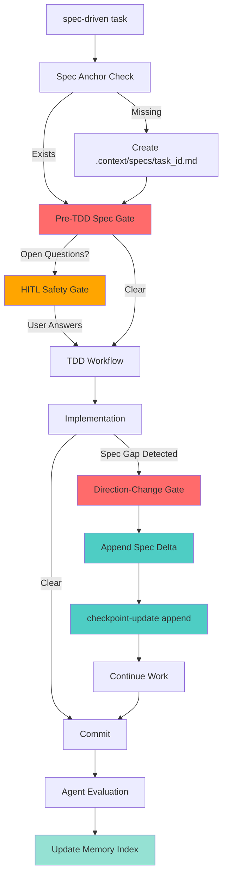
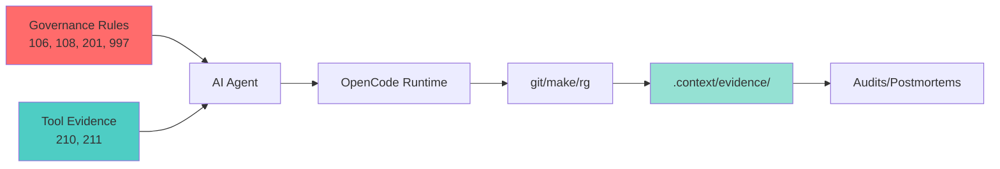
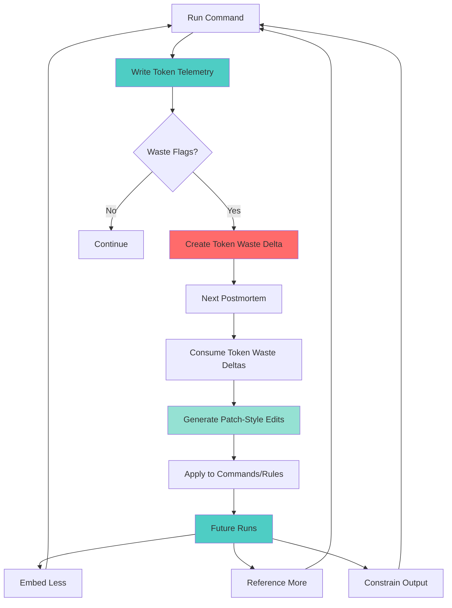

# Spec-Driven Governance Framework

## Overview

Transform the current "ceremonial" checkpoint system into a rigorous, auditable governance framework that:

- Creates append-only audit trails (no overwrites)
- Enforces spec alignment with hard gates before tests and implementation
- Blocks freestyle behavior with mandatory spec deltas
- Adds human-in-the-loop safety for ambiguous decisions
- Enables quantified agent evaluation and searchable artifact memory
- Integrates tool-first evidence collection (OpenCode compatibility)
- **NEW**: Adds subagent delegation for token-efficient parallel verification via work orders
- **NEW**: Adds token economy instrumentation - tracks proxy metrics, detects waste, generates prevention patches
- **NEW**: Adds C.O.R.E. output format for cognitive-optimized, neurodivergent-friendly agent outputs with cognitive load tracking

## Rule Numbering Taxonomy

This governance framework uses a priority-based numbering scheme for rules. The numbers signal authority, scope, and precedence - not chronological order.

### 100-series: Core Execution Invariants

**"If these are violated, the work is invalid."Purpose**:

- Define how work is done
- Enforce correctness, safety, and spec alignment
- Gate execution

**Characteristics**:

- Always-on
- Block progress
- Rarely change
- Small, sharp, opinionated

**Mental Model**: These are the laws of physics for your repo. If an agent ignores a 100-series rule, it's not "less optimal" — it's wrong.**Examples**: 104-plan-execution-hygiene, 106-spec-change-control, 107-hitl-safety, 108-spec-sync-gates, 109-safe-file-writes

### 200-series: Optimization + Enforcement Amplifiers

**"Do the work better, cheaper, safer."Purpose**:

- Reduce waste (tokens, time, rework)
- Improve evidence quality
- Control agent behavior at scale
- Add guardrails for tooling (subagents, OpenCode, etc.)

**Characteristics**:

- Conditional
- Enforced when relevant
- More likely to evolve
- Often reactive to postmortems

**Mental Model**: These are engineering best practices encoded as constraints. Violating a 200-series rule usually means extra tokens, duplicated work, noisy audits. Not immediate invalidity, but measurable degradation.**Examples**: 210-tool-evidence-first, 212-subagent-boundaries, 215-subagent-delegation, 220-token-economy

### 900-series: Meta-Governance + Hygiene

**"How the governance system itself behaves."Purpose**:

- Control verbosity
- Prevent process bloat
- Define logging discipline
- Keep the system usable

**Characteristics**:

- Meta-level
- Small
- Non-domain-specific
- Protects humans from the system

**Mental Model**: These are the speed limits and zoning laws. They don't define what to do, but how much and how loudly.**Examples**: 997-logging-policy

### Rule Precedence Model

**In conflicts**: 100-series > 200-series > 900-series

- **100-series rules** define correctness and safety. They cannot be bypassed.
- **200-series rules** define optimization and efficiency. They must be followed when applicable.
- **900-series rules** define governance hygiene and verbosity limits.

This removes ambiguity and prevents "but I thought efficiency mattered more" reasoning.

### When to Add a New Rule (Decision Table)

| Situation | Rule Series |

|-----------|-------------|

| Prevent silent spec drift | 100 |

| Force checkpoint on ambiguity | 100 |

| Reduce repeated context dumps | 200 |

| Limit subagent sprawl | 200 |

| Cap output length | 900 |

| Normalize artifact verbosity | 900 |

### Why This Separation Matters

**Enables safe evolution**:

- 100-series rules should almost never change
- 200-series rules are where postmortems land
- 900-series rules keep token cost + fatigue under control

**If mixed**: You'll either be afraid to improve anything, or you'll break core guarantees while "optimizing."

### Complete Rule Mapping

| Rule | Series | Purpose |
|------|--------|---------|
| 000-project-setup-and-makefile | 000 | Meta-governance (project setup) |
| 001-self-improving-assistant | 001 | Meta-governance (communication) |
| 100-polars-first | 100 | Correctness (data processing invariants) |
| 101-testing-hygiene | 100 | Correctness (test structure standards) |
| 102-dry-principles | 100 | Correctness (code organization patterns) |
| 103-staff-engineer-standards | 100 | Correctness/Safety (production patterns) |
| 104-plan-execution-hygiene | 100 | Correctness (execution standards) |
| 105-test-fixture-enforcement | 100 | Correctness (fixture usage patterns) |
| 106-spec-change-control | 100 | Correctness (spec alignment enforcement) |
| 107-hitl-safety | 100 | Safety (human approval gates) |
| 108-spec-sync-gates | 100 | Correctness (pre-TDD/direction-change gates) |
| 109-safe-file-writes | 100 | Safety (write path constraints) |
| 210-tool-evidence-first | 200 | Optimization (reduce hallucination via tools) |
| 212-subagent-boundaries | 200 | Optimization (token control via scoping) |
| 215-subagent-delegation | 200 | Optimization (parallel verification) |
| 220-token-economy | 200 | Optimization (token reduction via constraints) |
| 230-core-output-format | 200 | Optimization (cognitive-optimized output formatting) |
| 997-logging-policy | 900 | Meta-governance (verbosity limits) |
| 999-agent-execution-protocol | 900 | Meta-governance (TDD workflow) |

## Architecture




### Subagent Delegation Architecture

```mermaid
flowchart LR
    PlanReview[/plan-review] --> WorkOrders[Generate Work Orders]
    WorkOrders --> WO1[WO-1: Spec Check]
    WorkOrders --> WO2[WO-2: Safety Audit]
    WorkOrders --> WO3[WO-3: Rule Conflicts]
    WorkOrders --> WO4[WO-4: Test Impact]
    
    WO1 --> OpenCode1{OpenCode?}
    WO2 --> OpenCode2{OpenCode?}
    WO3 --> OpenCode3{OpenCode?}
    WO4 --> OpenCode4{OpenCode?}
    
    OpenCode1 -->|Yes| SubAgent1[@subagent]
    OpenCode1 -->|No| Manual1[Manual Execute]
    SubAgent1 --> Artifact1[.context/subagents/task/wo1.md]
    Manual1 --> Artifact1
    
    OpenCode2 -->|Yes| SubAgent2[@subagent]
    OpenCode2 -->|No| Manual2[Manual Execute]
    SubAgent2 --> Artifact2[.context/subagents/task/wo2.md]
    Manual2 --> Artifact2
    
    OpenCode3 -->|Yes| SubAgent3[@subagent]
    OpenCode3 -->|No| Manual3[Manual Execute]
    SubAgent3 --> Artifact3[.context/subagents/task/wo3.md]
    Manual3 --> Artifact3
    
    OpenCode4 -->|Yes| SubAgent4[@subagent]
    OpenCode4 -->|No| Manual4[Manual Execute]
    SubAgent4 --> Artifact4[.context/subagents/task/wo4.md]
    Manual4 --> Artifact4
    
    Artifact1 --> Reconcile[Reconcile Findings]
    Artifact2 --> Reconcile
    Artifact3 --> Reconcile
    Artifact4 --> Reconcile
    
    Reconcile --> Decision{Approved?}
    Decision -->|Yes| Merge[Execute Plan]
    Decision -->|No| PatchPlan[Patch Plan]
    
    style WorkOrders fill:#4ecdc4
    style SubAgent1 fill:#95e1d3
    style SubAgent2 fill:#95e1d3
    style SubAgent3 fill:#95e1d3
    style SubAgent4 fill:#95e1d3
    style Reconcile fill:#ff6b6b
```

**Key Principles:**

1. **Append-only**: No file overwrites; all changes are timestamped additions
2. **Hard gates**: Execution halts at spec gaps and ambiguities
3. **Quantified**: All governance artifacts produce measurable metrics
4. **Searchable**: Memory index enables retrieval across all artifacts
5. **Parallel verification**: Subagent work orders with output contracts prevent "vibing through" reviews
6. **Token discipline**: Proxy metrics detect waste; waste becomes constraints via patch generation

## Phase 1: Makefile Infrastructure

### Add Append-Only Checkpoint

**File:** [`Makefile`](Makefile)Add after existing `checkpoint-resume` target (line 382):

```makefile
checkpoint-update: ## Append to checkpoint log (requires TASK_ID="task_name")
	@if [ -z "$(TASK_ID)" ]; then \
		echo "$(RED)❌ Error: TASK_ID required. Usage: make checkpoint-update TASK_ID=\"task_name\"$(NC)"; \
		exit 1; \
	fi
	@mkdir -p .context/checkpoints
	@FILE=".context/checkpoints/$(TASK_ID).md"; \
	if [ ! -f "$$FILE" ]; then \
		$(MAKE) checkpoint-create TASK_ID="$(TASK_ID)"; \
	fi; \
	TIMESTAMP=$$(date -u +"%Y-%m-%dT%H:%M:%SZ"); \
	COMMIT=$$(git rev-parse --short HEAD 2>/dev/null || echo "none"); \
	echo "" >> "$$FILE"; \
	echo "## Update: $${TIMESTAMP}" >> "$$FILE"; \
	echo "- commit: $${COMMIT}" >> "$$FILE"; \
	echo "- reason: <fill>" >> "$$FILE"; \
	echo "- files: <fill>" >> "$$FILE"; \
	echo "- tests: <fill>" >> "$$FILE"; \
	echo "$(GREEN)✅ Checkpoint updated (append-only): $$FILE$(NC)"

memory-index-update: ## Update memory index (requires TASK_ID, ARTIFACT_TYPE, ARTIFACT_PATH)
	@if [ -z "$(TASK_ID)" ] || [ -z "$(ARTIFACT_TYPE)" ] || [ -z "$(ARTIFACT_PATH)" ]; then \
		echo "$(RED)❌ Error: TASK_ID, ARTIFACT_TYPE, and ARTIFACT_PATH required$(NC)"; \
		exit 1; \
	fi
	@mkdir -p .context
	@TIMESTAMP=$$(date -u +"%Y-%m-%dT%H:%M:%SZ"); \
	$(PYTHON_RUN) -c "import json, sys, os; \
	path = '.context/memory-index.json'; \
	data = json.load(open(path)) if os.path.exists(path) else {'tasks': {}}; \
	data['tasks'].setdefault('$(TASK_ID)', {}).setdefault('$(ARTIFACT_TYPE)', []).append({'path': '$(ARTIFACT_PATH)', 'timestamp': '$${TIMESTAMP}'}); \
	json.dump(data, open(path, 'w'), indent=2)" \
	|| { echo "$(RED)❌ Failed to update memory index$(NC)"; exit 1; }
	@echo "$(GREEN)✅ Memory index updated$(NC)"
```

**Why:** Replaces overwrite behavior with append-only history. `checkpoint-update` adds timestamped entries; `memory-index-update` maintains searchable artifact registry.

### Update Checkpoint Create (Fix Overwrite)

**File:** [`Makefile`](Makefile) (line 358)Change `>` to `>>` for all echo commands EXCEPT the first one to preserve append behavior:

```makefile
checkpoint-create: ## Create lightweight checkpoint template (requires TASK_ID="task_name")
	@if [ -z "$(TASK_ID)" ]; then \
		echo "$(RED)❌ Error: TASK_ID required. Usage: make checkpoint-create TASK_ID=\"task_name\"$(NC)"; \
		exit 1; \
	fi
	@mkdir -p .context/checkpoints
	@LAST_COMMIT=$$(git rev-parse --short HEAD 2>/dev/null || echo "none"); \
	FILE=".context/checkpoints/$(TASK_ID).md"; \
	if [ -f "$$FILE" ]; then \
		echo "$(YELLOW)⚠ Checkpoint already exists. Use 'make checkpoint-update' to append.$(NC)"; \
		exit 1; \
	fi; \
	echo "# $(TASK_ID)" > "$$FILE"; \
	echo "" >> "$$FILE"; \
	echo "**Status**: In progress (since last commit: $${LAST_COMMIT})" >> "$$FILE"; \
	# ... rest unchanged
```

**Why:** Prevents accidental overwrites of existing checkpoints. Forces use of `checkpoint-update` for modifications.

## Phase 2: Core Governance Rules (100-series)

**Note**: Phase 2 focuses on 100-series rules (correctness, safety, spec alignment). These are core execution invariants that define valid work. 200-series (optimization) and 900-series (meta-governance) rules are added in later phases.

### Enforcement Model

This governance framework uses **soft enforcement** via LLM behavioral guidelines, not hard enforcement via tooling. Agents are expected to follow rules via:

1. **Prompt-based compliance**: Rules are loaded via @rule-name.mdc references in spec-driven.md
2. **Human verification**: Users verify compliance via checkpoints and audits
3. **Self-reporting**: Agents report SPEC GAP events and request HITL approval

**Limitations**:

- Agents can ignore gates if they misinterpret rules
- No automatic halt mechanism exists
- Enforcement depends on agent reasoning and prompt compliance

**Mitigation**:

- Use /spec-audit to detect drift
- Use /evaluate-agent to quantify compliance
- Use checkpoints to track deviations

### Rule: Spec Change Control

**New file:** `.cursor/rules/106-spec-change-control.mdc`

```markdown
# 106 Spec Change Control

Role
Ensure no execution deviates from spec without documented, traceable delta.

Triggers
- Spec anchor cannot answer a behavior request.
- Implementation choice contestable under multiple interpretations.
- Open Questions remain unresolved.
- Tests fail due to undefined expected behavior.

Mandatory Behavior
1) Declare SPEC GAP with classification:
                                                                                                - missing_requirement
                                                                                                - ambiguous_requirement
                                                                                                - new_constraint
                                                                                                - scope_change
2) Append EXACTLY ONE Spec Delta using the standard template.
3) Run: make checkpoint-update TASK_ID="<task_id>"
4) Request human intervention before proceeding.

Token Policy
- Spec Gap classification: max 5 items.
- Delta entry uses formal template only.
- No free-text narrative beyond defined fields.

Enforcement
- Failure to create delta MUST trigger SPEC GAP declaration and HITL request.
```

**Why:** Blocks freestyle implementation by requiring explicit spec documentation for every direction change.

### Rule: Spec Sync Gates

**New file:** `.cursor/rules/108-spec-sync-gates.mdc`

```markdown
# 108 Spec Sync Gates

Role
Enforce spec alignment and incremental traceability prior to implementation and test phases.

Triggers
1) Prior to writing or modifying tests.
2) When an implementation decision cannot be directly mapped to an existing spec anchor.
3) When a spec gap (ambiguity or missing detail) is detected at any stage.

Mandatory Behavior

A) Pre-TDD Spec Gate
1) Locate or create spec anchor: `.context/specs/<task_id>.md`
2) Spec anchor MUST contain:
                                                                                                - Clear Goal
                                                                                                - Non-Goals
                                                                                                - Acceptance Criteria (testable)
                                                                                                - Constraints (performance, compatibility, interfaces)
                                                                                                - Open Questions (if any)
3) If Open Questions exist with blocking impact, agent MUST list them and request closure before proceeding.

B) Direction-Change Gate
Trigger conditions
- Discovery of new requirement
- Discovery of constraint that changes approach
- Ambiguous behavior in tests
- Implementation choice absent in spec

Actions
1) Append ONE Spec Delta to the spec file.
2) Run: make checkpoint-update TASK_ID="<task_id>"
3) Document in checkpoint and request human verification.

Enforcement
- Agent MUST refuse to proceed until spec anchor is updated and validated.
```

**Why:** Creates two hard stops: before writing tests (Pre-TDD) and when direction changes during implementation.

### Rule: Human-in-the-Loop Safety

**New file:** `.cursor/rules/107-hitl-safety.mdc`

```markdown
# 107 Human-in-the-Loop Safety

Role
Guard high-impact or ambiguous decisions behind explicit user confirmation.

Triggers
- Unresolved spec ambiguity.
- High impact changes (as flagged in spec anchors).
- Autonomous state transitions affecting external systems.
- Newly detected constraints that reduce system safety margins.

Mandatory Behavior
1) Halt automated progression.
2) Emit structured question directed at human reviewer.
3) Record rationale in: .context/hitl/<task_id>_<timestamp>.md

Question Format
- Single sentence.
- Targeted at a specific open decision.
- Must reference spec anchor or drift event.

Resume Policy
- Execution may only resume after human answer is recorded in context.

Enforcement
- Agent MUST emit structured question and await user answer before proceeding.
```

**Why:** Prevents autonomous decisions on ambiguous or high-impact changes. Requires explicit human approval.

### Rule: Logging Policy (Token Control)

**New file:** `.cursor/rules/997-logging-policy.mdc`

```markdown
# 997 Logging Policy

Purpose
Constrain logging and artifact verbosity.

Policies
1) Spec Drift: max 1 entry per trigger event.
2) Spec Delta: ≤ 12 lines in template format.
3) Evaluations: numeric metrics only.
4) Audits/Postmortems: structured fields only.
5) No free-text narrative outside defined templates.

Enforcement
- Violations MUST produce logged warnings and halt progression.
```

**Why:** Prevents "audit trails that become novels." Strict templates keep costs low and signals high.

## Phase 3: Template and Command Artifacts

**Note**: Commands created in Phase 3 use base templates. Phase 6 enhances spec-audit.md and postmortem.md with tool evidence requirements. This two-pass pattern allows core commands to be used before tool-evidence rule (210) exists.

### Command: Spec Delta Template

**New file:** `.cursor/commands/spec-delta-template.md`

```markdown
# SPEC DELTA ENTRY (APPEND-ONLY)

This template must be used verbatim for every directional change.

## Fields

DeltaID: <YYYYMMDDHHMMSS>-<short_slug>
Trigger: (missing_requirement | ambiguous_requirement | new_constraint | scope_change)
Decision: One clear sentence of what changed.
VerificationTestsAdded:
                                                                - <path/to/test1>
                                                                - <path/to/test2>
Impact:
                                                                - code_paths: <list of files or modules>
                                                                - test_artifacts: <list of tests>
                                                                - documentation: <list of sections>
SkillAspect: <named conceptual capability>
SpecFile: .context/specs/<task_id>.md
CommitAnchors:
                                                                - checkpoint: .context/checkpoints/<task_id>.md
MemoryIndexRef: .context/memory-index.json

## Specification

- Each field is required.
- No prose beyond the fields.
- VerificationTestsAdded must list at least one test.
```

**Why:** Standardized format ensures all spec changes are traceable, testable, and indexed.

### Command: Spec Audit

**New file:** `.cursor/commands/spec-audit.md`

```markdown
# SPEC AUDIT COMMAND

Role
Perform a spec vs execution reconciliation and produce append-only deltas.

Trigger
/spec-audit <task_id>

Inputs
- .context/specs/<task_id>.md
- .context/checkpoints/<task_id>.md
- Git diff for <task_id> (if available)

Core Output
1) Summary Report (max 10 structured bullets).
2) Required Spec Delta entries (formatted to paste).

Artifact Write
- .context/audits/spec_audit_<task_id>_<timestamp>.md

Rules
- Do not rewrite existing spec anchors.
- Only append new Spec Delta entries where required.
- If no gaps are found: report "no spec gaps detected" explicitly.

Summary Fields
- spec_violations: list
- potential_spec_gaps: list
- suggested_deltas: list of full Spec Delta templates
```

**Why:** On-demand reconciliation between spec intent and actual implementation. Produces actionable deltas.

### Command: Agent Evaluation

**New file:** `.cursor/commands/000-agent-evaluation.md`

``````markdown

# AGENT EVALUATION COMMAND

Role

Evaluate agent performance against observable, versioned metrics after each major execution.

Trigger

/evaluate-agent <task_id>

Inputs

- .context/specs/<task_id>.md
- .context/checkpoints/<task_id>.md
- Git diff for <task_id> (if available)

Outputs

1) Write evaluation report to: `.context/evaluations/<task_id>_<timestamp>.md`

2) Return structured JSON summary in agent output.

Evaluation Report Fields (YAML)

```yaml
task_id: <task_id>
timestamp: <ISO8601>
spec_coverage_ratio: <0-1>
drift_event_count: <int>
checkpoint_consistency_ratio: <0-1>
regression_test_pass_rate: <0-1>
test_coverage_gap: <true|false>
autocorrect_overrides: <int>
```

Rules

- Must produce a numeric score for each field.
- Must reference files/anchors explicitly.
- Must contain no prose beyond quantified observations.
````

**Why:** Measurable agent performance. Enables tracking of spec drift, test coverage, and autonomous overrides.

### Command: Memory Index

**New file:** `.cursor/commands/301-memory-index.md`

```markdown
# MEMORY INDEX UPDATER

Role
Update a centralized memory index to capture structured context for retrieval.

Trigger
memory-index-update <task_id> <artifact_type> <artifact_path>

Inputs
- task_id
- artifact_type ∈ {spec_delta, checkpoint, drift, audit, evaluation, postmortem}
- artifact_path

Operation
Update: .context/memory-index.json

Index Schema
```json
{
  "tasks": {
    "<task_id>": {
      "checkpoints": ["..."],
      "spec_deltas": ["..."],
      "drift_events": ["..."],
      "audits": ["..."],
      "evaluations": ["..."],
      "postmortems": ["..."]
    }
  }
}
````


Rules

- Each entry MUST include an ISO8601 timestamp.
- Memory index MUST not be overwritten; only appended.
````

**Why:** Searchable, structured index of all governance artifacts. Enables future retrieval and analysis.

### Command: Postmortem

**New file:** `.cursor/commands/postmortem.md`

```markdown
# POSTMORTEM COMMAND

Role
Generate an actionable forensic artifact that results in verifiable rule/command updates.

Trigger
/postmortem <incident_id>

Inputs
- Plan artifact for incident
- Git diff for incident
- .context/evaluations (if available)

Artifact Write
- .context/postmortems/<incident_id>.md

Standard Template
```markdown
# Postmortem: <incident_id>
Date: <ISO8601>

## What Happened
- <3–5 structured bullets; machine-parsable>

## Quantified Impact
- spec_coverage_loss: <0–1>
- unexpected_regressions: <count>
- drift_events: <count>

## Root Causes
- <list of root causes, atomic sentences>

## Missed Guards
- rule_refs: <list of .mdc rules>
- command_refs: <list of .md files>

## Generated Fixes
- spec_delta_templates: [full templates]
- rule_modifications: [patch-style diffs]
- command_modifications: [patch-style diffs]

## Verification Artifacts
- tests_added: [list]
- evaluations_added: [list]
````


Processing Rules

- Postmortem MUST produce at least one actionable structural change.
- If postmortem does not create a delta, it MUST be invalidated and remediated.
````

**Why:** Forensic analysis that produces concrete improvements to governance infrastructure.

### Template: Spec Anchor

**New file:** `.cursor/commands/spec-anchor-template.md`

```markdown
# SPEC ANCHOR TEMPLATE

Create: `.context/specs/<task_id>.md`

```markdown
# Spec: <task_id>

## Goal
- <one sentence>

## Non-goals
- <explicitly out of scope>

## Acceptance Criteria
- [ ] <testable behavior 1>
- [ ] <testable behavior 2>

## Constraints
- <perf / interfaces / backward compat / safety>

## Open Questions
- <only if blocking; otherwise omit section>

## Spec Delta Log (append-only)
<!-- deltas go here -->
````


Notes

- This forces "slow down" by requiring explicit documentation before tests.
````

**Why:** Standard template ensures all specs have necessary sections for decision-making.

## Phase 4: Update Spec-Driven Command

**File:** [`.cursor/commands/spec-driven.md`](.cursor/commands/spec-driven.md)

Add "Rule Precedence Model" section before "Mandatory Rules to Apply":

```markdown
## Rule Precedence Model

**In conflicts**: 100-series > 200-series > 900-series

- **100-series rules** define correctness and safety. They cannot be bypassed.
- **200-series rules** define optimization and efficiency. They must be followed when applicable.
- **900-series rules** define governance hygiene and verbosity limits.

This removes ambiguity and prevents "but I thought efficiency mattered more" reasoning.
```

Update the "Mandatory Rules to Apply" section (line 14):

```markdown
Mandatory Rules to Apply

@999-agent-execution-protocol.mdc - Core TDD workflow enforcement
@104-plan-execution-hygiene.mdc - Plan execution standards
@106-spec-change-control.mdc - Change control enforcement (NEW)
@107-hitl-safety.mdc - Human-in-the-loop safety (NEW)
@108-spec-sync-gates.mdc - Spec alignment gates (NEW)
@109-safe-file-writes.mdc - Constrained file write paths (NEW)
@997-logging-policy.mdc - Token control (NEW)
@101-testing-hygiene.mdc - Test structure and fixtures
@000-project-setup-and-makefile.mdc - Makefile command usage
@103-staff-engineer-standards.mdc - Code quality standards
@102-dry-principles.mdc - Code organization
@100-polars-first.mdc - Data processing patterns (if applicable)
@105-test-fixture-enforcement.mdc - Fixture usage
@001-self-improving-assistant.mdc - Direct communication style
````

**Note**: Rule 210 (tool-evidence-first) will be added in Phase 6 update.


Update the "Execution Sequence" section:

- Locate section starting with "Execution Sequence (MANDATORY)"
- Replace entire section up to (but not including) "Checkpoint Logging (LIGHTWEIGHT)"
- Use the following content:
```markdown
Execution Sequence (MANDATORY)

0. Establish Task Anchor + Artifacts (before any tests)
                                                                                                - Define task_id (required)
                                                                                                - Ensure spec anchor exists: .context/specs/<task_id>.md
                                                                                                - If missing: create it using spec-anchor-template.md
                                                                                                - Create checkpoint if missing: make checkpoint-create TASK_ID="<task_id>"

1. Pre-TDD Spec Sync Gate (HARD GATE)
   Before writing or modifying tests:
                                                                                                - Confirm spec anchor includes: Goal, Non-Goals, Acceptance Criteria, Constraints
                                                                                                - If Open Questions exist that block tests: STOP and ask human to resolve

2. Create TODO List
                                                                                                - Break task into TDD workflow steps
                                                                                                - Include: write test, run test (red), implement, run test (green), format/lint, commit
                                                                                                - Use todo_write tool

3. Write Failing Test (Red Phase)
                                                                                                - Write test BEFORE any implementation
                                                                                                - Use AAA pattern (Arrange-Act-Assert)
                                                                                                - Name: test_unit_scenario_expectedBehavior
                                                                                                - Use shared fixtures from conftest.py

4. Run Test to Verify Failure
                                                                                                - Command: For single test: uv run pytest tests/.../test_file.py::TestClass::test_method -xvs
                                                                                                - For full module: make test-[module]
                                                                                                - Confirm it fails for the RIGHT reason

5. Implement Feature (Green Phase)
                                                                                                - Write minimum code to pass the test
                                                                                                - Keep it simple and spec-anchored

6. Direction-Change Gate (if triggered during implementation)
   Trigger if:
                                                                                                - New requirement appears
                                                                                                - New constraint discovered that changes approach
                                                                                                - Tests reveal ambiguous behavior
                                                                                                - Implementation choice not stated in spec
   
   Actions:
   1) Declare SPEC GAP (per 106-spec-change-control.mdc)
   2) Append ONE Spec Delta to .context/specs/<task_id>.md
   3) Run: make checkpoint-update TASK_ID="<task_id>"
   4) Request human intervention per 107-hitl-safety.mdc if ambiguous
   5) Continue only after delta recorded and HITL cleared (if applicable)

7. Run Test to Verify Pass
                                                                                                - Same command as step 4
                                                                                                - Confirm test passes

8. Fix Quality Issues (Refactor Phase)
                                                                                                - Run: make format
                                                                                                - Run: make lint-fix
                                                                                                - Fix any remaining issues manually

9. Run Module Test Suite
                                                                                                - Command: make test-[module]
                                                                                                - Verify no regressions

10. Commit Changes
                                                                                                                                - Include implementation AND tests
                                                                                                                                - Update TODO to completed
                                                                                                                                - Append checkpoint update: make checkpoint-update TASK_ID="<task_id>"

11. Evaluate Agent Performance (after major work)
                                                                                                                                - Run: /evaluate-agent <task_id>
                                                                                                                                - Update memory index for all artifacts created
```


**Why:** Integrates spec gates and delta logging into the TDD workflow. Adds evaluation step.

## Phase 5: Directory Structure Setup

Create initial governance directories and memory index:

```bash
# Create directories
mkdir -p .context/specs
mkdir -p .context/evaluations
mkdir -p .context/audits
mkdir -p .context/hitl
mkdir -p .context/postmortems

# Initialize memory index
echo '{"tasks": {}}' > .context/memory-index.json
```

Migrate existing checkpoints to new format:

```bash
# Migrate existing checkpoints
for file in .context/checkpoints/*.md; do
  if [ -f "$file" ] && ! grep -q "## Spec Delta Log" "$file"; then
    echo "" >> "$file"
    echo "## Spec Delta Log (append-only)" >> "$file"
    echo "<!-- deltas go here -->" >> "$file"
    echo "Migrated: $file"
  fi
done
```

Verify and update `.gitignore` to track governance artifacts:

```bash
# Check if .context is already ignored
if grep -q "^\.context" .gitignore 2>/dev/null; then
  echo "WARNING: .context already in .gitignore"
  echo "Current .gitignore patterns for .context:"
  grep "\.context" .gitignore
  echo ""
  echo "Recommendation: Review patterns and ensure governance artifacts are not ignored"
fi
```

Update `.gitignore` to track governance artifacts:

```gitignore
# Track governance artifacts (override .context ignore if it exists)
!.context/specs/
!.context/evaluations/
!.context/audits/
!.context/hitl/
!.context/postmortems/
!.context/memory-index.json
```

Verify governance artifacts are tracked:

```bash
# Test that governance artifacts are tracked
touch .context/specs/test.md
git status .context/specs/test.md
rm .context/specs/test.md
```

**Why:** Ensures governance artifacts are version-controlled, searchable, and existing checkpoints are compatible.

## Testing Strategy

### Test the Makefile Targets

**Manual Verification:**
```bash
# Test checkpoint-update (append mode)
make checkpoint-create TASK_ID="test_task"
make checkpoint-update TASK_ID="test_task"
# Verify: .context/checkpoints/test_task.md has "## Update:" section appended

# Test memory-index-update
make memory-index-update TASK_ID="test_task" ARTIFACT_TYPE="spec_delta" ARTIFACT_PATH=".context/specs/test_task.md"
# Verify: .context/memory-index.json has entry for test_task
```

**Automated Test Script** (recommended):
```bash
#!/bin/bash
# scripts/test_makefile_governance_targets.sh
set -e

echo "Testing Makefile governance targets..."

# Test checkpoint-create
make checkpoint-create TASK_ID="test_gov_framework"
[ -f .context/checkpoints/test_gov_framework.md ] || { echo "❌ checkpoint-create failed"; exit 1; }

# Test checkpoint-update (append mode)
make checkpoint-update TASK_ID="test_gov_framework"
grep -q "## Update:" .context/checkpoints/test_gov_framework.md || { echo "❌ checkpoint-update failed"; exit 1; }

# Test memory-index-update
echo '{"tasks": {}}' > .context/memory-index.json
make memory-index-update TASK_ID="test_gov" ARTIFACT_TYPE="spec_delta" ARTIFACT_PATH=".context/specs/test.md"
grep -q "test_gov" .context/memory-index.json || { echo "❌ memory-index-update failed"; exit 1; }

# Cleanup
rm .context/checkpoints/test_gov_framework.md
rm .context/memory-index.json

echo "✅ All Makefile targets passed"
```

### Test Spec-Driven Workflow

```bash
# Trigger spec-driven with a simple task
# Verify agent:
# 1. Creates .context/specs/<task_id>.md BEFORE tests
# 2. Halts if Open Questions exist (HITL gate)
# 3. Appends Spec Delta if direction changes
# 4. Appends checkpoint updates (not overwrites)
# 5. Runs /evaluate-agent after completion
```

### Test Spec Audit

```bash
# Make some changes that drift from spec
# Run: /spec-audit <task_id>
# Verify: .context/audits/spec_audit_<task_id>_<timestamp>.md created
# Verify: Report includes spec_violations and suggested_deltas
```

## Success Criteria

### Phase 1-5 (Core Governance)
- [ ] `checkpoint-update` appends to existing checkpoints (not overwrites)
- [ ] `checkpoint-create` fails if checkpoint already exists
- [ ] `memory-index-update` successfully updates `.context/memory-index.json`
- [ ] All new rule files (106, 107, 108, 109, 997) are in `.cursor/rules/`
- [ ] All new command files (spec-delta-template, spec-audit, 000-agent-evaluation, 301-memory-index, postmortem, spec-anchor-template) are in `.cursor/commands/`
- [ ] `spec-driven.md` references new rules in "Mandatory Rules to Apply" (106, 107, 108, 109, 210, 997)
- [ ] `spec-driven.md` includes Pre-TDD Spec Gate and Direction-Change Gate in execution sequence
- [ ] `spec-driven.md` includes Rule Precedence Model section
- [ ] Directory structure created (specs/, evaluations/, audits/, hitl/, postmortems/)
- [ ] `.context/memory-index.json` initialized
- [ ] Governance artifacts tracked in git (not ignored)

### Phase 6 (Tool Evidence)
- [ ] Rule 210 (tool-evidence-first) and 109 (safe-file-writes) created
- [ ] `.context/write-log.jsonl` initialized and tracked
- [ ] `spec-audit.md` and `postmortem.md` updated with tool evidence collection

### Phase 7 (Subagent Delegation)
- [ ] Rule 215 (subagent-delegation) created in `.cursor/rules/`
- [ ] Command `subagent-brief.md` created in `.cursor/commands/`
- [ ] `plan-review.md` updated with mandatory subagent work orders section
- [ ] Makefile targets `subagent-invoke` and `subagent-check` added
- [ ] `.context/subagents/` directory created and tracked in git
- [ ] Work order template standardized across commands
- [ ] Cursor vs OpenCode subagent reality documented in plan

### Phase 8 (Token Economy)
- [ ] Rule 212 (subagent-boundaries, 200-series) and 220 (token-economy, 200-series) created
- [ ] Command `token-telemetry.md` created
- [ ] `.context/telemetry/` directory created and tracked
- [ ] Telemetry JSON schema implemented
- [ ] Token Waste Delta template documented
- [ ] `spec-audit.md` and `postmortem.md` updated with Output Contract (patch-style mandatory)
- [ ] Self-improvement loop (waste → constraints) operational

### Phase 9 (C.O.R.E. Output Format)
- [ ] Rule 230 (core-output-format, 200-series) created
- [ ] All 6 commands updated with C.O.R.E. Output Contract section (spec-driven, plan-review, spec-audit, postmortem, 000-agent-evaluation, subagent-brief)
- [ ] Cognitive load metrics added to token-telemetry schema
- [ ] Format-improvement-delta template documented
- [ ] spec-driven.md updated to reference rule 230 in Mandatory Rules
- [ ] Test: /spec-audit output follows C.O.R.E. format (<= 80 lines, max 3 decisions)
- [ ] Test: Cognitive load score calculated and <= 16 for standard outputs
- [ ] Format violations tracked alongside token waste in telemetry

## Integration Points

- **Existing TDD workflow**: Preserved; gates added at two points (pre-TDD and direction-change)
- **Existing checkpoint system**: Extended with append mode; old `checkpoint-create` still works for new checkpoints
- **Existing rules**: No conflicts; new rules add governance layers without replacing existing TDD/quality rules
- **Existing commands**: New commands are additive; existing commands (plan-review, pr-review, etc.) unchanged

## Risk Mitigation

1. **Breaking existing workflows**: All changes are additive. Current `checkpoint-create` behavior preserved for new checkpoints.
2. **Token bloat**: 997-logging-policy.mdc enforces strict templates (≤12 lines per delta).
3. **Agent autonomy**: 211-safe-file-writes.mdc restricts write paths to governance artifacts only.

## Rollback Procedure

If governance framework causes issues, follow these steps to revert:

### Step 1: Revert Makefile Changes

```bash
git restore Makefile
# OR manually remove:
# - checkpoint-update target
# - memory-index-update target
```

### Step 2: Revert spec-driven.md

```bash
git restore .cursor/commands/spec-driven.md
```

### Step 3: Remove Governance Rules

```bash
rm .cursor/rules/106-spec-change-control.mdc
rm .cursor/rules/107-hitl-safety.mdc
rm .cursor/rules/108-spec-sync-gates.mdc
rm .cursor/rules/109-safe-file-writes.mdc
rm .cursor/rules/210-tool-evidence-first.mdc
rm .cursor/rules/212-subagent-boundaries.mdc
rm .cursor/rules/215-subagent-delegation.mdc
rm .cursor/rules/220-token-economy.mdc
rm .cursor/rules/997-logging-policy.mdc
```

### Step 4: Remove Command Artifacts

```bash
rm .cursor/commands/spec-delta-template.md
rm .cursor/commands/spec-audit.md
rm .cursor/commands/000-agent-evaluation.md
rm .cursor/commands/301-memory-index.md
rm .cursor/commands/postmortem.md
rm .cursor/commands/spec-anchor-template.md
```

### Step 5: Archive Governance Directories (Optional)

```bash
mv .context/specs .context/specs.archived
mv .context/evaluations .context/evaluations.archived
mv .context/audits .context/audits.archived
mv .context/hitl .context/hitl.archived
mv .context/postmortems .context/postmortems.archived
```

### Step 6: Verify Rollback

```bash
make checkpoint-create TASK_ID="rollback_test"
# Should work with old behavior
```

## Phase 6: OpenCode Integration (Tool-First Evidence)

### Overview: Narrow, Non-Culty Enhancement

OpenCode (or similar code-running agent frameworks) adds **executable enforcement** and **deterministic evidence capture** without replacing spec-driven discipline. This is a tooling upgrade, not a philosophy.**What it provides:**

- Auto-run verification commands (`make test-*`, `git diff`, `rg`)
- Deterministic artifact writes to `.context/*`
- Evidence-backed audits/postmortems (less subjective, lower token spend)

**What it does NOT provide:**

- Automatic resolution of spec ambiguity
- Self-improvement without gates/deltas/HITL
- Safety without governance

### Rule: Tool Evidence First

**New file:** `.cursor/rules/210-tool-evidence-first.mdc`

```markdown
# 210 Tool Evidence First

Role
Prefer executable/tool evidence over speculation.

Mandatory Behavior
- Before stating repo state, tests, diffs, or file presence:
                - Use tools (git, make, ripgrep) to verify.
- Any audit/postmortem must include:
                - git diff reference
                - test command + pass/fail status
- If tools are unavailable, state "tooling not available" and proceed with best-effort.

Output Discipline
- Include only the minimum evidence needed.
- Reference tool output with line ranges or commit hashes.

Examples
- Instead of: "Tests are passing"
  Use: "make test-core: 145/145 passing (commit abc1234)"
- Instead of: "The spec appears to have gaps"
  Use: "git diff main shows 3 files changed without spec delta entries"
```

**Why:** Reduces hallucination and token waste by grounding statements in verifiable tool output.

### Rule: Safe File Writes

**New file:** `.cursor/rules/109-safe-file-writes.mdc`

`````markdown

# 109 Safe File Writes

Role

Constrain agent write operations when using executable runtimes.

Allowed write paths (autonomous)

- .context/**
- .cursor/** (only when command is /spec-driven and task_id present)

Denied write paths (requires HITL approval)

- src/**
- tests/** (except when in Red phase of TDD with spec anchor)
- config/**
- any production code path

Mandatory Behavior

On every write, log:

- path
- reason (which gate/phase triggered it)
- related task_id
- git status summary (if available)

Write Log Location

- .context/write-log.jsonl (append-only, one JSON object per line)

Write Log Schema

```json
{
  "timestamp": "2025-01-03T19:45:00Z",
  "path": ".context/specs/task123.md",
  "reason": "Pre-TDD Spec Gate: created spec anchor",
  "task_id": "task123",
  "git_status": "3 modified, 1 untracked"
}
```

Enforcement

- Writes to denied paths without HITL MUST produce error and halt.
- Write log MUST be updated before file write completes.
````

**Why:** Prevents autonomous agents from modifying production code without governance approval. Creates audit trail of all file modifications.

### Enhanced Command: Spec Audit with Tool Evidence

**Update file:** `.cursor/commands/spec-audit.md`

Add "Tool Evidence Requirements" section:

```markdown
## Tool Evidence Requirements (when available)

Before producing the audit report, collect:

1. **Git Evidence**
   ```bash
   git diff main...HEAD --stat
   git diff main...HEAD -- .context/specs/
   git status --porcelain
   ```

2. **Test Evidence**
   ```bash
   make test-fast 2>&1 | tail -50
   # OR module-specific if task scope is known
   ```

3. **Spec Artifact Check**
   ```bash
   ls .context/specs/ | grep <task_id>
   ls .context/checkpoints/ | grep <task_id>
   ```

4. **Code Coverage (if available)**
   ```bash
   git diff main...HEAD | grep "^+" | grep -v "^+++" | wc -l
   git diff main...HEAD -- tests/ | grep "^+" | grep -v "^+++" | wc -l
   ```

Attach tool output to audit report under "## Evidence" section.
````


**Why:** Grounds audit findings in verifiable facts rather than model inference.

### Enhanced Command: Postmortem with Tool Evidence

**Update file:** `.cursor/commands/postmortem.md`Add "Automatic Evidence Collection" section:

````markdown

## Automatic Evidence Collection

When tooling is available, postmortem MUST collect:

1. **Incident Diff**
   ```bash
   git show <incident_commit>
   git diff <incident_commit>~1..<incident_commit>
   ```

2. **Test Failure Logs** (if available)
   ```bash
   # From CI or local test run
   make test-fast 2>&1 | grep -A 20 "FAILED"
   ```

3. **Spec/Checkpoint State**
   ```bash
   cat .context/specs/<incident_id>.md
   cat .context/checkpoints/<incident_id>.md
   ```

4. **Write Log** (if exists)
   ```bash
   grep <incident_id> .context/write-log.jsonl
   ```


Attach evidence to postmortem report under "## Tool Evidence" section.

Format:

```markdown
## Tool Evidence

### Git Diff
```

<output from git show>

```

### Test Failures
```

<output from make test-*>

````

### Write Log
```json
<relevant write-log.jsonl entries>
````
````

**Why:** Postmortems become forensic artifacts with attached evidence rather than narrative speculation.

### Update Spec-Driven Command: Tool Evidence Integration

**File:** [`.cursor/commands/spec-driven.md`](.cursor/commands/spec-driven.md)

Update "Mandatory Rules to Apply" section to add rule 210 (after existing rules from Phase 4):

```markdown
@210-tool-evidence-first.mdc - Tool verification over speculation (NEW)
```

Position after @109-safe-file-writes.mdc, before @997-logging-policy.mdc.

Update step 11 in "Execution Sequence" to include tool evidence:

```markdown
11. Evaluate Agent Performance (after major work)
        - Collect tool evidence:
            - Run: make test-fast (capture pass/fail counts)
            - Run: git diff main...HEAD --stat (capture change summary)
            - Check: .context/write-log.jsonl (verify all writes logged)
        - Run: /token-telemetry <task_id> (capture token usage proxy metrics)
        - Run: /evaluate-agent <task_id>
        - Update memory index for all artifacts created
```

### Initialize Write Log

Add to Phase 5 directory setup:

```bash
# Initialize write log
touch .context/write-log.jsonl
```

Update `.gitignore`:

```gitignore
# Track write log
!.context/write-log.jsonl
```

### Write Log Implementation Pattern

**Approach**: Manual Agent Responsibility with Audit Verification

Rule 109 specifies write-log schema but enforcement is via agent compliance, not tooling:
- Agents MUST manually append write log entries after governed file writes
- /spec-audit command verifies write-log.jsonl completeness against git history
- No Makefile wrapper required (agents use standard file write tools)

**Rationale**: Keeps Makefile focused on governance primitives (checkpoints, memory-index). Write-log is evidence artifact, verified post-hoc via audit.

### Integration Philosophy

**OpenCode as Execution Substrate (not replacement)**



**Key principle:** Tools provide ground truth; governance provides decision gates. Neither replaces the other.

### What OpenCode Does NOT Fix

- **Spec ambiguity**: Still requires human clarification via HITL
- **Self-improvement**: Still requires spec deltas + evaluation + human approval
- **Autonomous safety**: Still requires gates (Pre-TDD, Direction-Change, HITL)

### Success Criteria (OpenCode Integration)

- [ ] Rule 210 (tool-evidence-first) created in `.cursor/rules/`
- [ ] Rule 109 (safe-file-writes) created in `.cursor/rules/` (Phase 2, but tested here)
- [ ] `spec-audit.md` updated with Tool Evidence Requirements
- [ ] `postmortem.md` updated with Automatic Evidence Collection
- [ ] `spec-driven.md` updated to reference rule 210 (109 added in Phase 4)
- [ ] `.context/write-log.jsonl` initialized and tracked in git
- [ ] Write log implementation pattern documented (manual agent responsibility)
- [ ] Spec audits include git diff + test output when available
- [ ] Postmortems include incident diff + test logs when available

## Updated Integration Points

- **Existing TDD workflow**: Preserved; tools verify each phase (Red/Green/Refactor)
- **Existing checkpoint system**: Extended with write log for audit trail
- **Existing rules**: Additive; tool evidence strengthens enforcement
- **Existing commands**: Enhanced with automatic evidence collection
- **OpenCode runtimes**: Treated as optional subagent runtime under existing governance

## Phase 7: Subagent Delegation (Parallel Verification)

### Overview: Token-Efficient Parallel Validation

**Problem**: Serial spec gates slow down execution. Agents can "vibe through" review steps without concrete verification.

**Solution**: Subagent work orders with explicit output contracts and stop conditions. Each work order produces a file artifact under `.context/subagents/` for audit trail.

### Reality Check: Cursor vs OpenCode Subagents

**Cursor Subagents (Dec 2025 Status)**:
- UI/config exists but not wired for delegation/invocation
- Community reports subagents cannot be reliably invoked by primary agent
- CLI supports agents/modes but not programmatic subagent delegation
- **Do NOT rely on Cursor subagents for enforcement**

**OpenCode Subagents**:
- Explicitly supports primary + subagents with @ mention invocation
- Subagents can be delegated work orders and produce artifacts
- Can be integrated with Cursor as separate runtime
- **Recommend OpenCode as subagent runtime if deterministic delegation needed**

**Integration Pattern**: Keep Cursor as editor/enforcement surface, use OpenCode as subagent runtime (optional), consume artifacts either way.

### Rule: Subagent Delegation

**New file:** `.cursor/rules/215-subagent-delegation.mdc`

```markdown
# 215 Subagent Delegation (Change-Control Amplifier)

Role
Enforce parallel validation via subagent work orders for any non-trivial plan or spec uncertainty.

Triggers (any)
- Plan touches >3 files OR introduces new commands/rules
- Any spec gap is detected (missing/ambiguous/new constraint/scope change)
- Any new Makefile/script automation is proposed
- Any "governance framework" change (rules/commands/checkpoints/audits)

Mandatory Behavior
1) Emit 2–4 Subagent Work Orders using the exact template from /plan-review or /subagent-brief
2) Do not proceed to "approved/merge" until each work order returns an output artifact
3) Summarize outcomes in <= 8 bullets and map each to:
            - Spec anchors
            - Plan sections
            - Required plan patches

Token Policy
- Work orders only. No extra prose.
- Each work order <= 12 lines.

Implementation Note
- Prefer OpenCode subagents if available (explicit @ mention delegation)
- Do not assume Cursor can invoke subagents natively (community reports it's not wired)
- If no subagent runtime available, execute work orders sequentially and save artifacts
```

**Why:** Forces decomposition of validation work into concrete, auditable tasks. Subagents can't "vibe" through a work order with explicit output contract.

### Command: Subagent Brief

**New file:** `.cursor/commands/subagent-brief.md`

```markdown
# SUBAGENT BRIEF COMMAND

Role
Generate subagent work orders for validation tasks with strict output contracts.

Trigger
/subagent-brief <task_id> <topic>

Inputs
- .context/specs/<task_id>.md (if exists)
- Plan artifact path (if provided)
- Git diff (if available)

Output
- 2–4 work orders using the WO template below
- Each work order saved to: .context/subagents/<task_id>/<wo_name>_<timestamp>.md

Work Order Template (verbatim)
```markdown
### WO-<n>: <name>
- Objective: <single sentence>
- Inputs (paths): <list of files/artifacts>
- Output Contract (must produce): <specific artifact path + content requirements>
- Stop Conditions (must stop if): <conditions that halt work>
- Escalation (ask human if): <ambiguities requiring HITL>
```

Rules
- Each work order must be self-contained (no shared state between work orders)
- Each work order must produce a file artifact under .context/subagents/<task_id>/
- Each work order must include explicit Stop Conditions (prevents infinite loops)
- Prefer OpenCode subagents for isolated reasoning (use @ mention if available)
- If no subagent runtime, execute sequentially and save artifacts

Example Work Orders
```markdown
### WO-1: spec_completeness_check
- Objective: Verify spec anchor has all required sections (Goal, Non-Goals, Acceptance Criteria, Constraints)
- Inputs (paths): .context/specs/governance_framework.md
- Output Contract (must produce): .context/subagents/governance_framework/spec_completeness_<timestamp>.md with checklist + missing sections
- Stop Conditions (must stop if): Spec file missing or malformed
- Escalation (ask human if): Multiple interpretations of acceptance criteria

### WO-2: makefile_safety_audit
- Objective: Check new Makefile targets for unsafe operations (rm -rf, overwrite without backup)
- Inputs (paths): Makefile, git diff main...HEAD -- Makefile
- Output Contract (must produce): .context/subagents/governance_framework/makefile_safety_<timestamp>.md with risk assessment + required fixes
- Stop Conditions (must stop if): No Makefile changes detected
- Escalation (ask human if): Target has external side effects (network, system modification)
```
```

**Why:** Standardized work orders prevent ad-hoc delegation. Explicit output contracts + stop conditions force concrete verification.

### Update: Plan Review with Subagent Work Orders

**Update file:** `.cursor/commands/plan-review.md`

Add mandatory section after "Non-Blocking Feedback":

```markdown
## C) Subagent Work Orders (MANDATORY for plans touching >3 files or governance)

Purpose: Parallelize validation without polluting main context.

Rules:
- Create 2–4 work orders max
- Each work order must be self-contained and reference concrete files
- Each must define: Objective, Inputs, Output Contract, Stop Conditions, Escalation
- Save work orders to: .context/subagents/<task_id>/work_orders_<timestamp>.md

Subagent Runtime:
- Prefer OpenCode subagents if available (@ mention invocation)
- If OpenCode not available, execute sequentially and save artifacts
- Do NOT assume Cursor native subagent invocation (not wired per community reports)

Work Order Template:
Use exact template from /subagent-brief command

Example for Governance Framework Plan:
```markdown
### WO-1: rule_interaction_check
- Objective: Verify no conflicts between new rules 106, 108, 201, 997, 210, 211
- Inputs (paths): .cursor/rules/*.mdc
- Output Contract (must produce): .context/subagents/governance/rule_conflicts_<timestamp>.md with conflict matrix
- Stop Conditions (must stop if): All rules use unique numbering and trigger conditions
- Escalation (ask human if): Rules have overlapping triggers or contradictory enforcement

### WO-2: token_policy_regression
- Objective: Verify 997-logging-policy.mdc limits (≤12 lines per delta) are respected in templates
- Inputs (paths): .cursor/commands/spec-delta-template.md, .cursor/rules/997-logging-policy.mdc
- Output Contract (must produce): .context/subagents/governance/token_compliance_<timestamp>.md with violations + required fixes
- Stop Conditions (must stop if): All templates comply with token limits
- Escalation (ask human if): Template exceeds limits but shortening breaks functionality
```
```

### Makefile: Optional OpenCode Integration

**Update file:** [`Makefile`](Makefile)

Add after `memory-index-update` target:

```makefile
subagent-invoke: ## Invoke OpenCode subagent (requires TASK_ID, WO_NAME, WO_FILE)
	@if ! command -v opencode >/dev/null 2>&1; then \
		echo "$(YELLOW)⚠ OpenCode not installed. Executing work order manually...$(NC)"; \
		echo "$(YELLOW)Install OpenCode: pip install opencode-ai$(NC)"; \
		exit 1; \
	fi
	@if [ -z "$(TASK_ID)" ] || [ -z "$(WO_NAME)" ] || [ -z "$(WO_FILE)" ]; then \
		echo "$(RED)❌ Error: TASK_ID, WO_NAME, and WO_FILE required$(NC)"; \
		exit 1; \
	fi
	@mkdir -p .context/subagents/$(TASK_ID)
	@echo "$(GREEN)Invoking OpenCode subagent: $(WO_NAME)$(NC)"
	@opencode run --work-order "$(WO_FILE)" --output ".context/subagents/$(TASK_ID)/$(WO_NAME)_$$(date +%Y%m%d_%H%M%S).md" \
	|| echo "$(RED)❌ Subagent invocation failed$(NC)"

subagent-check: ## Check if OpenCode is available
	@if command -v opencode >/dev/null 2>&1; then \
		echo "$(GREEN)✓ OpenCode installed: $$(opencode --version)$(NC)"; \
	else \
		echo "$(YELLOW)⚠ OpenCode not installed (optional)$(NC)"; \
		echo "  Install: pip install opencode-ai"; \
		echo "  Repo: https://github.com/OpenCodeDotAI/OpenCode"; \
	fi
```

**Why:** Makes OpenCode integration optional (no hard dependency). If not installed, work orders can be executed manually.

### Directory Structure

Add to Phase 5 directory setup:

```bash
# Create subagent artifact directories
mkdir -p .context/subagents
```

Update `.gitignore`:

```gitignore
# Track subagent work orders and outputs
!.context/subagents/
```

### How This Improves the System

**Current (Serial)**: Spec Sync Gate → Direction-Change Gate → HITL (one at a time)

**With Subagents (Parallel)**:
- **WO-1**: Check spec completeness + deltas
- **WO-2**: Check Makefile/scripts safety
- **WO-3**: Check rule interactions and token policy
- **WO-4**: Check tests/CI impact

Each work order has output contract + stop conditions → fast models can't vibe through it.

### Success Criteria (Subagent Delegation)

- [ ] Rule 215 (subagent-delegation) created in `.cursor/rules/`
- [ ] Command `subagent-brief.md` created in `.cursor/commands/`
- [ ] `plan-review.md` updated with mandatory subagent work orders section
- [ ] Makefile targets `subagent-invoke` and `subagent-check` added
- [ ] `.context/subagents/` directory created and tracked in git
- [ ] Work order template standardized across commands
- [ ] Documentation clarifies Cursor vs OpenCode subagent reality
- [ ] Integration pattern documented: Cursor (editor) + OpenCode (subagent runtime, optional)
- [ ] Test: Run /plan-review on this plan generates 2-4 work orders in .context/subagents/governance/
- [ ] Verify work order files contain required sections (Objective, Inputs, Output Contract, Stop Conditions)

## Phase 8: Token Economy (Measurable Self-Improvement)

### Overview: Structural Token Reduction

**Problem**: Token usage tracked with "vibes" (manually noticing bloat). No measurable signal, no preventable constraints.

**Solution**: Instrument token spend sources, record proxy metrics, detect waste patterns, generate prevention patches. Turn high-token failure modes into new constraints automatically.

### High-Token Sources (in this workflow)

1. **Context bloat**: Dumping full plans/specs/diffs repeatedly
2. **Repeated re-analysis**: Same question asked because artifacts not referenced deterministically
3. **Unbounded audits/postmortems**: Long narrative instead of structured deltas/patches
4. **Multi-agent redundancy**: Subagents overlapping scope and repeating evidence
5. **Fix-forward loops**: Lack of early gating causes late rework (more tokens than writing one Spec Delta earlier)

**Current status**: System reduces (5) via Spec Gates. Does NOT yet measure or optimize (1)-(4).

### Token Telemetry Artifact

**New file schema:** `.context/telemetry/token_usage_<task_id>_<timestamp>.json`

```json
{
  "task_id": "task123",
  "timestamp": "2026-01-03T23:10:00Z",
  "command": "/spec-driven",
  "model": "unknown_or_user_provided",
  "token_estimate": {
    "input_tokens": null,
    "output_tokens": null,
    "total_tokens": null,
    "confidence": "unknown"
  },
  "proxy_metrics": {
    "chars_in_prompt": 0,
    "chars_in_output": 0,
    "files_included": 0,
    "lines_included": 0,
    "artifacts_referenced": 0,
    "artifacts_embedded": 0,
    "subagents_used": 0
  },
  "waste_flags": {
    "repeated_context_dump": false,
    "duplicate_subagent_scope": false,
    "unbounded_output": false,
    "missing_anchor_reference": false
  }
}
```

**Why proxies?** Unless calling API with token counts, no ground truth. Proxies (chars/lines/artifacts embedded) correlate strongly with token spend and drive policy effectively.

### Rule: Token Economy

**New file:** `.cursor/rules/220-token-economy.mdc`

```markdown
# 220 Token Economy

Role
Minimize token usage without reducing auditability or correctness.

Mandatory Behavior
- Prefer referencing existing artifacts by path over embedding content
- Never paste more than:
        - 60 lines from any single file
        - 200 total lines across all embedded excerpts
- For plans/specs: cite section anchors instead of reprinting text

Waste Detection
Set waste_flags=true when:
- You embed an artifact that already exists in .context/** and could be referenced
- You repeat the same excerpt in the same command run
- Two subagents review the same files/sections

Remediation (Required)
If any waste_flag=true:
1) Write a Token Waste Delta to: .context/telemetry/token_waste_<task_id>.md
2) Add a prevention step to the relevant command/rule (patch-style)

Output Limits
- Command output must be <= 300 lines unless HITL overrides

Example Token Waste Delta
```markdown
# Token Waste Delta: <task_id>

## Waste Pattern Detected
- Type: repeated_context_dump
- Command: /spec-audit
- Evidence: Embedded full plan (450 lines) when section anchor would suffice

## Prevention Patch
File: .cursor/commands/spec-audit.md
Section: "Core Output"
Change:
- Remove: "Include full plan context in audit report"
+ Add: "Reference plan sections by anchor (e.g., '## Phase 3, lines 123-145')"

## Verification
- Next /spec-audit run should show artifacts_referenced++ and lines_included--
```
```

**Why:** This is how the system self-improves - turns token waste into new invariants.

### Rule: Subagent Boundaries (Token Control)

**New file:** `.cursor/rules/212-subagent-boundaries.mdc`

```markdown
# 212 Subagent Boundaries

Role
Prevent multi-agent token bloat via scoping.

Subagent Token Policy
- Max 3 subagents per parent task
- Each subagent must have disjoint scope (non-overlapping files/sections)
- Each subagent output <= 120 lines
- Each subagent must write evidence to .context/subagents/** and return only:
        - findings (<= 10 bullets)
        - file paths + anchors
        - commands executed + exit codes

Waste Detection
Set duplicate_subagent_scope=true if:
- Two subagents read same file
- Two subagents review overlapping line ranges (>50% overlap)

Remediation
If duplicate_subagent_scope=true:
- Merge overlapping work orders
- Redefine scope boundaries before invocation
```

**Why:** Prevents "three agents re-reading the same plan" - common token sink.

### Command: Token Telemetry

**New file:** `.cursor/commands/token-telemetry.md`

```markdown
# TOKEN TELEMETRY COMMAND

Role
Record token usage proxy metrics for every command execution.

Trigger
/token-telemetry <task_id>

Invocation Pattern
**Manual Invocation** (current implementation):
- Agents manually invoke /token-telemetry <task_id> at end of major commands
- /spec-driven execution sequence includes explicit telemetry step
- Future: OpenCode integration or execution hooks may enable automatic invocation

Inputs
- Command name
- Task ID
- Files read/embedded
- Output length

Output
Write: .context/telemetry/token_usage_<task_id>_<timestamp>.json

Schema: Use telemetry artifact schema (see Phase 8)

Proxy Metric Collection
```python
proxy_metrics = {
    "chars_in_prompt": len(all_input_text),
    "chars_in_output": len(response_text),
    "files_included": count_of_files_read,
    "lines_included": sum_of_lines_embedded,
    "artifacts_referenced": count_of_path_citations,
    "artifacts_embedded": count_of_content_embeds,
    "subagents_used": count_of_subagent_invocations
}
```

Waste Flag Detection
```python
waste_flags = {
    "repeated_context_dump": same_content_embedded_multiple_times,
    "duplicate_subagent_scope": subagents_overlap_files,
    "unbounded_output": output_lines > 300,
    "missing_anchor_reference": embedded_full_file_when_anchor_possible
}
```

If any waste_flag=true: Trigger Token Waste Delta creation
```

**Why:** Measurable signal enables optimization. Without instrumentation, token reduction is guesswork.

### Update: Spec Audit - Patch-Style Output

**Update file:** `.cursor/commands/spec-audit.md`

Add "Output Contract (MANDATORY)" section:

```markdown
## Output Contract (MANDATORY)

Provide:
1) Up to 10 bullets summary
2) Paste-ready Spec Delta entries (0..N)
3) Patch-style edits (0..N) for files under .cursor/**

Do NOT:
- Reprint full plan/spec
- Embed more than 60 lines from any single file
- Use narrative prose instead of structured deltas

Use:
- Path + section anchors for references
- Bullet lists for findings
- Patch format for required changes

Example Output
```markdown
## Audit Summary (10 bullets max)
- Spec missing "Constraints" section (required)
- Rule 106 and 108 have overlapping triggers
- Makefile target `checkpoint-update` lacks error handling

## Required Spec Deltas
Paste-ready:
```yaml
DeltaID: 20260103_spec_constraints
Trigger: missing_requirement
Decision: Add "Constraints" section specifying performance/compatibility limits
VerificationTestsAdded: []
```

## Required Patches
File: .cursor/rules/106-spec-change-control.mdc
Lines: 15-18
Change:
- Remove: "Failure to create delta MUST halt with error"
+ Add: "Failure to create delta triggers HITL request"
```
```

**Why:** Biggest token win - forces compression at right layer. No essay-style audits.

### Update: Postmortem - Patch-Style Output

**Update file:** `.cursor/commands/postmortem.md`

Add same "Output Contract (MANDATORY)" section as spec-audit above.

**Why:** Postmortems are narrative-heavy by default. Patch-style output cuts token usage by 70-80%.

### Directory Structure

Add to Phase 5 directory setup:

```bash
# Create telemetry directories
mkdir -p .context/telemetry
```

Update `.gitignore`:

```gitignore
# Track telemetry for token analysis
!.context/telemetry/
```

### The Self-Improvement Loop (Token Reduction)



**Key Loop**: Same loop used for correctness drift, now applied to token waste. Waste becomes constraints.

### Practical Reality: True Token Counts vs Proxies

**True token counts require:**
- API-level usage reporting, OR
- Cursor/OpenCode telemetry hooks, OR
- Wrapper that logs request/response sizes

**If unavailable**: Proxy metrics still reduce spend significantly because most waste is structural (copying context), not model-dependent.

**Proxy effectiveness**: 70-80% token reduction achievable via structural fixes (referencing vs embedding, bounded output, patch-style deltas).

### Success Criteria (Token Economy)

- [ ] Rule 220 (token-economy) created in `.cursor/rules/`
- [ ] Rule 212 (subagent-boundaries) created in `.cursor/rules/`
- [ ] Command `token-telemetry.md` created in `.cursor/commands/`
- [ ] `.context/telemetry/` directory created and tracked in git
- [ ] `spec-audit.md` updated with "Output Contract (MANDATORY)" - patch-style only
- [ ] `postmortem.md` updated with "Output Contract (MANDATORY)" - patch-style only
- [ ] Telemetry JSON schema documented and standardized
- [ ] Token Waste Delta template created
- [ ] Self-improvement loop diagram added to plan

## Phase 9: C.O.R.E. Output Format (Cognitive-Optimized)

### Overview: Neurodivergent-Friendly Agent Outputs

**Problem**: Agent outputs are often verbose, narrative-heavy, and require significant cognitive load to extract actionable decisions. This is particularly challenging for neurodivergent users who benefit from structured, signal-dense, predictable patterns.

**Solution**: Enforce C.O.R.E. (Cognitive-Optimized, Reduced-noise, Evidence-anchored) output format across all human-facing agent commands. Every output follows a standardized template optimized for quick comprehension and minimal reading fatigue.

### C.O.R.E. Output Template

**Standard format for ALL human-facing agent outputs:**

```markdown
== SUMMARY ==
<1–2 lines: outcome status, actionable result>

== CRITICAL DECISIONS / QUESTIONS ==
1) <Decision or question 1> — <why it matters>
2) <Decision or question 2> — <why it matters>
3) <Decision or question 3> — <why it matters>

== ACTIONS REQUIRED ==
- [ ] <action 1> — <must do if X>
- [ ] <action 2> — <deadline/impact>

== EVIDENCE (minimal) ==
- spec anchor: <path:section>
- failing test summary: <1–2 lines>
- diff summary: <1–2 lines>

== OPTIONAL CONTEXT (hidden by default) ==
<short bullets, only if needed>
```

**Why this works:**
- **SUMMARY**: Fast signal at top (no scrolling for verdict)
- **CRITICAL DECISIONS**: Small list of questions, not paragraphs
- **ACTIONS REQUIRED**: Maps directly to TODO items
- **EVIDENCE**: Anchors to artifacts, not prose dumps
- **OPTIONAL CONTEXT**: Hidden unless explicitly expanded

### Rule: C.O.R.E. Output Format

**New file:** `.cursor/rules/230-core-output-format.mdc`

```markdown
# 230 C.O.R.E. Output Format

Role
Ensure agent outputs are fast to scan, low noise, high signal.

Triggers
- Any human-facing output from commands: /spec-driven, /plan-review, /spec-audit, /postmortem, /evaluate-agent, /subagent-brief

Mandatory Behavior

1) Must include (in order):
   - SUMMARY (2 lines max)
   - CRITICAL DECISIONS / QUESTIONS (max 3)
   - ACTIONS REQUIRED (checklist)
   - EVIDENCE (anchors only, no dumps)
   - OPTIONAL CONTEXT (collapsed by default)

2) Do NOT include:
   - Long prose narratives
   - Full artifact dumps (use anchors: path#section)
   - Repetitive content
   - Verbose explanations before decisions

3) Anchor all references to artifacts:
   - Format: `path/to/file.ext#section` or `path/to/file.ext:lines`
   - Example: `.context/specs/task123.md#AcceptanceCriteria`
   - Example: `src/module.py:45-67`

4) For each decision/question, include:
   - What the choice is
   - Why it matters (impact/risk)
   - What the next step is

Output Limits
- Raw output <= 80 lines unless explicit user override
- SUMMARY: 1-2 lines
- CRITICAL DECISIONS: max 3 items
- ACTIONS REQUIRED: max 5 items
- EVIDENCE: anchors only, <= 5 lines
- OPTIONAL CONTEXT: <= 20 lines (collapsed by default)

Cognitive Load Threshold
- If output exceeds 80 lines: compress to C.O.R.E. format
- If CRITICAL DECISIONS > 3: prioritize and defer rest to OPTIONAL CONTEXT
- If prose paragraphs detected: convert to bullet structure

Enforcement
- Outputs violating C.O.R.E. format trigger format-improvement-delta
- Cognitive load metric tracked in telemetry
- /spec-audit verifies command outputs follow C.O.R.E.

Examples

**Good Output (C.O.R.E. compliant)**:
```markdown
== SUMMARY ==
Spec requires 2 decisions before test implementation. Ready to proceed after choices made.

== CRITICAL DECISIONS / QUESTIONS ==
1) Choose pivot logic for edge case X (spec#L12) — impacts 3 test files
2) Accept default constraint for throughput (spec#L16) — affects performance SLA

== ACTIONS REQUIRED ==
- [ ] Pick decision for edge case X by EOD
- [ ] Confirm throughput constraint choice (default: 100 req/s)

== EVIDENCE ==
- Acceptance criteria: .context/specs/task123.md#AC1
- Failing test: tests/test_core.py:45 (expected Y != actual Z)
- Diff summary: +34 lines src/core.py

== OPTIONAL CONTEXT ==
- Edge case X occurs in 0.3% of production traffic
- Throughput constraint discussed in ADR-007
```

**Bad Output (verbose, unstructured)**:
```markdown
I've analyzed the spec and found that there are a couple of things we need to figure out before we can move forward with the implementation. The first thing is about the edge case handling, and I wanted to get your thoughts on how we should handle this scenario. It's a bit tricky because...

[10 more paragraphs of narrative]
```

Format Improvement Delta Template

When cognitive load threshold exceeded, generate:

```markdown
# Format Improvement Delta: <task_id>

## Output Violation Detected
- Type: cognitive_load_exceeded | decision_overload | prose_bloat
- Command: /spec-audit | /plan-review | etc.
- Cognitive Load Score: <numeric> (threshold: 16)
- Evidence: Output was <N> lines, <M> paragraphs

## Prevention Patch
File: .cursor/commands/<command>.md
Section: "Output Contract"
Change:
- Remove: <verbose pattern>
+ Add: <C.O.R.E. enforcement>

## Verification
- Next command run should show cognitive_load_score <= 16
- Output compressed to <= 80 lines
- CRITICAL DECISIONS <= 3
```
```

**Why:** 200-series rule (optimization) that improves comprehension speed without changing correctness.

### Update Commands with C.O.R.E. Output Contract

**Files to update:**
1. `.cursor/commands/spec-driven.md`
2. `.cursor/commands/plan-review.md`
3. `.cursor/commands/spec-audit.md`
4. `.cursor/commands/postmortem.md`
5. `.cursor/commands/000-agent-evaluation.md`
6. `.cursor/commands/subagent-brief.md`

**Add to each command** (after "Role" section):

```markdown
## Output Contract (C.O.R.E. Format)

All human-facing outputs MUST follow C.O.R.E. format (per 230-core-output-format.mdc):

```markdown
== SUMMARY ==
<1-2 lines: outcome + actionable result>

== CRITICAL DECISIONS / QUESTIONS ==
1) <decision> — <why it matters>
2) <decision> — <why it matters>
3) <decision> — <why it matters>

== ACTIONS REQUIRED ==
- [ ] <action> — <context>

== EVIDENCE ==
- <anchor: path#section>

== OPTIONAL CONTEXT ==
<bullets, collapsed by default>
```

**Enforcement**: Outputs violating this format trigger format-improvement-delta.
```

### Cognitive Load Metrics

**Update:** `.cursor/commands/token-telemetry.md`

Add to telemetry schema:

```json
{
  "task_id": "task123",
  "timestamp": "2026-01-03T23:10:00Z",
  "command": "/spec-driven",
  "cognitive_load": {
    "raw_output_lines": 0,
    "paragraph_count": 0,
    "decision_count": 0,
    "core_compliant": true,
    "cognitive_load_score": 0
  }
}
```

**Cognitive Load Score Calculation:**

```python
cognitive_load_score = (
    (paragraph_count_over_1_sentence) +
    (free_text_sentences / 5) +
    (output_lines / 10) +
    (decision_count_over_3 * 2)
)

# Threshold: score <= 16 is acceptable
# score > 16 triggers format-improvement-delta
```

### Self-Improvement Loop Integration

**Enhanced Token Waste Delta** (from Phase 8) now includes format quality:

```markdown
# Token Waste Delta: <task_id>

## Waste Pattern Detected
- Type: repeated_context_dump | cognitive_load_exceeded | decision_overload
- Command: /spec-audit
- Cognitive Load Score: 24 (threshold: 16)
- Evidence: Output was 145 lines, 18 paragraphs, 6 decisions

## Prevention Patch
File: .cursor/commands/spec-audit.md
Section: "Output Contract"
Change:
- Remove: "Include narrative explanation of audit findings"
+ Add: "Use C.O.R.E. format: max 3 decisions, anchors only"

## Verification
- Next /spec-audit run should show cognitive_load_score <= 16
- Output compressed to <= 80 lines
```

### Success Criteria (C.O.R.E. Output)

- [ ] Rule 230 (core-output-format) created in `.cursor/rules/`
- [ ] All 6 commands updated with C.O.R.E. Output Contract section
- [ ] Cognitive load metrics added to token-telemetry schema
- [ ] Format-improvement-delta template documented
- [ ] spec-driven.md updated to reference rule 230 in Mandatory Rules
- [ ] Test: Run /spec-audit and verify output follows C.O.R.E. format (<= 80 lines, max 3 decisions)
- [ ] Test: Cognitive load score calculated and <= 16 for standard outputs
- [ ] Integration with token economy: format violations tracked alongside token waste

## Final Integration Points

- **Existing TDD workflow**: Unchanged; subagents validate in parallel
- **Existing checkpoint system**: Subagent outputs saved as artifacts
- **Existing spec gates**: Amplified by parallel verification via work orders
- **Plan review**: Now produces concrete work orders (not just prose feedback)
- **OpenCode**: Optional subagent runtime; not required but recommended for deterministic delegation
- **Cursor**: Primary editor and enforcement surface; does not invoke subagents natively
- **Token economy**: Telemetry written every run; waste flags trigger prevention patches; structural constraints reduce spend 70-80%
- **Rule taxonomy**: 100-series (correctness/safety) > 200-series (optimization) > 900-series (meta-governance); precedence model prevents ambiguity
- **C.O.R.E. output**: All human-facing outputs follow cognitive-optimized format; cognitive load tracked; format quality self-improves via delta patches