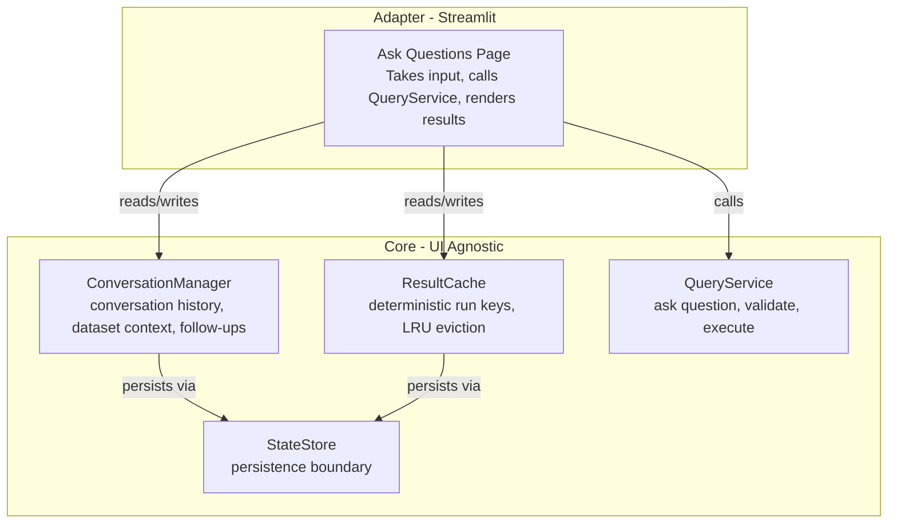

# Streamlit State Extraction Plan

## Goal

Decouple domain logic from Streamlit, converting the codebase from "Streamlit app" to "domain engine with Streamlit shell." This enables future UI ports (FastAPI, CLI, Jupyter) without rewriting core.

## Current Problem

Product logic is smeared across:

- [`st.session_state`](src/clinical_analytics/ui/pages/03_💬_Ask_Questions.py) - scattered state management
- UI event handlers - lifecycle assumptions
- Implicit coupling - every new feature multiplies dependencies

## Target Architecture




## Milestone A: State Extraction (Phase 3)

### A1: ConversationManager (Pure Python, Zero Streamlit)

**Extract from** [`Ask_Questions.py`](src/clinical_analytics/ui/pages/03_💬_Ask_Questions.py):

- `normalize_query()` (lines 141-158) - query normalization
- `canonicalize_scope()` (lines 160-228) - scope canonicalization
- Chat transcript management (session_state["chat"]) - conversation history
- Dataset context tracking (session_state["last_dataset_choice"]) - current dataset

**DO NOT Extract** (stays in Streamlit UI):

- `remember_run()` (lines 231-270) - belongs in ResultCache (see A2)
- UI workflow state (intent_signal, pending, use_nl_query) - UI-specific state machine
- State machine logic (lines 1537-1702) - UI orchestration, not domain logic

**Create**: `src/clinical_analytics/core/conversation_manager.py`**Interface**:

```python
@dataclass
class Message:
    id: str
    role: Literal["user", "assistant"]
    content: str
    timestamp: datetime
    run_key: str | None  # For result association

class ConversationManager:
    def add_message(role: str, content: str) -> str  # Returns message_id
    def get_transcript() -> list[Message]
    def get_current_dataset() -> str | None
    def set_dataset(dataset_id: str) -> None
    def get_active_query() -> str | None
    def set_active_query(query: str) -> None
    def get_follow_ups() -> list[str]
    def set_follow_ups(follow_ups: list[str]) -> None
    def clear() -> None
    def serialize() -> dict  # For persistence
    @classmethod
    def deserialize(data: dict) -> ConversationManager
```

**TDD Steps**:

1. Write failing tests for ConversationManager interface
2. Implement ConversationManager (extract logic from Ask_Questions.py)
3. Run tests, fix quality issues (format, lint, type-check)

**Tests**: `tests/core/test_conversation_manager.py`

- Test message addition, retrieval
- Test dataset context management
- Test query normalization (reuse existing logic)
- Test scope canonicalization
- Test serialization/deserialization

### A2: ResultCache (Pure Python, Deterministic Keys)

**Extract from** [`Ask_Questions.py`](src/clinical_analytics/ui/pages/03_💬_Ask_Questions.py):

- `remember_run()` (lines 231-270) - **caching AND run history tracking** (this function manages result cache LRU, not conversation)
- `cleanup_old_results()` (lines 272-296) - LRU eviction
- `MAX_STORED_RESULTS_PER_DATASET` constant (default: 50)
- Result storage pattern: `st.session_state[f"analysis_result:{dataset_version}:{run_key}"]`

**Create**: `src/clinical_analytics/core/result_cache.py`**Interface**:

```python
@dataclass
class CachedResult:
    run_key: str
    query: str
    result: dict  # Serializable analysis result
    timestamp: datetime
    dataset_version: str

class ResultCache:
    def __init__(max_size: int = 50)
    def get(run_key: str, dataset_version: str) -> CachedResult | None
    def put(result: CachedResult) -> None  # Auto-evicts oldest if at max
    def evict_oldest(dataset_version: str) -> None
    def clear(dataset_version: str | None = None) -> None
    def get_history(dataset_version: str) -> list[str]  # Run keys in LRU order
    def serialize() -> dict
    @classmethod
    def deserialize(data: dict) -> ResultCache
```

**TDD Steps**:

1. Write failing tests for ResultCache interface
2. Implement ResultCache (extract logic from Ask_Questions.py)
3. Run tests, fix quality issues

**Tests**: `tests/core/test_result_cache.py`

- Test get/put operations
- Test LRU eviction (deterministic)
- Test per-dataset isolation
- Test serialization/deserialization

### A3: QueryService (Extract Query Execution, Zero Streamlit)

**Problem**: QuestionEngine imports Streamlit (line 15: `import streamlit as st`), cannot be moved to core.**Solution**: Extract query execution logic from QuestionEngine, delegate NL parsing to NLQueryEngine (already UI-agnostic).**Extract from** [`QuestionEngine`](src/clinical_analytics/ui/components/question_engine.py) and [`Ask_Questions.py`](src/clinical_analytics/ui/pages/03_💬_Ask_Questions.py):

- Query execution logic (call NLQueryEngine.parse_query, validate, execute)
- Run key generation (currently in Ask_Questions.py via hashlib of query + scope)
- Reuse `AnalysisContext`, `AnalysisIntent` types from question_engine.py

**Create**: `src/clinical_analytics/core/query_service.py`**Interface**:

```python
from clinical_analytics.core.nl_query_engine import NLQueryEngine, QueryPlan
from clinical_analytics.core.semantic_layer import SemanticLayer
from clinical_analytics.ui.components.question_engine import AnalysisContext

@dataclass
class QueryResult:
    plan: QueryPlan  # From NLQueryEngine
    issues: list[dict]  # Validation issues (list of dicts with 'message', 'severity')
    result: dict | None  # Analysis result if executed
    confidence: float
    run_key: str
    context: AnalysisContext

class QueryService:
    def __init__(self, semantic_layer: SemanticLayer):
        """Initialize with semantic layer for query parsing."""
        self.semantic_layer = semantic_layer
        self.nl_engine = NLQueryEngine(semantic_layer)
    
    def ask(
        self,
        question: str,
        dataset_id: str,
        upload_id: str | None = None,
        dataset_version: str | None = None,
    ) -> QueryResult:
        """Parse and execute query, return structured result."""
        ...
    
    def _generate_run_key(self, query: str, scope: dict) -> str:
        """Generate deterministic run key from query + scope (extracted from Ask_Questions.py)."""
        ...
```

**TDD Steps**:

1. Write failing tests for QueryService interface
2. Implement QueryService (extract from QuestionEngine, delegate to NLQueryEngine, remove Streamlit dependencies)
3. Run tests, fix quality issues

**Tests**: `tests/core/test_query_service.py`

- Test query parsing (mock semantic layer and NLQueryEngine)
- Test run_key generation (deterministic for same query + scope)
- Test result structure (QueryResult dataclass)
- Test error handling (invalid queries, missing dataset)
- Verify zero Streamlit imports (grep check)

### A4: Refactor Streamlit UI to Use Core Classes

**Modify** [`Ask_Questions.py`](src/clinical_analytics/ui/pages/03_💬_Ask_Questions.py):**Replace**:

```python
# OLD: Direct st.session_state usage
st.session_state["messages"] = [...]
st.session_state["current_dataset"] = dataset_id
st.session_state[f"analysis_result:{dataset_version}:{run_key}"] = result
```

**With**:

```python
# NEW: Core classes stored in session_state for lifecycle only
if "conversation_manager" not in st.session_state:
    st.session_state["conversation_manager"] = ConversationManager()
if "result_cache" not in st.session_state:
    st.session_state["result_cache"] = ResultCache(max_size=50)

manager = st.session_state["conversation_manager"]
cache = st.session_state["result_cache"]
service = QueryService(semantic_layer)

# All state operations go through core objects
manager.add_message("user", query)
result = service.ask(query, dataset_id, upload_id, dataset_version)
cache.put(CachedResult(...))
```

**Acceptance Criteria**:

- `grep -r "st.session_state" src/clinical_analytics/core/` returns nothing
- `grep -r "import streamlit" src/clinical_analytics/core/` returns nothing
- Core test suite runs without Streamlit: `python -c "from clinical_analytics.core.conversation_manager import ConversationManager; from clinical_analytics.core.result_cache import ResultCache; from clinical_analytics.core.query_service import QueryService"`
- All existing UI tests pass
- Run: `make test-core PYTEST_ARGS="tests/core/test_conversation_manager.py tests/core/test_result_cache.py tests/core/test_query_service.py -xvs"`

## Milestone B: Minimal Persistence (Phase 4)

### B1: StateStore Interface (Pluggable Design)

**Create**: `src/clinical_analytics/core/state_store.py`**Interface**:

```python
@dataclass
class ConversationState:
    conversation_manager: ConversationManager
    result_cache: ResultCache
    dataset_id: str
    upload_id: str | None
    dataset_version: str
    last_updated: datetime

class StateStore(ABC):
    @abstractmethod
    def save(state: ConversationState) -> None
    
    @abstractmethod
    def load(upload_id: str, dataset_version: str) -> ConversationState | None
    
    @abstractmethod
    def list_sessions() -> list[tuple[str, str, datetime]]  # (upload_id, dataset_version, last_updated)

class FileStateStore(StateStore):
    """File-based backend: data/sessions/{upload_id}_{dataset_version}.json"""
    def __init__(base_path: Path = Path("data/sessions"))
```

**TDD Steps**:

1. Write failing tests for StateStore interface and FileStateStore
2. Implement StateStore ABC and FileStateStore
3. Run tests, fix quality issues

**Tests**: `tests/core/test_state_store.py`

- Test save/load operations
- Test session listing
- Test file I/O (use tmp_path fixture)
- Test error handling (missing files, corrupt JSON)

### B2: Integrate StateStore into Streamlit

**Modify** [`Ask_Questions.py`](src/clinical_analytics/ui/pages/03_💬_Ask_Questions.py):**Add**:

```python
# On page load: Restore state if exists
store = FileStateStore()
if saved_state := store.load(upload_id, dataset_version):
    st.session_state["conversation_manager"] = saved_state.conversation_manager
    st.session_state["result_cache"] = saved_state.result_cache

# On state change: Persist
def save_state():
    state = ConversationState(
        conversation_manager=st.session_state["conversation_manager"],
        result_cache=st.session_state["result_cache"],
        dataset_id=dataset_id,
        upload_id=upload_id,
        dataset_version=dataset_version,
        last_updated=datetime.now(),
    )
    store.save(state)

# Call save_state() after each query execution
```

**Acceptance Criteria**:

- Restart app, conversation + results persist for single dataset
- No UI logic changes required (transparent persistence)

## What We Are NOT Building (Deferred)

- FastAPI backend (not needed for MVP)
- Next.js frontend (not needed for MVP)
- SSE streaming (solve with progressive rendering in Streamlit)
- TypeScript contracts (no second codebase)
- Redis/DB sessions (file-based is fine)
- Multi-user sessions (single-user MVP)

## Testing Strategy

### Core Tests (Zero Streamlit Dependencies)

- `tests/core/test_conversation_manager.py`
- `tests/core/test_result_cache.py`
- `tests/core/test_query_service.py`
- `tests/core/test_state_store.py`

Run: `make test-core`

### UI Tests (With Streamlit)

- `tests/ui/test_ask_questions.py` (existing, verify no regressions)

Run: `make test-ui`

### Integration Test

- End-to-end: Ask question -> persist -> restart -> restore -> continue conversation
- Test file: `tests/integration/test_state_persistence.py`
- Simulates app restart by creating new StateStore, loading state, verifying conversation + cache restored

## TDD Workflow (Mandatory)

For each component:

1. Write failing test (Red)
2. Implement feature (Green)
3. Refactor and fix quality (Refactor)
4. Run module tests (`make test-core PYTEST_ARGS="tests/core/test_X.py -xvs"`)
5. Run quality gates (`make format && make lint-fix`)
6. Commit with tests

## Success Criteria

1. Core classes exist: ConversationManager, ResultCache, QueryService, StateStore
2. Zero Streamlit imports in core: `grep -r "import streamlit" src/clinical_analytics/core/` returns nothing
3. Core test suite runs without Streamlit installed
4. Streamlit UI refactored to use core classes (adapter pattern)
5. All existing tests pass (no regressions)
6. Persistence works: restart app, conversation + cache restored

## Timeline Estimate

- Milestone A (State Extraction): 2-3 days
- Milestone B (Persistence): 1 day
- Total: 3-4 days

## Next Steps After Completion

1. Core is UI-agnostic (proven)
2. Can port to FastAPI/CLI/Jupyter without rewriting core
3. Focus shifts to ADR004 (documentation ingestion, schema inference, AutoContext)

## Files to Create

- `src/clinical_analytics/core/conversation_manager.py`
- `src/clinical_analytics/core/result_cache.py`
- `src/clinical_analytics/core/query_service.py`
- `src/clinical_analytics/core/state_store.py`
- `tests/core/test_conversation_manager.py`
- `tests/core/test_result_cache.py`
- `tests/core/test_query_service.py`
- `tests/core/test_state_store.py`

## Files to Modify

- `src/clinical_analytics/ui/pages/03_💬_Ask_Questions.py` (refactor to use core classes)

## Type Definitions and Imports

**QueryService imports:**

- `QueryPlan` from `clinical_analytics.core.nl_query_engine`
- `SemanticLayer` from `clinical_analytics.core.semantic_layer`
- `AnalysisContext` from `clinical_analytics.ui.components.question_engine`

**Run key generation:**

- Extract from Ask_Questions.py (uses hashlib to hash query + canonicalized scope)
- Make deterministic: same query + scope = same run_key

**Validation issues:**

- `issues: list[dict] `where each dict has `{"message": str, "severity": str}`