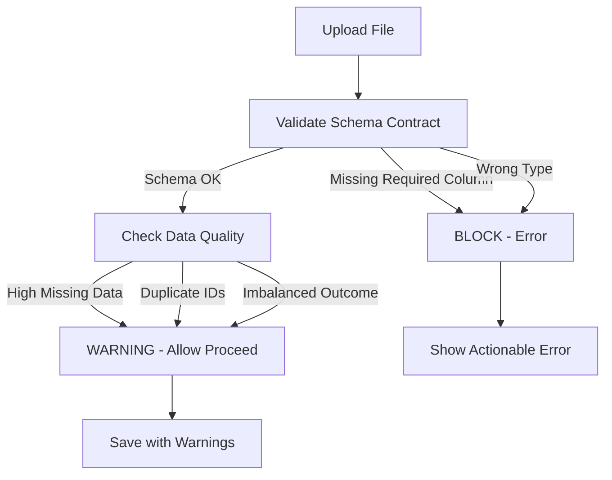

# V1 MVP UX Fixes: Page Gating and Upload Experience

## Overview

Fix four critical UX issues blocking the V1 MVP:

1. **Reorder and rename pages** - Upload as landing, then Summary, then Chat (user-friendly names)
2. **Gate legacy analysis pages** (old 2-6) with feature flag - keep all code, just disable in V1 MVP mode
3. **Add progress feedback** to single-file uploads (match ZIP upload experience)
4. **Make validation actionable** - only block on schema violations, not data quality issues doctors can't fix

## Current Problems

1. **Wrong page order**: Upload is page 1, but Analyze (with summary + chat) is page 7 - should be Upload → Summary → Chat
2. **Technical page names**: "Upload Data", "Analyze" - not user-friendly for doctors
3. **Pages 2-6 still visible**: Descriptive Stats, Compare Groups, Risk Factors, Survival, Correlations - these should be gated in V1 MVP
4. **No progress feedback**: Single-file uploads have no status updates during save (ZIP uploads have progress callbacks)
5. **Arbitrary validation thresholds**: Blocks on "15% missing data" which doctors can't fix, creates frustration
6. **Unfriendly file names**: Uploaded files stored as `user_upload_20251226_235709_db3af1fe.csv` instead of using friendly name from user input or original filename


## Critical Implementation Notes

**These fixes prevent "looks done in the doc, breaks in the app" issues:**

1. **Page gating**: Does NOT hide pages from sidebar - only stops execution. Gate must run before any expensive operations executed inside `main()`. Heavy imports at module scope must be moved inside `main()` after the gate.


2. **Progress feedback**: Use callback pattern with int 0-100 (not float 0.0-1.0). Call `progress_cb` inside loops/chunks for real progress. Staged reporting (0.2, 0.4, 0.6) is fine for MVP as long as each stage wraps meaningful work.


3. **Type validation**: Actually check types (patient_id not float, outcome binary, time columns parse to datetime). Don't just check existence.


4. **Duplicate IDs**: Default granularity to "unknown" for V1. Duplicates are WARNINGS unless user explicitly asserts "patient_level" (then BLOCKING). Real clinical CSVs commonly have duplicates (encounters, labs, meds).


5. **Warnings storage**: ONE canonical location: `metadata["validation"]["quality_warnings"]`. Everything else reads from this, never writes to multiple places.


6. **get_data_quality_warnings()**: Keep it CHEAP - read from `self.config` only (already in memory). Do NOT call `get_dataset_info()` or trigger disk reads.


## Architecture Changes


### Feature Flag Addition

Add `V1_MVP_MODE` flag to [`src/clinical_analytics/ui/config.py`](src/clinical_analytics/ui/config.py):

```python

# V1 MVP: Gate legacy analysis pages (2-6)

# Set V1_MVP_MODE=false to show all pages (for development/testing)

V1_MVP_MODE = os.getenv("V1_MVP_MODE", "true").lower() == "true"

```


### Validation Strategy Change

**Current**: Blocks on data quality issues (missing data %, duplicate IDs, imbalanced outcomes)**New**: Only block on schema contract violations (required columns, types). Data quality issues become warnings.




## Implementation Tasks


### Task 1: Reorder and Rename Pages for User-Friendly Navigation

**Goal**: Make Upload the landing page, then Summary, then Chat. Use non-technical names.**Current Structure**:

- `app.py` - Landing page (dataset selection)
- `pages/1_📤_Upload_Data.py` - Upload
- `pages/7_🔬_Analyze.py` - Analyze (has both summary and chat)

**New Structure**:

- `app.py` - Conditional redirect (V1_MVP_MODE=true → Upload, else dataset selection)
- `pages/1_📤_Add_Your_Data.py` - Upload (renamed from Upload_Data)
- `pages/2_📊_Your_Dataset.py` - Summary (new, extract from Analyze)
- `pages/3_💬_Ask_Questions.py` - Chat (renamed from Analyze, chat-only)
- `pages/20_📊_Descriptive_Stats.py` - Legacy (renamed from 2_)
- `pages/21_📈_Compare_Groups.py` - Legacy (renamed from 3_)
- `pages/22_🎯_Risk_Factors.py` - Legacy (renamed from 4_)
- `pages/23_⏱️_Survival_Analysis.py` - Legacy (renamed from 5_)
- `pages/24_🔗_Correlations.py` - Legacy (renamed from 6_)

**Critical**: Streamlit page ordering is filename-based. Must renumber legacy pages to avoid collision with new pages 2-3.**Files to modify**:

1. **`[src/clinical_analytics/ui/app.py`](src/clinical_analytics/ui/app.py)** - Conditional redirect

**Change**: Redirect only in V1_MVP_MODE, otherwise preserve dataset selection:

```python

from clinical_analytics.ui.config import V1_MVP_MODE


def main():

    st.set_page_config(page_title="Clinical Analytics Platform", page_icon="🏥", layout="wide")

    

    # V1 MVP: Redirect to Upload page (landing page)

    if V1_MVP_MODE:

        st.switch_page("pages/1_📤_Add_Your_Data.py")

        return

    

    # Development/testing mode: Keep existing dataset selection

    # ... ALL EXISTING CODE BELOW - preserve dataset selection ...

```

**Note**: This preserves dataset selection for dev/testing when `V1_MVP_MODE=false`. If you hard redirect unconditionally, you're functionally deleting the dataset selection code.

2. **Rename Upload page**: `1_📤_Upload_Data.py` → `1_📤_Add_Your_Data.py`

**Change**: Update page title and icon:

```python

st.set_page_config(page_title="Add Your Data | Clinical Analytics", page_icon="📤", layout="wide")

st.title("📤 Add Your Data")

st.markdown("Upload your clinical dataset - no coding required!")

```


3. **Create Summary page**: New file `2_📊_Your_Dataset.py`

**Content**: Extract summary/overview functionality from Analyze page:

- Dataset selection
- Semantic Scope sidebar (already in Analyze)
- Descriptive statistics overview
- Data quality warnings display
- Basic metrics (patient count, outcome prevalence, etc.)

**Pattern** (extract from `7_🔬_Analyze.py` lines 357-442):

```python

"""

Your Dataset - Overview and Summary


See your data at a glance: patient counts, outcomes, data quality.

"""


import streamlit as st

# ... imports ...


st.set_page_config(page_title="Your Dataset | Clinical Analytics", page_icon="📊", layout="wide")


def main():

    st.title("📊 Your Dataset")

    st.markdown("""

    Overview of your dataset: patient counts, outcomes, and data quality.

    """)

    

    # Dataset selection (same as Analyze page)

    # ... dataset loading code from Analyze ...

    

    # Show summary metrics

    # ... descriptive stats from Analyze ...

    

    # Show data quality warnings if available

    if hasattr(dataset, 'semantic'):

        warnings = dataset.semantic.get_data_quality_warnings()

        if warnings:

            st.warning(f"⚠️ {len(warnings)} data quality warning(s) found")

            with st.expander("View Warnings"):

                for warning in warnings:

                    st.warning(f"**{warning['type']}**: {warning['message']}")

```


4. **Rename and refactor Analyze page**: `7_🔬_Analyze.py` → `3_💬_Ask_Questions.py`

**Change**:

- Remove summary/overview content (move to Summary page)
- Keep only chat/question engine functionality
- Update title and description:
```python

st.set_page_config(page_title="Ask Questions | Clinical Analytics", page_icon="💬", layout="wide")


def main():

    st.title("💬 Ask Questions")

    st.markdown("""

    Ask questions about your data in plain English. I'll figure out the right analysis and explain the results.

    """)

    

    # Dataset selection (same as before)

    # ... dataset loading ...

    

    # Chat/question engine only (remove summary/descriptive stats)

    # ... question engine code ...

```


**Note**: All existing code in Analyze page is preserved - just split into two pages.

### Task 2: Add V1 MVP Mode Flag

**File**: [`src/clinical_analytics/ui/config.py`](src/clinical_analytics/ui/config.py)Add feature flag (keep all existing code):

```python

# V1 MVP: Gate legacy analysis pages (2-6)

# Set V1_MVP_MODE=false to show all pages (for development/testing)

V1_MVP_MODE = os.getenv("V1_MVP_MODE", "true").lower() == "true"

```


### Task 3: Renumber and Gate Legacy Pages (Old 2-6) - Keep All Code

**P0 Fix**: Streamlit page ordering is filename-based. Cannot have new pages 2-3 while keeping legacy pages 2-6. Must renumber legacy pages first.**Step 1: Renumber Legacy Pages** (file moves, no code changes):

- `pages/2_📊_Descriptive_Stats.py` → `pages/20_📊_Descriptive_Stats.py`
- `pages/3_📈_Compare_Groups.py` → `pages/21_📈_Compare_Groups.py`
- `pages/4_🎯_Risk_Factors.py` → `pages/22_🎯_Risk_Factors.py`
- `pages/5_⏱️_Survival_Analysis.py` → `pages/23_⏱️_Survival_Analysis.py`
- `pages/6_🔗_Correlations.py` → `pages/24_🔗_Correlations.py`

**Step 2: Gate Legacy Pages** (add gate + move heavy imports)**Important Note**: This gate does NOT hide pages from the sidebar. It only stops execution after the user clicks them. Pages remain visible but show a redirect message.**Critical P0 Fix**: Module-level imports execute BEFORE `main()` is called. If legacy pages import heavy stuff at module scope, the gate in `main()` is too late.**Files to modify** (after renumbering):

- `pages/20_📊_Descriptive_Stats.py`
- `pages/21_📈_Compare_Groups.py`
- `pages/22_🎯_Risk_Factors.py`
- `pages/23_⏱️_Survival_Analysis.py`
- `pages/24_🔗_Correlations.py`

**Pattern** (two-part fix):**Part A: Move heavy imports inside main()** (if they exist at module scope):

```python

# At module scope: Keep only lightweight imports

import streamlit as st

from clinical_analytics.ui.config import V1_MVP_MODE


# DO NOT import heavy stuff here (pandas, datasets, etc.)

# Move those imports inside main() after the gate


def main():

    # Gate: V1 MVP mode disables legacy pages

    # MUST run before any expensive operations

    if V1_MVP_MODE:

        st.info("🚧 This page is disabled in V1 MVP mode. Use the **Ask Questions** page for all analysis.")

        st.markdown("""

        **V1 MVP focuses on:**

    - Upload your data

    - Ask questions in natural language

    - Get answers with SQL preview

        

        All analysis is available through the Chat interface on the Ask Questions page.

        """)

        if st.button("Go to Ask Questions Page"):

            st.switch_page("pages/3_💬_Ask_Questions.py")

        st.stop()

    

    # NOW do heavy imports (after gate)

    import pandas as pd

    from clinical_analytics.core.registry import DatasetRegistry

    # ... other heavy imports ...

    

    # ... rest of existing main() function unchanged ...

```

**Part B: If no heavy imports at module scope**, just add gate at start of `main()`:

```python

def main():

    # Gate: V1 MVP mode disables legacy pages

    from clinical_analytics.ui.config import V1_MVP_MODE

    

    if V1_MVP_MODE:

        st.info("🚧 This page is disabled in V1 MVP mode. Use the **Ask Questions** page for all analysis.")

        st.markdown("""

        **V1 MVP focuses on:**

    - Upload your data

    - Ask questions in natural language

    - Get answers with SQL preview

        

        All analysis is available through the Chat interface on the Ask Questions page.

        """)

        if st.button("Go to Ask Questions Page"):

            st.switch_page("pages/3_💬_Ask_Questions.py")

        st.stop()

    

    # ... rest of existing main() function unchanged ...

```

**Critical**:

- Gate must run before any expensive operations executed inside `main()`
- Heavy imports at module scope must be moved inside `main()` after the gate
- All existing code below remains untouched


### Task 4: Add Real Progress Feedback to Single-File Uploads

**Critical**: Progress must be REAL, not staged. The user will stare at "Saving dataset..." while `save_upload()` does real work. We need a callback pattern.**Files to modify**:

1. **`[src/clinical_analytics/ui/storage/user_datasets.py`](src/clinical_analytics/ui/storage/user_datasets.py)** - Add progress callback to `save_upload()`

**Location**: `save_upload()` method signature and implementation**Change**: Add optional progress callback parameter:

```python

    def save_upload(

        self, 

        file_bytes: bytes, 

        original_filename: str, 

        metadata: dict[str, Any],

        progress_cb: Callable[[int, str], None] | None = None

    ) -> tuple[bool, str, str | None]:

    """

    Save uploaded file with security validation.

    

    Args:

        file_bytes: File content

        original_filename: Original filename

        metadata: Upload metadata (variable types, mappings, etc.)

        progress_cb: Optional callback(progress: int, message: str) for UI updates (0-100, not 0.0-1.0)

    

    Returns:

        Tuple of (success, message, upload_id)

    """

    # Security validation

    if progress_cb:

        progress_cb(10, "Validating file security...")

    

    valid, error = UploadSecurityValidator.validate(original_filename, file_bytes)

    if not valid:

        if progress_cb:

            progress_cb(100, f"Validation failed: {error}")

        return False, error, None


    # Generate upload ID

    if progress_cb:

        progress_cb(20, "Preparing upload...")

    

    upload_id = self.generate_upload_id(original_filename)


    try:

        # File conversion with progress inside loops

        if progress_cb:

            progress_cb(30, "Reading file...")

        

        # ... existing file conversion code ...

        # If there's a loop (e.g., chunk processing), call progress_cb inside it:

        # for chunk_idx, chunk in enumerate(chunks):

        #     process(chunk)

        #     if progress_cb:

        #         progress = 30 + int((chunk_idx / len(chunks)) * 20)

        #         progress_cb(progress, f"Processing chunk {chunk_idx + 1}/{len(chunks)}...")

        

        if progress_cb:

            progress_cb(50, "Converting file format...")

        

        # ... file reading/conversion ...

        

        if progress_cb:

            progress_cb(60, "Validating schema contract...")

        

        # ... schema validation ...

        

        if progress_cb:

            progress_cb(80, "Saving metadata...")

        

        # Save metadata

        full_metadata = {

            # ... existing metadata ...

        }

        

        metadata_path = self.metadata_dir / f"{upload_id}.json"

        with open(metadata_path, "w") as f:

            json.dump(full_metadata, f, indent=2)

        

        if progress_cb:

            progress_cb(100, "Upload complete!")


        return True, f"Upload successful: {upload_id}", upload_id


    except Exception as e:

        if progress_cb:

            progress_cb(100, f"Error: {str(e)}")

        return False, f"Error saving upload: {str(e)}", None

```


2. **`[src/clinical_analytics/ui/pages/1_📤_Upload_Data.py`](src/clinical_analytics/ui/pages/1_📤_Upload_Data.py)** - Use callback in UI

**Location**: `render_review_step()` function, around line 448**Change**: Pass progress callback to `save_upload()`:

```python

if st.button("💾 Save Dataset", disabled=not can_save, type="primary"):

    # Create progress tracking UI elements

    progress_bar = st.progress(0)

    status_text = st.empty()

    log_expander = st.expander("📋 Processing Log", expanded=True)

    log_container = log_expander.container()

    

    def progress_callback(progress: int, message: str) -> None:

        """Update progress UI with real-time status."""

        # st.progress() expects int 0-100, not float 0.0-1.0

        progress_bar.progress(progress)

        status_text.info(f"🔄 {message}")

        with log_container:

            st.text(f"→ {message}")

    

    try:

        metadata = {

            "dataset_name": dataset_name,

            "variable_types": variable_info,

            "variable_mapping": mapping,

            "validation_result": validation_result,

        }

        

        # Pass callback to get real progress updates

        success, message, upload_id = storage.save_upload(

            file_bytes=st.session_state["uploaded_bytes"],

            original_filename=st.session_state["uploaded_filename"],

            metadata=metadata,

            progress_cb=progress_callback,  # Real progress, not staged

        )

        

        if success:

            status_text.success("✅ Dataset saved successfully!")

            with log_container:

                st.success("✅ Processing complete!")

            st.balloons()

            # ... existing success message code unchanged ...

        else:

            status_text.error(f"❌ {message}")

            with log_container:

                st.error(f"❌ Save failed: {message}")

    

    except Exception as e:

        import traceback

        progress_bar.progress(100)  # Use int, not float

        status_text.error(f"❌ Error: {str(e)}")

        with log_container:

            st.error(f"❌ Error during processing: {str(e)}")

            st.code(traceback.format_exc())

```


### Task 5: Refactor Validation to Schema-Contract Only with Type Checks

**File**: [`src/clinical_analytics/ui/components/data_validator.py`](src/clinical_analytics/ui/components/data_validator.py)**Strategy**: Split validation into two categories with ACTUAL type checks:

1. **Schema Contract Violations** (BLOCK - errors): Missing required columns, wrong types, NULL patient IDs
2. **Data Quality Issues** (WARN - allow proceed): Missing data %, duplicate IDs (tied to granularity), imbalanced outcomes

**Changes**:

1. **Modify `validate_complete()`** to separate schema vs quality with REAL type validation:
```python

@classmethod

def validate_complete(

    cls, 

    df: pd.DataFrame, 

    id_column: str = None, 

    outcome_column: str = None,

    granularity: str = "unknown"  # NEW: default to unknown (V1 MVP)

) -> dict:

    """

    Validate dataset with schema-first approach.

    

    Args:

        df: DataFrame to validate

        id_column: Patient ID column name

        outcome_column: Outcome column name

        granularity: Detected/inferred granularity ("patient_level", "encounter_level", "event_level", "unknown")

        

    Note: Default granularity is "unknown" for V1. Duplicates are warnings unless explicitly patient_level.

    

    Returns:

        {

            "is_valid": bool,  # True if schema OK (can proceed)

            "schema_errors": list,  # Blocking errors (schema violations)

            "quality_warnings": list,  # Non-blocking warnings (data quality)

            "issues": list,  # Combined for backward compatibility

            "summary": {"errors": int, "warnings": int}

        }

    """

    schema_errors = []

    quality_warnings = []

    

    # SCHEMA CONTRACT CHECKS (BLOCKING)

    

    # 1. Missing required columns

    if id_column and id_column not in df.columns:

        schema_errors.append({

            "severity": "error",

            "type": "missing_column",

            "message": f"Required column '{id_column}' not found. Please map a column to Patient ID.",

            "actionable": True,

        })

    

    # 2. Type checks (REAL validation, not just existence)

    if id_column and id_column in df.columns:

        id_col = df[id_column]

        

        # NULL check

        if id_col.isna().any():

            null_count = id_col.isna().sum()

            schema_errors.append({

                "severity": "error",

                "type": "null_patient_id",

                "message": f"Patient ID column has {null_count} NULL values. Every row must have a patient ID.",

                "actionable": True,

            })

        

        # Type check: patient_id must not be float-ish (common CSV parsing footgun)

        if pd.api.types.is_float_dtype(id_col):

            # Check if it's actually float (has decimals) vs integer stored as float

            if (id_col.dropna() % 1 != 0).any():

                schema_errors.append({

                    "severity": "error",

                    "type": "invalid_patient_id_type",

                    "message": f"Patient ID column is float type with decimal values. Patient IDs must be integers or strings.",

                    "actionable": True,

                })

    

    # 3. Outcome column type check

    if outcome_column and outcome_column in df.columns:

        outcome_col = df[outcome_column]

        

        # Must be boolean-ish, numeric {0,1}, or {yes/no} after normalization

        if pd.api.types.is_object_dtype(outcome_col):

            # Check if it's yes/no or similar

            unique_vals = outcome_col.dropna().unique()

            if len(unique_vals) > 2:

                schema_errors.append({

                    "severity": "error",

                    "type": "invalid_outcome_type",

                    "message": f"Outcome column has {len(unique_vals)} unique values. Expected binary (0/1, yes/no, true/false).",

                    "actionable": True,

                })

        elif not pd.api.types.is_numeric_dtype(outcome_col):

            schema_errors.append({

                "severity": "error",

                "type": "invalid_outcome_type",

                "message": f"Outcome column must be numeric or boolean. Got {outcome_col.dtype}.",

                "actionable": True,

            })

        elif pd.api.types.is_numeric_dtype(outcome_col):

            # Check if binary (0/1 or close)

            unique_vals = outcome_col.dropna().unique()

            if len(unique_vals) > 2:

                # Allow if it's categorical numeric (e.g., 0, 1, 2) but warn

                quality_warnings.append({

                    "severity": "warning",

                    "type": "non_binary_outcome",

                    "message": f"Outcome has {len(unique_vals)} unique values. Most analyses expect binary outcomes.",

                    "actionable": False,

                })

    

    # 4. Time column type check (if time_zero is mapped)

    # This would be in variable_mapping, check if time_zero column exists and parses to datetime

    

    # DATA QUALITY CHECKS (WARNINGS - NON-BLOCKING)

    

    # Duplicate IDs: BLOCKING only if explicitly patient-level, WARNING otherwise

    # V1 MVP: Default to "unknown" - duplicates are common in clinical CSVs (encounters, labs, meds)

    if id_column and id_column in df.columns:

        duplicates = df[id_column].duplicated()

        if duplicates.any():

            n_duplicates = duplicates.sum()

            

            if granularity == "patient_level":

                # BLOCKING: User explicitly asserted "1 row per patient" - duplicates violate contract

                schema_errors.append({

                    "severity": "error",

                    "type": "duplicate_patient_ids",

                    "message": f"Found {n_duplicates} duplicate patient IDs. Patient-level cohorts require unique IDs. If your data has multiple rows per patient (encounters, labs, etc.), select encounter-level or event-level granularity.",

                    "actionable": True,

                })

            else:

                # WARNING: Unknown/encounter/event-level - duplicates are expected

                quality_warnings.append({

                    "severity": "warning",

                    "type": "duplicate_ids",

                    "message": f"Found {n_duplicates} duplicate IDs. This is normal for {granularity} granularity (multiple encounters/labs per patient). Verify this matches your data structure.",

                    "actionable": False,

                })

    

    # Missing data becomes warning, not error

    for col in df.columns:

        pct_missing = (df[col].isna().sum() / len(df)) * 100

        if pct_missing >= 30:

            quality_warnings.append({

                "severity": "warning",

                "type": "high_missing",

                "message": f"Column '{col}' has {pct_missing:.1f}% missing data. Consider excluding or imputing.",

                "actionable": True,

            })

    

    # Schema valid = no schema errors (quality warnings don't block)

    is_valid = len(schema_errors) == 0

    

    return {

        "is_valid": is_valid,

        "schema_errors": schema_errors,

        "quality_warnings": quality_warnings,

        "issues": schema_errors + quality_warnings,  # For backward compatibility

        "summary": {

            "errors": len(schema_errors),

            "warnings": len(quality_warnings),

        }

    }

```


**Note**: The `granularity` parameter should come from the variable mapping/detection step. Default to "unknown" for V1 MVP (duplicates are warnings unless user explicitly asserts patient-level).

2. **Update validation call in Upload_Data.py** to pass granularity:

**Location**: `render_review_step()` function, around line 394**Change**: Pass granularity parameter to validation (default to "unknown"):

```python

# Get inferred granularity from variable detection (default to unknown for V1)

granularity = "unknown"  # Default for V1 MVP - duplicates are warnings unless explicitly patient-level

# TODO: Extract from variable_info or mapping if user explicitly selects granularity


# Run final validation with mapping and granularity

validation_result = DataQualityValidator.validate_complete(

    df, 

    id_column=patient_id_col, 

    outcome_column=outcome_col,

    granularity=granularity  # NEW: for duplicate ID logic

)

```


3. **Update `render_review_step()` in Upload_Data.py** to handle new structure (keep all existing code, just update validation display):
```python

# Show validation results

if validation_result["is_valid"]:

    st.success("✅ Schema contract validated! Dataset is ready to use.")

    if validation_result["summary"]["warnings"] > 0:

        st.info(f"ℹ️ {validation_result['summary']['warnings']} data quality warning(s) found. You can proceed, but review warnings below.")

else:

    st.error(f"❌ {validation_result['summary']['errors']} schema error(s) found. Please fix before saving.")


# Show schema errors (blocking) - NEW

if validation_result.get("schema_errors"):

    with st.expander(f"❌ Schema Errors ({len(validation_result['schema_errors'])})", expanded=True):

        for error in validation_result["schema_errors"]:

            st.error(f"**{error['type']}**: {error['message']}")

            if error.get("actionable"):

                st.caption("💡 This can be fixed by mapping a different column or cleaning your data.")


# Show quality warnings (non-blocking) - NEW

if validation_result.get("quality_warnings"):

    with st.expander(f"⚠️ Data Quality Warnings ({len(validation_result['quality_warnings'])})", expanded=False):

        for warning in validation_result["quality_warnings"]:

            st.warning(f"**{warning['type']}**: {warning['message']}")

            if warning.get("actionable"):

                st.caption("💡 You can exclude this column in the mapping step or proceed anyway.")


# Keep existing issues display for backward compatibility

if validation_result.get("issues") and not (validation_result.get("schema_errors") or validation_result.get("quality_warnings")):

    # Fallback to old format if new format not available

    with st.expander(f"View Issues ({len(validation_result['issues'])})"):

        for issue in validation_result["issues"]:

            severity = issue["severity"]

            if severity == "error":

                st.error(f"❌ **{issue['type']}**: {issue['message']}")

            else:

                st.warning(f"⚠️ **{issue['type']}**: {issue['message']}")

```


### Task 6: Update Save Logic to Only Check Schema Errors

**File**: [`src/clinical_analytics/ui/pages/1_📤_Upload_Data.py`](src/clinical_analytics/ui/pages/1_📤_Upload_Data.py)**Location**: `render_review_step()`, line 446**Change** (keep existing logic, just update comment):

```python

# Can only save if no schema errors (warnings don't block)

can_save = validation_result["summary"]["errors"] == 0 and dataset_name.strip()

```

This already works with the new validation structure (errors = schema_errors only).

### Task 7: Use Friendly Filenames for Uploaded Files

**Problem**: Files are stored as `user_upload_20251226_235709_db3af1fe.csv` instead of using the friendly `dataset_name` the user provided (or original filename).**Goal**: Store files with friendly, sanitized names while keeping `upload_id` for metadata tracking.**File**: [`src/clinical_analytics/ui/storage/user_datasets.py`](src/clinical_analytics/ui/storage/user_datasets.py)**Location**: `save_upload()` method, around lines 320-342**Change**: Use friendly filename (from `dataset_name` in metadata, or fallback to sanitized original filename):

```python

# Extract dataset_name from metadata (user-provided friendly name)

dataset_name = metadata.get("dataset_name")

if not dataset_name:

    # Fallback to sanitized original filename (without extension)

    dataset_name = UploadSecurityValidator.sanitize_filename(original_filename)

    dataset_name = Path(dataset_name).stem  # Remove extension


# Sanitize the friendly name for filesystem safety

safe_dataset_name = UploadSecurityValidator.sanitize_filename(dataset_name)

# Ensure it's not empty and doesn't conflict

if not safe_dataset_name or safe_dataset_name == ".":

    safe_dataset_name = "dataset"


# Use friendly name for CSV file (still keep upload_id for metadata)

csv_filename = f"{safe_dataset_name}.csv"

csv_path = self.raw_dir / csv_filename


# Handle filename conflicts (if user re-uploads same name)

if csv_path.exists():

    # Append upload_id suffix to make unique

    csv_filename = f"{safe_dataset_name}_{upload_id}.csv"

    csv_path = self.raw_dir / csv_filename


# Now save with friendly name

if file_ext == ".csv":

    csv_path.write_bytes(file_bytes)

    df = pd.read_csv(csv_path)

elif file_ext in {".xlsx", ".xls"}:

    import io

    df = pd.read_excel(io.BytesIO(file_bytes))

    df.to_csv(csv_path, index=False)

elif file_ext == ".sav":

    import io

    import pyreadstat

    df, meta = pyreadstat.read_sav(io.BytesIO(file_bytes))

    df.to_csv(csv_path, index=False)

else:

    return False, f"Unsupported file type: {file_ext}", None


# Store the friendly filename in metadata for later retrieval

full_metadata = {

    "upload_id": upload_id,

    "original_filename": safe_filename,

    "stored_filename": csv_filename,  # NEW: friendly name used for storage

    "dataset_name": dataset_name,  # User-provided friendly name

    # ... rest of metadata ...

}

```

**Also update `get_upload_data()` and `UploadedDataset.load()`** to use friendly filename:**File 1**: [`src/clinical_analytics/ui/storage/user_datasets.py`](src/clinical_analytics/ui/storage/user_datasets.py)**Location**: `get_upload_data()` method, around line 450**Change**: Load from friendly filename if available in metadata:

```python

def get_upload_data(self, upload_id: str) -> pd.DataFrame | None:

    """

    Load uploaded dataset.

    

    Uses friendly filename from metadata if available, falls back to upload_id.

    

    Args:

        upload_id: Upload identifier

    

    Returns:

        DataFrame or None if not found

    """

    # Get metadata to check for friendly filename

    metadata = self.get_upload_metadata(upload_id)

    if metadata and "stored_filename" in metadata:

        csv_path = self.raw_dir / metadata["stored_filename"]

    else:

        # Fallback to old naming convention (for backward compatibility)

        csv_path = self.raw_dir / f"{upload_id}.csv"

    

    if not csv_path.exists():

        return None

    

    return pd.read_csv(csv_path)

```

**File 2**: [`src/clinical_analytics/datasets/uploaded/definition.py`](src/clinical_analytics/datasets/uploaded/definition.py)**Location**: `validate()` and `load()` methods, around lines 60-75**Change**: Update both methods to use friendly filename:

```python

def validate(self) -> bool:

    """

    Check if upload data exists and is valid.

    

    Returns:

        True if data is accessible

    """

    # Try friendly filename first, fallback to upload_id

    stored_filename = self.metadata.get("stored_filename")

    if stored_filename:

        csv_path = self.storage.raw_dir / stored_filename

    else:

        # Fallback to old naming convention (for backward compatibility)

        csv_path = self.storage.raw_dir / f"{self.upload_id}.csv"

    

    return csv_path.exists()


def load(self) -> None:

    """

    Load uploaded data into memory.

    """

    if not self.validate():

        raise FileNotFoundError(f"Upload data not found: {self.upload_id}")

    

    self.data = self.storage.get_upload_data(self.upload_id)

    

    if self.data is None:

        raise ValueError(f"Failed to load upload data: {self.upload_id}")

```

**Note**:

- The `upload_id` is still used for metadata file naming (`{upload_id}.json`), but the actual CSV file uses the friendly name
- This makes it easier to identify files during testing
- For V1 MVP, assume all datasets are user uploads (until MIMIC connector works)
- Friendly naming makes it easier to identify and re-upload test datasets without confusion


### Task 8: Save Quality Warnings as Metadata for Semantic Layer

**Goal**: Store validation warnings in ONE canonical location. Don't store them twice.**Canonical Location**: `metadata["validation"]["quality_warnings"]`**Files to modify**:

1. **`[src/clinical_analytics/ui/storage/user_datasets.py`](src/clinical_analytics/ui/storage/user_datasets.py)** - Save warnings in canonical location

**Location**: `save_upload()` method, around line 410-420**Change**: Store validation result in canonical structure (NO DUPLICATION):

```python

# Save metadata (around line 410)

# Extract validation_result from metadata BEFORE merging

validation_result = metadata.pop("validation_result", None)


full_metadata = {

    "upload_id": upload_id,

    "original_filename": safe_filename,

    "upload_timestamp": datetime.now().isoformat(),

    "file_size_bytes": len(file_bytes),

    "file_format": file_ext.lstrip("."),

    "row_count": len(df),

    "column_count": len(df.columns),

    "columns": list(df.columns),

    "schema_validation": schema_validation_result,

    **metadata,  # Rest of metadata (without validation_result)

}


# Canonical location: full_metadata["validation"]

# SINGLE SOURCE OF TRUTH - everything else reads from here

if validation_result:

    full_metadata["validation"] = {

        "schema_errors": validation_result.get("schema_errors", []),

        "quality_warnings": validation_result.get("quality_warnings", []),

        "summary": validation_result.get("summary", {}),

        "raw": validation_result,  # Keep raw for backward compatibility if needed

    }

```

**Critical**: Use `metadata.pop("validation_result")` to extract it BEFORE merging, then store only in `full_metadata["validation"]`. This prevents duplication.

2. **`[src/clinical_analytics/datasets/uploaded/definition.py`](src/clinical_analytics/datasets/uploaded/definition.py)** - Expose quality warnings from canonical location

**Location**: `get_info()` method, around line 304-320**Change**: Read from canonical location only:

```python

def get_info(self) -> dict[str, Any]:

    """

    Get dataset information.

    

    Returns:

        Dictionary with dataset metadata including data quality warnings

    """

    info = {

        "upload_id": self.upload_id,

        "name": self.name,

        "uploaded_at": self.metadata.get("upload_timestamp"),

        "original_filename": self.metadata.get("original_filename"),

        "row_count": self.metadata.get("row_count"),

        "column_count": self.metadata.get("column_count"),

        "columns": self.metadata.get("columns"),

        "variable_mapping": self.metadata.get("variable_mapping"),

    }

    

    # Read from canonical location: metadata["validation"]["quality_warnings"]

    if "validation" in self.metadata:

        validation = self.metadata["validation"]

        if "quality_warnings" in validation:

            info["data_quality_warnings"] = validation["quality_warnings"]

    

    return info

```


3. **`[src/clinical_analytics/core/semantic.py`](src/clinical_analytics/core/semantic.py)** - Add method to get data quality warnings (KEEP IT CHEAP)

**Location**: After `get_dataset_info()` method, around line 575**Change**: Add method that reads from config only (no expensive operations):

```python

def get_data_quality_warnings(self) -> list[dict[str, Any]]:

    """

    Get data quality warnings for this dataset.

    

    For uploaded datasets, this returns validation warnings from upload.

    For built-in datasets, returns empty list (no warnings tracked yet).

    

    IMPORTANT: This method is CHEAP - no disk reads, no expensive operations.

    Warnings are already in self.config from initialization.

    

    Returns:

        List of warning dictionaries with type, message, actionable flag

    """

    # Read from config only (already loaded, no disk access)

    # Canonical location: config["validation"]["quality_warnings"]

    if "validation" in self.config:

        validation = self.config.get("validation", {})

        return validation.get("quality_warnings", [])

    

    # Fallback: check old location for backward compatibility

    if "data_quality_warnings" in self.config:

        return self.config["data_quality_warnings"]

    

    # Built-in datasets: no warnings

    return []

```

**Critical**: Do NOT call `get_dataset_info()` here - it may trigger expensive operations. Read from `self.config` only (already in memory).

4. **`[src/clinical_analytics/datasets/uploaded/definition.py`](src/clinical_analytics/datasets/uploaded/definition.py)** - Include warnings in semantic layer config from canonical location

**Location**: `_build_config_from_inferred_schema()` method, around line 283-302**Change**: Read from canonical location only:

```python

def _build_config_from_inferred_schema(self, inferred_schema: dict[str, Any]) -> dict[str, Any]:

    """Build semantic layer config from inferred schema."""

    outcomes = inferred_schema.get("outcomes", {})

    default_outcome = list(outcomes.keys())[0] if outcomes else None


    config = {

        "name": self.name,

        "display_name": self.metadata.get("original_filename", self.name),

        "status": "available",

        "init_params": {},  # Will be set to absolute CSV path

        "column_mapping": inferred_schema.get("column_mapping", {}),

        "outcomes": outcomes,

        "time_zero": inferred_schema.get("time_zero", {}),

        "analysis": {

            "default_outcome": default_outcome,

            "default_predictors": inferred_schema.get("predictors", []),

            "categorical_variables": inferred_schema.get("categorical_columns", []),

        },

    }

    

    # Read from canonical location: metadata["validation"]

    # This is the SINGLE SOURCE OF TRUTH - everything else references this

    if "validation" in self.metadata:

        config["validation"] = self.metadata["validation"]

    

    return config

```

**Critical**: Only ONE canonical location: `metadata["validation"]["quality_warnings"]`. All other code reads from this location, never writes to multiple places.**Result**: The semantic layer can now access data quality warnings via `semantic.get_data_quality_warnings()` (cheap, reads from config only), and the LLM in the chat interface can use these to help users understand data quality issues when answering questions.**Storage Pattern**:

- **Canonical location**: `metadata["validation"]["quality_warnings"]` (single source of truth)
- **Semantic layer config**: `config["validation"]["quality_warnings"]` (copied from metadata during initialization)
- **No duplication**: All code reads from these locations, never writes to multiple places


## Testing Strategy


1. **Page gating**: Set `V1_MVP_MODE=true`, verify pages 2-6 show redirect message and stop execution
2. **Page enabling**: Set `V1_MVP_MODE=false`, verify pages 2-6 work normally
3. **Progress feedback**: Upload single CSV, verify progress bar and status updates appear
4. **Validation**: 


- Upload with missing patient_id column → should BLOCK
- Upload with 50% missing data → should WARN but allow proceed
- Upload with duplicate IDs → should WARN but allow proceed (granularity="unknown" by default)


5. **Friendly filenames**:

- Upload file "my_data.csv" with dataset_name "Test Dataset" → stored as "Test_Dataset.csv" (or "Test_Dataset_{upload_id}.csv" if conflict)
- Re-upload same name → handles conflict gracefully
- Files in data/uploads/raw are identifiable by friendly name


## Files Modified

| File | Changes | Code Deleted? ||------|---------|---------------|| `src/clinical_analytics/ui/app.py` | Redirect to Upload page (make Upload landing) | No - preserve dataset selection code || `src/clinical_analytics/ui/pages/1_📤_Upload_Data.py` | Rename to `1_📤_Add_Your_Data.py`, update title | No - all code kept || `src/clinical_analytics/ui/pages/2_📊_Your_Dataset.py` | **NEW** - Create Summary page (extract from Analyze) | No - code extracted, not deleted || `src/clinical_analytics/ui/pages/7_🔬_Analyze.py` | Rename to `3_💬_Ask_Questions.py`, remove summary content | No - summary moved, not deleted || `src/clinical_analytics/ui/pages/2_📊_Descriptive_Stats.py` | **RENAME** to `20_📊_Descriptive_Stats.py`, add gate, move heavy imports | No - all code kept || `src/clinical_analytics/ui/pages/3_📈_Compare_Groups.py` | **RENAME** to `21_📈_Compare_Groups.py`, add gate, move heavy imports | No - all code kept || `src/clinical_analytics/ui/pages/4_🎯_Risk_Factors.py` | **RENAME** to `22_🎯_Risk_Factors.py`, add gate, move heavy imports | No - all code kept || `src/clinical_analytics/ui/pages/5_⏱️_Survival_Analysis.py` | **RENAME** to `23_⏱️_Survival_Analysis.py`, add gate, move heavy imports | No - all code kept || `src/clinical_analytics/ui/pages/6_🔗_Correlations.py` | **RENAME** to `24_🔗_Correlations.py`, add gate, move heavy imports | No - all code kept || `src/clinical_analytics/ui/config.py` | Add `V1_MVP_MODE` flag | No || `src/clinical_analytics/ui/pages/1_📤_Add_Your_Data.py` | Add progress feedback, update validation display | No - all code kept || `src/clinical_analytics/ui/components/data_validator.py` | Refactor validate_complete() to schema-first | No - all existing methods kept || `src/clinical_analytics/ui/storage/user_datasets.py` | Save quality_warnings in metadata, use friendly filenames | No - all code kept || `src/clinical_analytics/datasets/uploaded/definition.py` | Expose quality_warnings in get_info() and config, load by friendly filename | No - all code kept || `src/clinical_analytics/core/semantic.py` | Add get_data_quality_warnings() method | No - all code kept |

## Success Criteria


- [ ] Upload page is the landing page (app.py redirects to it)
- [ ] Page order: 1. Add Your Data, 2. Your Dataset, 3. Ask Questions
- [ ] Page names are user-friendly (non-technical language)
- [ ] Summary page shows dataset overview (extracted from Analyze)
- [ ] Chat page only shows question engine (summary removed)
- [ ] Legacy pages renumbered to 20-24 (no collision with new pages 2-3)
- [ ] Legacy pages show redirect message when `V1_MVP_MODE=true` (all code remains in files)
- [ ] Legacy pages work normally when `V1_MVP_MODE=false`
- [ ] Heavy imports moved inside main() after gate (if they existed at module scope)
- [ ] Single-file uploads show progress bar with int 0-100 (not float)
- [ ] Progress callback called inside loops/chunks for real progress
- [ ] Validation only blocks on schema contract violations (required columns, types)
- [ ] Duplicate IDs default to WARNING (granularity="unknown"), only BLOCK if explicitly patient_level
- [ ] Data quality issues (missing data, duplicates) are warnings, not errors
- [ ] Doctors can proceed with warnings but not with schema errors
- [ ] Validation messages are actionable (explain what to fix)
- [ ] Quality warnings saved in ONE canonical location: `metadata["validation"]["quality_warnings"]`
- [ ] No duplication - validation_result extracted before merge, stored only in canonical location
- [ ] Semantic layer can expose warnings via get_data_quality_warnings() for LLM context (cheap, reads from config only)
- [ ] app.py preserves dataset selection when `V1_MVP_MODE=false`
- [ ] Uploaded files stored with friendly names (dataset_name from user input, or sanitized original filename)
- [ ] Filename conflicts handled gracefully (append upload_id if file exists)
- [ ] UploadedDataset.load() uses friendly filename from metadata (stored_filename field)