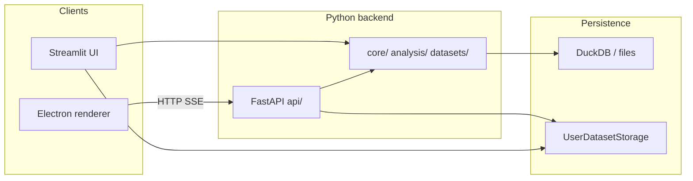

# As-built architecture (2025-03)

This page is the **reviewer entry point** for how the repo is wired today. It complements older diagrams that center Streamlit only (for example [ARCHITECTURE_OVERVIEW.md](ARCHITECTURE_OVERVIEW.md)) and the forward-looking [omnibus Electron cutover spec](../specs/omnibus_electron_streamlit_cutover.md).

## Product surfaces

| Surface | Role | Typical command |
|--------|------|-----------------|
| **Streamlit** | Full interactive UI (`src/clinical_analytics/ui/`) | `make run` / `make run-app` |
| **FastAPI** | HTTP API for datasets, queries, sessions, enrichments (`src/clinical_analytics/api/`) | `make run-api` |
| **Electron** | Desktop shell loading a Vite renderer; talks to API (`electron/`) | See `electron/package.json` scripts and Playwright config under `electron/tests/` |

**Data model:** User-uploaded datasets are the supported path. Built-in demo datasets described in older README text are **removed**; see [IMPLEMENTATION_STATUS.md](../specs/IMPLEMENTATION_STATUS.md) (historical) and [dataset-registry.md](dataset-registry.md).

## Diagram (logical)



**Trust boundary:** Local development assumes a **trusted machine**. FastAPI is bound for local use with CORS defaults suitable for dev; do not treat that as production hardening. See [THREAT_MODEL.md](../security/THREAT_MODEL.md).

## Source of truth by concern

| Concern | Start here |
|--------|------------|
| Electron vs Streamlit feature parity | [omnibus_electron_streamlit_cutover.md](../specs/omnibus_electron_streamlit_cutover.md) (parity matrix; update when behavior changes) |
| Import boundaries (api vs core vs ui) | [ARCHITECTURE_BOUNDARIES.md](ARCHITECTURE_BOUNDARIES.md) |
| Tests and Makefile | `tests/AGENTS.md` (repository root), repo `Makefile` |
| CI vs local suites | [Automation matrix (CI, Makefile, Electron)](../development/testing.md#automation-matrix-ci-makefile-electron) |

## How to verify

```bash
make install-dev
make test-fast
make run-api   # API (another terminal)
make run       # Streamlit
```

GitHub Actions runs the **Electron renderer** Playwright job (`electron-playwright` in `.github/workflows/ci.yml`). Locally use `make test-electron-e2e` (after `cd electron && npm ci`) or `cd electron && npm run test:e2e`. This is Chromium + Vite, not the packaged Electron binary.
