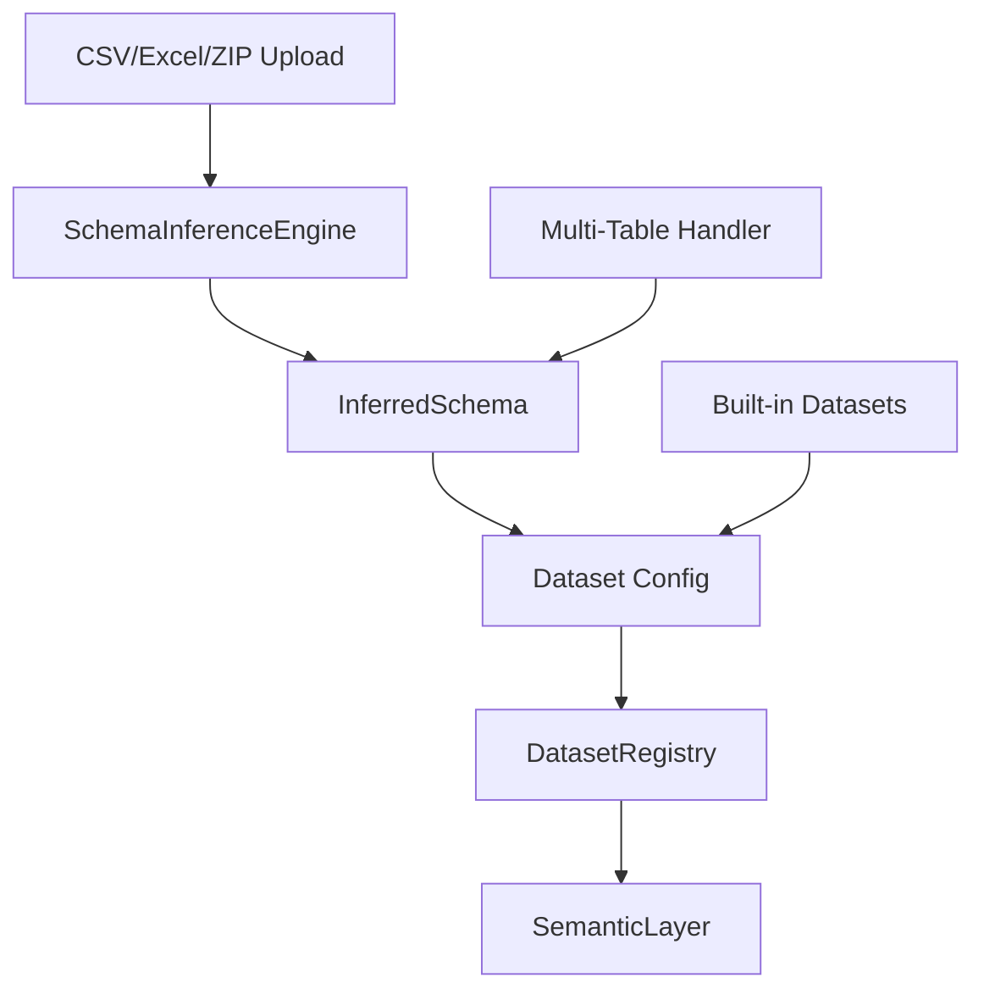

# Dataset Registry

## Overview

The Dataset Registry is the central component for managing clinical datasets. It provides:

1. **Automatic schema inference** from uploaded files
2. **Unified interface** for both built-in and user-uploaded datasets
3. **Multi-table support** with automatic relationship detection
4. **Config-driven semantic layer** integration

## Architecture



## Components

### SchemaInferenceEngine

Automatically detects:

- Patient ID column (unique identifier)
- Outcome columns (binary variables with outcome-related names)
- Time columns (dates, survival time)
- Event columns (binary indicators)
- Categorical vs continuous variables

**Detection Methods:**

1. **Name-based heuristics**: Pattern matching on column names
2. **Type analysis**: Data type and uniqueness checks
3. **Statistical properties**: Cardinality, missing values

### InferredSchema

Data class containing all detected schema elements:

```python
@dataclass
class InferredSchema:
    patient_id_column: Optional[str]
    time_zero: Optional[str]
    outcome_columns: List[str]
    time_columns: List[str]
    event_columns: List[str]
    categorical_columns: List[str]
    continuous_columns: List[str]
```

### DatasetRegistry

Central registry managing all datasets:

```python
class DatasetRegistry:
    @classmethod
    def register_from_dataframe(cls, dataset_name, df):
        # Infer schema
        schema = SchemaInferenceEngine.infer_schema(df)

        # Create config
        config = schema.to_dataset_config()

        # Register
        cls._registry[dataset_name] = {
            'class': AutoInferredDataset,
            'config': config,
            'df': df
        }
```

### MultiTableHandler

For complex datasets with multiple tables (e.g., MIMIC-IV):

1. **Load all CSVs** from ZIP file
2. **Detect primary keys** in each table
3. **Detect foreign key relationships**
4. **Build join graph**
5. **Execute joins** to create unified cohort

## Registration Workflow

### Single Table Upload

```
1. User uploads CSV/Excel
   ↓
2. SchemaInferenceEngine analyzes structure
   ↓
3. InferredSchema generated
   ↓
4. Converted to Dataset Config
   ↓
5. Registered in DatasetRegistry
   ↓
6. SemanticLayer initialized
   ↓
7. Ready for analysis
```

### Multi-Table Upload

```
1. User uploads ZIP with multiple CSVs
   ↓
2. Extract all tables
   ↓
3. MultiTableHandler detects relationships
   ↓
4. Perform automatic joins
   ↓
5. Unified cohort DataFrame created
   ↓
6. SchemaInferenceEngine analyzes cohort
   ↓
7. Registered as single dataset
   ↓
8. Ready for analysis
```

## Configuration Format

### Auto-Inferred Config

```yaml
name: my_dataset
display_name: My Clinical Study
status: auto-inferred

column_mapping:
  patient_id: patient_id

outcomes:
  mortality:
    source_column: mortality
    type: binary
  readmission:
    source_column: readmission_30d
    type: binary

time_zero:
  source_column: admission_date

tables:  # For multi-table datasets
  - name: patients
    primary_key: patient_id
  - name: admissions
    foreign_key: patient_id
    relationship: one-to-many
```

## Schema Override

Users can manually override auto-detected schema:

```python
from clinical_analytics.core.registry import DatasetRegistry

# Override patient ID
config = {
    'column_mapping': {'subject_id': 'patient_id'},
    'outcomes': {'death_28day': {'type': 'binary'}}
}

DatasetRegistry.update_config('my_dataset', config)
```

## Built-in Datasets

Pre-configured datasets for testing and examples:

- **COVID-MS**: Multiple sclerosis patients with COVID-19
- **Sepsis Challenge**: PhysioNet sepsis prediction data
- **MIMIC-III Demo**: Subset of MIMIC-III database

These are loaded from `src/clinical_analytics/datasets/` with handwritten configs (being phased out in favor of auto-inference).

## Next Steps

- Understand the [Semantic Layer](semantic-layer.md)
- Learn about [NL Query Engine](nl-query-engine.md)
- See [Architecture Overview](overview.md)
