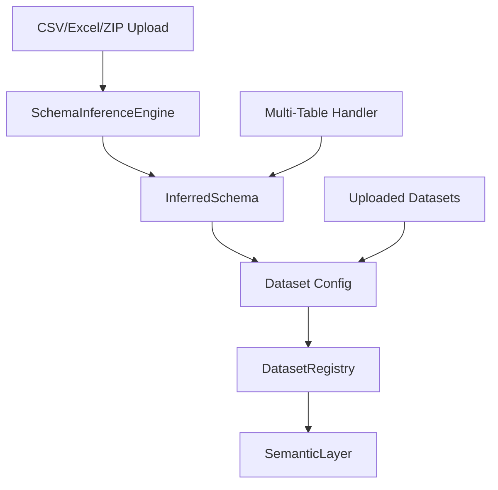

# Dataset Registry

## Overview

The Dataset Registry is the central component for managing clinical datasets. It provides:

1. **Automatic schema inference** from uploaded files
2. **Unified interface** for user-uploaded datasets
3. **Multi-table support** with automatic relationship detection
4. **Config-driven semantic layer** integration

## Architecture



## Components

### SchemaInferenceEngine

Automatically detects:

- Patient ID column (unique identifier)
- Outcome columns (binary variables with outcome-related names)
- Time columns (dates, survival time)
- Event columns (binary indicators)
- Categorical vs continuous variables

**Detection Methods:**

1. **Name-based heuristics**: Pattern matching on column names
2. **Type analysis**: Data type and uniqueness checks
3. **Statistical properties**: Cardinality, missing values

### InferredSchema

Data class containing all detected schema elements:

```python
@dataclass
class InferredSchema:
    patient_id_column: Optional[str]
    time_zero: Optional[str]
    outcome_columns: List[str]
    time_columns: List[str]
    event_columns: List[str]
    categorical_columns: List[str]
    continuous_columns: List[str]
```

### DatasetRegistry

Central registry managing all datasets:

```python
class DatasetRegistry:
    @classmethod
    def register_from_dataframe(cls, dataset_name, df):
        # Infer schema
        schema = SchemaInferenceEngine.infer_schema(df)

        # Create config
        config = schema.to_dataset_config()

        # Register
        cls._registry[dataset_name] = {
            'class': AutoInferredDataset,
            'config': config,
            'df': df
        }
```

### MultiTableHandler

For complex datasets with multiple tables (e.g., MIMIC-IV):

1. **Load all CSVs** from ZIP file
2. **Detect primary keys** in each table
3. **Detect foreign key relationships**
4. **Build join graph**
5. **Execute joins** to create unified cohort

## Registration Workflow

**Unified Architecture**: Single-table and multi-table uploads use identical workflows. Single-table = multi-table with 1 table.

### Single Table Upload

```
1. User uploads CSV/Excel/SPSS
   ↓
2. normalize_upload_to_table_list() normalizes to table list
   ↓
3. SchemaInferenceEngine analyzes structure
   ↓
4. InferredSchema generated
   ↓
5. Dataset version computed (content hash)
   ↓
6. Saved to persistent DuckDB + Parquet export
   ↓
7. Individual table saved to {upload_id}_tables/
   ↓
8. Converted to Dataset Config
   ↓
9. Registered in DatasetRegistry
   ↓
10. SemanticLayer initialized (all tables registered in DuckDB)
   ↓
11. Ready for analysis
```

### Multi-Table Upload

```
1. User uploads ZIP with multiple CSVs
   ↓
2. normalize_upload_to_table_list() extracts all tables
   ↓
3. MultiTableHandler detects relationships
   ↓
4. Perform automatic joins (creates unified cohort)
   ↓
5. SchemaInferenceEngine analyzes structure
   ↓
6. InferredSchema generated
   ↓
7. Dataset version computed (content hash)
   ↓
8. Saved to persistent DuckDB + Parquet export
   ↓
9. All individual tables saved to {upload_id}_tables/
   ↓
10. Converted to Dataset Config
   ↓
11. Registered in DatasetRegistry
   ↓
12. SemanticLayer initialized (all tables registered in DuckDB)
   ↓
13. Ready for analysis
```

**Key Differences**: None. Both upload types follow identical workflow after normalization step.

## Configuration Format

### Auto-Inferred Config

**Unified Format**: Both single-table and multi-table uploads use `inferred_schema` format (not `variable_mapping`).

```yaml
name: my_dataset
display_name: My Clinical Study
status: auto-inferred
upload_id: user_upload_20250101_120000_abc123
dataset_version: a1b2c3d4e5f6g7h8  # Content hash

column_mapping:
  patient_id: patient_id

outcomes:
  mortality:
    source_column: mortality
    type: binary
  readmission:
    source_column: readmission_30d
    type: binary

time_zero:
  source_column: admission_date

tables:  # All upload types have this (single-table = [table_0])
  - name: table_0  # Single-table uses filename stem
  - name: patients  # Multi-table uses ZIP entry names
  - name: admissions
    primary_key: patient_id
    foreign_key: patient_id
    relationship: one-to-many

granularities:  # Inferred from columns
  - patient_level
  - admission_level  # If admission_id column exists
```

**Persistence**: Metadata stored in `data/uploads/metadata/{upload_id}.json` with complete schema information.

## Schema Override

Users can manually override auto-detected schema:

```python
from clinical_analytics.core.registry import DatasetRegistry

# Override patient ID
config = {
    'column_mapping': {'subject_id': 'patient_id'},
    'outcomes': {'death_28day': {'type': 'binary'}}
}

DatasetRegistry.update_config('my_dataset', config)
```

## Dataset Support

The platform supports **user-uploaded datasets only**. Built-in datasets (COVID-MS, Sepsis, MIMIC-III) have been removed in favor of a self-service upload model with automatic schema inference.

All datasets are now registered dynamically through the upload workflow with auto-inferred configurations.

## Next Steps

- Understand the [Semantic Layer](semantic-layer.md)
- Learn about [NL Query Engine](nl-query-engine.md)
- See [Architecture Overview](overview.md)
