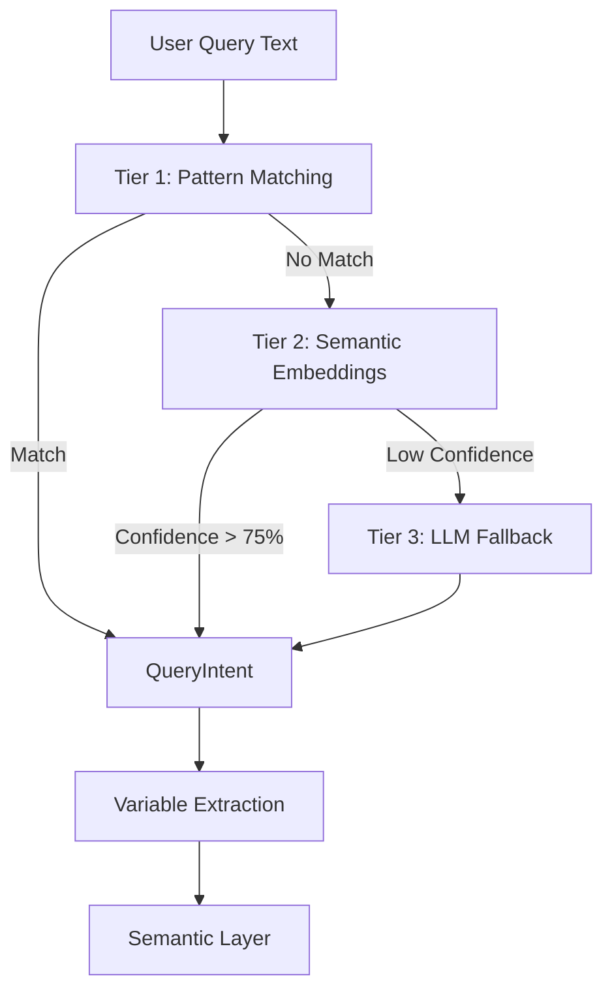

# Natural Language Query Engine

## Overview

The NL Query Engine transforms free-form text questions into structured query intents that the semantic layer can execute. It uses a three-tier architecture for robust parsing.

## Architecture



## Three-Tier Parsing

### Tier 1: Pattern Matching

Fast regex-based matching for common query patterns.

**Patterns:**

```python
# Group comparison
r"compare\s+(\w+)\s+(?:by|between|across)\s+(\w+)"

# Risk prediction
r"(?:what predicts|predictors of|predict)\s+(\w+)"

# Survival analysis
r"\b(survival|time to event|kaplan|cox)\b"

# Correlation
r"\b(correlat|relationship|associat)\b"

# Descriptive
r"\b(describe|summary|overview|statistics)\b"
```

**Confidence**: 90-95% (high certainty for exact matches)

**Latency**: <1ms

### Tier 2: Semantic Embeddings

Uses sentence-transformers to match query with template library.

**Model**: `all-MiniLM-L6-v2` (local, no API calls)

**Process:**

1. Encode user query to embedding vector
2. Compute cosine similarity with all template embeddings
3. Return best match if similarity > 0.70
4. Extract variables from query using fuzzy matching

**Confidence**: Similarity score (0.70-1.0)

**Latency**: ~50ms

**Privacy**: Fully local, no data leaves your machine

### Tier 3: LLM Fallback

For complex or ambiguous queries, uses structured prompts with RAG.

**Context Provided:**

- Available columns from semantic layer
- Outcome definitions
- Example queries
- Variable synonyms

**Request Format:**

```python
{
    "intent_type": str,  # DESCRIBE, COMPARE_GROUPS, etc.
    "primary_variable": str,
    "grouping_variable": str,
    "confidence": float
}
```

**Confidence**: Model-generated (0.3-0.9)

**Latency**: ~2-5s (API call)

**Privacy**: Only anonymized metadata sent (column names, types)

## QueryIntent Structure

```python
@dataclass
class QueryIntent:
    intent_type: str  # Analysis type
    primary_variable: Optional[str]
    grouping_variable: Optional[str]
    predictor_variables: List[str]
    time_variable: Optional[str]
    event_variable: Optional[str]
    filters: Dict[str, Any]
    confidence: float  # 0.0-1.0
```

## Intent Types

### DESCRIBE

Descriptive statistics for all variables.

**Triggers:**

- "describe", "summary", "overview", "statistics"

**Variables Extracted**: None (uses all columns)

### COMPARE_GROUPS

Compare outcome between groups.

**Triggers:**

- "compare X by Y"
- "difference in X between Y"

**Variables Extracted:**

- `primary_variable`: Outcome to compare
- `grouping_variable`: Grouping variable

### FIND_PREDICTORS

Identify risk factors for an outcome.

**Triggers:**

- "what predicts X"
- "risk factors for X"
- "predictors of X"

**Variables Extracted:**

- `primary_variable`: Outcome to predict
- `predictor_variables`: Covariates (default: all available)

### SURVIVAL

Survival analysis (Kaplan-Meier, Cox).

**Triggers:**

- "survival", "time to event", "kaplan-meier"

**Variables Extracted:**

- `time_variable`: Follow-up time
- `event_variable`: Event indicator
- `grouping_variable`: Stratification variable (optional)

### CORRELATIONS

Correlation between variables.

**Triggers:**

- "correlation", "relationship", "association"

**Variables Extracted:**

- `primary_variable`: First variable
- `grouping_variable`: Second variable (if specified)
- If no variables specified, compute correlation matrix

## Variable Extraction

### Fuzzy Matching

Maps query terms to actual column names:

```python
def _fuzzy_match_variable(query_term: str) -> Optional[str]:
    # Direct match
    if query_term in columns:
        return query_term

    # Fuzzy match with difflib
    matches = get_close_matches(
        query_term.lower(),
        [c.lower() for c in columns],
        n=1,
        cutoff=0.6
    )

    return matches[0] if matches else None
```

**Examples:**

- "age" → `age_years`, `patient_age`
- "died" → `mortality`, `death`
- "treat" → `treatment_arm`, `treatment`

### Synonym Handling

Built-in synonym mapping:

```python
SYNONYMS = {
    'age': ['age_years', 'patient_age', 'age_at_admission'],
    'mortality': ['died', 'death', 'deceased', 'expired'],
    'treatment': ['tx', 'therapy', 'intervention'],
    'outcome': ['result', 'endpoint', 'event']
}
```

## Query Templates

Pre-computed template library with embeddings:

```python
templates = [
    {
        "template": "compare {outcome} by {group}",
        "intent": "COMPARE_GROUPS",
        "slots": ["outcome", "group"]
    },
    {
        "template": "what predicts {outcome}",
        "intent": "FIND_PREDICTORS",
        "slots": ["outcome"]
    },
    # ... more templates
]
```

Templates are built dynamically from semantic layer metadata.

## Confidence Thresholds

- **>90%**: High confidence (Tier 1 pattern match)
- **75-90%**: Good confidence (Tier 2 semantic match)
- **50-75%**: Medium confidence (show interpretation, ask for confirmation)
- **<50%**: Low confidence (ask clarifying questions or use structured input)

## Error Handling

### Unknown Variables

If extracted variable doesn't exist:

1. Show "Variable not found: X"
2. Suggest similar variables
3. Allow user to select from dropdown

### Ambiguous Intent

If confidence <50%:

1. Show possible interpretations
2. Ask user to select
3. Learn from user's choice (future enhancement)

### Invalid Combinations

If requested analysis doesn't match variable types:

1. Explain incompatibility
2. Suggest appropriate analysis
3. Allow user to override

## Performance

| Metric | Tier 1 | Tier 2 | Tier 3 |
|--------|--------|--------|--------|
| Latency | <1ms | ~50ms | ~2-5s |
| Accuracy | ~95% | ~85% | ~70% |
| Coverage | ~40% | ~80% | ~100% |
| Privacy | ✅ Local | ✅ Local | ⚠️ API |

## Future Enhancements

1. **Learning from corrections**: Update template weights based on user feedback
2. **Multi-step queries**: "Compare survival by treatment, then stratify by age"
3. **Conditional filters**: "Show mortality for ICU patients only"
4. **Time constraints**: "30-day mortality" → extract timeframe
5. **Custom templates**: Allow users to add domain-specific query patterns

## API Reference

See [API Documentation](../api-reference/core.md#nlqueryengine) for detailed class reference.

## Next Steps

- Understand the [Semantic Layer](semantic-layer.md)
- Learn about [Dataset Registry](dataset-registry.md)
- Try [Question-Driven Analysis](../user-guide/question-driven-analysis.md)
