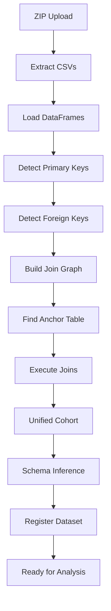

# Multi-Table Support Specification

## Overview

Enable analysis of complex datasets with multiple related tables (e.g., MIMIC-IV) by automatically detecting relationships and joining tables into a unified cohort view.

## Problem Statement

Many clinical datasets come as multiple related tables:

- **MIMIC-IV**: patients, admissions, diagnoses, procedures, lab results
- **Clinical trials**: demographics, visits, adverse events, lab values
- **EHR extracts**: encounters, medications, diagnoses, vitals

Current platform only handles single-table CSVs.

## Proposed Solution

1. **Upload ZIP file** with multiple CSVs
2. **Auto-detect relationships** (foreign keys)
3. **Build join graph** from detected relationships
4. **Execute joins** to create unified cohort
5. **Analyze** unified cohort as single dataset

## Requirements

### Functional Requirements

**FR1: ZIP File Upload**

- Accept ZIP files containing multiple CSVs
- Extract and load all CSVs
- Display table list with row counts

**FR2: Primary Key Detection**

Detect unique identifiers in each table:

- Pattern matching on column names (patient_id, subject_id, etc.)
- Uniqueness validation (100% unique, no nulls)
- Fallback to highest cardinality column

**FR3: Foreign Key Detection**

Detect relationships between tables:

- Name similarity (patient_id in both tables)
- Referential integrity check (child values exist in parent)
- Confidence scoring (>80% match required)

**FR4: Join Graph Construction**

- Build directed graph of relationships
- Find anchor table (most central node)
- Determine join order (BFS from anchor)

**FR5: Automatic Joining**

- Execute left joins in correct order
- Handle name collisions (suffixes)
- Preserve referential integrity

**FR6: Manual Override**

Allow users to:

- Specify custom join keys
- Change join types (left, inner, outer)
- Exclude tables from join

### Non-Functional Requirements

**NFR1: Performance**

- Relationship detection: <2s for 10 tables
- Join execution: <5s for 100K rows

**NFR2: Scalability**

- Support up to 20 tables
- Handle 1M+ rows after joining

**NFR3: Robustness**

- Gracefully handle circular references
- Detect and warn about many-to-many relationships
- Validate join cardinality

## Architecture

### Components

**MultiTableHandler**

```python
class MultiTableHandler:
    def __init__(self, tables: Dict[str, pd.DataFrame])
    def detect_relationships(self) -> List[TableRelationship]
    def build_unified_cohort(self) -> pd.DataFrame
```

**TableRelationship**

```python
@dataclass
class TableRelationship:
    parent_table: str
    child_table: str
    parent_key: str
    child_key: str
    relationship_type: str  # one-to-many, many-to-one
    confidence: float
```

### Workflow



## User Interface

### Upload Step

```
┌────────────────────────────────────────────┐
│ 📦 Upload Multi-Table Dataset               │
│                                             │
│ Drop ZIP file here or click to browse      │
│                                             │
│ Detected tables:                            │
│ ✓ patients.csv (1,000 rows)                │
│ ✓ admissions.csv (3,500 rows)              │
│ ✓ diagnoses.csv (12,000 rows)              │
└────────────────────────────────────────────┘
```

### Relationship Review

```
┌────────────────────────────────────────────┐
│ 🔗 Detected Relationships                   │
│                                             │
│ patients → admissions                       │
│   Key: patient_id (confidence: 100%)        │
│   Type: one-to-many                         │
│                                             │
│ admissions → diagnoses                      │
│   Key: hadm_id (confidence: 95%)            │
│   Type: one-to-many                         │
│                                             │
│ [✓ Looks good] [Edit relationships]        │
└────────────────────────────────────────────┘
```

### Join Preview

```
┌────────────────────────────────────────────┐
│ 👀 Join Preview                             │
│                                             │
│ Anchor table: patients (1,000 rows)        │
│                                             │
│ After joining:                              │
│ • admissions: 1,000 → 1,000 (no data loss) │
│ • diagnoses: 1,000 → 1,000 (no data loss)  │
│                                             │
│ Final cohort: 1,000 patients, 45 columns   │
│                                             │
│ [Create dataset]                            │
└────────────────────────────────────────────┘
```

## Example: MIMIC-IV

### Input Structure

```
mimic-iv-demo.zip
├── patients.csv         (subject_id, gender, anchor_age)
├── admissions.csv       (subject_id, hadm_id, admittime)
└── diagnoses_icd.csv    (subject_id, hadm_id, icd_code)
```

### Detected Relationships

```python
[
    TableRelationship(
        parent_table='patients',
        child_table='admissions',
        parent_key='subject_id',
        child_key='subject_id',
        relationship_type='one-to-many',
        confidence=1.0
    ),
    TableRelationship(
        parent_table='admissions',
        child_table='diagnoses_icd',
        parent_key='hadm_id',
        child_key='hadm_id',
        relationship_type='one-to-many',
        confidence=1.0
    )
]
```

### Join Execution

```sql
-- Step 1: Start with patients (anchor)
SELECT * FROM patients

-- Step 2: Join admissions
LEFT JOIN admissions ON patients.subject_id = admissions.subject_id

-- Step 3: Join diagnoses
LEFT JOIN diagnoses_icd ON admissions.hadm_id = diagnoses_icd.hadm_id
```

### Final Cohort

Unified DataFrame with columns:

- From patients: subject_id, gender, anchor_age
- From admissions: hadm_id, admittime, dischtime
- From diagnoses: icd_code, icd_version

Ready for analysis!

## Testing

### Test Cases

**TC1: Simple One-to-Many**

```
Input:
  - patients.csv (patient_id, age)
  - visits.csv (patient_id, visit_date)

Expected:
  - Detect relationship: patients → visits (one-to-many)
  - Join successfully
  - Verify row count matches patients table
```

**TC2: Chained Relationships**

```
Input:
  - patients.csv (patient_id)
  - admissions.csv (patient_id, admission_id)
  - diagnoses.csv (admission_id, diagnosis)

Expected:
  - Detect: patients → admissions → diagnoses
  - Join in correct order
  - All patients preserved
```

**TC3: Multiple Foreign Keys**

```
Input:
  - patients.csv (patient_id)
  - events.csv (patient_id, admission_id)
  - admissions.csv (admission_id)

Expected:
  - Detect both relationships
  - Choose optimal join path
  - No data duplication
```

**TC4: Manual Override**

```
Input:
  - Users edits detected relationship
  - Changes join key or type

Expected:
  - Use user-specified configuration
  - Show warning if creates data loss
```

### Acceptance Criteria

- [ ] MIMIC-IV demo loads successfully
- [ ] Relationships detected with >90% accuracy
- [ ] Joins preserve referential integrity
- [ ] Performance <5s for 100K rows
- [ ] Manual override works correctly

## Edge Cases

### Circular References

```
patients ← admissions → diagnoses → patients
```

**Solution**: Detect cycles, break at lowest confidence relationship

### Many-to-Many

```
patients ←→ medications (via prescriptions)
```

**Solution**: Warn user, suggest creating linking table

### Missing Foreign Keys

```
child values not in parent
```

**Solution**: Show warning, provide option to use inner join

### Name Collisions

```
Both patients and admissions have 'id' column
```

**Solution**: Add suffixes (id_patients, id_admissions)

## Implementation Plan

1. **Phase 1: Core Multi-Table Handler** (2 days)
   - ZIP extraction
   - Primary/foreign key detection
   - Join graph building

2. **Phase 2: UI Integration** (2 days)
   - ZIP upload component
   - Relationship review UI
   - Join preview

3. **Phase 3: Testing** (1 day)
   - MIMIC-IV demo
   - Edge case handling
   - Performance optimization

## Future Enhancements

- **Smart aggregation**: Auto-aggregate one-to-many (e.g., count diagnoses per patient)
- **Time-based joins**: Join based on temporal proximity
- **Fuzzy matching**: Handle slight name variations in foreign keys
- **Visual join editor**: Drag-and-drop relationship builder

## References

- [Dataset Structure Patterns](../architecture/DATASET_STRUCTURE_PATTERNS.md)
- [Dataset Registry](../architecture/dataset-registry.md)
- [Architecture Overview](../architecture/overview.md)
